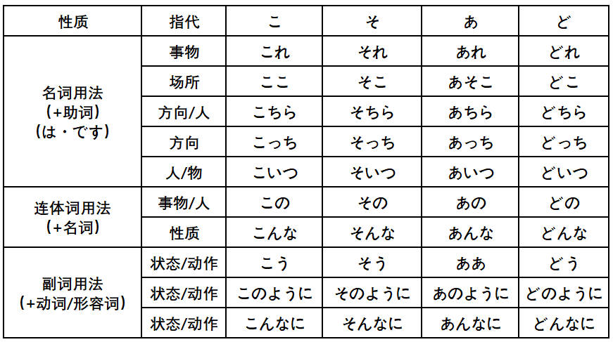

# 基础

## 汉字笔画

[汉字笔顺](https://kakijun.jp/)

## 汉语词音读规律

### 同声同音

**guan|jiao**

- 関心（**かん**しん）|交通（**こう**つう）
- 観察（**かん**さつ）|郊外（**こう**がい）
- 官庁（**かん**ちょう）|学校（がっ**こう**）
- 館長（**かん**ちょう）|効果（**こう**か）

### 前拨后长，单短双长

**规律大概占比 80% 左右**

**前拨：前鼻音（`an, en, in, un`） + 拨音**

漢＋字 （かん＋じ）     `han` > かん（前鼻音 > ん）

**后长：后鼻音（`ang, eng, ing, ong`）+ 长音**

英＋語（えい＋ご）　`ying` > えい（后鼻音 > 长音）

**单短：单元音（`a,o,e,i,u`）+ 短音**

**双长：双元音（`ao,ou`）+ 长音**

需＋要（じゅ＋よう）　`yao` > よう（ `ao/ou` > 长音）

### 促音便

**①以「つ・ち」结尾＋「か・さ・た・は」行　｜　は行半浊**　

- 発＋達：は**つ**＋**た**つ＝発達（は**った**つ）
- 失＋敗：し**つ**＋**は**い＝失敗（し**っぱ**い）、は行发生半浊

**②以「く・き」结尾＋「か」行**

- 欲＋求：よ**く**＋**き**ゅう＝欲求（よ**っき**ゅう）
- 石＋鹼：せ**き**＋**け**ん＝石鹼（せ**っけ**ん）香皂

### 浊音便

**①以「う・ん」结尾＋「か・さ・た・は」行　｜　は行半浊**

- 中＋国：ちゅ**う**＋**こ**く＝ちゅう**ご**く
- 患＋者：か**ん**＋**し**ゃ＝かん**じ**ゃ
- 原＋発：げ**ん**＋**は**つ＝げん**ぱ**つ

## 输入注意点

- ぢ（`ji`）按照 (`di`) 输入；
- づ（`zu`）按照 (`du`) 输入；

## 4种基本句型（敬体形/简体形）

## 接续形式

## 指示词

## 动词变形

### 特殊动词

需特殊记忆的一类动词（**i/e 段 + る结尾**）：

**i 段 + る结尾**

要る（いる）、入る（いる）、入る（はいる）、参る（まいる）、切る（きる）、限る（かぎる）

握る（にぎる）、遮る（さえぎ）、知る（しる）、走る（はしる）、散る（ちる）、混じる（まじる）

**e 段 + る结尾**

蘇る（よみがえる）、帰る（かえる）、焦る（あせる）、蹴る（ける）、茂る（しげる）、捻る（ひれる）

喋る（しゃべる）、滑る（すべる）、減る（へる）、占める（しめる）、照る（てる）、寝る（ねる）

**特殊用法**

行く：行って/た

ある：否定形>ない

要る（いる）：没有过去式（方言除外）

負う：負うて/た，負って/た

### 基本形 > ます形

> 第4课

### 基本形 > て・た形

> て形-第14课 た形-第21课

### 基本形 > ない形

> 第19课

### 基本形 > 命令形

> 第29课

### 基本形 > 意志形

> 第30课

### 基本形 > ば形（假定）

> 第37课

### 基本形 > 可能形

> 第38课

### 基本形 > 受身形（被动）

> 第41课

### 基本形 > 使役形

> 第43课

### 基本形 > 使役受身形

>第43课

### 动词活用

## 自他动词

**自动词**：主语＋は/ば+自动词，强调一种状态（が）

**他动词**：主语 + は/ば＋宾语＋を＋他动词（を）

## 数量词

## 敬语

### 特定形式

### 形式变换

### 礼貌体

### 常用句型

# 1 单元

## 第 1 课 出会い

### 会话

**出会い（で）**

#### あのう/ちょっと

- あのう、東京タワーへ行きたいんですが、道（みち）を**教えてくださいませんか**。
- もらう（更委婉，我的动作自谦）道を教えて**いただきませんか**。
  - 我 << 他人，句子主语是：我方，**我方从他人那里得到**
  - もらう >> いただく（谦让语）  

- ちょっと、お願い**したい**ことがあるんですが...（有事要拜托您）
  - お＋V(连用)＋する（いたす，谦让语）
  - ちょっと、待ってください。

#### すみません

**道歉，感谢**，口语中发音接近于**すいません**

- いいえ、全然/大丈夫です/気（き）にしないで（别放在心上）
- いいえ、**どんでもないです**/気になさらずに/**気になさらないでください**。（更尊敬，ないで>>ずに）

**引起注意**

- はい？/何（なん）でしょうか（对すみません的回应）
- 何（なに）か御用でしょうか（更尊敬，对すみません的回应）

#### 自/他动词

- これ**が**落（お）ちました（自动词，强调状态，更自然）

- 自動ドア**が**閉（し）まります

- これ**を**落としました
- 私は目覚（めざ）まし時計（どけい）**で**起（お）きました。（闹钟叫醒了我）
  - で表示原因
  - **无生命的物体（闹钟）不能充当主语**

#### 先ほど

**さっき更正式的形式**

- こんにちは。先ほど**お電話した**山田です/先ほど**の**山田です。
- 先ほどの方 >> 先ほど**会（あ）った**方
- 先ほど**の**質問（しつもん）に**お答（こた）えします**。（の（代表言う）>> おっしゃった）
- 先ほどおっしゃった質問にお答えします。

#### 助かる（たす，自v）

**子供を助ける（他v）**

**对...有帮助**

- 天気がいいので、**助かります**。
- 仕事を手伝（てつだ）えば、お父（とう）さんが**助かります**。
- さっきは、どうもありがとうございました。**助かりました**。
- 荷物を持っていただいて、**助かりました**。（もらう＞いただく）更委婉
- 荷物を持ってくださって、**助かりました**。（くれる＞くださる）别人主动

#### 感じがする

**有...感觉**

味（あじ）/匂い（にお）/声（こえ）/音（おと）**がする**（味道/气味/声音）

感じ（かん）/頭痛（ずつう）/寒気（さむけ）/吐き気（はきけ）**がする**（头疼/发冷/恶心）

- 北京（ぺきん）の**町並み**（まちなみ）が**すっかり**変（か）わってしまって、不思議（ふしぎ）な感じがします。（街景，给人一种不可思议的感觉）
- この景色（けしき）を見ると、日本に来（き）た**とって/という**感じがします。（看到这样的景色，感觉是来到了日本）

#### すっかり/ずいぶん

**すっかり（100%不能认出）**

**ずいぶん（80%不能认出）**

- 街も**すっかり/ずいぶん**変わりました
- 陳さんの病気（びょうき）は**すっかり/ずいぶん**よくなりました。
- 李さんにもらったあめは**すっかり**なめてしまいました。（てしまう完成）
- **ずいぶん**食べたね/歩（ある）いた（表量多）
- **ずいぶん**たくさん買い物をしましたね。

#### ついていく

つく（粘上，附着）＋いく（由近及远）＞ついていく＞**ついていけない**（可能形）

あの人の考え方**にはついていけません**。（那个人的想法我跟不上）に提示对象

#### くらい/ほど

**くらい＝ぐらい｜简体＋くらい｜くらい＋の＋N（表示程度）**

- これは中学校（ちゅうがっこう）のテストですが、大人（おとな）でも**分からないくらい**難しい問題です。(虽然是中学测试，却是大人都答不上的难题)くらい表中顿
- この辺は、静か過（す）ぎで寂（さび）しい**くらいです**。
- 財布を忘（わす）れましたが、ジュースを**買うくらいのお金（かね）**は持っています。（买饮料这种程度的钱还是有的）

**简体＋ほど｜比较（天花板）｜强调情感色彩**

- 涙（なみだ）が**出（で）るほど**、うれしかったです。（高兴得眼泪都出来了）
- 昨日はとても疲れました。最後は立（た）っていられない**ほど**でした。
- 首都開発（しゅとかいはつ）計画（けいかく）は、面白い**ほど**うまく進（すす）んで（进展出奇的顺利）
- 死（し）ぬほど暑い（热死了，强调感情色彩）
- 先生**ほど**優（やさ）しい人がいない。（没有比老师更温柔的人）

#### ～てきた

**来る（来）|时间/空间上的由远及近**

- 日本語の発音（はつおん）に少し慣（な）れ**てきました**。
- 救急車（きゅうきゅうしゃ）のサイレンの音（おと）がだんだん大きく**なってきました**。
- ほら、高層（こうそう）ビルが**見えてきた**でしょう？

### 课文

**日本の鉄道（てつどう）**

#### ～とは

**～とは＝～というのは**

**1.解释说明/询问**

- JR **とは**、Japan Railways **の略（りゃく）です**
- 森さん**とは**、どんな人ですか

**2.下定义**

- おせち料理**とは**、正月（しょうがつ）に食べるお祝（いわ）いの料理**のことです**。
- ～とは、～のことです

**3.～というのは/～というものは/～ということは（解释说明）**

**の：名词化，泛指｜者（もの）：东西，物品｜事（こと）：具体的事情**

- 幸運（こううん）という**もの**はいつ訪（おとず）れるか分かりません。（何时到来不可预知）
- 子供を育（そだ）てるという**こと**は、とても楽しいことです。
- 一人で生活（せいかつ）するという**こと**は、大変なことです。

**4.～ということは：推测原因|归纳结果**

- 彼が怒（おこ）った**ということは**、きっと**ひどい**ことを言われたのでしょう。（大概是被人说了很过分的话）
- 車に５人**しか**乗（の）れない**ということは**、だれかがバスで行かなければならないということです。
  - **しか～ない**：包含感情，强调只有

#### ～は～の1つです

**...之一**

- 世界的に有名（ゆうめい）な新幹線（しんかんせん）**も**JRの路線（ろせん）**の１つです**。
- 日本**は**アジアの国**の１つです**

#### 結ぶ

 **连接，建立关系（绳子打结）。結び（結ぶ的连用形）＞＞中国結び（むす）**

- 主要都市（しゅようとし）を結ぶ路線は**もちろん**（自不必说）

- 靴（くつ）のひもをきちんと**結ぶ**。（鞋带系紧）
- 中国の旅行は、私と妹（いもうと）を結ぶ大切な**思い出（で）**です。（将我和妹妹联系起来的重要回忆）
- 化石（かせき）は、古い時代（じだい）と現代（げんだい）を**結んでいます**。

**繋ぐ（つなぐ），抽象连接上　結ぶ＝繋ぐ**

- 空港（くうこう）と北京市街を**結ぶ**。
- 手を繋ぐ（つなぐ）
- 紐（ひも）を結ぶ

#### どんどん

**事情进展顺利，连续不断**

- 路線（ろせん）が**どんどん**延（の）びています。
- 佐藤さんの中国語は**どんどん**上手になっています。
- 遠慮（えんりょ）しないで、**どんどん**食べてください。

#### 大（だい/おお/たい）

- **だい+汉语词（接头词）**：大事件・大地震（じしん）・**大成功（せいこう）**・大規模（きぼ,adj2）
- **おお+和语词（接头词）**：大金（かね）持ち、大雨（あめ）、大汗（あせ）
- **たい（固化词）**：大変、大切

#### 接头词/接尾词

**各（かく）～**

- 各位（かくい）・各種（かくしゅ）・各国（かっこく）

**～化（か）**

- 映画化・電子化（でんし）・現代化（げんだい）
- 近代化（きんだいか）・高齢化（こうれい）
- 実用化（じつよう）

**～的（てき）**

- 世界的（せかいてき）/国際的（こくさいてき）

- 積極的（せっきょくてき）/具体的（ぐたい）
- 抽象的（ちゅうしょう）/消極的（しょうきょく）/個人的（こじん）
- 効果的（こうか）/伝統的（でんとう）/**本格的（ほんかく）正式，原则，正规**

#### 写作顺序

- まず＞次に＞また/そして/さらに＞最後に
- はじめに/最初に＞続いて＞最後に

- 第一に・第二に・第三に

#### 文脉指示词

**そ系列一般指上文，こ系列一般指下文**

**そこで：补充新情况。地点+で表示范围**

**それで：原因。事物＋で表示原因**

東京に向（む）かう路線を「上（のぼ）り」、地方（ちほう）に向かう路線を「下（くだ）り」といいます。

- **そこで**、こんななぞなぞがあります。（于是/在这种情况下）
- **それで**、こんななぞなぞがあります。（因此）

### 单词

**三圆：音+义+拓展|二圆：音+义|一圆：音**

転勤（てんきん）：同一公司，系统内部|転勤になる（大家共同决定的结果）

転職（てんしょく）：跳槽

東京駅は「上り」の最終の駅**になっている**からです。(强调被决定的结果)

東京駅は「上り」の最終（さいしゅう）の駅だ**と決められている**。（被决定）

辺（へん）：n,一带，附近｜街角（まちかど）

辺り（あた）：n,周围，附近

**1.出会い（で）：n,相遇，碰见**

- 出会う：偶然（ぐうぜん）に会う
- 李さんに偶然出会った

**2.お祝い（いわ）:n,庆贺，祝贺**

- 祝う：お＋祝い
- 母から入学（にゅうがく）のお祝いをいただいた。（从妈妈那里收到了入学的**礼物**）
- 入学（にゅうがく）を祝う。

**3.上る（のぼ）：v1,上，登，进京｜上り（のぼ）：n,上，上行**

- 階段（かいだん）を上る・日が昇る（のぼ）・山**に**登る（のぼ）：に强调登上山顶
- 階段を下（お）りる・日が沈む（しず）・山を下（お）りる

**下る（くだ）：v1,下，下去，到地方去｜下り（くだ）：n,下，下行**

電車から降（お）りる

電車に乗る（の）

- **下りる（お）＞上（あ）がる/登る（のぼ）**
  - 階段から下りる/階段を上がる/木に登る
- **下がる（さ）＞上（あ）がる（自他动词）**
  - 物価（ぶっか）が下がる/上がる
  - 気温（きおん）が下がる/上がる
- 下る（くだ）＞上る（のぼ）
  - 下り列車（れっしゃ）
  - 上り（のぼり）のエレベーター（上行电梯）

**4.沸（わ）く：v1,沸腾，烧开｜沸かす：v1,燃烧，烧开**

- お湯が沸く/お湯を沸かす
- 湧く（わ）：涌出
  - 興味（きょうみ）が湧いてきた。（临时）
  - 興味を持つようになってきた。（逐渐有了兴趣）

**5.乾かす（かわ）：v1,弄干，晾干**

- 干す（ほ）：展开后风干，晒干：**强调晾晒**

- 乾かす：加热，送风等人为方法，**强调干**
- 濡（ぬ）れた服を干した（可能依然湿的）

- 濡れた服を乾かした（完全干了）

**6.表す（あらわ）：v1,表示，表达，表现**

- 顔に表す（かお）：喜形于色
- 言葉に表す

**7.溶く（と）：v1,调拌，调开，溶解**

- 溶かす：水溶，**热熔**（他动）
- 溶く：固体，粉末放入液体（他动）
- 水に溶く・水で溶く
- 鉄（てつ）を溶かす・バターを溶かす（黄油）

**8.広げる（ひろ）：v2,展开，扩大，拓展**

- 噂（うわさ）を広げる（谣言，绯闻）
- 噂が広がる

**9.流れる（なが）：v2,流动，流淌**

- 噂が流れる/広がる（流言四起）
- 流れ（连用形）：潮流，流程
- 時の流れ・授業（じゅぎょう）の流れ

**10.なめる：v2,添，含**

- 犬が手を舐める
- 舐めるな！（不要把人看扁了）

**11.優れる（すぐ）：v2,优秀，卓越**

- 过去式+N
- 優れた人/技術（ぎじゅつ）

**12.延びる（の）：v2,延伸，延长**

- 路線（ろせん）が延びる/出発（しゅっぱつ）が延びる
- 伸びる：売（う）り上（あ）げが伸びる（销售额上升）

**13.訪（おとず）れる：v2,到访，访问**

- 家を訪れる
- 春が訪れる

**14.育（そだ）てる：v2,养育，培养**

- 花を育てる
- 子育（こそだ）て：n,养育孩子

**15.注目（ちゅうもく）する：v3,注目，注视**

- 注目を浴びる（あ）：大家关注的焦点（沐浴着大家注视的目光）
- 価格（かかく）に注目する/顔に注目する

**16.経営する（けいえい）**

- 会社を経営する
- 感（かん）じがします

**17.目覚まし時計（めざましどけい）：闹钟**

- 目**が**目覚（さ）める：眼睛睁开
- 目**を**覚（さ）ます＞**目覚（ざ）ます**：叫醒，唤醒

**18.なぞなぞ：n,谜语**

- 謎をかける/謎を解く（と）：出谜/解密
- 謎のような人

**19.答え（こた）：n,回答，答案**

- 答える
- 質問に答える（しつもん）

**20.こんな：连体词，这样的**

- 连体词：连接体言（连接名词，代词等）
- こんな人（贬义）
- このような（连体）
- **これら：代，这些**

### 综合练习

#### 练习

雨がやんで、空が**だんだん明（あか）るく**なってきました。（雨が止む）

探していた小学校（しょうがっこう）時代の友達に**とうとう会うことができました**。（终于见面了）

これは私の**個人（こじん）的**な意見（いけん）です。

さっきから携帯電話（けいたいでんわ）を探しているのですが、**見つかりません**。（自动词没找到，强调状态）

- 田中さんは**鉄道を利用して旅行するの**が趣味（しゅみ）です。（兴趣是...）

- 特（とく）に列車（れっしゃ）の中で**駅弁（えきべん）を食べる**のが楽しみです。（...是一种乐趣）
  - **～のが楽しみです**
- 駅弁とは**駅で売っているお弁当（べんとう）の**ことです。

#### 对话

遇见在其他场合打过招呼的人，依稀记得名字，但不确定。同他打招呼，并确认姓名

- あのう、すみません。田中さんじゃありませんか。
- すみません、ちょっと失礼（しつれい）ですが、田中さんですか。

**问路：**

- あのう、ちょっとお聞きしたいんですが...

  東大（とうだい）ってどこにありますか。/東大（とうだい）へはどうやって行けますか

- すみません、東大へ行きたいんですが、道に迷（まよ）ってて...

  こっちからは行けます。（这边可以去吗）

### 同步练习

- 親（おや）というものは**いつも子供の幸せ（しあわせ）**を願っています。（父母总是希望孩子幸福）
- 幸運（こううん）という**もの**はいつ訪（おとず）れるか分かりません。（幸运这种东西，何时到来不可预知）
- 人間（にんげん）の欲望（よくぼう）というものは**きりがありません**。（没完没了）
  - 切る（き）
- 年々（ねん）｜わざわざ（特别，专门）
- 慣（な）れない所（不习惯的地方）
- 一方（いっぽう）、～
- ～ように見える（看起来是...样）

**表达积累**

～によって異（こと）なる/違（ちが）う（依据...，...是不同的）

同（おな）じ国でも、地方**によって、～が違う**

**～ことに気がつく（意识到）**

~ということは、～ことです**が**、～ことです。（...事虽然...,但是）

町が近代化（きんだい）する**ということは**いい**ことかもしれませんが**、個性（こせい）がなくなってしまうのは寂しい**ことです**。

少し（すこし）不便（ふべん）なことがあっても、自分の目で見て、耳で聞いて、手で触（ふ）って、世界（せかい）中の人と交流（こうりゅう）することが、旅行のよさではありませんか。（这不就是旅行的好处吗？）

## 第 2 课 あいさつ

### 会话

あいさつ：寒暄

#### 寒暄

**好久不见**

- （どうも）お久（ひさ）しぶり。

- （どうも）お久しぶりですね。
- （どうも）ご無沙汰（ぶさた）しています。

- （どうも）ご無沙汰しております。

**问候**

- お元気ですか。
- お変わりないですか。（没什么变化吧）
- お変わりありませんか。
- お変わりないでしょうか。

**ぶり（间隔时间长）**

**～ぶりに＋V｜～ぶりの＋N**

**间隔时间长|...的样子**

- ３か月ぶり**に**、東京へ行きました。（时隔3个月，再次来到东京）
- **3年ぶりで**彼にあった（时隔3年见面）
- **暮（く）らしぶり：生活的样子**

- 10年ぶり**の寒さで**、湖（みずうみ）が凍（こお）りました。（10年一遇的严寒，湖水都结冰了）

**ふり：装作...的样子**

- 知らないふりをして
- いい子（こ）のふり

**その節（せつ）≈この間＝先日（せんじつ）**

その節：可以指过去或未来

- **その節**は結構（けっこう）な物をいただきまして、ありがとうございいます。（过去）
  - 結構（けっこう）：特别好，特别棒
  - 谢谢您那次送给我那么好的礼物
- **その節**はよろしくね。（未来）
  - 届时请多多关照

#### 早（はや）いものですね

**时间过得真快，～ものです：感慨**

- 時間が経（た）つのは早いものですね。（时间的流逝是很快的事情）
- １人でよく帰って**こられた**ものです。(自己一个人竟然能回来)
- 平和（へいわ）な世界（せかい）になってほしい**ものです**。（真希望世界和平）
- 休暇（きゅうか）が取（と）れたら、ゆっくり旅行したい**ものです**。（真想好好旅行一番）

#### 介绍的顺序

先内后外，先上后下

**公司里的称呼：**

[对内]

- 部長（上司）
- 鈴木さん（同事）

[对外]

- 佐藤です（对外称呼内部的人）
- 山田課長（かちょう）（称呼外部公司的人）
- **すみません、山田課長はいらっしゃいますか。[称呼外部]**
- **山田は今出（で）かけております。[称呼内部]**（おります＞いる的尊敬语）

### 课文

**あいさつの時の礼儀（れいぎ）**

1.お辞儀（じぎ）の角度（かくど）**には**、首を曲げるだけの軽（かる）い**ものから**深（ふか）く頭を下げる**ものまで**、いろいろあります。

- **～には、～ものから～ものまで、いろいろある。**（存在句，从...到...，有很多）
- **～には、～ことから～ことまで、いろいろある。**
- 鞠躬的角度，从点头这样轻量事的，到把头深深低下去，有很多种。

2.次（つぎ）に相手（あいて）の名刺を**お辞儀をしながら**受け取ります。

- 接着一边鞠躬一边接受对方的名片。
- **连用形中顿，用于解释说明**
- **まず～次に～最後に（さいご）**

3.話す内容（ないよう）**にも気をつけ**なければなりません。

- **～に気をつける：留意（主动性）；**
- ～に気がつく：留意到；

**4.仕事の場（ば）/会議の場/面接の場**

**抽象的场合**

- 戴さんは昨日、会議の場で社長にほめられました。
- その場で解決（かいけつ）する。

**5.大事（だいじ）なのは**、相手に不快感（ふかいかん）を与え（あた）ないことです。（重要的是）

**6.～顔をする**

- 怖い顔をしていています
- 彼女はわたしを見ると、**びっくりしたような顔**をしました。（她看见了我，显得很吃惊）

**7.相手に印象（いんしょう）を与える**：留下印象

～印象を与える

**8.～時は、普通（ふつう）～する：普通お辞儀をします。**

**～のが普通/一般（いっぱん）的（てき）です**：握手（あくしゅ）よりもお辞儀をする**のが一般的です**

#### Vる＋ほうが~

**表示客观对比，建议的语气没有 Vた＋ほうが～强**

**Vた＋ほうが～**

**Vない＋ほうがいい**

- 危ないから**触（さわ）らないほうが**いい。

- 両手（りょうて）を**使うほうが**丁寧（ていねい）です。
- 食事は（１人で**食べるより**）大勢（おおぜい）で**食べるほうが**楽しいです。（吃饭多人在一起更有乐趣）
- ジョギングは、（**急（いそ）ぐより**）ゆっくり**走（はし）るほうが**いいそうです。（客观对比）
- ジョギングは、ゆっくり**走った方がいい**です。（语气更强烈）

#### ～かどうか/～か

**多个并列时，可将かどうか省略为か。**

- 飛行機のチケットは買った**か**、ホテルの部屋は予約した**か**、確認（かくにん）してください。**（かどうか省略为か）**
- 昨日どこへ行ったか、誰とあったか、何をしたかどうか、いろいろ聞かれました。
- **結婚（けっこん）している**かどうか、給料（きゅうりょう）はいくらか、年（とし）はいくつかどうかは、普通（ふつう）は聞きません。

**年（とし）**

年が離（はな）れる（年龄差距较大）

年を取（と）る（上了年纪）

お年寄り（としよ）老年人

- わたしは兄（あに）と**年が離れて**います。
- 夫（おっと）とはかなり年が**離れて**います。
- 母は最近**年を取って**、目が悪（わる）くなりました。
- お**年寄り**には席（せき）を譲（ゆず）りましょう。

#### いくら～ても

**无论...也**

- **いくら**早く答え**ても**間違いがあれば合格（ごうかく）てきません。（回答再快，错了也不合格）
- この店では**いくら**料理を食べ**ても**1000円です。
- **いくら**頑張（がんば）っ**ても**無駄（むだ）だ（怎么努力都没用）
- **いくらなんでもひどい**。（再怎么说也太过分了）

**いかに（怎样，怎么）/どんなに（怎样，怎么）/どれだけ（多么）～ても**

**いかに：更书面语**

- **どんなに**遅く（おそ）なっ**ても**大丈夫です。
- **いかに**フランス語がうまく**ても**、フランス人には及（およ）びません。
- **どれだけ**考え**ても**、いい案が見つかりません。（无论怎样想，也想不出好办法）
- **どれだけ**心配したか：多么担心吗
- **いかに**急い**でも**
- **如何に（いか）生活するのか**（如何生活）
- **どんなに**頑張ってもできんない

#### ～ては/～では

某一情况下出现另一种情况

- 怖い顔をしてい**ては**、相手にいい印象を与えることはできません。

- あんな人が教師（きょうし）**では**学生がかわいそうです。(这种人是老师，学生很可怜)
- 交通（こうつう）がこんなに不便（ふべん）**では**お客さんは来ないでしょう。
- こんなに給料（きゅうりょう）が安く**ては**困（こま）ります。（工资这么少可不行）
- そんな大きな声を出し**ては**近所迷惑（きんじょめいわく）です。（发那么大声会给邻居添麻烦的）

#### こもる/こめる(他动)

**込めて，包含，充满，こめる（他动）**｜気持ち（きもち）：心情

- **煙（けむり）/匂（にお）い**がこもる（充满烟/气味）
- 家にこもる（呆在家中不出门）｜**引きこもり**（家里蹲）
- 気持ち/真心/思い**がこもる**｜気持ち/真心/思い**を込める**

- **気持ちがこもっている**かどうか、予想以上に相手に伝わってしまうものです。
- 手作（てづく）りのお弁当にはお母（かあ）さんの**真心（まごころ）がこもって**いますよ。
- 彼らは（結婚のお祝いの**気持ちをこめて**）歌を歌いました。（饱含着对婚礼祝福的心情唱歌）
- 遠（とお）く離（はな）れた家族への**思いをこめて**、手紙を書きました。（包含着远离家人的思念）

#### Vる/Vた/N＋以上

- わたしたちが**予想する以上**（いじょう）に人が集（あつ）まったら、どうしましょうか。

  到场的人数如果比预料多，我们该怎么办

- わたしたちが**予想した以上に**人が集まりました。（到场的人比我们预料的多）
- <思った以上に>試験（しけん）は難しかったです。（考试比预想的难）
- 上海は<**想像（そうぞう）以上に**>近代（きんだい）化が進（すす）んでいます。（以超乎想象的速度实现近代化）
- 田中さんも真面目ですが、山田さんは田中さん**以上に**まじめです。（山田比田中更认真）

#### ～ものです

**1.本质，理所当然**

- 予想以上に相手に伝（つた）わってしまう**ものです**。（对方能分毫不差地感受到）
- 山の天気は変（か）わりやすい**ものです**。（山里天气易变呀）

- 人の心（こころ）は分からない**ものです**。
- そんな失礼なことは言う**ものではありません**。（那种失礼的话是说**不得的**）

**2.感慨：ものだ**

- 早（はや）い**ものです**ね。
- 時間の経（た）つのは早い**ものです**ね。（时间过得真快呀）

**3.回顾：Vた＋ものです**

- 子供の時、よく川で**遊（あそ）んだものです**。
- 新入社員（しんにゅうしゃいん）の時、よく林（はやし）部長と飲みに**行ったものです**。

**～だもの/だもん：申诉自己的正当性，比～ですから语气弱**

おととい送（おく）ったん**ですもの**ね。

### 单词

待つ＞待たせる（使役）：お/ご...する（自谦）

お話中（ちゅう）/お仕事中/お電話中

日本人同士（どうし）：仅限日本人和日本人之间

**お願いします**

- こちらに**お願いします**。（把人带来吧）

- こちらに案内（あんない）してください。
- 今回もよろしく**お願いします**。

首（くび）を曲（ま）げる：点头｜握手（あくしゅ）をする

頭を下（さ）げる：鞠躬，认输｜相手（あいて）

**1.凍る（こお）：v1,结冰，结冻**

氷（こおり）｜水が凍る

**2.伝（つた）わる：v1,传达，传播，流传**

伝わる（自）｜伝える（他）

- 相手/後世（こうせい）に伝わる（流传给后世）
- **噂が伝わる/流（なが）れる/広（ひろ）がる**
- よろしくお伝えください。（请帮我带好）

**3.譲る（ゆず）：v1,让，转让**

**経つ（た）：v1,（时间）流逝，消逝**

- 席を譲る（ゆず）

- 時間が経つのは早い
- **時が経つにつれて**（随着时间的流逝）

**4.付き合う（つきあう）：v1,交往，来往**

- 彼女と付き合う
- 食事に付き合う（陪同吃饭）

**5.離（はな）れる：v2,相隔，距离，分离，离开**

- 中心部（ちゅしんぶ）を離れた場所（ばしょ）
- 駅から2キロぐらい離れた所
- **離れ離れ（はなればなれ）：离散**
- 家族がはなればなれになる

**6.与える（あた）：v2,给与，给予**

**及ぶ（およ）：v1,达，及**

- 影響（えいきょう）/被害（ひがい）が及ぶ（影响/波及）
- 影響/ショックを与える（震撼）

**7.怠ける（なま）：v2,懒惰，懈怠**

- 仕事を怠ける
- 怠け者（懒汉）

**8.曲げる（ま）：v2,弄弯，扭曲**

- 事実（じじつ）**を**曲げる
- 右（みぎ）に曲（ま）がる（自动词）

**傾（かた）ける：v2,倾斜，倾注**

- **傾く（かたむく）自动词**
- 机/首（くび）を傾（かたむ）ける（脖子）
- 力（ちから）を傾ける

**9.あきれる：v2,目瞪口呆，惊愕**

- 呆（あき）れて**もの**が言えない（呆着说不出话）
- 受け取る（うけとる）：v1,接受，接收（强调结果）
- 受ける（う）（强调动作）

**10.懐（なつ）かしい：adj1,怀念，留念**

- 故郷（ふるさと）が懐かしい
- ふるさと：多指情感上的故乡｜こきょう：正式用法
- 懐かしい**思い出**（值得怀念的会议）

**11.ありがたい：adj1,珍贵，难的**

- ありが**たい**＞ありが**とうございます**
- めで**たい**＞おめで**とうございます**

- 早い＞おは**ようございます**
- ありがたくいただきます。（那我就不客气了）
- **それはありがたいです**。

**12.結構（けっこう）：adj2,很好，优秀，足够**

**順調（じゅんちょう）：adj2,顺利，良好**

- 結構な眺め（なが）
- 千円（せんえん）で結構です
- 結構です/結構役に立つ（やくにたつ）（帮助很大，相当有用）
- 仕事が**順調に**進む（すす）

**13.かわいそう：adj2,可怜**

**いや：adj2,厌烦，讨厌**

**わずか（僅か）：adj2,很少，一点点，仅仅**

- **かわいそうな**顔をして
- 嫌だ/嫌な予感がある（有不好的预感）
- 僅か100円しかない

**わがまま：adj2,任性，任意**

- 吾輩（わがはい）｜わが：我们

- わがままな子供
- わがままを言う

**思い：n,情感，想法：思う/思い出**

**14.決まる（き）＞決まり（き）：n,规矩，决定**

- **決まりがある（有约定俗成的/有规定的）**

- 決まりを守る（まも）：守规矩

- 名刺（めいし）の出（だ）し方と受け取り（うけとり）方**に**も決まり**があります**。

  （递名片和接名片的方法也有规定）

**15.案（あん）：n,办法，方案，预想，意料**

- いい案が浮（う）かぶ
- 案内（ない）：导游，导览

**首（くび）：n,头，脑袋，脖子**

- 首になる（被炒鱿鱼了）/首にする（炒别人鱿鱼）
- **君は首だ（你被解雇了）**

**腰（こし）：腰をかける・座る（坐下）**

**16.両手（りょうて）：n,双手，两手**

片手（かたて）：n,单手，一只手

- 片道（かたみち）：单程
- 片思い（かた）：单相思

**17.真心（まごころ）：诚心，诚意，真心**

- 真っ白（まっしろ）：雪白
- 真ん中（まんなか）：正中间

**予想（よそう）：n,预料，预计，预想**

- 予想がつく（想到了）
- 予想外（よそうがい）：出乎意料

**印象（いんしょう）**

- 印象（いんしょう）を**与（あた）える**

- 印象に残（のこ）る
- 印象**深い（ふかい）**

**18.あらゆる(连体)所有，一切**

**连体词可直接＋名词**

- 有り得る（ありうる）：ある可能性（かのうせい）がある
- ありとあらゆるもの：所有的东西

**全て（すべ）**

- 全ての方法（ほうほう）：能想到的所有**正常的方法**
- あらゆる方法（ほうほう）：不择手段的方法

**その節（せつ）：那时，那次/届时**

- その節はお世話になりました

- その節はよろしく

- この間（あいだ）：n,前些天，最近

  こないだ：口语中，の常省略

- この間お世話になりました。

**19,同士（どうし）：同伴，伙伴**

同质化程度高

- 学生同士/隣同士（互为邻里）

- 秒（びょう）ルール：3秒法则

- 無力感（むりょくかん）

**20.無駄使い（むだづかい）：n,浪费，滥用**

- 水を無駄使いしないで

**近所迷惑（きんじょめいわく）：n,打扰邻里**

- 近所（きんじょ）：邻里
- **ご迷惑を掛（か）けして、申し訳（もうしわけ）ございません**。（给您添麻烦了，真的很抱歉）

**気分転換（きぶんてんかん）：n,转换心情**

- 気分が悪い：心情不好
- お祭り（まつり）気分：节日气氛

**21.短语搭配**

ご無沙汰しております：好久不见

**ご馳走（ごちそう）さまでした：谢谢热情款待**

申し訳（もうしわけ）ありません

**では、これで：那就这样吧**

今日（きょう）はこれで終（お）わりにします

### 综合练习

急（きゅう）な雨で**頭から足（あし）まで**すっかり濡（ぬ）れてしまった。（从头完全湿到脚）

#### といわれています

今の若者（わか）は人と話すことや、自分の気持ちや意見（いけん）を相手に伝（つた）えることがうまくできない**といわれています。**

- 现在的年轻人在与人交谈方面，自己的心情和意见无法很好地传递给对方
- **と言われています：被普遍认为**

**テレビグーム：电视游戏**

友達とはパソコンや携帯（けいたい）のメール**で**しか付き合わないという子供も増（ふ）えています。

- 付き合わない（つきあわ）：不交往，相处
- 除了电脑和手机邮件之外

**自分の気持ちを言葉で相手に伝えること、相手の顔を見ながら直接（ちょくせつ）話すことはとても大切です。**

家族**と**も：和家人

しませんか：难道不这样吗

#### だんだん

**段々（だんだん）：程度副词，表示阶段变化过程，缓慢，渐变**

- だんだん話せるように**なってきた**
- だんだん暑く**なってきた**

#### どんどん

**情态副词：猛烈，快速，顺利，压迫感**

- どんどん話すようにする。

- どんどん暑くなっている。

#### 对话

**公司商谈，客人久等**

- 申し訳（わけ）ありません。お待たせしました。
- お待たせし**て**申し訳ございません。（て：表示轻微地原因）

**见到多年未见的恩师**

- ご無沙汰（ぶさた）しております
  - お変わりませんか（か）
  - お変わりないでしょうか
  - お変わりございませんか

- おかげさまで、元気にして（い）ます。（托您的福，一切都好）口语中い脱落

### 同步练习

#### 振假名/送假名

**話（はな）し**

- 写在汉字旁边的：送假名-し
- はな：振假名

被害（ひがい）が広い地域（ちいき）に及ぶ（およ）灾害影响很多地方。

時間/お金に**余裕（よゆう）がある**：时间上宽裕

#### 小句中が＞の

**ようこそ：欢迎，热烈欢迎**

落ち着く（おちつく）：v1,沉着，朴素

壁（かべ）は明るい色**より**もう少し落ち着いた色にし**ては**いかがでしょう。

いくら親（おや）でも、子供の心の中までは分からない**ものです**。

#### 连用形中顿

**动词用连用形作中顿：v3：散歩をする＞散歩し**

**adj1 中顿：Aい＞Aく**

**ている去掉：光っている＞光り（ひか）**

- 横浜で生まれ、ここで育ち（そだ）、ここで子育てをしています。
- 月（つき）は明るく、星（ほし）は光り、山々が**くっきりと**見えています。（看得很清楚）

講義（こうぎ）に**ついていけません**。：跟不上讲义

活字（かつじ）離れ**が**進む若者（わか）＞活字（かつじ）離れ**の**進む若者（わか）

**ツール：工具**

#### てほしい

**希望别人去做**

新聞を読んでほしいものです。（希望读一读报纸）

表から（ひょう）：从表上看

- 表から~，～ことがわかります
- ここから～、～ことがわかります

セットで売る：成套出售

～と～を比（くら）べると、～は～（という）ことが分かる。

**つい読み比べをしてしまいます：つい...してしまう，一不小心完成了**

## 第 3 课 顔合わせ

### 会话

**顔合（あ）わせ：见面会**

担当（たんとう）いたします＞担当する（いる＞いたす自谦）

担当して**おります**＞担当している（いる＞おる自谦）

**私（わたくし）**：读音是更正式的表达

**4人（にん）/４名（めい）更郑重的说法**

#### こめて/ほか

**2年目（ねんめ）：第2年**

- 李さんを**こめて**4名のスタッフ（包含李一共4名）

- 李さん**ほか**3名のスタッフ（除李之外有3名）

#### ～させていただく

**请别人允许我做...：客套，请求允许**

**あ段＋せる：使役｜主（おも）：adj2**

**～ていただく：请别人为我做（～てもらう）**

- **主に営業（おもにえいぎょう）を担当させていただきます。**（请允许我担当主要负责人）
- この会社の主な商品（しょうひん）は、バターとチーズです。

**主（しゅ）として=主に**

- 田中先生は**主として**初級（しょきゅう）のクラスを担当しています。
- それでは、私から説明（せつめい）**させていただきます**。

#### ～にとって

**站在...的立场来看**

**表示判断或评价的基准**

**后+对事物的评价，价值判断等**

- わたし**にとっては**、初めての海外旅行（かいがいりょこう）でしたが。
- 張さん**にとって**、仕事は人生（じんせい）のすべてではありません。
- わたしたちの会社**にとって**、今回のプロジェクトはとても大切です。（公司的立场）

**1.～として：作为~（身份，资格，名目），以~名义**

**做某事/评价某事时的立场，资格，名义**

- 困（こま）っている人を助（たす）けるのは、人間（にんげん）**として**当然（とうぜん）のことです。（做人的本分）
- わたしが親（おや）**として**一番気をつけていることは、子供の個性（こせい）を尊重（そんちょう）することです。
- 李さんは主任（しゅにん）**として**、上海支社に赴任（ふにん）しました。

**2.～としては：作为~来说**

**做某事/评价某事的立场限定为个人立场**

- 彼女**としては**とても辛（つら）かったようです（痛苦，煎熬）。

- この絵は、子供**としては**とても上手です。

- わたし**としては**（＝わたしは）、その案に反対（はんたい）です。（后面+动作）

- わたし**にとって**、その案は**反対すべきです**。（应该反对）

  **にとって：后面不＋动作｜后＋价值判断**

**3.～にしたら/～にしてみれば/～にすれば（假定的感觉）**

**在~立场来看的话，应该~**

**假定别人的立场，做出推量**

- 大人（おとな）は簡単（かんたん）でも、子供**にしたら**難しい**でしょう**。（对大人来说很简单，但对孩子来说很难吧）
- 彼**にしてみれば**、こんな朝早（あさはや）く出（で）かけるのは嫌（いや）**でしょう**。（站在他的立场来说，这么早出门也是不大情愿的吧）
- 張さん**にすれば**、今回の決定（けってい）に不満（ふまん）があるだろう。（站在小张的立场，对这次决定会有所不满吧）

#### ～として/～にとって

**Pにとって、Q：P是立场，Q是评价；**

**Pとして、Q：P是身份，资格，Q是动作/评价**

- 困っている人を助けるのは、人間（にんげん）**として**当然（とうぜん）のことです。（责任感）
- 困っている人を助けるのは、人間**にとって**当然のことです。（仅评价）

#### が/けど/けれど/けれども

**が：表示转折；后＋省略；引出话题**

**けれども：多在口语中使用**

- すみません**が**、今お話してもいいでしょうか。（现在方便谈话吗）
- 李さんも日本語が上手です**けど**、王（おう）さんも上手ですね。
- ちょっと伺います**けど**、この近くに博物館（はくぶつかん）はありませんか。
  - 聞く（き）自谦＞伺い
  - お聞きしたいですが（聞きします）

#### 今でも

**今でも/も｜現在（げんざい）でも/も**

- 父はわたしのことを**今でも**小さな子供のように思っています。
- 幼い（おさな）ごろのこと今でも覚えている。｜**頃（ごろ）：时候**

- 京都（きょうと）には1000年以上の建物（たてもの）が**今でも**たくさん残（のこ）っています。

**今まで：到今为止，现在已经改变**

- 今まで勉強してきたこと

- **今まで**故郷（こきょう）を離（はな）れて暮らしていました。（在此之前，一直离开故乡生活）

- **今まで**優（やさ）しくしてくれてどうもありがとうございました。（感谢一直以来对我那么好）

  分别时寒暄

#### 自我介绍

- **寒暄：**初めまして

- **所属+姓名：**（公司，学校）の～です/～と申します

- **补充说明：**名字写法，工作/学习经历，兴趣爱好

  - 山（さん）は山（やま）です

  - 王は王様の王、風（ふう）は風**と書きます/という漢字（かんじ）です**。

  - **～と呼んでください**
  - 主（おも）に営業を**担当（たんとう）させていただきます/担当しております**。
  - 上海支社に来て、**２年目です/２年経（た）ちました/2年になりました。**

  - 東京大学の2年生です。

  - 中国の上海から**参りました/来まし**た。

- **结尾：よろしくお願いします**/お願いいたします
  - お願い申し上げます。
  - これからお世話になります。（商务场合）

### 课文

**名字｜苗字（みょうじ）**

#### adj1＋く＋の＋N

**特殊形式**

- 多い＞多くの場合（ばあい）
- 遠い（とお）＞遠くの
- 近い（ちか）＞近くの
- **少しない＞少しの**｜公園に少しの観光客（かんこうきゃく）がいる

#### 場合（ばあい）

**简体＋場合｜N＋の＋場合｜AN＋な＋場合**

- ボタンを押（お）しても切符（きっぷ）が出（で）ない**場合**、駅員を読んでください。
- 都合（つごう）が悪い**場合**は知らせてください。（没时间得话，请告诉我）

**場合によっては：根据情况**

- 平日（へいじつ）は7時に閉店（へいてん）しますが、**場合によっては**９時まで営業することもあります。

  Vる＋ことがあります（有这种情况）

#### ～わけにはいかない

**不能，不可｜訳（わけ）：理由，道理，情况**

**できない：能力上不行**

**～ないわけにはいかない：不能不，不可不，必须**（不作什么不行）

- 名字をつけ**ないわけにはいきません**（义务）
- ここであきらめる**わけにはいきません**（不能在这个时候放弃）
- 来週受験（じゅけん）なので風邪を引く**わけにはいきません**。（下周考试，不能感冒）

**～わけにもいかない：想而不能**

- 質問がたくさんあっても、無視（むし）する**わけにもいかない**ので、きちんと答えています。
- お金は足（た）りませんが、予算を増やす**わけにもいきません**。
- お金は足りませんが、予算を増やす**わけにはいきません**。（区别不大）

#### そこで/それで

**そこで：地点，即在这种情况下，又出现新情况**

**それで：因此，で表示原因**

地名（ちめい）や地形（ちけい）から名字をつけました。

#### 倒装

**强调原因**

- 自然（しぜん）に関係（かんけい）する漢字（かんじ）が多いのは、**そのためです**。

- 彼が夜間学校をやめたのは、仕事が忙しくなった**ため**です。（倒装，果＞因）
- 彼は仕事が忙（いそが）しくなった**ため**、夜間学校（やかんがっこう）をやめました。（因＞果）

#### ～と考えられている

**～といわれている/～と考（かんが）えられている：普遍看法，并非主观判断**

- 正しい（ただ）敬語（けいご）を使える人は本当に少（すく）ない**といわれています**。（能够正确使用敬语的人是非常少的）
- 日本の人は減（へ）っていく**と考えられています**。

#### それでも

**即使如此**

- 父親（ちちおや）が病気（びょうき）で亡（な）くなりました。**それでも**彼はアルバイト（零工）をして大学を卒業しました。
- 日本人の名字の種類（しゅるい）は30万近くあります。**それでも**世界（せかい）の第（だい）２位です。

#### 数值表达

**約（やく）・大体・ほぼ＋数字**

**数字＋程度（ていど）・ほど・ぐらい**

**～以上：～を超える/～を上回る（うわまわ）**

**～以下（いか）：~近く（将近）/～を下回る（したまわ）**

- 30万近く（ちか）：将近

- 160万を超（こ）えています

**一方（いっぽう）：一方面，另一方面**

A社の業績（ぎょうせき）はとてもいいです。一方、B社の業績はあまりよくありません。

#### 表达积累

**1.～ようになったのは、～になってからです**

すべての日本人が名字を持つ**ようになったのは**、明治時代（めいじじだい）**になってからです**。

**2.どうすればいいのかわかりません：不知道怎么办**

どんな名字を持てばいいのかわかりません。

**3.名前をつける**

- 名付（なつ）けられた：被起名字
- ～から名付けられた：从...来的

**4.程度（ていど）しかない：只有这个程度**

### 单词

広告（こうこく）｜法律（ほうりつ）

加わります（くわ）

Vる＋ことがあります（有时候会）

Vた＋ことがあります（有...经历）

持つ＞持て（命令形）

**それでも：即使那样，尽管如此，可是**

それでも食べたい

**1.溶ける（と）：v2,融化，熔化，溶化**

- バターが溶ける
- 砂糖が水**に**溶ける（溶于水中）｜砂糖で水**で**溶ける（用水去溶解）
- 雪/氷（こおり）が解ける＞雪解け（と）：破冰

**2.上（うわまわ）回る：v1,超过，超出**

**下回る（したまわ）：v1,不够...水平，在...以下**

- 前回（ぜんかい）の売り上げを上回る
- 予想を下回る

**3.なくなる（亡くなる）：v1,去世，死亡**

- 死ぬ（し）

- 無くなる（な）：没有了，消失了

  夢/お金が無くなる

**4.指す（さ）：v1,指，指示**

- 「それ」は文章（ぶんしょう）のどの部分（ぶぶん）を指すか
- 授業（じゅぎょう）で指された。（被课上点名）

**加わる（くわ）：v1,参加，添加，增添**

加える（くわ）：他动词

1名加われば、メンバーが揃う（そろ）：再加一个人的话，小组成立

**試す（ため）：v1,试，尝试，试验**

- 試してみる：尝试其他的事物（不止试衣服）

- 試着（しちゃく）：试衣服

**5.あきらめる：v2,放弃，断念，死心**

- もう諦めた（あきら）
- 諦めずに最後まで頑張る

**力（ちから）：n,力气，力量**

- 力が強い/力強い
- **力になれるように**頑張る（努力成为某人的力量/支柱）

**見舞い（みま）：n,探望，慰问，问候**

- お見舞いに行く（去探望）

**辛い（つら）：adj1,难受，痛苦，难过**

- 別（わか）れは辛い（つら）

**深刻（しんこく）:adj2，严肃，严重，深刻**

- 深刻な問題
- ～問題が深刻になってきた（问题变得越来越严重）

**6.仲良く（なかよ）：adv,亲密，友好**

- 仲良し：二人は仲良しです。
- 友達として仲良くしてね（作为朋友要友好）

**7.学習する（がくしゅう）：v3,学习**

**勉強する：暗含学习的辛苦**

**学ぶ（まな）**

**習う（なら）：学习技能，一般需要老师**

- 彼女の生（い）き方を学ぶ（学习生活的方式）
- ピアノを習う（学习技能）
- 日本語を勉強する/学ぶ
- もっともっと勉強しなきゃ
- 日本語学習（がくしゅう）

**8.ざっと：adv,一下子，很快**

- ざっと読んで意味を把握（はあく）する
- 部屋をざっと**片付（かたづ）ける**

### 综合练习

1.冬の北海道（ほっかいどう）は素晴（すば）らしいです。夏は花が咲（さ）いて**さらに**美（うつく）しいです。**（さらに：更加）**

2.**そこで**：在这基础上又出现新的结果

3.出席者（しゅっせきしゃ）は８名ですが、資料（しりょう）は**10部（ぶ）**コピーしておいてください。

4.引っ越し（ひっこし）先（さき）の住所（じゅうしょ）を知っていますか。

### 同步练习

#### V简＋のは、～ためです

私わちのチームは負（ま）けて**しまったのは**、代表選手（だいひょうせんしゅ）が**けが**で出（で）られないため。

- チーム：小组，团队
- けが：受伤

#### にとって/として

- わたしは将来（しょうらい）オリンピックの選手（せんしゅ）**として**、**活躍（かつやく）**したいと思（おも）っています。（大展身手）

- その方法（ほうほう）として、**世界（せかい）の人々から注目（ちゅうもく）されています**。

（受到世界各地人的关注）｜被动形式

- 親（おや）の愛は子供**にとって**何よりも大切なものです。（父母的爱对孩子来说比什么都重要）
- 彼女は自分のこと**について**は何も話してくれませんでした。（关于）

**並べる（なら）：v2,排列，摆放**

栄養（えいよう）が足（た）りないと頭も働（はたら）かず、学習（がくしゅう）もちんとできない。

- ず＞ない
- **これら：这些，ら表示复数**
- 用意する（ようい）：准备，安排，提供

中日（ちゅうにち）病院（びょういん）の医者になって3年になりました。

ちょっと通訳（つやく）していただきませんか。（口译）

- 通訳（つやく）：口译
- 翻訳（ほんやく）：笔译

## 第 4 课 東京本社

**東京本社（とうきょうほんしゃ）**

### 会话

#### うち（家/内）

**うち：抽象概念**

**わたしの家（いえ）：指房子**

うちの会社は北京に支社があります。

#### 转述信息

**～と言っていた（直接引述）｜って（口语）**

- **~ということだ（可表示过去等，口语+书面语）**
- **～とのことだ（可表示过去等，口语）**

**～そうだ：传闻（听到，看到的）**

- **本身没有过去，否定，疑问**
- Aい＋そうです
- ANだ＋そうです
- Vる＋そうです

**～と言った/～と言ってた**

- ちょっとお話をしたい**と言っていました**。（重点在转述内容）
- ちょっとお話をしたい**と言いました**。（重点在描述动作）

**午後なら何時でも構（かま）わないそうです、山田さんのご都合（つご）はいかがですか。**

- **将来时间＋なら；**

- 構う（かま）：管，理睬；
- 都合（つご）：情况｜都合がいい/悪い
- 月曜日はちょっとご**都合が悪い**。火曜日なら**都合がいい**んですが...
- 先生の**ご都合のいい**時にお伺いします。（小句中が＞の）

#### 省略

- どこへ行くんですか。

  東京（へ行く**の**）です

- トラックの免許（めんきょ）はいつ取（と）りましたか。

  去年の5月ごろ（に取った**の**）です。

**そのようにお伝（つた）えします**：按您说的那样转述

- お伝えします：自谦
- そうお伝えします=そのようにお伝（つた）えします

**お忙しいところ/お休みのところ/お疲れのところ**

- お疲れのところ**を**、て伝ってもらって、すみません。（を、后面+动作）
- お忙しいところ、すみません。（抽象时间上某一个点）

**実は（じつ）：是这样的**

#### 思ったより/思った以上（いじょう）

**比预想的...**

- **思ったより**大変な仕事になりそうなんです。（工作变得比想的要难）
- 北京は**思ったより**暖かいですね。
- 試験（しけん）は、**思っていたより**難（むずか）しくありませんでした。
- 今月（こん）の給料（きゅうりょう）は**予想（よそう）より**少なくてがっかりしました。（がっかり：失望）
- アフリカ旅行は**思った以上**に楽しかったです。
- 上海の変化は**想像（そうぞう）以上**に速（はや）いですね。

#### 突然ですが

**失礼（しつれい）ですが...**

- 突然（とつぜん）ですが、わたし、会社を辞（や）めることにしました。
- 突然ですが、明日出発（しゅっぱつ）することになりました。
- 突然ですが、結婚（けっこん）することになりました。

#### ～てもらえませんか

**もらう＞もらえる（可能形）**

- （私が）山田さんにこの仕事をして**もらえませんか**（你能做这项工作吗）我请别人
- 山田さんがこの仕事をし**てくれます/てくれませんか**。（山田帮我做）别人做主语
- 李さんが、わたしを推薦（すいせん）し**てくれた**んですか。（是李小姐推荐我的吗）

**てもらえますか　/　てもらえませんか　/　ていただけませんか（尊敬程度递增）**

- 自己做主语，使用可能态：もらえる

**てくれますか　/　てくれませんか　/　てくださいませんか（尊敬程度递增）**

- 他人做主语，不用可能态，使用基本型：くれる

～担当者に**なるんですか / 推薦（すいせん）されたんですか**

- この仕事は李さんに頼（たの）みます（这事交给小李）
- えっ、李さん**に**？

山田さんは上海支社に**いたこともあるし**、中国の事情（じじょう）に詳（くわ）しい**から**ということでした。

（转述小李的话：山田曾在上海分公司呆过）｜事情：情况，状况

- Vた＋ことがある（有...经验）
- 家庭（かてい）の**事情**でしばらく会社を休んでいました。（しばらく：暂时，一会儿）
- ちょっと**事情**があって...

#### ～し～から

**～し～、～し～　/　～し～、～から～：并列，表原因**

**～し～：暗示还有其他理由（不止一个）**

- 彼は頭がいい**し**、優しい**し/から**、モテるのは当然（とうぜん）だ。
- 彼は頭がいい**し**、モテるのは当然だ。（不止一个）
- 彼は頭がいい**から**、モテるのは当然だ。（只有一个）
- もうこんな時間です**し**、明日も**早いので**、そろそろ失礼します。
- 陳さんは日本語もうまい**し**、英語もできる**から**、安心（あんしん）です。

#### 承知しました/承知いたしました

我明白了的自谦语｜承知（しょうち）しました

- **する＞いたす（自谦）＞なさる（尊敬语）＞します**
- 分かり**ました** / かしこまり**ました**。
- 了解（りょうかい）です / 了解**しました** / 了解**いたしました** 

### 课文

**近年サラリーマン事情（工薪阶层的情况）**

**かつて：曾经**

#### ～といえば

**～と言う＞～といえば（说起，提到）**

- 中国**といえば**、ウーロン茶を連想（れんそう）します。
- 吉田さん**といえば**、歴史（れきし）に詳（くわ）しくて有名（ゆうめい）です。（精通历史是出名的）

#### 当（あ）たり前（まえ）

**理所当然，常做谓语**

**当たり前だ / 当たり前のことだ**

**当然（とうぜん）可放在前面使用、もちろん**

- 当然、残業（ざんぎょう）や休日出勤（きゅうじつしゅっきん）をしました。
- 残業（ざんぎょう）や休日出勤（きゅうじつしゅっきん）をするのは当たり前でした。

#### 取り組む

**取り組む：埋头干，致力于，全力投入**

**取り組み（とりくみ）：连用形作名词，措施**

- 週休２日制（しゅうきゅうふつかせい）の導入（どうにゅう）や労働（ろうどう）時間を減（へ）らす**取り組み**が実施（じっし）され
- 日本政府（せいふ）の環境（かんきょう）問題への**取り組み**はまだ始まったばかりです。（才刚刚开始）
- 仕事に真剣に（しんけん）取り組む：认真投入
- 研究（けんきゅう）に取り組む
- 環境問題に取り組む / 環境問題への取り組み：针对环境问题的一些举措（n）

#### ～てくる

时间/空间上的**由远及近**，渐变的过程

- 世界の人口（じんこう）は増え続（フエつづ）け**てきました**。（过去＞现在终）
- この店は昔（むかし）から食器（しょっき）を扱（あつか）っ**てきています**。（过去>持续到现在）经营餐具
- 頭が痛くなっ**てきました**。（越来越疼）
- 世界の人口は現在も増えし**ています**。
- 世界の人口はこの50年間急激（きゅうげき）に増加（ぞうか）し**てきました**。
- 世界の人口は**これからも**増えし**てゆきます**。（接下来继续增加下去）

#### ～年代

**ねんだい、10代：10-19**

- **10代**の子供たちに、大人（おとな）の生活習慣病（せいかつしゅうかんびょう）が広がっています。（生活习惯病正在蔓延到10多岁的孩子中）
- 昭和生まれ（しょうわうまれ）・平成生まれ（へいせい）・令和生まれ（れいわ）
- （1926~1989）・**（1989~2019）：ゆとり世代（せだい）宽松世代**・（2019~）

#### ふつか

**2号，两天**

- 会議（かいぎ）は来月の2日です（ふつか）。
- 1日（いちにち）で終われると思ったが、二日（ふつか）かけてしまった。（想的一天会结束，花费了两天）
- 二日間（ふつかかん）：2天时间
- **二日酔い（ふつかよい）：宿醉**

#### これまで

**范围广，到这个月/到这一年为止等**

**今まで：更具体，到现在为止**

- **これまで/今まで**この制度（せいど）を利用（りよう）するのは、ほとんどが女性でした。
- **今まで**晴れていたのに、急（きゅう）に雨が降り出（ふりだ）しました。（刚刚还是晴天，却突然下雨了）
- 映画が始まる直前（ちょくぜん）だったので、**今まで**トイレの前に行列（ぎょうれつ）ができていました。

#### ほとんど

**副词，名词**

- わたしのお金は**ほとんど**なくなりました。（几乎没了）
- ほとんどの学生は合格（ごうかく）した。

- 彼のコンサートにはお客が**ほとんど**来ませんでした。（演唱会）
- **ほとんど**の学生が、朝ご飯を食べないで学校に来ます。
- 説明書（せつめいしょ）を読んで、**大体（だいたい）の**ことはわかりましたが、細（こま）かい点（てん）についてはまだ疑問（ぎもん）があります。（细致的点）

#### ～（の）ではないか

**推测，主张，判断**

**～ではないか：反问，惊讶，征求同意**

**Vる/Aい＋のではないか**

**AN/N＋な＋のではないか：の作形式名词**

**AN/N＋ではないか**

**のではないか＞んじゃないか・のではないでしょうか**

- AN/Nだ＞AN/Nではない（否定形式）

- 会社での理解が得（え）られない**のではないか**、出世（しゅっせ）の妨（さまた）げとなる**のではないか**

  是否能得到公司的理解，是否能会妨碍晋升。

- これは豚肉（ぶたにく）**ではありませんか**（这不是猪肉吗）
- 本当は楽しい**んじゃないですか**（实际不适很开心吗）

#### 見れる/見らえる

**見える：由于眼力，距离等客观因素可以看到，表示自然地映入眼帘**

**見らえる：可能形，能看到，表示主观的能力（可能性和机会）**

- 外は暗く（くら）て、何も**見えません**。
- 上野動物園（うえのどうぶつえん）では、パンダが**見られます**。

- 窓を開けると、海が**見える**。
- 携帯電話（けいたいでんわ）でインターネットを楽しむ人がよく**見られます**。
- 最近は昔（むかし）のように着物を着る人はなかなか**見られなくなりました**。（想过去那样穿和服的人难得一见）
- あそこにいる、帽子（ぼうし）を被（かぶ）った男（おとこ）の人が**見えます**。
  - こ：主观关联性强/下文
  - そ：客观关联性强/上文
  - **あ：双方共有的**

都会（とかい）での**時間に追（お）われる**生活をやめて、田舎（いなか）に引っ越（ひっこ）す人もいます。

（被时间追赶的生活）

- 時間/生活/お金に追（お）われる
- 時間/生活/お金に余裕（よゆう）がある（时间充足/富裕）

**生活を送（おく）ります（过...生活）**

- 都会（とかい）での**時間に追（お）われる**生活を送ることをやめて
- **日々（ひび）を送る**＞充実（じゅうじつ）した日々を送っている。

### 单词

**まず＞次に＞更に（さら）/そうして/また＞最後に**

この国では農業（のうぎょう）が盛ん（さかん）です。さらに、工業（こうぎょう）も発展（はってん）しています。

**1.予測（よそく）:n,预测**

- 予測が外れる（はずれる）
- 当たり前のことは誰でも予測がつく
- いつ地震が起（お）こるか、予測がつかない

**2.事情（じじょう）：n,情况，缘故，缘由**

- 家庭（かてい）の事情
- 事情があって、本日（ほんじつ）は休ませていただきます。

**3.要望（ようぼう）:n,迫切要求，迫切期望**

- 応える（こた）：回应期望・応じる（おう）：适应，顺应
- ご要望にお応えできず、本当に申し訳ございません。
- お客様のご要望に応じて、計画（けいかく）を修正（しゅうせい）する

**4.注文（ちゅうもん）:n,订货，订购，点菜**

- ご注文をお伺いします
- 注文が入（はい）りました（订单来了）

**5.点（てん）：n,点，方面**

**疑問（ぎもん）：n,疑问**

- 疑問を持つ
- この点について疑問を持っています。（关于这一点有疑问）

**6.直前（ちょくぜん）：n,即将...之前，正前面**

- 出発（しゅっぱつ）の直前に（时间）：出发之前
- 車の直前を横切る（よこぎ）（空间）：车前面横穿马路

**7.妨げ（さまた）:n,妨碍，妨害**

- 出世（しゅっせ）の妨げ

- 妨げる（さまた）
- 発展（はってん）を妨げる

**働き（はたら）:n,作用，功能，工作**

- 働く / 薬の働き
- 働きながら勉強する / 装置（そうち）が働く：装置起作用

**疲れ（つか）:疲劳，劳累，劳顿**

- 疲れる
- 疲れが出（で）る / 疲れが取れる（消除疲惫）

**8.バランスを取る（と）/保つ（たも）：维持平衡**

- バランスが崩れる（くず）
- 収支（しゅうし）のバランスが崩れて、会社は倒産（とうさん）した。

**でき上（あ）がる: v1,做好，完成**

- できる＋上がる

- 出来上がり
- 出来上がり次第（しだい）、ご連絡（れんらく）いたします。（做好之后立即联系你）

**9.迫る（せま）: v1,接近，迫近，临近**

- 締め切り（しめきり）:deadline,期限
- 試験 / 締め切りが迫ってきた
- 危険（きけん）が迫る

**追う（お）: v1,追，赶，催逼**

- 時間に追われる：被时间追赶
- 生活に追われる
- **猫の手も借（か）りたいほど忙しい：非常忙**

**10.扱う（あつかう）：v1,经营，对待，处理**

取り扱う　≈　扱う

- 機械（きかい）を上手に扱う（操作机械流畅）
- この本は会社問題を扱った（讲了社会问题）
- 客として扱う（当作客人对待）
- その品は当店（とうてん）では扱ったおりません。(本店不卖这个商品)

**失う（うしな）：v1,失去，丧失**

- チャンスを失う
- 3点失った / 得た（え）

**沈む（しず）：v1,落上，沉没，消沉**

- 日が沈む
- 沈む瀬（せ）あれば浮（う）かぶ瀬（せ）あり：有起有落

**11.減（へ）らす：他v1,减少，减轻**

減る（自动词）/ 増やす（他动）・増える（自动）

- 人員（じんいん）を減らす / 増やす（裁员/增加员工）
- 人口（じんこう）が減る / 増える

**得る（え）：v2,得到，取得**

另一个读音—うる：表示事物的可能性

あり得る（う）＞あらゆる：有可能形，**即全部**

- 知識（ちしき）を得る
- ありえない：不可能有

**設ける（もう）：v2,设定，设置，设立**

- 基準（きじゅん）を設ける：设立基准
- 儲ける（もう）＞金を儲ける

**12.がっかりする：v3,失望，灰心丧气**

- ちょっとがっかりした：稍微有点失望
- がっかりして、やる気がない：没干劲

**推薦する（すいせん）：v3,推荐**

- 推薦状（すいせんじょう）
- 推薦入学（にゅうがく）

**悔しい（くや）：adj1,懊悔，遗憾**

全力（ぜんりょく）を出（だ）せなかった自分が悔しい

**細かい（こま）：adj1,细小，细致，琐碎**

拘る（こだわ）

- 細かいお金ですみません
- 細かいところまで**こだわる**：拘泥于
- こだわりがある（非常讲究）

**13.激しい（はげ）：adj1,激烈，剧烈，厉害**

- 競争（きょうそう）/ 変化が激しい
- 風 / 雨が激しい

**急激（きゅうげき）：adj2,急剧，急速**

- 急激**な**変化（へんか）
- 急激に進む近代化（きんだい）

**14.盛ん（さか）：adj2，兴盛，旺盛，热烈**

国際交流（こくさいこうりゅう）が**ますます**盛んになってきた。

ますます：更进一步，更上一层楼

**かまわない：没关系**

構う（かま）：管，理睬

なりふり構わず：不修边幅

**関係（かんけい）がある：有关系**

わたしと関係ない / わたしには関係ない（和我没关系）

### 综合练习

事情（じじょう）**に**詳（くわ）しい

#### ている/てある

- 助けてくれた（曾经别人主动帮助）
- すばらしい絵が描（か）かている（自动词）＞ている
- すばらしい絵が描（か）けてある（他动词）＞てある
- 王さんに**デザインを考えて**もらうことにしました。（请小王考虑设计的内容）

#### 对话

**请人搬东西**

- すみません、田中さん、て伝（つた）っ**てもらえませんか**。（能帮个忙吗）
- ～、運（はこ）ん**でもらえませんか**。（搬一下）

**向同事转达部长尽快完成工作的命令**

- 佐藤さん、部長は早く仕事を片付（かたづ）けろ**と言っていましたよ**。（工作收尾）
- **口语中 い 经常脱落**

**告诉老师同学迟到了，因为电车故障**

- 先生、王さんは電車の故障（こしょう）で授業（じゅぎょう）に遅（おく）れる**そうです**。
- 先生、王さんは電車の故障（こしょう）で授業（じゅぎょう）に遅（おく）れる**とのことです**。

### 同步练习

先進国（せんしんこく）の少子化（しょうしか）**への取り組み（く）**はまだ十分です。（发达国家针对少子化的措施还不够）。

- 多用于组织，国家等大型机构；

どのような**事情**があっても、義務教育（ぎむきょういく）だけは受け**なければなりません**。

１年間の交換（こうかん）留学生（りゅうがくせい）として、東京**へ来ました**。

親（おや）にしてみれば、やはり子供には**出世（しゅっせ）**してほしいと思っているでしょう。（世俗意义上的成功）

王さんは息子に**山田さんに会って（あ）お土産をもらう**ように言いました。（从山田哪里得到）

- もらう：从别人哪里得到
- あげる：我给别人；

天安門の**見学**（けんがく）が終わって

- **見学**：参观
- **見学先**：参观地点

バスは**なかなか**働きません。

- なかなか＋否定
- 表示否定程度之高

間に合わ（まにあわ）：赶得上｜間に合わない

もしお時間があれば、ぜひお会いしたいです。（有时间得话，一定见你一面）

**印象（いんしょう）/ 雰囲気（ふんいき）がすっかり変わった。**

- 印象/氛围完全改变；
- すっかり：100%改变 | ずいぶん：80%

要望（ようぼう） / ニーズに応じる（おう）

- 顺应/适应要求（期望）
- ニーズ：needs,需求

声を出す（だ）/ 大きな声を出す（出声）

# 2 单元

## 第 5 课 商品紹介

**商品紹介（しょうひんしょうかい）**

### 会话

#### なかなか

**なかなか＋否定（一般用法）：表示否定程度之高**

**なかなか＋肯定：肯定程度之高**

- 最初（さいしょ）は**なかなか**売れなくて苦労（くろう）しましたが（刚开始一直卖不出去，很辛苦）
- 最高（さいこう）・最大（さいだい）・最小（さいしょう）
- 最低（さいてい）・**最適（さいてき）：最合适**
- 最高（の）気温（きおん）
- 最適な人材（じんざい）

#### ~をきっかけに（して）

**以...为契机**

**～がきっかけ：作为契机で**

**～がきっかけになって：成为了契机，区别不大**

- コンテストで最高賞（しょう）を受賞（じゅしょう）したの**をきっかけにして**、売れるようになりました。
- 山本（やまもと）さんは就職（しゅうしょく）**をきっかけにして**一人暮（ひとりぐ）らしを始めた。

**～を～に（して）：以...为...**

手がかり：线索 / 頼り（たよ）：依赖

- 犯人（はんにん）が残（のこ）したナイフ**を手がかりに（して）**、事件（じけん）を解決（かいけつ）した。
- 李さんが書いてくれた地図を**たよに（して）**、美術館（びじゅつかん）を探（さが）した。（以...为依据）

#### も（强调）

- 最近では、海外からの注文（ちゅうもん）**も**増えてきています

  - **注文**：订单，点菜；

  - ～てきた（从过去增加到现在）

  - **～てきている**（从过去增加到现在，现在仍保持增长）

- 今年は梅雨（つゆ）に雨が降りませんね。明日も晴れらしいです。

- 二度も焼（や）けたことがある（曾被烧过2次）

- 今日は3リットルも水を飲みました。3升（数量后＋も，强调次数多）

#### ~に受（う）ける

基本型，接受，中意，喜欢

- あの名前は、中国人**に受ける**でしょうか。
- お粥（かゆ）は健康（けんこう）にいい料理ですから、女性（じょせい）**に受ける**と思います。

#### 小句中が变の

- 意味**の**違う漢字（かんじ）があると聞きました。
- 森さん**の**住んでいる所は、静かでいい所です。
- 車**の**通（とお）る道

#### と/ば假定

と：假定性弱，表继起关系，不加意志；

ば：希望后件成立，不加意志

- この眼鏡（めがね）を使（つか）え**ば**よく見えますよ。
- こちらに行け**ば**安全です。
- もし機械が故障（きかいがこしょう）し**たら**知らせてください。

**～というのは、～を表（あらわ）します：叫...，表示...意思**

#### ～ということからきた

**由...而来，～に由来（ゆらい）した：更书面语**

- 「金星をあげる」**ということからきた**言葉（ことば）です。
- 駅弁（えきべん）は、「駅で売っている弁当（べんとう）」**ということからきた**言葉です。
- 「天ぷら」はポルトガル語の“tempera”**に由来した**言葉です。

#### 话题转折/转折

**①转折话题**

**話は変（か）わりますが～ / 話が飛（と）びますが～：换个话题**

**ところで：转换话题 **

**さて / 早速（さっそく）ですが：说话人占据主导地位，积极推进**

- **話が変わりますが**、明日の夜、食事（しょくじ）に行きませんか。

- **ところで**、「金星」という名前は、中国人に受けるでしょうか
- **さて**、明日の天気予報（てんきよほう）をお知らせいたします。
- **早速（さっそく）ですが**、先日（せんじつ）の件について皆様のご意見（いけん）をお伺いします。（想听听大家的意见）

**②转折**

**けれでも（句中/句首） / でも**

**あ、それから～ / あと（後）**

- 部屋の電気を消（け）して。あと、忘れ物はない？（关灯，另外，有没有忘掉的东西）

**それで / で**

- 今日は寒いですね。**で**、結果（けっか）はどうでしたか？
- **で**、小野さんは受けた？

**それでは / では**

- それでは、山田さん、乾杯（かんぱい）のご挨拶（あいさつ）をお願いいたします。（请您致祝酒词）

#### ～って

**って = と / という / という人は （仅限口语）**

「金星」**って**：将名词作为一个信息提出来

佐藤さん**って**、大学の時、バスケットボール部だったらしいです。：提示新信息

- 手伝っては欲しい**って**言っていました。（と）
- 立入禁止は「ここに入（はい）るな」**って**意味だよ。（という）
- 太田さん**って**、どんな人ですか。（という人は）
- 引きこもり**って**、何？（というのは）
- 太田さん、今度（こんど）中国へ転勤（てんきん）だ**って**。（そうだ：听说，传闻）

#### 素敵（すてき）

**素晴らしい（すば）：有客观的评价标准，所有人都觉得好**

**素敵：吸引人的，有魅力的，主观上觉得好**

- ボトルの形（かたち）が**素敵**ですね。
- 野田さんのワンピース、とても**すてき**ね。（连衣裙, one-piece dress）
- 田中さんの奥（おく）さん、本当に**素敵**な人ですね。
- 成績（せいせき）が素晴らしいです。（客观）

#### ~のは間違いない

**绝对，表达确信。（没有错误）、間違う（v1,弄错，过失）**

**简体小句+のは間違いない**

**简体小句+ことは間違（まちがい）いない **

**简体小句+ことに間違いない**

- 中国の体操選手（たいそうせんしゅ）がオリンピックで優勝（ゆうしょう）する**のは間違いない**。
- 国民（こくみん）1人1人に税金（ぜいきん）を納める（おさ）義務（ぎむ）がある**ことは間違いない**。（每个公民毫无疑问都有纳税的义务）
- 私の荷物である**ことに間違いありません**。（肯定是我的行李）
- これは彼が**やったことに間違いない**。（肯定是他干的）

#### ~に違いない / ～に相違（そうい）ない

**（我觉得）一定，含主观意思，实际确切程度可能不高**

**相違ない：书面形式**

**简体＋に違いない | N/AN＋に間違いない**

- ここのガイドブックは内容（ないよう）が豊富（ほうふ）で面白い、**きっと**売れる**に違いない**。（常搭配副词使用）
- 彼は十分（じゅうぶん）な休みを取っていなかった**に相違ない**。（一定没好好休息，书面）
- 以上のとおり、**相違ありません**。（以上内容，确认无误）

#### 确定程度递增

**以下确定程度递增**

- たぶん～だろう（可能，大概）

- ～違いない / ～相違ない / きっと～と思う（我觉得一定）
- ～のは間違いない（一定）

### 课文

#### ～という点から

**という前面指示具体的内容**

**～という点から見ると / 判断（はんだん）すると / 分類（ぶんるい）すると：从某一点来看 / 判断 / 分类**

- 日本語の単語（たんご）を、**元の言葉は何にか**という点（てん）から分類（ぶんるい）すると（从原来的词语是什么意思分类的话）
- 物価（ぶっか）が高い**という点から見ると**、東京は暮（く）らしにくい。（从物价方面来看，生活不轻松）
- 遅（おそ）くまで開（あ）いている**という点で**、あの店は便利（べんり）だ。（营业到很晚 / 开到很晚）

#### もともと

元々：原本

- 和語（わご）は**もともと**日本語にあった言葉で、漢語（かんご）は中国語（ちゅうごくご）から取（と）り入（い）れられた言葉だ。
- この**バイオリンはもとも**と陳さん（ちん）が使（つか）っていたものだ。(小提琴)

**元来（がんらい）・本来（ほんらい）**

- 彼女は**元来**とても**穏（おだ）やか**な人だ（温和的）

#### に基（もと）づく

**もと＋つく（基础+附着，黏上），以...为基准，以..为依据**

**に基づいた＋N　=　基づいく＋N：起修饰作用**

**に基づいて＋谓语 | に基づいています**

- 音読（おんよ）みとは、昔（むかし）の中国語の発音（はつおん）**に基づいた**読み方（かた）だ。（基于古代汉语发音的读法）
- これまでの経験（けいけん）**に基づいて**判断するのは間違（まちが）っている。（基于以前经验做出判断是不对的）
- 今回（こんかい）の調査（ちょうさ）は法律（ほうりつ）**に基づいている**。（这次调查依据法律进行）

- 事実（じじつ）**に基づいて**書かれた小説（しょうせつ）である。

**～をもとにして～**

- 歴史（れきし）をもとにして小説（しょうせつ）を書く。（素材）

#### ~を中心（ちゅうしん）とする

**以...为中心 | にする ≈ とする（二者区别不大），其中 とする 更书面语，语气更硬，中心是汉语词而选とする** 

**～をきっかけにして：以...为契机**

- 西洋（せいよう）**を中心とした**外国（がいこく）から取り入れられた言葉で、普通（ふつう）片仮名（かたかな）で書く
- この雑誌（ざっし）は２０代の女性**を中心とする**若者（わかもの）に読まれている。（被20多岁的女性读）
- 地球（ちきゅう）は太陽（たいよう）**を中心として**回（まわ）っている。
- この書店（しょてん）は**中国の本を中心に**扱（あつか）っている。（主要销售中国书籍）

**～に～が加（くわ）わる | ～に～を加（くわ）える**

**在...上加上（自动｜他动）**

- 漢語、和語に外来（がいらい）語が加わると、さらに意味の違いが==出（で）てくる==。（地道表达：逐渐涌现出来）**汉语词，和语词加上外来语词，意思的差别就更明显了**
- さらに~出てくる。（更加出现）

#### たいてい（大抵）

**（n,adv）＝ほとんど**

大体（だいたい）：大概，差不多，表示**程度**上大致都（主干部分）

大抵（たいてい）：大致上，一般都，表**频率**上大致都

- 日曜日は**たいていの人**が休んで家にいます。(n)
- 平日（へいじつ）の夜（よる）や休みの日には、**たいてい**家で読書（どくしょ）をしている。（平时的晚上和休息的时间）
- この活動（かつどう）に参加（さんか）している人は、**たいてい**環境問題（かんきょうもんだい）に関心（かんしん）を持っている。
- 先生の言っていることが**大体**わかりました。

#### ような＋N | ように＋V

- 将来は（しょうらい）、アナウンサーの**ように**テレビに出（で）る**仕事につきたい**と思っています。（想从事想播音员那样的工作）
- てれびに出る（上电视）| 仕事につく（从事...工作）
- この子供が描いたような絵は一億（おく）円もするらしい。（这个孩子画的画，听说值一亿元）

**～という（提示新信息）＋ような/ように**

**～といった（复数）＋ような/ように：提示复数信息**

- エビ、イカ、卵**というような**コレステロールの高い食品（しょくひん）は避（さ）けたほうがいい。（虾，鱿鱼，鸡蛋这样高胆固醇的食品最好不要吃）

**という＋ふうな/ふうに（略口语）**

- 風（ふう）：样子，样态
- 知らないふうをして（不知道的样子）
- 学者風（がくしゃふう）

### 单词

**～に受（う）ける / ～に人気がある**

**四（よ）つに分（わ）ける：分成4个部分**

**組（く）み合（あ）わせる** = 組む + 合わせる：使...组合在一起

- 腕（うで）を組む（手挽手，双手交叉在胸前）

**取り入れる（とりいれる）**: v2, 引进，引入，采用

- 技術（ぎじゅつ）を取り入れる

**～を～と呼（よ）ぶ**

- 言葉を混種語（こんしゅご）と呼ぶ。（词叫做混合词）
- 土曜日（どようび）と日曜日（にちようび）など、一週間（いっしゅうかん）に二日（ふつか）休日（きゅうじつ）があること**を週休二日制（しゅうきょうふつかせい）と呼ぶ**。

**消（け）しゴム**：橡皮

**Vる＋ことがある（有时候）| Vた＋ことがある（有经验）**

- 同じ～でも、～で/によって～違うことがある（有时候不同）

- 漢語か和語かで意味（いみ）が**違う（ちが）ことがある**。（有的时候也不同）
- 漢語か和語か**によって意味が違う**ことがある。

**例えば（たと）**

**～ことが多い（おお）**：多数这样想

**1.スタイル: n,体型，身材，形式**

- 生活スタイル
- ヘアスタイル：发型

**2.きっかけ: n,机会，开端，契机**

**～がきっかけで、～：以...为契机**

**～をきっかけに（して）、～**

- アニメ**がきっかけで**、日本語の勉強を始めた。
- 先生の授業（じゅぎょう）**をきっかけに**、鴨川（かもがわ）へ行きたくなった。

**3.手がかり（て）: n, 线索**

- 手がかりをつかむ：找到线索。

- ヒント：灵感，提示
- ヒントを与える（あた）。

**4.頼り（たより）: n,依靠，依据，借助的东西**

- 頼る | 親（おや）に頼る：啃老，靠父母
- 頼りになる人（靠谱的，可以依靠的）

**5.もと（元）: n,原来，本来，根源，起源**

元・基・本・素

元彼・元首相（しゅしょう）

**もともと: adv, 原本，本来，根本**

元々行く気はなっかた: 本来是不想去的

**残す（のこ）: v1, 留下，剩下 | 残る（のこ）: 自动词**

**6.伸びる（の）: v2, 增加，扩大，伸展，变长**

- 伸ばす（の）: 他动词
- 売り上げが伸びる：营业额上涨
- よく伸びるクリーム: 容易抹开的面霜
- 延びる: 路線（ろせん）が伸びる

**7.分ける（わ）: v2, 分开，分解**

- りんごを二つ**に分ける**。
- 身長（しんちょう）によってグルーブを分ける。（根据身高分组）

**8.感動する（かんどう）: v3（自动）, 感动**

**只能做自动词**

- 私が彼のスビーチに**感動した**。（我被他的演讲感动了）
- 彼のスビーチがを私を**感動させた**。（使我感动）
- 私が彼のスビーチに**感動させられた**。（使役被动）

**9.活躍する（かつやく）: v3, 大显身手，活跃**

- オリンビック選手（せんしゅ）として活躍したいと思います。
- これからの活躍を期待している。

**10.納める（おさ）: v2, 缴纳，交纳，结束，完毕**

収める・治める・修める

- 税金（ぜいきん）を納める。

- どうぞお納めください。（请笑纳）

- **税込**（ぜいこみ）: 含税价格
- **税抜**（ぜいぬき）: 去税价格

**うち: n, 之中，当中**

うちの会社（我们公司）| うち=私の家

**生物（なまもの）: 生的食品，生鲜食品**

生で食べる

**11.決心（けっしん）: n, 决心，决意**

- なかなか決心が**つかない**（怎么也下不了决心）
- 決意（けつい）

**結果（けっか）: n, 结果**

- 結果が出る
- 結論（けつろん）

**順番（じゅんばん）: n, 顺序，次序**

- 順番に並（なら）べてください（请按顺序排队）

**12.あくび: n, 哈欠**

あくびをする（打哈欠）

**実際（じっさい）: n, 实际**

- 実際に読んでみると（实际上读过之后）
- 実際に起きたこと（实际发生的事情）

**最低（さいてい）| 最高（さいこう）**

**13.ほうふ（豊富）adj2, 丰富**

- 豊か（よた）: adj2
- 豊かな自然環境（しぜんかんきょう）に恵（めぐ）まれている。（自然风光很好，受惠于丰富的自然环境）

**単語（たんご）**: n, 词汇，单词

**語彙（ごい）**: n,词, 词汇（强调总体性）

- 文章（ぶんしょう）を単語に分ける（把句子拆成单词）
- 語彙が乏（とぼ）しい / 豊富

**14.穏やか（おだ）: adj2, 温和，平稳，平静**

- 穏やかな雰囲気（ふんいき）：氛围
- お春日和（はるびより）の穏やかな日（ひ）

**15.違い（ちが）: n, 不同，区别（和语词） | 相違（そうい）: n, 不同，相异（汉语词）**

違いない（ちがいない）: 没错

相違ない（そういない）: 没有区别

**間違いない（まちが）: adj1, 一定，肯定，没错**

**違う（ちが）: 不同 / 間違う（まちがう）: 弄错**

お巡（まわ）りさん: n, 巡警，警察

**回る（まわ）| 巡る（めぐ）**

**16.袋（ふくろ）: n, 袋子，口袋**

- 手袋（てぶくろ）：手套
- 手提げ（てさ）: n, 手提包，手提袋
- 風呂敷（ふろしき）: n, 包袱布，包裹步

**壁飾り（かべかざ）: n, 墙饰**

**飾る（かざ）: v, 装饰 | 飾り（かざ）: n, 装饰**

**17.さて: 连词, 那么**

**自己占主导地位推动**

- **さて**、今日のお天気をお伝えします。
- **早速（さっそく）ですか**、先日（せんじつ）の件について皆様のご意見（いけん）をお伺いします。（积极推动）
- **あと**: 另外，然后，还...，再...。
- **で**: 那么，口语中可表示催促含义。
- **けれでも（けど・け）**: 不过，可是，但是，然而 | **替代が**, 表示转折，铺垫之。

### 综合练习

フロント（front, 前台，服务台）

- “あり”是动词“ある”的连用形

- “なし”是“ない”的连用形

かぎはカード式（しき）なので、記念品（きねんひん）としてもらって帰る。（作为卡片式的钥匙，可以作为纪念品带回去）。

### 同步练习

1.おととし：前天 / あさって：后天
ない ＞ なければ：行動（こうどう）しなければならない

名前をつける（起名字）｜神社（じんじゃ）｜江戸（えど）

2.日本にはたくさんの町があるが、その町ができた理由（りゆう）はいろいろある。（日本有许多城镇，而这些城镇形成的原因各有不同。）

- ～をテーマにする（以...为题目）；
- ～が、理由はいろいろある；

というふうに（更口语化）≈ というよに

それを聞（き）いて思（おも）い出（で）しました。（听到这想起来了）

3.~をきっかけに、～が盛ん（さか）になってきた。（以...为契机，...变得很繁荣）

～をきっかけに、～に興味（きょうみ）を持（も）つようになった。

- あの試合（しあい）**をきっかけにして**、国際交流（こくさいこうりゅう）**が盛ん（さか）になった**。

- 漫画を読んだの**をきっかけに**、歴史（れきし）**に興味を持つようになった**。

4.**～をもとにした**漫画 / 映画 / ドラマ / 小説（しょうせつ）：以...为蓝本，素材

「三国志演義（さんごくしえんぎ）」**を元（もと）にした**漫画を読んだ。

**敵から（てき）町を守る（まも）**工夫（くふう）が**されている**。（する＞される）

～工夫（くふう）をする：对...所作的努力

**5.～を目指（めざ）す（以...为目标）**

サッカー選手（せんしゅ）を目指す（以成为足球选手为目标）

わざとした（adv, 故意，特意）

きっとそうに違いないですよ。（一定是这样的）

## 第 6 课 先輩

### 会话

> タイトル：せんぱい

#### ～のだ

**解释说明：な＋んだ | 寻去对方解释说明：のですか**

- 竜虎酒造（りゅうこしゅぞう）の佐藤さんな**んだ**けど（けど提起话题）、**なんと**ぼくの大学（だいがく）の先輩（せんぱい）だったんだ。
- 先日（せんじつ）相談（そうだん）した件な**んです**が、覚（おぼ）えていますか。
- 昨日（きのう）、コンサートに行きました。
- あの人は嬉（うれ）しい**のです**。（那个人看上去很高兴）

#### なんと

**惊叹，感动**

- **なんと**僕の大学の先輩だったんだ。
- A社の株価（かぶか）は、たったの１年で**なんと**10倍（じゅばい）も上（あ）がった。（A公司的股价在短短一年内竟然上涨了10倍）
- **なんと**美しい（うつく）月（つき）だ

#### 语气词

- 同意：はい / ええ / うん / はいはい / そうそう
- 否认：いいえ / いえ / いや
- 吃惊：ふうん / へえ / 本当（ほんとう）
- 保留意见：さあ / まあ

**ね・ねえ**

- 佐藤さんは来ないんです**ね**。

  ーええ。**熱（ねつ）がある**ということでしたから。（发烧了）

- 今日は遅いんだ**ね**。

- もう八時ですよ。わかしいです**ねえ**。

- それはもう。まじめだ**し**、みんなから信頼（しんらい）されていた**し**ね。（可别提了，即认真，又取得了大家的信任）

- せきが止（と）まらないんです。風邪を引いてしまったみたいです。（咳嗽不停，好像感冒了）

  最近風邪が**はやって**いますしねえ。（流行る：はやる）

#### てしまう

1. 后悔，遗憾，责备的语感；
2. 完了，结束了；

**口语转换（初级37课）**

買ってしまった＞買っちゃった

- **でしま**う＞**じゃ**う
- **てしま**う＞**ちゃ**う

- 打ち合わせが長（なが）いちゃって。

- どうして昨日のパーティー来なかったの？

  **おしゃれする**のが面倒（めんどう）気さくなっちゃって。（打扮起来太麻烦了）

  （おしゃれ：时尚，おしゃれする：打扮自己，くさい，面倒：照顾）

  （なる＞なってしまう＞なっちゃって）注意读音变化

#### ~のこと

担心，喜欢的对象是人，＋のこと（**限定在好き、嫌い词**）

- 佐藤さんに李さんのことを**聞かれた**な。どうな人だ**って**（被佐藤**问了**小李的事、って：表引用）
- 王さん**（のこと）が心配**（しんぱい）です。（担心的对象是人）
- 野田（のだ）さんはスポーツが好きです。（喜欢的事物，限定在好き、嫌い词，此时不加のこと）

#### 面倒（めんどう）を見る

**照顾**

- わたしの夫（おっと）は子供の面倒を全然見ない。
- 部下（ぶか）の面倒をよく見る。
- 孫（まご）の面倒を見る。

#### まさに

真正是，确实是，正是，强调语气，书面语。

- **まさに**理想的（りそうてき）な上司（じょうし）で，
- あの事故（じこ）で生き残（いきのこ）ったなんて、**まさに**奇跡（きせき）だ。（能在那次事故幸免于难，简直是奇迹）

### 课文

> タイトル：「はしの文化（ぶんか）」さまざま

#### ～による / ～によって

**～によって異（こと）なる/違（ちが）う（依据...，...是不同的）**

異なる（更文绉绉）　＝　違う

- 食事（しょくじ）の内容（ないよう）や習慣（しゅうかん）**によって**違う。
- 林（はやし）さんが行くかどうか**によって**、わたしもどうするか決めます。
- 食事の内容**による**値段（ねだん）の違いはありますが、ツアーの行き先（さき）は同じです。
- 天気予報（てんきよほう）**によると**、～そうだ。

#### ～といっても

**～という＋ても**，表示转折，大体上虽然能那么说，但实质上不一样。

**（简体）＋といっても**

**AN/N＋といっても（词尾だ省略）**

- 「はし」**といっても**、その形（かたち）や材料（ざいりょう）は国（くに）や地域（ちいき）によって違う。
- 英語ができない**といっても**、日常会話（にちじょうかいわ）は十分（じゅうぶん）にできる。（虽说不会英语，但是日常会话完全能应付）。
- 寒い**といっても**、コートを着（き）る必要（ひつよう）はありません。（虽说有点冷，但还没有穿外套的必要）。
- 農村（のうそん）**といっても**、コンビニやスーパーもある。

**先端（せんたん）が丸（まる）く太（ふと）さがあまり変（か）わらない。（前端是圆形的，但粗细没怎么发生变化）。**

- 太い＞太さ（n）:粗细程度

#### ～ほか、～も

**语法拼接，...之外，还有...**

- 材料（ざいりょう）は木（き）や竹（たけ）、プラスチックの**ほか**、玉（ぎょく）や金属（きんぞく）のもの**も**ある。
- 週末（しゅうまつ）はランニングをする**ほか**、美術館（びじゅつかん）に**も**行きます。
- この店には緑茶（りょくちゃ）、ウーロン茶の**ほか**、紅茶（こうちゃ）もあります。
- この地域（ちいき）では、金属（きんぞく）やガラスの**ほか**、発泡（はっぽう）スチロールやビニール**も**不燃（ふねん）ごみとして出します。（这个地区，除了金属跟玻璃，泡沫苯乙烯及塑料薄膜也要按非燃烧垃圾来仍）。

#### やや

**稍微，语气较硬的书面语**

- やや硬い（かたい）
- 韓国（かんこく）のはしは中国より少（すこ）し短（みじか）く、**やや**平（たい）らな形（かたち）をしている。
- こちらのジーンズのほうが**ややスマート**に見えるようだ。（穿这条牛仔裤看起来更苗条一点）

**呈现...的形状：形をしている**

- 形をしている・色をしている
- あの雲（くも）は、動物のような**形をしている**。
- この間発見（あいだはっけん）された鰻（うなぎ）は全身（ぜんしん）が白（しろ）い**色をしていて**、非常（ひじょう）に珍しい（めずらしい）。

#### とされる

**用被动表示更客观的感觉，大家都这么觉得。とされている（特定的消息来源时可用）/ とされる**

**～と考（かんが）えられている：大家都这么觉得**

- 大皿（おおざら）から料理（りょうり）を取る時は、**取（と）りばし**を使うのが、正式（せいしき）なマナーだ**とされる**。（从大盘子中取菜时，使用公筷被视为正规的礼节）
- （有特定的消息来源）ガイドブックによると、日本人は朝食（ちょうしょく）にご飯と味噌汁（みそしる）を食べる**とされている**。ところが、実際（じっさい）にパンを食べる人も多い。（然而，实际上吃面包的也很多）
- 日本では２月１４日のバレンタインデーは、女性が男性にチョコれとを贈（おく）る日だ**とされている**。

#### 実に/実は

**実は：相当于作主体强调｜実に：作副词**

- 同じ「はしをつかう」文化（ぶんか）も、実にさまざまだ。（即使是相同的使用筷子的文化，即使是不同的）さまざま：adj2,各式各样，形形色色
- 実にいいタイミングで彼が来た。(timing, 时机)他来的正是时候。

### 单词

**2年先輩（せんぱい）**：高两届

打ち合わせ（うちあわせ）：事前商谈

打ち上げ（うちあげ）：事后庆祝

仕事熱心（ねっしん）/ 勉強熱心（对...热心）

**熱心に（adv）**授業（じゅぎょう）を聞（き）く生徒（せいと）が多い（おお）

**気になる（き）：关心，在乎，感兴趣**

**気にする：强调人为性。気にしないで：别放在心里（安慰别人）**

- 佐藤さん、李さんのことが気になる（佐藤在乎/关心小李）
- 明日**お祭（まつ）り**があるので、天気が**気になる**。（明天是传统庆典活动）

**かもしれません＞かも（口语省略形式）**

- そうかもね。（可能是这样吧）
- もしかして、道（みち）を間違（まちが）えた**かも**（没准迷路了）|道に迷う（まよう）：迷路
- そうな無理をしたら、倒（たお）れるかもよ。（不要勉强/硬撑，会累倒下的）

**キャプテン**：captain，队长。

#### 吃食

味噌汁（みそしる）｜れんげ（蓮華）：汤匙，因形状如莲花瓣而得名

お椀（わん）：木制的｜茶碗（ちゃわん）：陶瓷制品，茶わん蒸（む）し：蒸鸡蛋羹

具（ぐ）を食（た）べる（单独的具意思为：菜）

直接口（ちょくせつくち）をつけて食べる。

ステンレス(n)：不锈钢

尖る（とが）：v1,尖，尖细，紧张，发怒

**1.マナー：n,礼节，规矩，礼貌**

- 正式なマナー / いいマナー

- 礼儀（れいぎ） / 礼儀正しい（ただしい）：合乎礼节

**タイミング：n,时机，时候**

- タイミングがいい
- タイミングを計る（はかる）：伺机而动

**2.はやる：v1,流行，时髦**

- このスタイル、今流行ってるよ。
- コロナ / インフルエンザが流行っている。
- 对应的汉语词（更书面语）：流行（りゅうこう）する

**3.贈る（おく）：v1, 赠送，授予**

送る（おく）

**尖る（とがる）：v1,尖，尖细，紧张**

- 尖（とが）った声
- 鋭い（するどい）
- 目が鋭い / 鋭い質問（しつもん）

**長引く（ながびく）：v1,拖延，延长**

- 病気（びょうき）が長引く

**3.立（た）てる：v2,弄响，扬起，制定，立，竖**

- 音（おと）を立（た）てて食べる
- 計画（けいかく）を立てる

**倒（たお）れる：v2, 病倒，倒下，倒塌，倒闭**

- 会社が倒れる / 倒産（とうさん）
- 過労（かろう）で倒れた（过劳倒下）

**生き残る（いきのこる）**：v1,幸存，保住性命 = 生きる + 残る

**持ち上げる（もちあげる）**：v2,端起，拿起，举起 = 持つ + 上げる

**4.おしゃれする：v3, 大版，修饰，おしゃねな人**。

**熱心（ねっしん）：adj2, 热情，热心**

心を込（こ）めて一生懸命（いっしょうけんめい）すること（包含真心拼命努力的事情）

- 勉強熱心
- 仕事に熱心な人

**平ら（たいら）：adj2,平，扁平，平坦**

平らな道

**5.様々（さまざま）：adj2,各式各样的，形形色色的**

いろいろ・それぞれ

- **いろいろ**お世話になりました。（强调多）いろんな
- **さきざき**な形（かたち）（强调多样性）
- 人には**そればれ**好（この）みがある（强调各自）
- 十人十色で（じゅうにんといろ）、人生（じんせい）いろいろ

**6.面倒（めんどう）：n,照料，麻烦**

面倒（めんどう）を見る：照顾，照料

面倒くさい：adj1,非常麻烦

臭い（くさい）：酒臭い / 古（ふる）臭い（迂腐）

**対応（たいおう）：n,应答，应对，应付**

相手（あいて）や状況（じょうきょう）に応（おう）じて行動（こうどう）する

**賛成（さんせい）：n,赞成，同意**

李さんの提案（ていあん）に賛成する。

**7.偶然（ぐうぜん）：n,偶然**

**思いがけない**ことが起きる（没想到的发生了）

- 偶々（たまたま）
- 偶然に街（まち）で出（で）会う

**祭り（まつ）：n,文化节，庙会，节日**

お祭り気分（きぶん）：节日的氛围

**8.支払い（しはらい）：n,支付，付款**

- お支払いは現金（げんきん）ですか、それともクレジットカードですか。
- **お会計**（かいけい）お願いします（算账）
- お勘定（かんじょう）お願いします（回转寿司店数盘子结账）

**せき：n,咳嗽**

咳をする

**9.口（くち）：n,嘴，口**

- 口に合（あ）う：合口味吗
- 一口（ひとくち）で食べる
- 口がうまい
- 口が軽い（嘴不严）

**具（ぐ）：n,配料，材料，工具，手段**

- 家具（かぐ）

**実（み）：n,种子，果实**

- 実（み）を結ぶ（むす）
- 実に（じつに）驚い（おどろい）た（下了一大跳）

**逆（ぎゃく）：n,相反，反，倒**

- 逆にしてはおかしい

**10.先（さき）：n,最前端，尖儿，前面**

- 先に手を洗（あら）う
- 10年先（未来的10年） / 先のこと（未来的事情）
- 旅行（りょこう）先 /  留学（りゅうがく）先 / 引っ越（ひっこ）し先

**おっと（夫）：丈夫 | 妻（つま）：称呼自己**

**いとこ：n,表/堂兄弟，表/堂姐妹**

**11.朝食（ちょうしょく）：n,早餐，早点**

昼食（ちゅうしょく）：n,午餐

お昼（おひる）：n,午饭，午餐

土用の丑の日（どようのうしのひ）：鰻（うなぎ）鳗鱼

取り皿（とりざら）

**12.株価（かぶか）：n,股票价格，股价**

株式会社（かぶしきがいしゃ）：股份制公司

平均（へいきん）株価

**芝居（しばい）：n,戏剧，话剧，演技**

芝居が下手（へた）だ

**たった：adv,只，仅**

ただ | たった100円

**13.まさに：adv，正是，的确，实在，确实**

起强调作用

正（まさ）におっしゃった通（とお）りです（真是和您说的一模一样）

**なんと：adv，竟然，多么，怎样**

なんと美（うつく）しい月（つき）だ

**何と言っても（不管怎么说）**

**14.気になる（き）：有意，有心，担心，挂念**

気がつく（きがつく）：留意到 / 気をつける（他动词，有意识地留意）

気が利く（きがきく）：敏锐周到，善解人意，细致周到

気が済む（きがすむ）：担心终止＞済む（终止）すみません / すまない

気に入る：中意，喜欢

**割り（わ）：~成，十分之~**

三分（ぷん）の一

三割引き（さんわりびき）：打三成，即7折

#### 拟声拟态词

- 日本語が**ぺらぺら**ですね。（说的顺畅，夸赞日语好）
- **はきはき**した対応（たいおう）：做事干脆，相当于三类动词

- **くたくた**に疲れる：表示疲惫，劳累
- ズボンが**だぶだぶ**になる / お腹が**だぶだぶ**する：肥呼呼，满满的
- 電車が**のろのろ**と走（はし）る：慢吞吞的
- 部屋の中は**じめじめ**する / **じめじめ**した性格（せいかく）：黏糊糊/性格阴暗
- 納豆（なっとう）の**ねばねば**が嫌いだ：黏乎乎
- 星（ほし）が**きらきら**光（ひか）る
- こまが**くるくる**回る（まわる）：陀螺转

- 心はもう**ぼろぼろ**だよ：破破烂烂，残破不堪

- **ぱくぱく**食べる：大口大口吃
- 子供は**ぐっすり**と寝（ね）ってる：睡得香
- **うっとり**と聞き惚（ほ）れる：听的沉迷，入神 | 一目惚れ（ひとめぼれ）：一见钟情

### 综合练习

**なければならない**：社会上普遍公认的，必须

なければいけない：带有个人意识的

なくてはならない

なくてはいけない

**ないと（いけない）**

パーティーで突然（とつぜん）スピーチを頼（たの）まれて慌（あわ）てた。

（突然拜托在聚会上发言，我慌了神）

京都（きょうと）は**かつて**日本の首都（しゅと）だった。

**ヨーグルト**: 酸奶 | 唐揚げ（からあげ）：油炸食品，炸鸡 | サラダ：沙拉

### 同步练习

1.正（ただ）しく人を見るには（正确地看待人）

**2.やや**問題（もんだい）がある（稍微）

**3.~はずがない**（否定性更强，一点可能性都没有） | ～ないはずだ

- **実際（じっさい）**にはその血液型（けつえきがた）の人が全員几帳面（きちょうめん）な**はずがない**。

- 几帳面：n,一丝不苟，认真；
- 実際:：实际上，事实上，现实；

4.無意識（むいしき）に相手を見る目が偏（かたよ）ってしまう。（不自觉地看待对方的目光会变得有偏见）

**5.~というわけだ：当然，应该是**

- まさに偏見（へんけん）**というわけだ**。（这个应该就是偏见了吧）

**6.~わけにはいかない：不能**

**7.词汇**

**少ない（すく）**：adj，少，不多

**少し**（すこし）：adv，稍微，一点儿

症候群（しょうこうぐん）：n，综合症

防ぐ（ふせ）：v1，预防，防止

**売り切れる**（うりきれる）：v2，售完，售罄

**立ち上がる**（たちあがる）：v1，站起来，起立

**話し合う**（はなしあう）：v1，商谈，对话

**活発**（かっぱつ）：adj2，活跃，活泼

## 第 7 课 打ち合わせ

### 会话

> 打（う）ち合（あ）わせ

CM：电视广告，commercial message.

#### どういう/どんな

**どういう：什么内容 | どのおうな（口语形式：どんな）：什么样的，什么性质**

一般区别不大

- 「みっともない」って、**どういう**意味（いみ）ですか。（具体是什么意思）
- **どんな**料理が好きですか。（整体性质，喜欢意大利菜）
- **どういう**料理が好きですか。（更具体的内容，喜欢放了很多番茄和大蒜的菜）
- 「イベントを延期（えんき）する」と書いてありますが、**どういう**ことですか。（上面写着活动延期，这是怎么回事）event-事件

#### だろうと思う

相比于直接以**だろう**结句，加上**と思います**更婉转。

- **きっと**参考（さんこう）なる**だろうと思います**。（我觉得一定有所参考吧，だろう表示推测，きっと表示一定的确信）。
- 仕事が忙（いそが）しいと言っていたから、田中さんは遅いれる**だろうと思います**。（因为田中先生说工作很忙，所以我想他会很晚到吧）
- 課長が出張（しゅっちょう）しているから、**だぶん**今日（きょう）は会議がない**だろうと思います**。（我想今天大概没有会了吧）
- **きっと**話題（わだい）になるだろう**と思います** | **きっと**注目（ちゅうもく）されるだろう**と思います** （比赛被关注，コンテスト）
- 今学校（がっこう）では、**転校（てんこう）してきた**女子生徒（じょしせいと）のことが話題になっている。（现在，那个转校来的女学生已经成为学校里的焦点话题）

#### AならB、CならD

- 選考会（せんこうかい）の会場（かいじょう）は、上海**なら**ナーストンホテル、北京**なら**華晶酒店（しゅてん）を考（かんが）えています。（比赛的地点，如果是上海的话选择...酒店，北京的话选择..酒店）
- お土産（おみやげ）**なら**～（买礼物的话，就选择...）
- 宝石（ほうせき）を買うの**なら**、銀座（ぎんざ）にいい店（みせ）がありますよ。（银座有不错的商店）
- 飛行機（でい行くの）**なら**2時間、電車（でい行くの）**なら**6時間かかります。（坐飞机去的话2个小时，坐火车去的话6个小时）
- この公園（こうえん）は、春（に見るん）**だったら**梅（うめ）と桜、秋（あき）（に見るん）**だったら**紅葉（こうよう）がきれいです。（在春天看的话是梅和樱，在秋天看的话则是枫叶最美）

#### 取り上げる

> とりあげる：提出，报道，登

**テレビ/ニュース/新聞に**取り上げられた

- テレビに**取り上げ**てもらうこともできるわね。（可以请电视台的来采访）
- 今朝（けさ）の新聞（しんぶん）では、中国（ちゅうごく）の首相（しゅしょう）が日本を訪問（ほうもん）した記事（きじ）が**大きく取り上げられていた**。（几天早上的报纸**突出报道了**中国总理访问日本的消息）
- わざわざ**取り上げて**議論（ぎろん）する必要（ひつよう）はない。（わざわざ：特低地，提出讨论是不必要的）

#### かね / わね / よね

一般使用 よね 作为语气词即可，表示确认。

かね：年长的男性

わね：年长的女性

重复的确认用 ね

#### っけ

询问之前记得，现在忘记的事情，是...来着，比较随便的口语表达方式。

**N/AN＋だ（った）＋っけ**

**Aかった/Vた＋っけ**

敬体接续：

**N/AN＋でした＋っけ**

**Vました＋っけ**

**Aい＋のだ｜Aい＋んでしたっけ**

- 企画会議（きかくかいぎ）は来週（らいしゅう）の何曜日でした**っけ**？
- あれ、わたし、さっき花瓶（かびん）をどこに置（お）いた**っけ**？
- ええと、お酒は、飲めないんでした**っけ**？（嗯...你好像不能喝酒，是吧？）
- 先週（せんしゅう）の日曜日って雨だった**っけ**？（上周是不是下雨来着）

**参考**（さんこう）にする｜参考になる

**話題**（わだい）になる

京都（きょうと）は、春**なら**桜、秋（あき）**なら**紅葉が綺麗（きれい）です。

### 课文

> 電子（でんし）メールの作法（さほう）

#### うえ

- 仕事の**うえ**でのメール（工作上的邮件）

- 生活（せいかつ）**のうえで**何か困（こま）ったことがあったら言ってください。（生活上有什么困难的话，请告诉我）

#### さえ...ば

**后项成立的最低限的条件**

- 注意点（ちゅういてん）**さえ**理解（りかい）しておけ**ば**（只要理解这些注意事项）

  理解して**おく**：提前做好某种准备

- お金（かね）と時間**さえ**あれ**ば**、毎日演劇（えんげき）を見に行きたい。（只要有时间和钱）

- あと100円**さえ**あれ**ば**、あのかばんが買えるのに。（反事实的假定）

#### さえ/すら/まで

さえ：最低限 | すら：连...都 | まで：在这种程度上最极端的一种情况

- 雑草（ざっそう）さえ/すら/まで食べた。（连野草都吃了）
- 1円さえ/すら/**×までない**。（まで不适用于否定形）连1元都没有
- 早（はや）起きさえ/**×すら/×まで**すれば、日の出が見られる。（**满足最低条件，实现后件**）只要早起，就能看到日出。

#### ～などという

特别列举代表性的两个以上的事例，暗示还有其他多个事例，**という：叫做...**

- 「こんにちは」「はじめまして」**などという**、メールの内容（ないよう）の分からない表現（ひょうげん）は避（さ）ける。（避免使用...之类不明白邮件内容的词句作为邮件名）
- 「はいはい」「そうそう」**といった/などという**返事（へんじ）や相（あい）づちは場合によっては失礼（しつれい）になる。（等回答或随声回答因场合不同可能不礼貌）
- ラーメン、ギョーザ（餃子）、春巻（はるまき）**などの/などという**中華料理（ちゅうかりょうり）は、日本でも日常的（にちじょうてき）に食べられている。（即使在日本也能吃到）

- 警察官（けいさつかん）が強盗（ごうとう）をする**などという**ことはあったならない。（提示特殊事件）决不能发生警察抢劫之类的事情。

#### といい

**~たほうがいい：表示建议的意味更强烈一些**

- 文（ぶん）のはじめに「○○様」**と**相手の名前を入れる**といい**。（可以在正文的开头以..的形式）写上对方的姓名比较好

  **～と＝～というように，表示后面动作的具体内容**

- よく眠（ねむ）れない場合は、運動（うんどう）をする**といいよ**。（如果无法入睡的话，可以运动运动）

- 甘（あま）さが足（た）りなかった、クリームかジャームを加（くわ）える**とよい**。（若不够甜，可以加入奶油或果酱）。

- 株（かぶ）の取り引き（とりひき）はやってみる**と面白いですよ**。（试试炒股也很有意思）

- コンピューターのことなら、中井（なかい）さんに聞い**たらいいよ**。（问问中井好了）

- 太（ふと）りたくないんだったら、食べるのをやめれ**ばいい**。（如果不想长胖，最好不要吃）

#### ごとに

每...（间隔相等的时间/空间）

- 3~4行（ぎょう）**ごとに**1行あけると読みやすい。（每3~4行空1行的话容易读）
- 1年**ごとに**、売り上げの目標（もくひょう）作（つく）って営業活動（えいぎょうかつどう）を頑張（がんば）った。（1年定一个销售目标，为销售活动加油）
- クイズ番組（ばんぐみ）で質問（しつもん）に答える**ごとに**（**＝たびに**）、点数（てんすう）が増（ふ）えていった。（在智力竞赛节目中每回答一道题，分数都增加了）
- 一雨**ごとに**暖かくなる。（一场春雨一场暖）

#### 邮件的用语

- いつもお世話になっております。

- 先日（せんじつ）お話しました～の件ですが、～

- ご予定（よてい）はいかがですか。（有什么安排吗）

- ご都合（つごう）のいい時間に伺いたいと思っております。（想在您方便的时间去拜访您）

- いくつか気をつけなければならないことがある。（有几点必须注意）

- ~さえ理解（りかい）しておけば～（只要理解这些，就能...)

- 自分の名前を忘れ**ずに**入れる。

#### 邮件写法

1.件名（けんめい）：主题

2.宛名（あてな）：～様・殿（どの）：部门，委员会・先生・御中（おんちゅう）：加部门名称前面・各位（かくい）

3.前文：挨拶（あいさつ）

4.主文：用件（ようけん）事情

5.末文：...お願いいたします

6.後付（ごふ）・日付（ひづけ）：日期・署名（しょめい）

### 单词

**評判（ひょうばん）**：一般指好评价

- 評判がいい / 高い

- あの医者は、診察（しんさつ）が丁寧（ていねい）で評判がいい。（那个医生，由于看病很仔细，广受好评）

**それぞれの案をできるだけ具体的（ぐたいてき）にまとめて（ください）**

这些方案尽可能整理出具体的

- 上对下有时使用敬体，**表示着重强调和严肃**，如此处的ください。
- **それぞれ**：各式各样，强调个体性

- **までに**：动作/事项的期限范围内完成，在节点之前完成即可（**一次性/完结性**）

- **まで**：动作/事项**一直持续到最后时间**。

- **できるだけ**：尽可能

- **まとめる**（v2，整理，汇集）：内容（ないよう）をまとめる

ずに＝ないで

**1.トラブル：n,纠纷，事故，故障**

- トラブルが起（お）きる/生（しょう）じる（起纠纷/产生纠纷）

- エンジンのトラブル：引擎坏了

**2.みっともない：adj1，不像样，不体面**

- みっともない姿（すがた）
- みっともない負（ま）け方
- あまりみっともないところを見せたくない

**3.明確（めいかく）：adj2，明确**

事実（じじつ）を明確にする

**簡潔（かんけつ）：adj2，简洁**

簡潔に説明する

ポイント：n，点数，要点

**4.たまる：v1，积攒，积存**

- ポイント/お金が貯まる（积分，攒钱）
- 仕事/ストレスが溜まる（工作/压力积攒）

**近づく（ちか）：v1，临近，接近，靠近**

- 春が近づいた

**5.加える（くわ）：v2，加上，加入，增加**

加（くわ）わる（自）

- メンバに加わる
- 足（た）す/足（た）し算（ざん）：加/加法
- 引く/引き算：减/减法
- 掛（かけ）ける/掛け算：乘法
- 割（わ）る/割り算：除法

**6.入（い）れる：adj2,添加，加入，补足**

- かばんに入れる
- 手を入れる：加工，修改
- お茶を入れる：泡茶
- 暖房（だんぼう）を入れる：开暖气

**7.会（あ）う：v1,合适，相称**

- 口に合う/足（あ）に合う
- ネクストが服の色に合う
- 気が合う：合得来
- 話し合う：交谈，互相聊天

**あける：v2,空开，空出**

各段落（かくだらく）の最初（さいしょ）は1文字（もじ）空ける。

**8.募集（ぼしゅう）する：v3,征集，募集，招募**

- アルバイトを募集する（招聘兼职工作/临时工）
- 応募（おうぼ）：募集に応（おう）じる

- バイト（更口语化）に応募

**9.早起（はやお）き：n,早起**

- 早寝早起き
- 朝型（あさがた）人間（にんげん）/夜型（よるがた）人間

**日の出（ひので）**：n,日出 | 日の入（い）り：日落

**10.宛て先（あてさき）：n,收件（信）人地址**

- あて（当て）：寄给，发给
- 李さんあての手紙（寄给小李的）

**返事（へんじ）：n,回答，回复**

- **ご**返事いただき、誠（まこと）にありがとうございます。（感谢您的回信）

**11.作法（さほう）：n,做法**

- 礼儀（れいぎ）作法：礼节

- 作法を知らない：不懂礼貌

**相づち（あい）：n,随声应答**

- 相槌を打（う）つ：帮腔，附和

- 相槌がいい

**はじめ：n,开头，开始**

- 年（とし）の初め

- はじめは～、次（つぎ）は～

**12.付き合い（つきあい）：n,交往**

- 小野さんと付き合ってる（和小野交往）

- 付き合いが悪い

**取り引き（とりひき）：n,交易，买卖**

- 取引先：交易方，交易的对象

**13.目標（もくひょう）：n,目标**

- 目標を目指（めざ）して努力（どりょく）する（朝着目标努力）
- 目標を達成（たっせい）する（达成目标）

**常識（じょうしき）:n,常识，常情**

- 常識がない：吵架用语

**春巻（はるまき）：n,春卷**

- 春雨（はるさめ）：细粉丝
- 恵方巻（えほうまき）：简易寿司

**非常電話（ひじょうでんわ）：紧急电话**

**14.気にする（き）：介意，关心，留心**

- 気になる

- **話題（わだい）になる**：成为话题，谈资

- ネットで話題になっている：在网上成为话题

- 参考（さんこう）にする：作为参考

- 参考になる：有参考，供参考

**15.思い切り（おもいきり）：adv,彻底，痛快，决心，决意**

- 思い切る：諦（あきら）める-放弃；固く決心（かたくけっしん）する-坚定决心

- 思い切りがいい/悪い：乐观，豁达，果断（n）

- 思い切り泣（な）いた/遊んだ/休（やす）んだ

**一応（いちおう）: adv，暂且，姑且**

- 一応準備（じゅんび）はできた

**どういう：什么样的，怎样的**

- それはどういうわけだ：这是怎么回事

**16.～錠（じょう）：~粒**

- ビタミン錠
- 施錠（せじょう）：上锁
- 南京錠（なんきん）：南京锁
- ダイヤル式南京錠：转盘式南京锁

**～ごと：每**

- 一雨ごと**に**暖かくなる

### 综合练习

- あの人ならきっと**約束（やくそく）を守（まも）って**くれるだろう。（那个人的话，一定会遵守约定的吧）くれる：表示自己受惠的（因别人遵守习惯）

- 次の会議では具体的（ぐたいてき）な問題を取り上げる予定（よてい）だ。（下次会议准备讨论具体问题）

- 食べ時、**音（おと）を立（た）て**てはいけないんでです。そばやうどんは大丈夫（だいじょうぶ）ですけど。(吃饭的时候不要发出声音。荞麦面和乌冬面倒是没问题)

- 何といっても、食べものを口に入れるた**まま**話しをするのはマナーが悪いし、相手に失礼（しつれい）ですね。

  **V1たままV2：在V1的状态下做V2**

**1.朋友已告诉的住宿名称，但是忘记了。再次找朋友确认。**

- ホテルの名前をなん**だっけ**？
- ホテルはどこ**だっけ**？

**2.没见过”カンガルー”这种动物，询问其特征**

- カンガル**って**、どういう動物（どうぶつ）ですか？
- **どのような**動物ですか | **どうんな**動物ですか

### 同步练习

「お金さえあれば、1人でも生きていける」とは

町を**活性化**（かっせいか）するために、～：为了让城市更具有活力

**緑豊**（みどりゆた）かな自然（しぜん）がある：绿意盎然的大自然

- 豊か（ゆたか）：adj2，丰富，富裕

  ミツバチは農薬（のうやく）に非常（ひじょう）**に弱い**生（い）き物：蜜蜂是非常容易受到农药影响的生物

- ～に弱い（よわ）：弱
- 非常（ひじょう）：紧急，非常

もう1つの理由（りゆ）：另一个理由

**~に取り上げられ、大（おお）きな話題（わだい）になった**：被上了新闻/电视，成了大家热议的话题。

- テレビや新聞にも何度も取り上げられ、大きな話題になって。（电视和报纸也多次报道，成为热门话题）

**~を味（あじ）わう：地道表达，品味~**

- ケーキ屋さんやバーなどでだけ**味わう**ことができる。（只能在蛋糕店和酒吧品尝）

**いずれも**評判（ひょうばん）がいい：不管哪一个都广受好评

カクテル：鸡尾酒

## 第 8 课 企画書

> きかくしょ

### 会话

#### そのとおりです

是这样的，人为对方所言正确，赞同

- おっしゃる**とおり**です。（诚如您所说）
- 先ほど述（の）べた**とおり**です。（正如您刚才所阐述的）

#### それで

**1.それで/で**：因此（微弱因果关系），それ表示前文的内容。

**そこで**：于是（在...范围）

**だから：因果关系更强**

- **それで**考えたんですが、中国でも「金星」のキャンペーンのターグット(campaign target)を都市部（としぶ）に住む若者に絞（しぼ）ってはどうでしょう。（所以我想，将活动的目标定位在都市青年身上怎么样）
- 貯金（ちょきん）がなくなってしまいました。**それで**、今日親（きょうおや）に送金（そうきん）してもらうように頼（たの）みました。（存款用完了。所以，今天让父母给我寄钱了）

**2.それで/で：转换话题；催促（第5课）**

#### ~について

**名词+について：关于**

- 詳（くわ）しい内容（ないよう）**について**は、企画書をご覧（らん）ください。（有关详细内容）
- 犯人（はんにん）の特徴（とくちょう）**について**、教（おし）えてください。（请告诉我有关犯人的特征）
- その講演**について**の記事（きじ）を読みました。（读了有关那个演讲的报道）
- 先日（せんじつ）の件**について**ですが、ご意見（いけん）を伺いたいです。
- 専攻（せんこう）選択（せんたく）について。（关于专业选择）

#### ご覧ください

请看 | ご覧になってください

ご覧になる：看

- ご覧になってください = ご覧ください
- もしお時間があれば、あちらの部屋でゆっく絵画（かいが）をご覧になってください。

#### それから

补充话题，另外

- **それから**、ホームページの件ですが、「「金星」の故郷（こきょう）を探（さぐ）る」というコーナーを設（もう）けてはどうでしょうか。（另外，关于网页，设计这样一个栏目怎么样）
- 昨日（きのう）は朝早（あさはや）く起きてジョギングをした。**それから**、ゆっくり朝食（ちょうしょく）を食べた。（早早起来跑步，然后从容吃了早餐）
- 夕食（ゆうしょく）の材料（ざいりょう）を買ってきて。あっ、**それから**、電池（でんち）がないから、買ってきてくれる。（去买做晚餐的菜，对了，还有，电池没有了，也买回来了）

#### 征求对方意见的提议

Vた＋ほうがいい：建议，一般前提都是正确的

提议：更委婉

- ～たら＋**どうですか | どうでしょうか | いかがですか | いかがでしょうか**

- ～ては＋**どうですか | どうでしょうか | いかがですか | いかがでしょうか**

**对行为提出建议**

- ～ませんか / ～ましょうか / ～いかがですか

- 取材（しゅざい）に行ってみませんか。（你去收集材料怎么样）

#### 可能态

区分二类动词的**可能态和被动态**

教える＞教えられる

- わたしは日本語が**教えられます。**（可能）
- あの先生は日本語を**教えられます**。（可能；尊敬）
- 日本語は多くの国で**教えられています**。（被动）在许多国家被教授

#### 转折连词

しかし（书面）＞でも（口语）

が（书面）＞けれでも（口语/书面）

- 疲れた。**けれでも**行ってみよう。
- 3時間待った。**が**、李さんからの電話はなかった。

#### ～させてください

**请允许我作某事**

**～させてください＞～させていただきませんか（更尊敬）**

- まず会社に帰って、上司（じょうし）と相談（そうだん）させてください。（先回去，请让我和上司交谈）
- この件（けん）については、もうちょっと議論（ぎろん）を**続（つづ）けさせていただけませんか**。（关于这件事，让我们再讨论一下好吗？）

### 课文

#### だけ

**小句简体形态＋だけ | N＋だけ**

**1.表示限定，最低限度**

- ちょっと見た**だけで**本物だと分かります。（只看一眼就知道是真品）
- この薬**だけで**病気（びょうき）は治（なお）ります。（只需吃这种药病就可以治好）

**2.表示相应的程度**

- あの女優（じょゆう）はたった1年で一生暮（いっしょうく）らせる**だけの**お金を儲（もう）けたそうだ。（女演员仅用1年时间挣足一生用的钱）
- 食べたい**だけ**食べてください。（想吃多少就吃多少吧）

**だけだ**

- 中井（なかい）さんは事件（じけん）があった場所（ばしょ）を知っている**だけだ**。詳（くわ）しいことは知らないらしい。（只知道事件发生的地点，**似乎**不清楚具体情况）
- **深（ふか）い意味（いみ）**はありません。気になったので、ちょっと聞いてみた**だけです**。（没什么更深的意思，只是有些放心不下，所以问问）
- 彼はけが人を助け**ただけてはない（不仅）**。故障（こしょう）した機械（きかい）を修理（しゅうり）して被害（ひがい）の拡大（かくだい）を防（ふせ）いだ。（不仅帮助受伤的人，还修理故障机器，防止损伤的扩大）

**～だけではすまない/だけで済む**

だけ＋済む（す）-结束：仅仅这样是结束不了的/仅仅这样就可以结束

- 課長に報告（ほうこく）したら、注意（ちゅうい）される**だけではすまない**。（如向科长报告的话，就不只是警告能完成事的）
- 交通（こうつう）事故（じこ）に遭（あ）ったが、シートベルトをしていたので骨折（こっせつ）**だけで済んだ**。（系了安全带，所以只是骨折而已）

#### すると

**这么做的话（する）就：常用于意外情况**

- インスタントラーメンを試食（ししょく）してもらった。**すると**、相手はどんぶりを使う代わりに紙コップを使い、インスタントラーメンをフォークで食べ始めた。（请大家品尝方便面，对方用纸杯代替大碗）

- 段（だん）ボール箱（ばこ）のふたを開けた。**すると**、中からネズミが飛（と）び出（だ）してきた。（一打开纸箱，从中跳出一只老鼠）

  段（だん）ボール箱（ばこ）：波形板箱子，即纸箱。

- かばんから食べ物を出（だ）した。**すると**、一匹（いっびき）の猿（さる）が近寄（ちかよ）ってきた。（刚从包里掏出食物，就有一只猴子凑过来）

#### ～代わりに

**替代，代替。代（か）わる | ずに＝ないで**

**～（简体）＋代わりに**

**N＋の＋代わりに**

- 手紙を出（だ）す**代わりに**電話をしました。（打电话而不是写信）
- あなた**の代（か）わりに**わたしが行きます。（我代替你去）
- 鍋（なべ）がなかったので、鍋**の代わりに**フライパンを使った。（没有锅了，用平定锅替代）

**～に代わる＋N**：做名词的连体修饰，代替...的...

- どんぶりに**代わる新しい**容器（ようき）が必要（ひつよう）だ。

**～に代わって＋～**：接续，后面+动词/句子其他成分

**～の代わり＋の＋N**

- 田中先生**の代わりの**先生として、新学期（しんがっき）から林先生が来た。（作为替代田中老师的人）
- ピザはフォーケとナイフを使う**ないで**手で食べたほうがおいしいです。（不用刀叉直接用手）
- 小麦粉（こむぎこ）を使（つか）わ**ずに**米（こめ）の粉（こな）でパンを作りました。（不用面粉而用米粉）

#### と/というように

**～と/～というように：对前面名词的样态进行解释**

- 容器の材料（ざいりょう）は、ガラス、紙、プラスチック、金属（きんぞく）**と**、当時（とうじ）考えられるだけのものが集められた。（容器的材料是玻璃，纸，塑料，金属**这些**当时能够收集考虑到的东西）
- 息子（むすこ）がいなくなったので、通（かよ）っている学校（がっこう）、よく行く公園（こうえん）、中がいい友達の家**と**、いろいろな場所を探してみたが、見つからなかった。

#### ～末

**工夫（くふう）の末（すえ）| 工夫した結果（けっか）：下功夫的结果**

**Vた＋末 | N＋の＋末**

**さまざまな工夫の末：下了很多功夫**

**～末に、～末の**：经历某个过程后，最终取得的结果

- 何度（なんど）も失敗（しっぱい）した**末**、ようやく開発（かいはつ）に成功（せいこう）した。（经历多次失败后，终于开发成功了）
- 長（なが）い話（はな）し合（あ）いの**末に**、やっとみんなんの意見がまとまった。（经过长时间协商，大家终于达成一致意见）
- これはみんなで話し合った**末**の結論（けつろん）です。（这是大家讨论后得出的结论）

#### ～あげく（に）

**Vた＋あげく | N＋の＋あげく**

**挙句**：前项不积极，后项带有消极的意味。（有“最后一句”延伸而来）

**挙句の果（は）て：后项更严重，”竭尽全力，到头来“**

- 苦労（くろう）し**たあげく**、結局（けっきょく）失敗（しっぱい）した。（历尽艰辛，最后仍然失败了）

- 1時間も道に迷（まよ）っ**たあげく**、やっと目的地（もくてきち）についた。（迷路了1个小时，才到目的地）

#### た結果

**强调因果关系**。

- 確（たし）かめた結果（けっか）、小包（こづつ）が届（とど）いていないことが分（わ）かった。（经过确认，才知道包裹没有寄到）
- 辞書（じしょ）を調（しら）べ**た結果**（けっか）、間違（まちが）えて覚（おぼ）えていたことが分かった。（查了词典，才明白记错了）

#### 今では/現在では

**現在では：更书面的表达**

**今でも/今も：现在仍然是（没变化）**

- 街（まち）の様子（ようす）が**今では**すっかり変（か）わっていて、昔（むかし）の様子を見ることはできません。（现在街道彻底变样了，完全看不到原来的影子）
- あの小（ちい）さな男（おとこ）の子（こ）が、**今では**大きな会社の社長ですよ。（从前那个小男孩，现在是大公司的总经理了）

### 单词

**①繰り返す**（くりかえす）：同（おな）じことを何度もする-反复。

**②世界（せかい）中に広（ひろ）がる**：在世界范围内推广（自动词）

**③～に驚く（におどろく）**：对...感到惊讶；

**④手軽に（てがる）**：很轻松做某事；

**どこでも：无论在那里**

どこでも手軽に食べられる：无论在那里都能方便地吃

夢（ゆめ）を持（も）っていた：有一个梦想

**Vてあげます**：自己主动做施惠性的动作

**Vてもらう**：较含蓄的受惠，1.别人主动作恩惠性动作；2.自己请别人做

**Vてくれます**：对方做让我受惠的动作

安藤（あんどう）はこれ**に驚（おどろ）き**：对这件事感到吃惊。

**食べられるようにしなければならない：必须能用叉子吃。**

- Vられる＋ようにする＋なければならない
- **なければならない | なければいけない | なくてはならない | なくてはいけない | ないと（いけない）**
- ようにする：人为性维持一个状态

**1.コーナー：n,栏目，角落，专栏**

- 日常（にちじょう）コラム：日常小栏目

**ピーアール（PR）**：n,宣传，广告

- 自己（じこ）PR

**アンケート：n,问卷调查**

- アンケート調査（ちょうさ）

**2.対象（たいしょう）:n,对象**

- 20代を対象にして、アンケート調査を行きました。（以20多岁为对象，进行了问卷调查）

**長年（ながねん）：n,多年，常年累月**

- **長（なが）：训读＋年（ねん）：音读**

- 長い（ながい）：训读/長男（ちょうなん）：音读
- 年（とし）/年（ねん）
- 次男（じなん）/長女（ちょうじょ）

**3.けがにん（けが人）：伤员**

- 怪我（けが）
- 怪我をした：受伤了

**4.工夫（くふう）：n,下功夫，想办法**

- いろいろ考えて、よい手段（しゅだん）を見出（だ）すこと（想了很多，找出一个好的方法）

- 工夫を凝（こ）らす：悉心钻研

**一生（いっしょう）：n,一生**

- 一生のお願い

**代（か）わる：v1，代替**

- 私が代わります（自己）

**絞る（しぼ）：v1，集中，榨，挤**

- お絞る
- 目標を絞る（もくひょう）：目标缩小到
- 20代の女性に絞る：缩小到20岁的女性

**5.探る（さぐ）：v1,探访，探寻，试探（他动）**

- ポケットを探る：用手探索
- 原因を探る（さぐ）：多次探索，尝试

- 出口（でぐち）/財布（さいふ）を探す（さが）：他动，用眼去探寻

**注ぐ（そそ）**：v1，加入，注入

- 水を注ぐ

**6.砕く（くだ）：v1,弄碎，打碎，掰碎**

- 氷（こおり）を砕く（くだ）
- 砕いて説明する

**砕ける（自）**

- 砕けた表現（ひょうげん）：口语化表达 | 改（あらた）まった表現：周到，尊敬的表达（教材正经表达）

**粉（こな）：n，粉，粉末**

- 粉々（こなごな）
- 粉々に砕けた

**7.まとまる：v1,一致，归纳，凑齐**

- 意見（いけん）がまとまる
- まとめる（他）

**儲（もう）ける：v2,赚钱，发财**

- 金を儲ける
- 株で儲ける

**8.採用（さいよう）する：v3,采用，采纳**

- 採用試験（しけん）：录取考试

**招待する（しょうたい）：v3,招待**

- パーティーに招待する

**開催（かいさい）する：v3,召开，举办**

- 2024年のオリンピックはバリで開催される予定です
- 開催地・開催時間

**9.飛び出す（とびだす）：v1,跳出，跑出，飞起**

- 子供飛び出し注意（ちゅうい）

**滑り落ちる（すべりおちる）：v2，滑落，滑下**

- 滑（すべ）る・落（お）ちる

**10.話し合う（はなしあう）：v1,谈，谈话，商量，讨论**

- 話し合い：n,协商，谈判
- 話しかける：v2,搭话，打招呼
- 日本語で話しかける：用日语说话

**11.張り切る（はりきる）：v1,干劲十足，紧张，绷紧**

- 張（は）る＋切る
- 根が張る（ねがはる）：自动词，扎根

- テントを張る（他）：扎帐篷
- 胸を張る
- 新しい仕事に張り切る：对新工作干劲十足

**12.近寄る（ちかよ）：v1,挨近，靠近**

- 近寄（ちかよ）ってみる：试着靠近
- 近寄りたい存在（そんざい）

**偏る（かたよる）：v1,不平衡，偏颇，偏袒**

- 片＋寄る

- 人口が都市に偏る

**打つ（う）：v1,敲，打**

- 心を打つ

**遭う（あ）：v1,遭遇，碰上**

- ひどい目に遭った：到了大霉

**13.溶かす（と）:v1,溶解，熔化（他动）**

- 水溶，热熔

**溶く（と）：v1,调拌，调开，溶解（他动）**

- 固体，粉末放入液体

**溶ける（と）：v2,融化，熔化，溶化**

- 雪/氷が解ける | 雪解け

**14.写す（うつ）：v1,拍照，描写，抄写**

- 写真を写す/写真を撮る
- これは有名（ゆうめい）な庭（にわ）を写（うつ）したものです。（照抄，复刻版本）

**進路（しんろ）：n,去向，前进道路，升学道路**

- 卒業の進路を決定（けってい）する

**結局（けっきょく）：adv,结果，最后**

- 結局、好きじゃないということですね。

**15.～すでに：adv,已经，业已**

- 既に述（の）べたとおり：正如之前所说

- 既に手遅れだ（ておくれ）：已经晚了

**~とおり：~样，~那样**

- そのとおりです：是那样的，的确如此
- 確かにおっしゃるとおりです。

**16.すると：于是，接着**

- 春になった。すると、花が咲（さ）き始めた
- そうしたら = すると

そんな | そういう | **そのような**（逐渐正式，そのような更书面化，像这样的）

### 综合练习

1.经常吃方便面吗？还是不太吃？为什么？

よく食べる | あまり食べない

なぜなら（因为）、~

- メリット（优点）：①，②，③
- デメリット（缺点）：①，②，③

### 同步练习

#### さんざん

**狼狈不堪，凄惨状；狠狠地，严重**

- **さんざん**考えたあげくに、やはり彼の申し出を断（ことわ）ってしまった。（经过反复考虑，最终还是拒绝了他的提议）

  申し出：提议、申请

- さんざん遊んだ
- さんざん𠮟（しか）られた

**具合が悪い（ぐあいがわるい）**：身体不舒服、身体状况不佳

**ぜひやらせてください：一定让我做**

- プレゼンの司会（しかい）をしてくれる人知らないかな。（不知道有没有人能帮我主持一下演讲呢）

  前の会社で**経験**（けいけん）あるので。ぜひやらせてください。

買い物し過（す）ぎて財布（さいふ）が**からっぽ**だ。帰りの電車代すら残（のこ）っていない（买太多东西钱包空了。连回去的电车费都没剩）

- **空（から）っぽ**：空空
- 電車代（だい）

#### 済（す）みません

- **だけで済まない（す）**：就这样结束不了

- **だけで済む（す）**：就这样结束了

**予防注射（よぼうちゅうしゃ）**

- 予防注射**さえ**すれば、アフリカ旅行（りょこう）も心配はいらない。
- 屋根（やね）：屋顶 | シートベルト：安全带

**まさに**お昼を食べ**ようとした**時に。突然（とつぜん）、家が揺（ゆ）れた。

- 正当准备吃饭的时候，突然，家摇晃了起来。
- まさに：正...
- ようとした：正在准备做...

写真を見る**たび**に母のことを思い出す。

- 度（たび）：在...时候
- 母（はは）

#### 親しむ

**親しむ＞親しまれる（被人为很亲近，广受大家的喜欢）**

- 巨大（きょだい）なかごのような様子から、「鳥の巣（す）」という愛称（あいしょう）で**親（した）しまれている**。(从其巨大的外观如同一个大篮子一样，它被亲切地称为“鸟巢”)
- 学生に親しまれる：被学生亲近
- 自然（しぜん）に親しむ：亲近自然

斬新（ざんしん）なデザインの建築（けんちく）が**相次いで登場した**。これらは北京の新し名所（めいしょ）として**人気を集めている**。

- **相次（あいつ）いで登場（とうじょう）した**：相继登场，相继出现
- **人気（にんき）を集（あつ）めている**：聚集人气，人气渐长

#### 指路

**まっずぐ/しばらく行くと、～がある/見える**

- まっずぐ：径直

- しばらく：稍微
- 通り：n,道路，通过

**北（きた） | 南（みなみ） | 東（ひがし） | 西（にし）**

**左（ひだり） | 右（みぎ）**

- 神宮（じんぐう）通を、川（かわ）を**渡（わた）って**まっすぐ南へ歩きます。三条通という広い通りに出ますから、そこに右へ**曲（ま）がって**しばらく行くと駅があります。

  （穿过神宫通，渡过河，一直往南走。到了一条叫三条通的大马路，在那里往右拐，再走一会儿就到了车站）

- 神宮（じんぐう）通を北へまっすぐ行くと、平安神宫があります。平安神宫の前で左へ曲がってしばらく行くと川があります。橋を渡らずに、右へ曲がってしばらく行くと、大きな通りに出ます。レストラン平安は、この道を渡ったところにあります。

# 3 单元

## 第 9 课 トラブル

### 会话

> トラブル：出现麻烦

#### てある/ている

**他动词＋てある：表示行为造成的结果持续**

**他动词＋ている：表示动作正在进行**

- 「王風」という名札（なふだ）が付け**てあります**。（上面有挂着王凤的牌子）
- 玄関（げんかん）電気がつけ**てあります**。（门厅的灯开着）
- 窓が開（あ）いている。（自动的结果：窗户开着）
- 窓が**開けてある**。（他动造成的结果持续：动作造成窗户开着）
- ？窓を開けている。（正在开窗，瞬间动词一般不使用）

**ておく：强调动作，提前做好某种准备**

**てある：强调结果状态**

- 書類（しょるい）は机の上に置（お）い**ておきます**。
- 朝起きられるように、時計（とけい）を6時にセットし**ておく**。
- 書類は机の上に置い**ておいて**ください。（请别人做某种动作：文件就先放桌上吧）

#### ～どおり

**与...一样 | 按照...那样**

**①N/V（连用）＋どおり**

**予想どおり | 予想したとおり | 指示（しじ）どおり | おっしゃるとおり（正如您所说）**

- **予定どおり**17時30文に到着（とうちゃく）いたしましたが...。（已经按时到达了）
- 飛行機（ひこうき）は**時間どおり**に到着しました。（飞机准点到达）
- 田中さんは、**希望（きぼう）どおり**大学院（だいがくいん）に進学（しんがく）しました。（如愿以偿升入大学）

**②Nの / V(简)＋とおり**

- 指示したとおり / 文字（もじ）どおり
- おっしゃるとおり：正如您所说

#### よろしければ

**询问对方的意见 / 询问对方是否方便**

**如果没问题的话 / 加入没有不方便的话**

**よろしい是よい的郑重说法 | よろしければ是よろしい的ば形**

- **よろしければ**、お呼び出（だ）しのアナウンスをいたしましょうか。（如果合适的话/如果您不介意的话）
- **よかったら**、食後（しょくご）にデザートはいかがですか？（你要是喜欢的话，饭后来点甜点怎么样）よかったら的礼貌程度不如よろしければ

#### お+V连用+する＋ておる

**お～している＞お～しておる**

**两个敬语的叠加，而不是套用（二重敬语）**

- ただ今**お調（しら）べしております**。（ている＞ておる自谦语）正在查找
- その商品は、現在こちらでは**お取（と）り扱（あつか）いしておりません**。（那种商品现在已不销售了）
- **お呼び出ししております**が、お部屋にはいらっしゃらないようです。（我们替您叫了，可好像不在房间里）
- **よろしいでしょうか＞いいですか**

#### 後ほど

**後（あと）で  =  後程（のちほど）更尊敬/更礼貌**

**さっき = 先程（さきほど）更尊敬**

- **後ほど**、お泊（と）まりのホテルにお届（とど）けいたします。(之后，送到您下榻的宾馆)
- 詳細（しょうさい）については**後ほど**ご報告（ほうこく）いたします。（详细情况随后向您报告）
- 書類は**後で**見ますから、わたしの机に置いてください。（文件我过会看，先放到桌子上）

#### お/ご＋动作性名词（自谦/尊他）

**お泊（とま）り = お＋动作性名词（此处表示尊他）**

- お泊（と）まりのホテルにお届（とど）けいたします。
- **お困（こま）り**の際（さい）はこちらへお電話ください。（您有困难时请给这里打电话）
- **お急（いそ）ぎ**の方はこちらの入口（いりぐち）からお入り（はいり）ください。（赶时间的人请从这边入口进去）
- 佐藤さん、今日はどちらに**お泊りです**か。（今天您住在那里）

- キャンセル待ちのお客様は後ほど**お呼び出し**いたします。（候补的顾客，稍后我们会呼叫您）
- 田中様から**おことづけ**がございます。（田中先生有口信给您）

### 课文

> イタリア旅行（意大利）

#### 日记的特点

**1.多使用名词结句**

- 憧れ（あこがれ）のローマに到着（とうちゃく）

**2.过去时 > 现在时（身临其境）**

- 旅行社（りょこうしゃ）の人が迎え（むか）に来ているはずだが、**見つからない**。
- だれがと思ったら、我々を迎えに来たガイドさん**だった**。

**3.书面语+口语**

- **こんな**立派（りっぱ）な都市があった**なんて**、信じられない。
- こんな > このよな（书面语）| なんて > とは（书面语）

#### ～にて

**で的更正式用法，主要用于书面语**

- 日本航空（こうくう）にてパリ**経由**（けいゆ）、東京へ。（乘坐日本航空经由巴黎返回东京）
- 大会議室（だいかいぎしつ）**にて**会議を行（おこな）います。
- イベントの最終日（さいしゅうひ）は午後（ごご）５時**にて**終了（しゅうり）させていただけます。（最后一天到下午五点结束）
- 詳細（しょうさい）はメール**にて**ご連絡いたします。（详细情况通过电子邮件与您联系）

#### 疑问词＋かと思ったら

**~かと思ったら+过去式**

- だれ**かと思ったら**、我々を迎（むか）えにきたガイドさんだった（我以为是谁呢，原来是迎接我们的导游）

- いつ**かと思ったら**、今日**だった**（正想是什么时候呢，原来是今天）

- 何か**と思ったら**、古い雑巾（ぞうきん）**だった**（正纳闷是什么呢，旧抹布）

- どうするの**かと思ったら**、**いきなり**走り出（だ）し**た**（正想着他会怎么做呢，他突然跑了起来）

#### ~のだろうか

**~のだ：解释说明 | ~のだろうか：推测，基于上下文信息得出的疑问**

- 海外旅行（かいがいりょこう）に来る東洋人（とうようじん）は中国、韓国、日本の順（じゅん）になっている**のだろうか**。

- 明日は晴れる**のだろうか？**（预报明天是晴天，但天空的样子很难说）

  のだろうか：与事实有关联性

- 明日は晴れる**だろうか**？（单纯疑问）

#### なんて

**提示评价对象，表示惊讶，感概，轻蔑等语气 | ～とは**

**N（だ）＋なんて**

**～（简）＋なんて**

- ここで会う**なんて**、びっくりしました。（竟然在这里碰上，真没想到）
- 李さんが今日休みだ**なんて**聞いていなかった。（没听说小李今天休息呀）
- 幽霊（ゆうれい）**なんて**いませんよ。（哪有什么幽灵）轻蔑
- あの人が一番だ**なんて**。（那个人竟然是第一）

#### ばかり

**だけ：表示限定（客观）**

**ばかり：表示量，次数多（主观）**

**ばかり＋が/を | に/へ＋ばかり**

- 最近、変な夢**ばかり**を見る。（尽做奇怪的梦）
- 彼は週末になると博物館（はくぶつかん）に**ばかり**行っている。（尽去博物馆）
- 周りは日本人**だけ**です。（客观陈述）
- 周（まわ）りは日本人**ばかり**です。（主观感情）

#### らしい

**～(简体)らしい | AN/N だ＋らしい**

- 相手もわたしたちと同じ気持ちだった**らしい**。（推测，同样的感觉）
- あそこにいる人は男（おとこ）**らしい**。（推测）
- 彼はとても男**らしい**。（典型，非常有男人气概）

#### 相通じる

**相（あい）＋通（つう）じる：相互+讲通 | 相通（あいつう）ずる：v3**

- 言葉が通じる | 話が通じる
- やはり同じ東洋人ということで、**相通じる**ものがあるのかもしれない。(可能有相同的地方)

- わたしと彼は育（そだ）った環境（かんきょう）が似（に）ているので、性格（せいかく）に**相通じる**ところがある。（成长环境相似，性格上有些相同的地方）

### 单词

**憧れる（あこがれる）**

**憧れ：连用形 | あこがれの | 期待の | 実施の**

- あこがれのローマに到着（とうちゃく）

- これは社員一同（いちどう）、**期待（きたい）の新製品**です。（公司全体员工期待已久的新产品）
- 先月（せんげつ）から**実施（じっし）のイベント**は、なかなか好評（こうひょう）です。

**見つかる（自动词） | 見つける（他动词）**

**にこにこと笑（わら）う：笑嘻嘻 | にこにこする**

**緊張**：ちょっと緊張（きんちょう）する

**なんとなくほっとする**：总觉得松了一口气

**1.よろしい：adj1,可以，行，好**

いい的更尊敬用法

- ご都合（つごう）の**よろしい**時、お越（こ）しください。（在您方便的时候，请过来）
- **よろしい**、お任（まか）せください。（好，请交给我吧）
- ～よろしいでしょうか。（这样合适吗/这样可以吗）

**2.羨（うらや）ましい：adj1,羡慕，眼红**

- 羨む：恵（めぐ）まれている他人（たにん）を見て、自分もそうなりたいとお**願う**（希望，发愿）

  恵まれる：得天独厚，得天赐，惠顾

- 恵まれた生活（せいかつ）
- 自然（しぜん）に恵まれている（得到自然得惠顾）
- 国の発展（はって）に恵まれて、我々の生活はだんだん豊（ゆ）かになってきた。（得益于国家的发展，我们的生活变得越来越丰富了）

**3.ばか：adj2,胡扯，荒唐，不合理**

- バカな話
- バカにしないで：别把我当傻瓜 | 人を舐（な）めないで：别小看人
- バカとはさみは使いよう：物や人は使い方によって、役に立つ（やくたつ）其作用
- 馬鹿野郎（ばかやろう）：人をののしって言う語（ののしる：骂，诽谤，侮辱）。

**4.目立（めだ）つ：v1,显眼，引人注目**

他（ほか）とはっきり異（こと）なって、注意（ちゅうい）を引く（和别人完全不同）

- 目立った存在（そんざい）
- 白髪（しらが）が目立つ：白发很明显

**5.黙る（だまる）：v1,不说话，不出声，沉默**

- 人の話を黙って聞く（默默地听别人说话）
- うるさい、黙れ

**埋（う）まる：v1,埋上，埋藏**

- 埋（う）める：他动词
- 木の葉（は）に埋まる

**好む（この）：v1,喜欢，爱好**

- 好み | 好みに合う
- お好みの料理
- 最近の好み

**6.申し込む（もうしこむ）：v1,预约，提出，申请**

- 参加（さんか）を申し込む
- 前日（ぜんじつ）までに申し込むんでください
- 申し込み（もうしこみ）：连用形
- 申込書（もうしこみしょ）

**7.呼（よ）びかける：v2,招呼，呼唤**

- 話しかける：搭话
- 環境保護（かんきょうほご）を呼びかける

**終（お）える：v2,做完，完成，结束**

- 終わる（自）・終える
- 始まる（自）・始める
- 宿題（しゅくだい）を終える

**8.破（やぶ）れる：v2,破，撕破**

- 破る（他）
- 約束（やくそく）を破る / 夢を破る

**破（やぶ）く：v1,弄破**

破る＋裂く（さ）

- 破く（他）/ 破（やぶ）ける（自）
- 紙**を**破く
- 紙**が**破ける

**9.呼び出す：v1,呼叫，叫出**

呼び出し：n,呼叫，叫唤

- 社長に呼び出された：被社长叫走了
- テニスに呼び出す：叫人打网球

**ことづける：v2,带口信，捎话，传话**

**ことづけ：n,口信，嘱托**

- ことづけを頼（たの）む（拜托带口信）
- よろしくとことづける：带个好

**相通（あいつう）じる：v2,相通**

相通じる：相＋通じる

**相通（あいつう）ずる：v3,相通**

- 考え方が相通じる / 相通ずる

**10.閉会（へいかい）する：v3,闭会，散会**

- 開会（かいかい）
- 開幕（かいまく）・閉幕（へいまく）

**プロポーズする**：v3,求婚（propose）

プロポーズされた：被求婚

**取り扱い（とりあつかい）**：n,办理，处理，对待 = **扱う（あつかう）**：v1,经营，对待，处理

**11.キャンセル：n,取消，废除**

- 予約（よやく）の取り消（け）し
- キャンセルさせていただけます

**～待ち（ま）**

**キャンセル待ち**：候补，等退票

**12.目の前：n,眼前，面前**

- 試験が目の前に迫（せま）った

**順（じゅん）**：n,顺序，次序

- 順に従う（したがう）：按次序来
- 先着順（せんちゃく）：先到先得 / アルファベット順

**隅（すみ）：n,角落，旮旯**

- 隅々（すみずみ）
- 隅々まで気を配（くば）る：照顾每一个角落

**土産物屋（みやげものや）**：n,土特产店老板，土特产店

**手荷物係（てにもつがかり）**：行李员

- 係（かかり）：主管/负责
- 受付係（うけつけ）：前台
- いきものがかり：生物股长，乐队

**13.大学院（だいがくいん）：n,研究生院**

- 学部生-がくぶせい（学士-がくし）
- 院生-いんせい（博士-はかせ、修士-しゅうし）

**西暦（せいれき）：n,公历，阳历**

- 旧暦（きゅうれき）
- 陰暦（いんれき）

**鈴（すず）**：铃铛

**14.一体（いったい）：adv,到底，究竟**

- 一体どうする気だ：到底打算怎么办
- 一体どういうこと：到底怎么回事

**そのうち**：adv，不久，过几天

- そのうちまた来ます

**なんとなく**：adv，总觉得

- なんとなく元気がない：总觉得无精打采

**いきなり**：adv，突然，冷不防

-  いきなり聞かれても答（こた）えられない

**15.拟声拟态词**

> 擬音語（ぎおんご）：拟声词 | 擬態語（ぎたいご）：拟态词 | オナマトペ

**ほっと：adv，放松，送气**

- その話を聞いて、ほっとしました
- 無事（ぶじ）に合格（ごうかく）できて、ほっとした

**にこにこ：adv，笑眯眯**

**にっこり：adv，微笑**

- にっこり（と）笑う / にこにこ笑う
- にこにこ / にっこりする

**ふわふわ：adv,轻飘飘，软绵绵**

- ふわふわする: v3
- ふわふわした布団（ふとん）/ケーキ/雲

**ぼんやり: adv, 发呆。精神恍惚，模糊**

- 目の前がぼんやりする
- **ぼんやりと**見える：隐约可见 > **はっきり**と見える：清晰看见
- ぼんやりしていて間違（まちが）える：迷迷糊糊搞错了

**いらいら：adv, 焦躁不安，焦急**

- いらいらする

**わくわく：adv, 兴奋，欢欣**

**どきどき：adv, 七上八下，忐忑不安**

**どきっと：adv, 大吃一惊，震惊**

**ぐずぐず：adv,慢腾腾**

- ぐずぐずしていて、出発（しゅっぱつ）の時間に間（ま）に合（あ）わなかった。（慢腾腾的，没赶上出发的时间）
- ぐずぐずしていて**時間に遅れる**：迟到
- ぐずぐず言うな：别嘟嘟囔囔

### 综合练习

- 昨日レストランで王さんを待っていたんだけど、いくら待っても来なかった。（昨天在餐馆等小王，左灯右等始终没来）。

- 何回（かい）か確認（かくにん）した書類（しょるい）でも、提出（ていしゅつ）する時になるとやはり不安になる。
- 美術館へ行ったら、月曜日は休みでがっかりした。（去了美术馆，结果发现周一闭馆，感到很失望）
- **いらいら**してくる：焦躁起来 | 仕事の厳（きび）し（严厉，严峻，苛刻）
- **田舎（しなか）の両親（りょうしん）**が元気だと聞いて、ほっとした。（乡下/农村的父母）
- 見学（けんがく） | 自由行動（じゆうこうどう） | 博物館（はくぶつかん）| 市内観光（しないかんこう）
- もうお昼だ。仕事の半分も終わっていない。この仕事が夕方（ゆうがた）までに終わる**のだろうか**。

### 同步练习

#### 敬语

- お待ちしておりました。
- 皆様のお越し（こ）心より**お待ちしております**。（衷心期待各位的光临）
- 明日８時に貴社（きしゃ）にお伺いしたのですが、ご都合（つごう）いかがでしょうか。お返事**お待ちしています**。（明早8点去拜访贵公司，您方便吗。期待您的回信）
- ~さんと御家族にお会いできることを**楽しみにしております**。（期待和您以及您的家人的会面）
- お目にかかれるのを**楽しみにしております**。

#### 积累

驚（おどろ）いている：吃惊，惊讶

金（きん）メダルを**獲得（かくとく）した**：收获金牌

**死ぬほど疲れた / 暑い**

**がっかりした**：感觉很失望

**店の前に朝からずいぶん大勢の若者が並んでいる。**

- 大勢（おおぜい）の若（わか）者：大多数年轻人

- 並（なら）んで：自动词

火気厳禁（かきげんきん） | 玄関（げんかん）

**どうしたのだろう。今日（きょう）は1日ぼんやりして、仕事/勉強に集中（しゅうちゅう）できない。**

- （这是怎么回事？今天一整天都在发呆，无法集中精神工作）
- 1日（ついたち）：表示日期 | 1日（いちにち）：1天

館内放送（かんないほうそう）：馆内广播

**あこがれのスターと握手（あくしゅ）ができて、夢のような気分だ：憧憬的明星握手，像梦一样。**

**している＞しておる**：1.自谦；2.更郑重的一些表达

- **紅葉して**おらず：还没红
- 残念（ざんねん）ながら：可惜

**見事（みごと）に紅葉していた：adj2，漂亮，好看，彻底**

- 見事な花 | 見事に完成した
- 紅葉する：枫叶红没红

**美（うつく）しい自然はだれの心にも響（ひび）くようだ**：美丽的大自然**似乎**打动了每个人的心。

- 響く：v1，回响，影响；
- ようだ：好像，似乎；

## 第 10 课 スケジュール

### 会话

> スケジュール

#### ように/よう

**动词基本形＋よう/ように：表示目的，为了**

**～よう更正式一些 | ようにする 和 ようする不可替换**

- できるだけたくさんの取材（しゅざい）ができ**るよう（に）**予定を立てました。（为了尽可能采访，所以安排这样的行程）

- 早く病気（びょうき）が**よう（に）**、安静（あんせい）にしていた。（为了尽早康复，静养了一段时间）
- 服が汚れない**よう（に）**、エプロンをかけて清掃（せいそう）します。（为了不弄脏衣服，系上围裙清扫）

#### とんでもない

**出乎意料，不合常理**

- **とんでもない**ことをした

- ここにあったケーキ、食べたでしょう。（质问的语气：这放的蛋糕，你吃了吗）

  **とんでもない**。僕は知りませんよ。

とんでもないです / とんでもありません / **とんでもございません**：对自己事情的否定，表示自谦

- 日本語がお上手（じょうず）ですね。

  いいえ、**とんでもございません**。（没有的事情）

- 先日（せんじつ）は、落（お）とした財布を届けてくださって、本当にありがとうございました。

  いえ、**とんでもございません**。たまたま見つけたものですから。（哪里哪里，我也是碰到了）

- 佐藤さん、先日は迷惑（めいわく）をかけて、すみませんでした。

  **とんでもございません**。こちらこそすみません。（哪里哪里，是我对不住您）

#### 関心がある

**对...关心，在意（更正式） | 興味がある/興味を持つ**

**関心（かんしん）がある | 関心（かんしん）を持つ：对社会问题等关心，在意**

- バクさんは環境問題（かんきょうもんだい）に**関心（かんしん）がある**そうです。

- どれも**関心（かんしん）のある**所（ところ）ばかりです。（全是我感兴趣的地方）

#### くらい/ぐらい

**①概数-大概；②程度-ほど；③限定-至少/起码**

- 1日**くらい**のんびりしたほうがいいと思って...（觉得应该起码有1天时间放松放松）—最低限度

- パソコンの扱（あつか）い方は、少し**ぐらいは**分かるだろう（电脑的操作，至少懂点吧）

  扱い：1.经营，售卖；2.操作，使用（工具，设备等）；3.处理，对待

- ここから駅まで、歩（ある）いて10分**くらい**です。（从这到车站，步行大约10分钟）—概数

- 日本語が話せるといっても、簡単（かんたん）なめいさつ**くらい**です。（也不过就是会点简单的问候而已）—强调程度

  **めいさつ**：打招呼，寒暄的意思。

- 今は入院（にゅういん）しているが、娘の結婚（けっこん）式**にくらい**出席（しゅっせき）したい。（虽然住院了，但是至少女儿的婚礼还是想参加一下）—限定
- 3時**ぐらいに**来てください。—概数

#### ませ

**~ます＞~ませ（更尊敬含义）**

- いらっしゃい**ませ**。
- 一度（いちど）ぜひご来社ください**ませ**。（请一定来公司一次）
- 気をつけてお帰りください**ませ**。（回去路上小心）

#### お/ご...できる

**お/ご~する ＞ お/ご～できる | ご＋汉语词/を＋和语词**

**お＋V1/V2（连用形）＋する：注意1个音节的词不用，見る、寝る、いる **

**ご＋V3（汉字）＋する：同理1个音节的词不用，来る、する**

- その件なら、我々が**ご協力（きょうりょく）できる**と思います。（我方自谦）
- この企画（きかく）について**ご説明できる**社員をすぐ呼びます。（我方自谦）
- 日本国内（こくない）であれば、どこへでも**お届けできます**。
- このつぼ（罐子）は、お売りできないんです。

#### ~だ＞~になります

**避免断定**

- お1人様16000円**です**が、よろしいですか。（表示断定）
- お1人様16000円**になります**が、よろしいですか。（对客人所用，避免断定）

**かしこまりました | 承知（しょうち）いたしました**

- すみません、この服を**試着（しちゃく）/試（ため）**したいですが。（试一试这件衣服）

  **かしこまりました**。少々お待ちくださいませ。

### 课文

> 温泉大国（おんせんたいこく）、日本

#### 延（の）べる

延べ：**累计人次（非人数，包含一人多次）**

- 延べ三人（可能为一个人去了3次）｜累計（るいけい）

- 利用者は１年間に**延べ**１億（おく）４千万（せんまん）人以上**といわれている（被这么说，大家都这么认为）**。（利用者据说一年达1亿4千万人次以上）
- この駅の１日（いちにち）の利用者数（すう）は**延べ**3万人です。（每天利用这个车站的乘客有3万**人次**）

#### のんびりする

**悠闲自在，较长时间处于轻松舒适的状态**

**リラックスする：放松，强调及时性**

- **のんびりした**性格（せいかく）

- 週末（しゅうまつ）を**のんびり**と過ごした。（悠闲地度过周末，と作为提示副词）
- 今は、環境（かんきょう）を変（か）えて**のんびりする**ために利用する人がほとんどだ。（大多数利用温泉的人都是为了换个环境放松一下）
- そんなに緊張（きんちょう）しないで、**リラックスして**ください。

#### N＋の＋多く

**N＋の多く：名词在前，确定了一个范围，表示大多数**

**多くの＋N：未界定范围，许多/大部分，根据句子意思定**

- **温泉の多く**は自然**の**豊（ゆた）かな場所にある。（**大部分**温泉都处于大自然多姿多彩的地方）

  小句中が变の、自然が豊か**だ（である）**

- **大学の多く**は4年制（せい）である。（大部分大学是4年制）
- **多くの大学**は4年制（せい）である。（许多大学是4年制）
- **停留所（ていりゅうじょ）**で多くの人がバスを待っている。（公交车站很多人等车）

#### adv+の+N

**副词+の+名词｜たっぷり：充分**

- 広いお風呂で**たっぷり**のお湯につかったりすること**によって**、リラックスできるのだろう。（浸泡在放满温泉水的宽阔浴池里，会令人倍感放松吧）

  **～によって/～による**：动作主体；情况差异；手段方法；原因

  （情况差异；手段方法；原因；可以用**で**替换）

- この仕事に**ぴったり**の人を見つけました。（找到非常适合这项工作的人了）

- 雪が凍（こお）って、**つるつる（光滑，顺滑）**の道を注意（ちゅうい）して歩（ある）いた。（小心翼翼走过冰雪结冻的顺滑道路）

#### ～による / ～によって

动作主体 | 情况差异；手段方法；原因（可用で替换）

- 広いお風呂でたっぷりのお湯につかったりすること**によって**、リラックスできるのだろう。（方法）
- この薬の効果（こうか）は、多くの実験（じっけん）**によって**確認（かくにん）されています。（方法：这种药品的功效已经经过多次试验）
- 自動車のデザインはコンピュータ**によって**行（おこ）われています。（手段：汽车的外观设计是通过电脑进行的）

- 林さんが行くかどうか**によって(＝で）**、私もどうするか決めます。(情况差异：我的情况依林先生去还是不去而定)
- 洪水に**よって（＝で）**多くの建物が流されてしまった。（原因：许多建筑被冲走了）

**作动作主体时，不能用で进行替换**

- このレストランは、有名（ゆうめい）なデザイナー**によって**設計（せっけい）された。（主体：这个餐厅由著名的设计师设计）

#### のだ＞のだろう

**だ＞だろう**：表示推断的可能性，体现文章的严谨性

- **大勢（おおぜい）の人**が集（あつ）まっているところを見ると、かなり大きい事故（じこ）の**だろう**。（从聚集那么多人来看，大概是很大的事故吧）
- 祖母（そぼ）はほとんど出かけない。年寄り（としより）で（理解为中顿）１人（ひとり）で出かけるのは、やはり不安（ふあん）なの**だろう**。

#### ちょっとした＋N

**1.少的，轻微的｜2.相当的，出色的，难得的（取第二个意思）**

- 「スーパー銭湯」は忙しい人たちの**ちょっとした**いやしの場になっているのだ。（超级洗浴中心正成为忙碌的人们难得的消除身心疲劳的场所）**难得的**
- **ちょっとした**ことが原因（げんいん）で、大きな問題になった。（因为一点小事，造成了大问题）**少的，不起眼的**

- この店では**ちょっとした**料理が食べられる。**（难得的）**

- ちょっとしたことにすぐ腹（はら）が立（た）つ（稍微有点事就生气）

#### 表达积累

- **1年間に延べ～人**：1年间累计多少人次

- **~といえば、～と思っている人が多い。しかし、～**：一提到...，大家都会觉得。但是
- **病気に効く**：对...病有效
- **工夫（くふう）をしている**：下功夫
- **一日中楽しめる**：能够快乐一天
- **ちょっとした癒しの場になっている**：成为了难的的疗养场所

### 单词

**予定を立（た）てる/組む**：制定计划

**予定を入（い）れる**：加入新计划

**滞在期間（たいざいきかん）**：停留期间

早速（さっそく）旅館を予約（よやく）します。

**あさって**：后天 | **空（あ）いているでしょうか：有空吗**

**泊（はく）**

- 一泊（いっぱく）
- 二泊：住2晚

**全国（ぜんこく）**に約（やく）3000の温泉地があり

病気（びょうき）に**効（き）く**：对病有效，治病

かつて、温泉は病気や**けが**の治療（ちりょう）に使われていた。

- **かつて**：曾经
- けが：受伤（n）

**1.ファイル：n,文件，档案，卷宗，附件**

- 資料を添付（てんぷ）ファイル**にて**ご提出（ていしゅつ）いたします。（にて相当于で）资料放在附件里了，请注意查收
- ご査収（さしゅう）のほどよろしくお願いします。

**2.たっぷり：adj2,充分，足够，满...**

- たっぷりな水を注ぐ（そそ）
- 自信たっぷり（N＋たっぷり）：自信满满
- 時間はたっぷりある。（副词，时间充足）

**解く：他动词，解，解答，解明**

解（と）ける：自动词

- 謎（なぞ）を解く

**3.含（ふく）む：v1,包含，含有（他动词）**

一般物品作主语，多体现状态

- みかんはビタミン**を**含む（橘子包含维他命）
- この値段は税金（ぜいきん）を含む（含税价格）

**含める（他），人作主语**

- 私を含めて五人家族

**含まれる（自）**

- みかんにはビタミンC**が**たっぷり含まれている（句子包含丰富的维生素）

**4.楽（たの）しむ：v1,享受，欣赏**

- 人生（じんせい）を楽しむ

**楽しみ：连用形**

- 楽しみにしております（期待某事）
- 人との触れ合い（ふれあい）は旅行（りょこう）の楽しみだ。（和人接触才是旅行的真正乐趣）

**組む（く）：v1,计划，安排，编制，编排**

- 腕（うで）を組む：交叉双手
- 取り組む：研究（けんきゅう）に取り組む（埋头，专心，致力于）

**5.濁る（にご）：v1,混浊，污浊**

- 水が濁る
- 濁って読む：浊化

**澄む（す）：清澈**

- 月（つき）/空気（くうき）が澄む

**つかる：v1,浸泡，泡澡**

- 水に浸かる

**6.流す（なが）：v1,冲走，冲刷**

流れる

- ニュースを流す（放新闻）
- **雰囲気（ふんいき）**に流される（被氛围带着走）

复合词组成（置后表示“漏掉”）：聞き流す：耳旁风 | 聞き外す（はず）：漏听

**7.癒す（いや）：v1,医治，治疗**

**いやし**：n,安慰，享受，医治，治疗

- 彼の言葉に癒された：被话语治愈
- 癒しの音楽（おんがく）

**立て直す（たてなおす）：v1,重整，重建**

- 計画（けいかく）立て直す

**8.湧き出る（わきでる）：v2,喷出，涌出**

**湧く＋出る**

- 勇気（ゆうき）が湧き出る/湧く

**変える（か）：v2,换，改变（他动词）**

変わる：自动词

- 席を変える
- 日程（にってい）を変える

**9.協力（きょうりょく）する：v3,合作，协作，配合**

- ご協力いただきまして、誠（まこと）ありがとうございます。

**しちゃくする（試着）：v3,试穿**

試（ため）してみる

**10.合図（あいず）する：v3,发信号，递暗号**

- 目で合図する

**ころ：n,时候，时期**

頃（ころ）：大概的时间范围

- 春頃（ごろ） / 桜の見頃（ごろ）：观赏的时候

**11.つぼ：n,瓶，罐，缸**

- こちらの思う壺だ。
- 壺（つぼ）に嵌（は）まる：抓住重点，正中下怀

**日付（ひづけ）：n，日期，年月日**

- 日＋つける＞日付

**洪水（こうずい）**

- 干（かん）ばつ：干旱
- 土砂災害（どしゃさいがい）：泥石流
- 避難指示（ひなんしじ）
- 行方不明（ゆくえふめい）：行踪不明

**12.ぴったり：adv，正好，恰好**

- ぴったり時間どおり終わる。（正好按时结束）
- 足（あし）にぴったりだ。

**肌（はだ）：肌肤**

- 鳥肌が立つ：起鸡皮疙瘩

**つるつる：adv，溜滑，光滑**

- つるつるした肌
- そばをつるつると食べる

**たまたま：adv，偶然，碰巧**

- 偶然（ぐうぜん）

**一度（いちど）：adv,一次，一度**

- 前に一度見たことがある

**13.相当（そうとう）：adv,相当，很**

- 相当に厳（きび）しい状況（じょうきょう）：相当严峻的情况（作副词）
- 千円（せんえ）相当の**お礼（れい）**：相当于1千日元的回礼（作名词）
- 自分の能力（のうりょく）に相当する仕事：和自身能力相符合的工作（サ变）

**14.全く（まった）：adv,完全，全然**

- 全く知らない
- 全く夢のようだ
- 困ったもんだね。全く（放在句末，表示抱怨的语气）

**15.関心（かんしん）がある：感兴趣**

- 興味（きょうみ）がある
- 興味を持つ
- 興味深い（ぶかい）
- 興味津々（しんしん）

**16.お・ご～もうしあげる（お・ご～申し上げる）**

- お願い申し上げます（麻烦您了，拜托了）
- お祈り申し上げます＞祈る（いの）(为您祈祷)
- お詫び申し上げます＞詫びる（わ）（深表歉意）

**～付き：带，附送**

- 保証（ほしょう）付
- バス・トイレつき：浴室/洗手间

**地中（ちちゅう）：n,地下，地里**

### 综合练习

予定を立（た）てる：预定

行う（おこなう）：v1,实施，进行 | 行動（こうどう）

**その中（なか）で注目（ちゅうもく）されているが、毎日繰り返し計算したり、文字を書いたりすると、脳の働きがよくなるという研究だ。**

- 解明（かいめい）研究（けんきゅう）
- 繰り返し（くりかえし）：v1,反复
- 計算（けいさん） | 文字（もじ）

- 働き（はたら）:n,作用，功能

- 働きをよくなる（功能变好）

**ここに面白い話がある：作文开头**

脳の働きを**維持する**ためには、毎日**怠けずに**手を使わなくではいけないようだ。

- 怠（なま）ける:v2，偷懒
- 維持（いじ）する：v3

#### 表达积累

- 注目されているのは～：被大家所关注的

- お年寄り**であっても**、子供**であっても**、～：不论是老年人或是小孩
- 毎日**怠けずに**シャドイングを練習しなければならない：每天都必须不偷懒地坚持练习影子跟读

### 同步练习

**個人情報（こじんじょうほう） | 増加（ぞうか） | 以降（いこ）**

課長に何度も謝って**やっと**許（ゆる）してもらったが、まだ怒（おこ）っているようだ。

- 謝って（あやまって） 
- **許す（ゆる）：v1,原谅，宽恕，允许**

家族が**バラバラ**になっている：家人分崩离析

- 戦争（せんそう）**によって**家族バラバラになってしまった人も少なくない。

**彼と仲直（なかなお）りしたか？**

**まだ。あの人なかなか頑固（がんこ）で、許し（ゆる）てくれないの。**

- 仲直りする:v3,和好，重归于好

日本語ができるといっても、**日常会話**（にちじょうかいわ）ができるくらいだ

本を読むことによって、**体験**（たいけん）したことのない世界や人を知（し）ることができる

**グラフ/図表（ずひょう）は、～を表（あらわ）している**

地域（ちいき）によって、好きな魚（さかな）に違いがある**ことがわかる**。

- **もしかしたら**封筒（ふうとう）に切手（きって）をはらないで出（だ）してしまったかもしれない。

  **もしかしたら**：推测确认程度中等，与**かもしれません**搭配使用

  **おそらく**：推测确认程度较高

- 昨日渡（わた）した申し込み用紙（ようし）、なるべく**早く（はやく）提出（ていしゅつ）**してください。

  早速（さっそく）

## 第 11 课 若者の意識

> わかもののいしき：意识

### 会话

#### 現在のところ

**正好在此节点，之后会变动 | 今 / 現在のところ：现在的节点上**

- 興行（こうぎょう）成績（せいせき）は**現在のところ**第二位（い）ですが、来週はトップになる見込（みこ）みです（发行的成绩现在是第二位）
- 日本のGDPは**今のところ**世界（せかい）第三位ですが、将来（しょう）中国に抜（ぬ）かれるでしょう。

#### 見込み(n)

**見込（みこ）む：预估，预想，预定**

**N＋の＋見込み**

**简体小句（将来时态：即る基本形）＋見込み**

- 来週はトップになる見込（みこ）みです。
- 来年大学卒業（そつぎょう）の見込みです。（明年将大学毕业）
- 来年の業績（ぎょうせき）はかなりよい見込みです。（明年的业绩有望好得多）

**～はずです：逻辑判断（基于客观事实的推断，突出因为所以的逻辑性）**

#### ～でも～でも

**不管是~还是~（所有都适用） | N＋でも**

- 彼が主演（しゅえん）する映画は、アクション**でも**恋愛ドラマ**でも**、必ず当（あ）たります。（不论是动作或恋爱片，必定都很成功）

- 映画**でも**音楽**でも**食べ物でも、本当にいいものを提供（ていきょう）すれば、**口（くち）コシ**で広がっていくはずです。（如果提供真正的好东西，就可能一传十，十传百地传扬开去）

  **口コシ**：人们口头相传的评论，新闻

- お年寄り**であっても**、子供**であっても**、～（である的とも形态）

日本**でも**、すごく人気があるんですね。（此处**で表示强调，も表示范围**）

#### ～にしても～にしても

**不管是~还是**

**V（简）/ N＋にしても：不同于でも，其前面还可以接动词**

- 彼らは、映画にしても、音楽にしても、いいものなら、すぐに受け入れます。
- 来る**にしても**来ない**にしても**、電話をください。
- 買う**にしても**買わない**にしても**、一度さっと見てみてください。（去看一看）

**~にせよ～にせよ/～にしろ～にしろ（郑重书面语）**

#### 当（あ）たる

**碰，撞，**击中，中奖，猜对，成功

- 日が**当たる**：日光打下来
- ボールが頭に**当たる**：击中
- 宝く（たから）じに**当たる**：中彩票大奖
- 天気予報が**当たる**：预报正确了
- 田中さんの企画（きかく）が**当たって**、そのは商品（しょうひん）**大ヒット**しました：大受欢迎
- 右（みぎ）のグラフは主要国（しゅようこく）の一人**当たり**の水産物（すいさんぶつ）供給量（きょうきゅうりょう）の推移（すいい）を表（あらわ）している。

**当てる（あ）：他动词**

- どっちが多いか**当てて**ごらん（猜猜那个多，ごらん＝みる）

#### そうそう

**对对，突然想起来**

- あっ、そうそう、佐藤さんから電話がありましたよ。

**附和别人的说法**

- そのスーツ明日の着（き）るよね

  そうそう、たんすから出（だ）しておいて

#### ~わけ（訳）ではない

**并不是，并非**

**~というわけではない = ～わけではない**

**（简体小句）＋わけではない**

**AN＋な＋わけではない**

**N＋の＋わけではない**

**AN/Nである＋～**

- 外国（こく）のものだから人気がある**というわけではないんですね**。
- 田中さんは上海に10年住んでいる。しかし、中国語を話せる**わけではない**。
- みんながルールを守（まも）らないから、自分も守らなくていい**というわけではない**。（虽说大家都不守规则，但并不是说自己就可以因此而不守规则）
- 中国語が全く（まった）話せない。
- 中国語が全く（まった）話せない**わけではない**。（并非完全说不了中文）
- わたしはみんなの意見に反対（はんたい）している**わけではない**。

**～わけにはいかない：不能，不可**

**～ないわけにはいかない：不能不，不可不，必须**

**接续：Vる/Vない＋わけにはいかない**

- 名字をつけ**ないわけにはいきません**（义务）
- ここであきらめる**わけにはいきません**。

#### 気がする

**我觉得（有什么感觉/想法） | 気がある＝と思う**

**(小句简体)＋（ような）気がする**

**AN＋な＋気がある**

**N＋の＋気がする**

- 若者は日本のものと外国のものを区別（くべつ）していない**ような気がします**。
- その意見は正（ただ）しいと思いますが、少し（すこし）問題もあるような**気がします**。(虽然认为那个意见是正确的，但觉得好像还有点问题)
- どっかであったような**気がする**（总觉得在什么地方见过）

**～ではないか・ではないでしょうか・ではないだろうか：推断，难道不是~吗**

- **Aい/V（简体）+の＋ではないか**
- **AN/N＋ではないか**

**口语化：の＝ん / では＝じゃ / ないです＝あります**

#### 避免断定

**增加客观性，避免主观断定**

- ～ではないか・ではないだろうか・ではないでしょうか
- 気がある
- ～と思う＞**～と思える・～と思われる（可能态）：增加客观性**

**～と思われている：普遍性看法**

#### 关于判断的表达

- **表断定**：だ（1课）
  AN/N＋だ
- **避免断定**：だろう/でしょう（26课）・と思う（24课）・ではないか（中-11课）
- **表可能**：~かもしれない（26课）
- **表确信**：~はずだ（42课）
- **表样态推测**：そうだ（33课）
- **表状况推测**：ようだ・みたいだ・らしい（44课）
- **表传闻**：そうだ（32课）・らしい（44课）

简体时态：**现在肯定-だ；过去肯定-だった；现在否定-ではない；过去否定-ではなかった**

1.表断定：だ（1课）

2.避免断定：

- だろう・でしょう（26课）。でしょう表推测（80%以上确认），可理解为です变来的，だろう可以理解为だ变来的。

  - **V/Aい(简体)＋でしょう**。明日の朝は大雨になるでしょう。

  - **AN/N＋だ＋でしょう（“简体现在肯定时态”去掉だ）**。今年（ことし）はたぶん豊作（ほうさく）だろう。（今年大概是个丰收年）
- と思う（24课）
  - **V/Aい(简体)＋と思う**。李さんはもうすぐ来ると思う。(我想小李马上来)　この本はおもしろいと思います。
  - **AN/N＋だ＋と思う**。中国はきれいだと思います。
- **Aい/V（简体）+の＋ではないか | AN/N＋ではないか**

3.表可能：かもしれない（26课），50%左右可能性

- **V/Aい(简体)＋かもしれない**。
- **AN/N＋だ＋かもしれない**。昨日（きのう）休みだったかもしれません。

４.表确信：はずだ（42课），理应。可将はず看作**形式名词**

- **V/Aい(简体)＋はずだ**。旅行に行くはずがありません（小张在住院，不可能旅行）。暑いはずがありません。はずがない否定语气更强。

- **AN＋な＋はず**。
- **N＋の＋はず**。キムさんはこの大学の学生（がくせい）のはずです。

5.样态推测：そうだ（33课）

- **Ａ（~~い~~）＋そうです**。このケーキはとでも**おもしそです**。

- **ＡＮ（~~だ~~）＋そうです**。お元気そうですね。

- **Ⅴ连用形 + そうです**。雨が降りそうだ。

6.状况推测：ようだ・みたいだ・らしい（44课）依据状况做出推测，主动词。

- よう（様），可按形式名词考虑
  - **V/Aい(简体)＋ようだ**。玄関のところにだれがいるようです。
  - **AN＋な＋ようだ**。
  - **N＋の＋ようだ**。

- みたいだ
  - **V/Aい(简体)＋みたいだ**。雨の音が聞こえません。雨が止んだみたいです。
  - **ＡＮ/N（~~だ~~）＋みたいだ**。明日は雨みたいです。（明天可能要下雨）

- らしい
  - **V/Aい(简体)＋らしい**。今度（こんど）の社員旅行（しゃいんりょこう）は韓国（かんこく）行くらしいです。下次的全社旅行好像是去韩国。
  - **ＡＮ/N（~~だ~~）＋らしい**。

7.表传闻：そうだ（32课），らしい（44课）

- そうだ：有明确的消息来源，可靠性高。无过去，否定，疑问。
  - **Ａい＋そうです**
  - **ＡＮだ＋そうです**
  - **Ⅴる＋そうです**
- らしい：风言风语，小道消息，不可靠

### 课文

> 漫画とアニメ

#### ～に夢中になる

**～に夢中（むちゅう）になる / ～に夢中だ  / ~夢中で（在梦中/痴迷的状态去做）**

**被事物吸引而投身其中 | 拼命地，努力地**

昔の子供は学校（がっこう）が終わると、外で遊ぶのに**夢中になった**ものです。（以前的孩子一放学，就跑到外面疯玩去了）

- グーム**に**夢中になる
- うちの子供は中学校に入ってからは、サッカー**に夢中です**。（孩子从上中学开始，就迷上了足球）
- 田中さんは今仕事**に夢中だ**から、しばらく結婚（けっこん）はしないでしょう。（一心扑在工作上，暂时不会结婚吧）
- 大きな犬に追（お）いかけられて、**夢中で**逃（に）げた。（拼命地跑）
- すばらしい日の出の風景（ふうけい）を見て、**夢中で**シャッターを押（お）しました。（一个劲地按快门）

#### ～という

**～という＞～ということだ/～そうだ：听说，传闻**

- 電車などでサラリーマン（工薪阶层）が夢中になって漫画を読んでいる光景を見て驚く**という**。
- レポートの締め切り（しめきり）は来週の月曜日だ**ということです**。（据说报告的截至日期是下周一）
- 海外（かいがい）に留学を希望（きぼう）する学生が増えている**という**。（听说到海外的留学生在不断增加）

#### ～向（む）け

**向ける（他动）：v2,面向，强调人为性 | 向く（自动词）：v1,适合，强调结果状态**

- 深夜（しんや）のテレビ番組（ばんぐみ）は多くが大人（おとな）**向けです**。
- 子供**向けの漫画**でも、大人が楽しめるものも多い。（向けの＋N）
- このマンション（公寓）はお年寄り**向けに**設計（せっけい）されています。（向けに＋V）
- このまくらかバーの色は男性より女性**向き**ですね。（比起男性，这枕套的颜色更适合女性）
- ちょっとした旅行**向きの**軽いかばんはありませんか。
- この部屋はもともと応接室（おうせつしつ）で、会議**向き**ではありません。（这房间原本是会客室，不适合作会议室）

**向（む）ける：v1,向，朝，对**

**向く：v1,向，朝，适合，对路**

- 右を**向く** / 体（からだ）を右に**向ける**
- 彼女は教師に**向く**（适合当老师）
- 子供向き：适合 / 子供向け：面向

**～用（よう）：子供用**

#### ～に関する

**～に関（かん）する≈～について | 関する更书面语**

**~に関する：关于，包含范围更广**

- 会社員の生活（せいかつ）や、経済（けいざい）**に関（かん）する**ものなど、大人（おとな）にしか楽しめない内容（ないよう）の漫画も多く。
- 石油（せきゆ）の輸入（ゆにゅう）**に関する**レポートを読んだ。（阅读了关于石油进口相关的报告）
- 入国（にゅうこく）の手続（てつづ）き**に関して**、説明いたします。（就入境手续做些说明）

**～について**

- 森さんについて語（かた）る
- 森さんに関して語る

#### ～にしか

**にしか＝に＋しか| 只有，しか、～ない**

**~~が~~/~~を~~＋は・も・しか**

- 大人（おとな）**にしか**楽しめ**ない**内容（ないよう）の漫画も多く。
- 李さん**（と＋しか＝）としか**話さない。
- 李さん**（と＋も＝）とも**話す。

#### ～だけで（は）なく

**だけでなく＋～も/まで：不只是/不仅是...连什么都**

- この漫画が子供**だけでなく**大人から**も**人気を集めている。（不仅孩子爱看，也很受大人欢迎）
- 新しく導入（どうにゅう）された新幹線（しんかんせん）は速い（かや）**だけでなく**、環境にもいいそうだ。（不仅速度快，而且环保）
- ドイツ**だけでなく**、フランスやイタリアも旅行するつもりだ。

**～のみならず（更书面）**

- 中国には、日本**のみならず**、各国（かっこく）からもたくさんの観光客（かんこうきゃく）**訪（おとず）れています**。（不仅日本，世界各国也有大量游客到中国访问）

**～（の）ほうか：补充说明，无语感，客观陈述**

- 今回（こんかい）の視察（しさつ）では予定していた5つの農村（のうそん）を見学（けんがく）した**だけでなく**、さらにもう１つ、別の農村**も**見学できた。（此次考察不仅参观了原计划的5个村子，另外还参观了一个别的村子）**语气更自然**
- 今回の視察では予定していた5つの農村を見学**したほか**、さらにもう１つ、別の農村も見学できた。（此次考察除了参观原计划的5个村子，另外还参观了一个别的村子）

**～うえ（に）：程度更深**

- バクさんは日本語ができる**うえに**、ロシア語もできる。
- 今日は気温（きおん）が低（ひく）い**うえに**、風が強いので、とても寒く感じる
- あいつは仲間（なかま）を裏切（うらぎ）った**うえ**、お金を持って逃（に）げた。（那家伙不仅出卖朋友，还携款逃跑了）

**そのうえ：在此之上**

- 今日は気温は低い。**そのうえ**、風邪も強い。

#### ～と（は）比べものにならない

**AはBと（は）比（くら）べものにならない：不可相比，差别大（没有体现其中一方更好）**

**比べもの：比较的事物**

**比べものにならない：不能相提并论，不可同日而语**

- 僕の中国語は下手（へた）で、鈴（すず）木さん**とは比べものになりません**。

- 冬の北海道（ほっかいどう）は東京よりも寒いんですか。（北海道的冬天比东京冷的多吗）

  ええ、**比べものになりません**よ。（根本没法比）

- 彼の日本語は，他（ほか）の人**と比べものにならない**くらいレベルが高い。（他的日语和其他人相比差别很大，因为非常优秀）

#### その後

**その後（ご）：书面，间隔时间长**

- まず、テレビアニメが人気を呼び、**その後**、映画も作られた。

**その後（あと）：主要用于口语，间隔时间相对短**

- 今日は午前中（ごぜんちゅう）、出張（しゅっちょう）の報告（ほうこく）をして、その後JC企画（きかく）へ打ち合わせに行きます。
- 田中さんなら、さっき研究室（けんきゅうしつ）で見かけましたが、その後どこへ行ったか知りません。

#### とともに

**Aと共に、B**

**Vる / N＋と共に**

**①伴随这A(原因)，B发生变化**

- 経済の発展（はってん）**とともに**、公害（こうがい）が問題になっている。

**②AB同时进行**

- 原因を調査（ちょうさ）するとともに、再発（さいはつ）を防（ふせ）ぐための努力（どりょく）もしていかなければならない。（在调查原因的同时，必须努力防止再次发生）

#### やがて

**后来，大约，不久**

- **やがて**、最先端（さいせんたん）のデジタル技術（ぎじゅつ）を使ったアニメが映画館のスクリーンに登場（とうじょう）し、（后来，采用最新数码技术制作的动画电影登上了电影院的大屏幕）
- 部屋が暗（くら）くなって、**やがて**映画の上映が始まった。
- 最後にあってから、**やがて**3年になる。（从最后一次见面开始，不久就要3年了）
- 日々の努力（どりょく）が**やがて**実を結ぶ（みをむす）：努力终于结果了

**間もなく**：间隔时间**较短**，时间长度明确

- わたしは入社して**間もなく**3年になります。（进公司快3年了）

#### 次々と

つぎつぎに・**つぎつぎと（更书面语）**

- 娯楽性（ごらくせい）や芸術性（げいじゅつせい）の高い作品（さくひん）が**次々と**制作（せいさく）されるようになった。
- 最近、インスタント食品（しょくひん）が各社（かく）から**次々と**発表（はっぴょう）されている。

### 单词

３本（ぼん）の映画

高い＞高まる（自动） | 高める（他动）

そうすればいいんでしょうか（怎么做才好呢）

**選（えら）んで | 質問（しつもん）**

同世代（どうせだい） | 同年代 | 同時代

 **口コミ**：口碑，口口相传

**とても参考（さんこう）になりました・勉強になりました。**

**対象（たいしょう）**

デジタル：数码

**生み出す（うみだす）**：生む＋出す

**1.貧（まず）しい：adj,贫穷，穷苦**

- 豊か/富（と）む
- 変化に富む/資源（しげん）に富む

**2.掴（つか）む：v1,抓住，掌握住**

- チャンスをつかむ
- 心をつかむ

**3.抜く（ぬ）：v1,超过，超出**

- 空気（くうき）を抜く/昼食（ちゅうしょく）を抜く：抽出空气，不吃午饭

**通り抜く**：豁然开朗，走出来 / **考え抜く**：想出来，想尽办法 / **耐（た）え抜く**：忍耐到最后 / **生き抜く**：活到最后，存活

- これは考え**抜いた**末（すえ）の結論（けつろん）です。
- 戦争（せんそう）を**生き抜い**た人：从战争中活下来的人
- 試験中頭が痛くなったが、最後まで**耐え抜い**た。

**4.通す（とお）：v1,通过，穿过，穿通**

通る（自动词）

- SNSを通して、友達と連絡を取る（通过SNS的手段）

**壊す（こわ）：v1，损害，伤害**

壊れる（自动词）

- 時計（とけい）を壊す / 時計が壊れた

**5.裏切る（うらぎ）：v1,背叛，违背**

背面＋切 > 引申为背叛

- 味方（みかた）を裏切る：同伴，敌人
- 味方・敵（てき）

裏切者（もの）：叛徒

**6.上げる（あ）：v2，提高，抬高**

- 挙げる・揚げる（油炸）
- 例を挙げる（れい）：举例子

**見かける：v2,看到，看见**

- よく見かける人（经常看到的人）

**7.薄める（うす）：v2,冲淡，稀释，淡化**

**薄い（うす）：adj1 > 薄まる(自动词)**

- 水で味を薄める
- スープがので、お湯で薄（うす）める塩辛い（しおからい）

**深まる（ふか）：v1,加深，变深**

- 留学したおかげた、日本文化への理解が深まった
- **秋（あき）が深まる**：秋意渐浓＞**深まりゆく秋**：渐浓的秋意

**深める**：（他动词）理解を深める

**8.広まる（ひろ）：v1,扩大，传播，遍及**

**広める：v2,推广，扩大**

- 噂（うわさ）が広まる
- 環境（かんきょう）を守（まも）るための運動は、なかなか**広まって**いきませんね。（なかなか：表示程度很高）
- 日本にキリスト教（きょう）**を広めた**のは、宣教師（せんきょうし）といわれる人々です。

**9.高まる：v1,高涨，提高**

**高める：v2,提高，抬高**

- 社員１人１人の節約の意識（せつやくのいしき）を、もう少し高めないといかない。
- 関心が高まる

**低（ひく）める・低まる**

- 声を低める：声音压低

**強（つよ）まる：v1,强烈起来，强硬起来**

強める：v2

- 自信を強める

**弱まる：v1,变弱，衰弱**

弱める：v2，弱化，减弱

- 雨が強まる・弱まる

**10.受け入れる：v2,采纳，接受**

- 意見を受け入れる
- 難民（なんみん）を受け入れる

**生み出す（うみだす）：v1,诞生，创作，产生**

- インターネットによって、新しいコミュニケーションの形（かたち）が生み出された。

**追（お）いかける：v2，追赶，紧接着，紧跟着**

- 泥棒（どろぼ）を追いかける

**13.売り切れる（うりきれる）：v2，卖完，售罄**

- 大好評（だいこうひょう）で、すぐ売り切れる＞**売り切れ:n**

- 切れる（自）/切る（他）> **売り切る(他)**

**V连用＋切る/切れる/切れない**：食べ切る・飲み切る・数え切れない（数不尽，数不清）

- この激辛（げきから）大盛（おおも）りラーメンを10分以内に**食べきったら**賞金（しょうきん）1万円差（さ）し上げます。（あげる＞差し上げます）
- **数え切れない**ほどの星（ほし）が空（そら）に光っている。

**ヒットする：v3，非常畅销，大受欢迎**

- 映画がヒットする

**評価（ひょうか）する：v3**

- 評判（ばん）：单独列出时指好评
- 好評（こうひょう）

**14.関する：v3,关于，有关（范围更广）**

- その点に関して、説明させていただきます

**～について**

- 森さんについて語（かた）る
- **森さんに関して語る（包含范围更大）**

**15.わけ：n,缘故，理由，原因**

- 申し訳ありません
- **～わけにはいかない**：不能，不可。道理，条理
- 訳が分からない（不明白其理由）

**見込（みこ）み：n,预料，估计，可能性**

- 見込む
- 今年卒業する見込みです。
- 将来性を見込み（しょうらいせい）

**て続き（つづ）：n，手续**

- 入学の手続き

**16.油断（ゆだん）：n,疏忽，麻痹**

- 油断せずに
- 油断のならない奴（やつ）

**冗談（じょうだん）：n,玩笑，戏言，笑话**

- 冗談にも程（ほど）がある。
- 冗談にしてごまかす。（以玩笑蒙混过去）

**17.配布（はいふ）する：v3，发，分发，散发**

- 資料を配布する / **配る（くばる）**

**説得（せっとく）：n,说服**

- 親（おや）を説得する
- 説得力

**18.生き生き（い）：adv,栩栩如生，生龙活虎**

- 彼女はいつも**生き生き**とした表情（ひょうじょう）で話す。
- 雨が降った後なので、木の葉（ば）が**生き生き**としている。
- 昔は日本のどこでも自然が豊かで、子供たちも**生き生き**としている。
- 水槽（すいそう）の中を様々な色の魚が、**生き生き**と泳（およ）いでいる。

**さっと：adv,很快，一下子，忽然，骤然**

- **さっと**立ち上がる（たちあがる）
- ざっと：ざっと読んで、内容（ないよう）を把握（はあく）する

**19.そうすると：连，这么说来，这么说**

- まとめて20人分を予約することにした。**そうすると**、少し割引（わりびき）がある。
- ホテルから出るのが5時で、新幹線は6（ろく）時だけど。
- そうすると、買い物の**余裕（よゆう）**がないの

**そのうえ：连，而且，并且**

- 彼はイケメンだし、**その上**料理もうまい。（他不仅长得好看，而且擅长做饭）

### 综合练习

一般（ぱん）の人向けから選手（せんしゅ）向けまでさまざまな自動車が**そろっている**。（从面向普通大众的车到面向专业车手的车，各种车型一应俱全）

- 近年、日本の**俳優（はいゆう）**が外国映画のスクリーンに**登場（とうじょう）**始めた。
- 外国映画**ばかり**でなく、最近は日本映画の人気も高まっています。（ばかり＝だけ，不只是）
- 大きな地震（じしん）とともに火事（かじ）が**発生（はっせい）**した。
- 沖縄（おきなわ）の青（あお）い空（そら）と人々のいきいきとした**笑顔（えがお）が印象（いんしょう）**的だ。
- **体（からだ）の調子（ちょうし）**が悪いのに、何か月も病院（びょういん）に行かなかった。**やがて**わたしは病気になり、歩けなくなった。（虽然身体不舒服，却拖了好几个月都没去医院。结果病情恶化，最终病到走不了路）

効果的（こうか）・不快感（ふかい）・火力（かりょく）

高齢化（こうれいか）・和式（わしき）

高視聴率（こうしちょうりつ）・最先端（さいせんたん）・同世代（どうせだい）

### 同步练习

吹き替え（ふきかえ）：配音　| 待ち合わせ（约会，碰面，等待）

興行（こうぎょう）：n,票房，上映，演出，公演 | **絶好調**（ぜっこうちょう）：adj2,绝佳，绝好

**あっという間に（ま）：一瞬间**

- 新型（しんがた）インフルエンザがあっという間に広まった（流行性感冒在一瞬间扩散了）

ネットで評判となる

**～意識（いしき）を高める（提高大家的意识）**

- 二酸化炭素の削減（さくげん）は人々の**意識を高めなければ**、進まない（不提高人们减少CO2的意识，无法取得进步）

**連絡を取っていない**

**～からといって、～わけにはいかない（虽然这么说/作，但是）**

- 宝（たから）くじを買った**からと言って**、当（あ）たる**わけではない**（虽然买了彩票，但是不一定中奖）

**とは比べものにならない：只显示差别大，不区分比较的前后对象**

- 今の携帯電話（けいたいでんわ）は10年前にのもの**とは比べものにならない** = 10年前にの携帯電話は今のものとは比べものにならない
- 兄（あに）は数学（すうがく）**だけではなく**英語の成績（せいせき）もトップだ。

**原因（げんいん）はどこにあるのだろうか。～ことがあげられる**

- このように邦画（ほうが）の人気が高まった**原因（げんいん）はどこにあるのだろうか**。**1つに**は興行収入（しゅうにゅう）の高い作品には原作（げんさく）**があり**、テレビドラマ化やアニメ化がされたものが多いことが**あげられる**（其中一点是）

**～までご連絡ください**

- 担当山田（やまだ）**まで**ご連絡ください。

## 第 12 课 最終日

> さいしゅうひ

### 会话

#### いよいよ

**adv,表示计划好或事先推测的事情即将发生**

- **いよいよ**明日帰国（きこく）ですね。
- 来週から**いよいよ**オリンピックは始まります。
- 来週**いよいよ**新しいグームソフトが発売（はつばい）されます。（新的游戏软件下周就要上市了）

#### Aないと、B

**不...就不...**

- やっぱり、実際（じっさい）に**来てみないと**、分からないことがあるものですね。（果然，不实际来一趟的话，有些事情就不知道）
- 成績がよく**ないと**あの大学へは入れ**ない**。（成绩不好就上不了那所大学）

#### いやあ

- いやあ、お久しぶりです。

- この絵、田中さんが描（か）いたんですか？すごいですね。

  いやあ、**それほどでもありません**。

#### 耳にする

**不经意间听见（非主动性去听）**

耳にする＞**聞く（主动听）**

目にする＞**見る（主动看）**

- **もっと**（表示程度）大阪の方言（ほうげん）が聞けると思っていたんですが、あまり**耳にしませんでした**。（原以为能听到更多大版方言的，但没怎么听到）
- 携帯電話の普及（ふきゅう）で、最近公衆（こうしゅうでん）電話を**目にしなく**なりました。

#### 言う＞いえば

**言う的ば形＞いえば**

**そういえば / そうそう / そうだ：突然想起某事**今日は月曜日なのに、道が込（こ）んでいませんね。（路上却不堵车）

- **そういえば**、そうですね。（这么说的话，确实是这样）

#### ～所為（せい）

**表示抱怨：不好结果的理由，都怪...**

**~（简）＋せい**

**AN＋な＋せい**

**N＋の＋せい**

- 繁華街（はんかがい）の方に行かなかった**せいかな**。（**~の方（ほう）：模糊的方向**）
- 食べ物の好き嫌いがある**せいで**、半分しか食べられませんでした。（由于挑食，只吃了一半）
- 風邪を引いている**せいか**、今日は仕事に集中（しゅうちゅう）できない。（都怪感冒，今天不能集中精力工作）
- 計画（けいかく）が失敗（しっぱい）したのは、わたしの**せいだ**。（计划失败，都怪我）

#### ~おかげ

**お陰（かげ） | ～お陰で・お陰か**

**托~的福，多亏~**

**~（简）＋おかげで**

**AN＋な＋おかげで**

**N＋の＋おかげで**

- 林さんの**おかげで**、助かりました。
- 運動が得意（とくい：擅长，满意）だった**お陰**、大学に推薦（すいせん）入学できました。
- 薬を飲んだ**おかげか**、１日で**熱が下（さ）がりました**。（退烧）
- 計画（けいかく）が成功（せいこう）したのは彼の**おかげです**。
- **おかげ様で**、元気です。

#### 遠慮（えんりょ）

**客气，谢绝，婉辞**

**せっかくですけれど：有违您的好意，承蒙特意邀请，却...**

- せっかくです**けれども**、今日は遠慮しておきます。

- 今回は**遠慮**しておきます

- おタバコハはご遠慮ください。（谢绝吸烟）
- **遠慮**なくどうぞ（不用客气）
- ご挨拶（あいさつ）は遠慮させていただきます。（请大家允许我免于问候，直接说）

#### させていただく

**请允许我作某事**

- これで失礼**させていただきます**
- お言葉に甘（あま）え**させていただきます**。（一般不用：那就却之不恭了）＞お言葉に甘える（对着您说的话撒娇）
- 喜（よろこ）んで出席**させていただきます**。（喜ぶ）

**お・ご～する / お・ご～いたす**

- 書類（しょるい）を**お**送り（おくり）**します**＝**送（おく）らせていただきます(更委婉)**

  注意过犹不及

- 明日、改（あらた）めてご連絡**いたします**（＝連絡させていただきます）明天再次和您联系

### 课文

> 方言と共通語（ほうげんときょうつうご）

#### 異（こと）なる

**異なる：不同**

**違う：不同，错误**

- 鈴木君、数学（すうがく）試験（しけん）の２**間目（もんめ）**、答えが**違います**。(第二道大题答案错了)
- 民族によって使用する言話（げんわ）が**異（こと）なっている**。

#### それぞれ

**それぞれ：名词，各自 | 副词**

- わたしたちは**それぞれ**が環境問題を考えなければならない。（作名词，各个人）
- これらの部品は、**それぞれ**が独立（どくりつ）して働き、一つが壊（こわ）れても機械（きかい）は止まりません（这些零部件，每件都独立工作，机器也不会停下来）
- **それぞれ**の方言は発音も文法（ぶんぽう）も語彙（ごい）も大きく違っている。
- 子供たちは公園のあちらこちらに座（すわ）って、**それぞれ**のお弁当を食べ始めた。（散坐在公园各处，吃起各自的盒饭）
- 学生たちは自分の意見を**それぞれ**述（の）べた。（分别陈述自己的意见）
- イベントの当日（とうじつ）は受付や応対（おうたい）で、みんな**それぞれ**忙しい。（活动当天，大家由于接待和应酬，都忙的很）

**かなり：相当多，表程度深。名词/副词**

- 中国語も一つではなく、**かなり**の数の方言が存在（そんざい）する。（即使汉语也不是一种，而是存在数量众多的方言）
- 町の建物のうち（在城镇的建筑物之中）、**かなり**が地震で倒（たお）れた。（城市的建筑物，大部分都因地震倒塌了）
- 新しい飛行場（ひこうじょう）できるまでに、時間が**かなり**かかりそうだ。（到新机场建成，似乎还要花费很长时间）
- 中国人にとって、日本語の読み方は**かなり**難しい。（对中国人而言，日语的读法相当难）

**たくさん**

- 日本では最近**たくさん**の人が、ボランティア活動（かつ）をするようになった。（进来有很多人开始参加志愿者活动）
- 海岸（かいがん）を散歩しながら貝殻（かいがら）を**たくさん**集めた。

**だいたい**

- 企画（きかく）の**だいたいの**内容は、パンフレットをご覧ください。（策划的大致内容，请您看宣传手册）
- ご説明は田中さんから**だいたい**伺っています。（关于说明，田中先生大致给我讲过了）
- この辺りは学生が多いので、どこの食堂でも**だいたい**安いです。

#### ～において

**在...方面，在...时间/地点，比で更正式**

**～における＋N：大講堂における卒業式**

- 日本語**においても**、発音（はつおん）、文法（ぶんぽう）、語彙（ごい）など、地域（ちいき）による言葉の違いがある。（在日语方面）
- 関西方言（かんさいほうげん）は、全国的な広がり**において**、他（ほか）の方言より知られている。（在向全国扩展方面，比其他方言更广为人知）
- 家具（かぐ）**においては**、北海道（ほっかいどう）や長野県（ながのけん）の製品が**優（すぐ）れている**。（就家具而言）
- 卒業式は大講堂（こうどう）**において**行（おこな）われた。

- その時代**において**、女性が学校（がっこう）に出るのは**珍（めずら）しい**ことであった。

#### ～（という）ことにある

**加上（という），表示叫做..，更突出。叫做...变成**

**V（简）＋（という）ことになる，一般省略という**

**N＋ということになる**

**AN（だ/である）＋ということにある**

**Aい（简）＋ということになる**

- 参加者（さんかしゃ）は男性３名、女性２名だから、５名**ということになる**。
- そんなにたくさんお酒を飲むと、明日の朝後悔（こうかい）する**ことになりますよ**。
- この問題は今解決（かいけつ）しておかないと、将来困（こま）った**ことになりますよ**。

**～ということは、～ということになる：也就是说**

- 成人（せいじん）になった**ということは**、お酒が飲める**ということになる**。（成年了也就是说，能够喝酒了）

**～こととなる（书面）**

#### 怒る

**怒る（おこ）：生气，发火**

- 子供のころわたしはあまり勉強しなかったので、父はよくわたしを**怒（おこ）った**。
- 子供のころ、わたしはあまり勉強しなかったので、よく父**に怒られった**。（被动）

**叱る（しか）：斥责**

- 先生はみんなの前で、山田君を**しかった**。
- 山田君はみんなの前で先生**にしかられた**。（被动）

**注意（ちゅうい）：忠告，提醒**

- 夜中（よなか）１時に帰ってきた学生に、寮長（りょうちょう）が寮の門限（もんげん）は１２時だと**注意した。**（对半夜1点回来的学生，宿舍长提醒说宿舍关门时间是12点）
- 赤信号（あかしんごう）で横断歩道（おうだんほどう）を渡（わた）ったら、お巡りさん**に注意されました。**

#### 积累

- **～という話（はなし）がある：有这么一回事**
- **～によって誤解（ごかい）が起きることもある**：因为...，有时也会引起误解
- **東京の言葉を基本（きほん）にした共通語（きょうつうご）**：以东京语言为基本的普通话
- **日常（にち）生活に共通語が浸透（しんとう）している**：渗透到日常生活中去

### 单词

**というと > というと、どういう意味ですか。（您这么说，是什么意思）**

**とおっしゃいますと？(更礼貌)**

「おおきに」：一般用于大阪商户对客人的感谢
「あかん」：不行

**方言（ほうげん）**

**というのは：解释说明**

**せっかく**ですけれど

- せっかく：难的 | **です＞が**
- せっかくですけれど、今日は遠慮しておきます。（有违您的好意，非常抱歉。但今天就算了）

- **けど/けれど/けれども（礼貌程度递增）＞が**

**代（か）わる：代替**

- その代わり、今度の東京取材（しゅざい）の時、誘（さそ）ってください。（不如这样，下次来东京采访时再叫上我一起去）

  今度：上一次，这次，**下一次（一般所指）**

- 今日は昼ご飯、ごちそうしますよ。**その代わり**、来週ごちそうしてください。（今天我请了，下周你可要回请我）

**もしよろしければ（更尊敬：您觉得合适的话）**＞もしよかったら

**ますます（益々）：更加，愈发**

- ますます楽しみになりました。

**投げ返す（なげかえす）＞投げる＋返す**

**聞き間違（まちが）えて＞聞く＋間違える**

**1.いよいよ：adv,到底，终于**

- 痛みがいよいよひどくなる。（愈々：愈发，程度更甚）

**近义词辨析：いよいよ・ようやく・やっと・ついに・とうとう**

**①いよいよ：关键时刻终于到来，期待预感，常用于事物开始**

- いよいよ明日は森さんと小野さんの結婚式です
- いよいよワールドカップが始まります
- いよいよの時（とき）

**②ついに（終に）・とうとう（到頭）：正面（经过等待/努力） | 负面（经过担心/纠结）**

- ついに：书面 | とうとう：口语
- 夢が**ついに / とうとう**実現（じつげん）した
- **ついに / とうとう**帰ってこなかった。（可+否定：终究没回来）

**③ようやく（漸く）・やっと：正面，付出时间，努力得到的结果**

- ようやく：书面 | やっと：口语。花费时间长，勉勉强强
- **ようやく / やっと**間に合う（まにあう）：赶得及

- **やっと**安心して眠（ねむ）れる

**2.喜んで（よろこ）：adv，高兴地，非常愿意地**

喜ぶ（よろこぶ）:v1

- 喜んで参加（さんか）します
- 喜んで参加させていただきます。

**改めて（あらた）：adv，再，重新**

- 改める

- 改めて伺います

**～気味（ぎみ）：有点，觉得（有...倾向）**

- 風邪気味
- 株価（かぶか）は上（あ）がり気味だ

**3.体調（たいちょう）：n,身体状况，健康状态**

- 体の調子（からだのちょうし）
- 体調が悪い（わる）

**好き嫌い（きら）：n,挑剔，好恶**

- 好き嫌いが激し（はげし）
- 個人（こじん）の好き嫌いで判断するだ

**4.誤解（ごかい）：n，误解，误会**

- 誤解を招く（まね）＞招き猫
- 彼はまだ誤解している：还在误解
- 正解（せいかい）

**当日（とうじつ）：n，当天，当日**

- 当日券（けん） | 試験（しけん）当日

**5.おうたい（応対）：n,应酬，接待**

- 電話の応対
- 応対が悪い：不善应酬

**我が国（わがくに）：n,我国**

- 我が：在文章，演讲中使用，代表我门这一方的
- 我が家・我が子

**進出（しんしゅつ）：n,打入，进入，挤进**

- 海外（かいがい）に進出する

**6.述べる（の）：v2,陈述，叙述，说明**

- 先に述べた通り（とおり）
- 中谷（2006）は、～と述べている

**支払う（しはらう）：v1，支付，付款**

- お支払いは**どうなさいますか**
- そうする＞なさる（する的尊他形式）

**7.異なる（こと）：v1,不一样，不同**

- 違う
- ～によって、違う/異なる
- 事実と異なる

**断る（ことわ）：v1,拒绝，谢绝，预先通知**

- 家庭（かてい）ごみの持ち込（こ）みは固（かた）くお断りします。（强硬地拒绝）

**取り消す（とりけす）：v1,取消，作废，撤销**

- 予約を取り消す＞キャンセル

**8.待ち合わせる（まちあわ）：v2,约会，碰头**

**待ち合わせ：n，约会，碰头**

- 友達と６時にホーム（月台）で待ち合わせる
- 待ち合わせの場所（ばしょ）/ 集合場所（しゅうごう）

**解釈（かいしゃく）する：v3,解释，说明**

- この文章（ぶんしょう）をどう解釈すればいいのか

**9.保管する（ほかん）：v3,保管，管理**

- 預かる（あず）：保管
- 保管料（りょう）：保管费

**不足（ふそく）する：v3,不足，不够，短缺**

- マスクは不足している
- 運動不足（ぶそく） / 認識（にんしき）不足 / 水不足

**10.聞き間違える（ききまちがえる）：v2,听错，误听**

- 書き間違える：v2,写错
- 言い間違える：v2,说错
- 住所（じゅうしょ）を間違えたせいで、小包（こづつみ）が届（とど）かなかった。（包裹没寄到）

**11.言い返す（いいかえす）：v1,顶嘴，反复说**

**返す（かえ）：①反击，还；②繰り返す（くりかえす）：重复**

**组合词：V1连用形＋V2的抽象含义**

聞き返す（ききかえす）：v1,反问，反复问

思い返す（おもいかえす）：v1,回想，反省，再次考虑

投げ返す（なげかえす）：v2,扔回去，投回去

投げる（な）：v2,投，扔，掷

**12.耳にする（みみ）：听到（非主动听）**

目にする：看到，看见

- よく耳にするので知らっています
- 耳慣れる（な）（听惯了）
- 耳慣れない言葉

**13.言葉に甘える（ことばにあまえる）：按您所说，如您所说**

- お言葉に甘えて頂戴（ちょうだい）いたします。（收下，接受了）
- お言葉に甘えてお休みをいたします。

**おめでとうございます：恭喜，祝贺**

- お誕生日おめでとうございます。
- ご結婚/ご入学おめでとうございます。

### 综合练习

少子化（しょうしか）・味噌汁（みそしる）・**逆で（ぎゃく）**

**豊作（ほうさく）：n,丰收**

守る（まも）・企業（きぎょう）・各家庭（かくかてい）・個人（こじん）

偶然（ぐうぜん）：n,adj2；急ぐ（いそ）：v1；**譲る（ゆず）：v1，譲ります**

**あらゆる：全部，所有**

- 日本ではあらゆる年齢（ねんれい）の人々に携帯電話が浸透（しんとう）している。

#### 誤解が起きる・起こる

> ごかいがおきる

**事件/问题/事故的发生：起こる**

- 交通事故が**起きた**・起こった
- 遅刻（ちこく）するよ、早く（はや）**起きて**ください。

#### 对话练习

**音乐会入场券，邀请朋友去**

- ~さん、7月6日に東京オーケストラのクラシックコンサットが**あるんだけど**、一緒（いっしょ）に行かない？
- ~ちゃん、7月6日に東京オーケストラのクラシックコンサット、**チケット二枚持って（い）るけど**、行く？（口语省略い）

### 同步练习

**元カノ / 元同僚（もと）**

- 午後の会議では会社の営業成績（えいぎょうせいせき）について**取り上（あ）げられた**。
- 契約（けいやく）**取り消す（け）**たい場所（ばしょ）は１週間（いっしゅうかん）以内（いない）に申し出（もうしで）ればいい。

**用意は済ませてある（す）/ 用意を済ます（すます＝済ませる）**

- **用意が済む：准备完成，就绪**
- 済む：完成，解决；**用意：n,准备，预备**

- **会議の様子（ようす）を２，３枚（まい）撮らせていただいでもよろしいでしょうか。（可以拍几张会议室的照片吗？）**

- **かまいません、どうぞ。**

子供が**騒（さ）いている**：吵闹

**分かれ目：分界线 | 荒々しい（あらあら）：adj,粗狂，粗野**

友達に寿司**を**奢る（おご）：**请朋友吃寿司，を-动作作用对象**

**～ということは、～ということだ**

-　社内（しゃない）をすべて禁煙にする**ということは**、つまり吸う場所がなくなるということだ。（全禁烟的话，也就是没有吸烟的场所）

**～のに対し、～：与之相对**

- 関東の卵焼き（たまごや）は固（かた）めで甘いの**に対し**、関西（かんさい）の卵焼きは塩味（しおあじ）で**柔（やわ）らしい**。

**～原因には、～の3つ考えられる**

- どうして、こんな**東西差**（とうざいさ）があるのだろうか。それには**３つの原因が考えられた**。
- 第１は、~。第2は、~。第3は，~

**～ことから、～ことがわかる：从...这件事，可以明白**

**転勤（てんきん）：调转，调换 | 奢る（おご）：请客，做东，奢侈**

**現在は人と情報（じょうほう）の交流（こうりゅう）が激しい（はげ）。しかし、この現在にまで東西の差がしっかりと受け継（うけつ）がれている****：被很好地继承下来

# 4 单元

## 第 13 课 スピーチの依頼

> スピーチのいらい：拜托

### 会话

**お忙しいところ申し訳ありませんが、ちょっとよろしいですか。**（百忙之中打扰，现在您方便吗）

#### 何だい？

**だい：男性年长者多使用**

- そうしたん**だい**？深刻（しんこく）そうな顔をして。（だい：升调，疑问）
- なん**だい**、その言い方！（怎么能说那样的话，含责备语气）

#### 改まる

**改（あらた）まる＞改めて / 改まった**

**特别郑重的，特别礼貌的表达**

- 改まった表現（ひょうげん）：郑重的表达 / **砕（くだ）けた表現：随和的表现（砕けた-破碎）**
- 改まった挨拶：郑重的问候

- どうしたの？**改まって**。（怎么回事，这么郑重其事的）
- **改まった**あいさつはいいから、早く乾杯（かんぱい）しましょう。（正式的客套就算了，快点干杯）
- **改まった**格好（かっこう）をしてるけど、今日は何か特別（とくべつ）なことがあるの？（打扮得这么正式，今天有什么特别得事吗）

#### 引き受けるか

> ひきうけるか

**仕事 / 責任（せきにん）を引き受ける（接受工作，负责）**

- **じゃあ**、王さんの提案どおりにやってみる**か**。
- 夕飯（ゆうはん）のおかずはハンバーグ**か**。
- なるほど、これが新しい製品**か**。

#### もしかして

**难道说：もしかすると/ もしかしたら（更书面语气）**

- **もしかして**、李さんも来るの？（轻微得询问，难道小李也来吗）
- **もしかして**、バーディーに招待（しょうたい）されたのはわたしたちだけかしら。

**～ではありませんか・じゃないですか**

- もしかして/ もしかすると/ もしかしたら、彼は酔（よ）っているん**じゃないですか**。（后接否定）

#### どうしても

**无论如何都**

- **どうしても**中国を離れられないそうです。
- 小さいころから魚介類（ぎょかいるい）が苦手（にがて）で、**どうしても**食べられないんです。（从小不喜欢吃鱼贝类，怎么也吃不下去）
- **どうしても**分からない。
- **どうしても**欲しい。

#### 表示请求

- ~てくれますか・～てくださいませんか

- ～てもらえませんか・～ていただけませんか
  - ～て頂けますか / て頂けませんか
  - て頂けないでしょうか / 頂けませんでしょうか
- ～ていただければ**ありがたい**（值得感谢） / **幸い（さいわい）です**...（倍感荣幸）
- ～てちょうだい＞～てください（更随意得请求，没那么礼貌）

### 课文

#### Vる一方だ

> いっぽう

**越来越，一直，一个劲儿（变化朝某个方向发展，可用于好的事情）**

- 世界（せかい）の人口（じんこ）は増加（ぞうか）する**一方だ**が、日本の人口は減り始めている。（世界人口不断增长，而日本人口却开始减少）
- 薬を飲んだのに、頭は痛くなる**一方だ**。（尽管吃了药，但头反而越来越疼）
- 石炭（せきたん）の輸出量（ゆしゅつりょう）は減少（げんしょう）する**一方だ**。（煤炭的出口量不断减少）

**Vる一方（で）**

- 彼はお金に困っていると言う**一方で**、ずいぶん無駄遣い（むだづかい）もしている。（一方面缺钱，一方面浪费）
- アメリカは～。**一方**、韓国（かんこく）は～

#### ~ばかりだ

**（抱怨）出现的数量多，变化不断发展（多用于不好的事情）**

- 病気はどんどん悪（わる）くなる**ばかりだ**。（＝一方だ）病情不断恶化
- 新しい家庭教師（かていきょうし）のおかげで息子の成績（せいせき）は上（あ）がる**一方だ**。（多亏了新的家庭教师，儿子的成绩不断提高）

#### N＋の一途（いっと）をたどる

**沿着这条路一直前进**

- 出生率（しゅっしょうりつ）は減少（げんしょう）**の一途をたどっている**。（出生率不断下降）
- 円安（えんやす）で、**輸**入（ゆにゅう）食品は値上（ねあ）がり**の一途をたどっている**。（因日元贬值，进口食品价格不断上涨）
- 日中（にっちゅう）商事（しょうじ）の売り上げは拡大（かくだい）**の一途をたどっている**。（营业额持续扩大）

#### 減り始めて

**減り始めた / 減った**

- 日本の人口が**減り始めている**（减少：正在持续中）
- 会社の経営（けいえい）が悪くなり昨年（さく）から給料（きゅうりょう）が**減り始めたが**、最近は改善（かいぜん）されてきた。（公司经营恶化，从去年开始工资减少，不过最近状况改善了）
- 最近は髪（かみ）を伸（の）ばす男性が**減った**。（最近留长发的男生减少了）
- 最近ではそろばんを使う人が**減った**。（进来使用算盘的人减少了）
- 不況（ふきょう）の影響（えいきょう）を受けて、売り上げるが半分に**減った**。（营业额减少为原来的一半）

#### ～には～がある

**...之中，有...**

- ～原因**には**、～の3つ**が考えられる**。

- 少子化背景（はいけい）**には**、結婚、出産（しゅっさん）、育児（いくじ）に対する人々の意識（いしき）の変化**がある**。（...的背景主要包括...的变化）
- 事故（じこ）の原因**には**整備不良（せいびふりょう）**がある**。（事故的原因有维修不良的因素）
- 事故の原因**には**十分な整備（せいび）をしなかった**ということがある**。（事故原因之一是维修不够彻底）
- 事故の原因**には3つある**。第一に、整備不良**がある**。第二に、運転手（うんてんしゅ）の不（ふ）注意**がある**。

#### ～に対する＋N

**～に対（たい）しての＋N / ～に対して＋～**

**关于，对于，针对**

- 政府（せいふ）**に対する**国民の批判（ひはん）が高まっています。（国民对政府的批判声音越来越高）
- 地球温暖化（ちきゅうおんだんか）**に対しての**取り組みは国によってさまざまだ。（各国应对全球变暖的措施各不相同）
- わたしの質問**に対して**返事はありませんでした。（对于我的质疑并没有做出答复）
- 忘れ物を拾（ひろ）ってくれた人**に対して**お礼（れい）を言った。（对于拾到我丢失东西的人我表达了感谢）
- 彼の意見**に（＝に対して）**多くの人が賛成（さんせい）している。

#### ～に対して / にとって / について

**对于...来说**

**にとって：站在他人的立场上，关于**

**に対して：对象，针对**

**について：围绕对象，关于**

- 大学受験（じゅけん）は太郎（たろう）**にとって**厳しい体験（たいけん）でした。（大学入学考试对太郎来说，是一次严酷的考验）
- 目上の人**に対して**、丁寧（ていねい）な言葉を使う。
- 調査結果（ちょうさけっか）**について**説明（せつめい）させていただきます。

#### ～ており

**～ていて的郑重书面语表达**，多用于论文等正式文体中。

- 自分の意志（いし）で結婚しない人も増え**ており**、
- 自分では、この方法がいちばんいいと**思っており**、やり方（做法）を変（か）えたくありません。（不想改变这种做法）**思っていて＞思っており**

#### わけがない

**没道理那样，表示强烈否定 | 可理解为わけがある的否定**

- 人々の意識が簡単（かんたん）に変（か）わる**わけはなく**（人们的意识不会简单地改变）
- 冬に海で泳（およ）げる**わけがありません**。

**わけではだ > わけではない：断定**

- 笑っている。しかし、うれしい**わけはない**。（不可能是高兴的，表示非常强烈的否定）
- 笑（わら）っている。しかし、うれしい**わけではない**。（断定-否定形式：不意味着是高兴的）

**はずがない（强调逻辑上的推理）≈わけではない（强调否定的语感）**

- 李さんは日本の歴史（れきし）が好きだから、徳川家康を知らない**はずはない/わけはない**。

- ほら、雪が降ってきましたよ。

  えっ？６月ですよ。そんな**はずはないです**。（什么？现在可是6月啊！不可能）

#### ～までには

**までに：在~之前，到~为止，表示期限**

**までには：将期限作为主体提出来**

- 結果（けっか）が出る**までには**、長い年月が必要（ひつよう）だろう。
- 今の子供が大人になる**までには**、さまざまな研究（けんきゅう）が進んでいるだろう。（在现在的孩子长成成人之前，想必各个邻域的研究都已经取得了进展）
- **少なくとも**お正月（しょうがつ）**までには**、返（かえ）してください（至少请在过年前归还）
- **遅く（おそく）でも**お正月までには、返してください。

#### 积累

- ～一方だ

  世界の人口は増加（ぞうか）する**一方だが**、日本の人口は減り始めている。

- 原因の１つは～にある

  **その原因の１つは**、生まれる子供の数が少なくなっている**ことにある**。

- こうした現象（げんしょう）を「～」と呼ぶ。

  **こうした現象を**「少子化」**と呼んでいるが**

- 傾向（けいこう）は今後（こんご）も続いてと予測（よそく）されている / 年々強まっている。

  **この傾向は今後も続いていくと予測されている**。

- ～背景（はいけい）には、～がある

  「少子化」の**背景には**、結婚、出産（しゅっさん）、育児（いくじ）に対する人々の意識の変化がある。

- ～ための取り組みを行（おこな）っている。

  政府も出生率（しゅっしょうりつ）の低下（ていか）を防ぐ（ふせ）た**めの取り組（く）みを行っている。**

- ～原因に繋（つな）がっている

  それが少子化の**原因につながっている**。（与少子化有关的原因）

- ～までには、長い年月が必要だろう。

  結果が出る**までには、長い年月が必要だろう**。

### 单词

**折り入って（おりいって）：诚心诚意的说出恳求或秘密**

- **折り入って**お話（はなし）したいのですが、今よろしいでしょうか。
- **折り入って**お願いしたいことがあるんですが...

**引き出し（ひきだし）：n,抽屉**

**思い出（おもいで）：回忆**

**～にようると=～によれば**

**N＋に対し：与之相对的**

**その原因の1つは**：原因之一

- **その原因の１つは**、生（う）まれる子供（こども）の数が少（すく）なくなっている**ことにある**。
- この**傾向**（けいこう）は今後（こんご）も続いていく**と予測（よそく）されている**。

**年々・毎年・年（とし）ごとに**

日々（ひび）・月々（つきづき）

- **年々**強（つよ）まっている。
- 世界の市場（しじょう）の状況（じょうきょう）は**日々**変化している。
- **アルバイト**で月々15万円以上の収入（しゅうにゅう）がある。（做兼职每个月）

**1.ブーム：n,高潮，热潮**

- ブームになている
- ブームに乗る
- パンダブーム（熊猫潮）

**2.かっこう（かっこう）：n,装束，样子，装饰**

- かっこういい / かっこう悪い
- 格好をつける：装腔作势

**上昇（じょうしょう）：n,上涨，上升**

**傾向（けいこう）：n,趋势，倾向**

- 物価が上昇の傾向にある
- 傾向を持つ

**3.背景（はいけい）：n，背景，背后的原因，背景形势**

- 事件（じけん）の背景を明（あき）らかにする：弄明白事件背后的原因

**体験（たいけん）：体验，经验**

経験（けいけん）

- 体験 / 経験を活（い）かす：用活这份经验

**4.不況（ふきょう）：n,不景气，萧条**

不景気（ふけいき）

**批判（ひはん）：n,批判，批评，评论**

- 厳（キび）しく批判する：严厉的批判
- 批判的

**5.礼（れい）：n,谢意，礼仪，礼节**

- お世話になったお礼：之前承蒙您关照的谢礼
- お礼のメール / 手紙
- お礼として：作为谢礼

**6.仕組（しく）み：n,结构，计划，方法**

- 仕組む：v1,组织，策划
- 機械（きかい）の仕組み
- 日本語の仕組みがわかるようになった：日语的结构

**7.頼み（たの）：n,请求，依赖**

頼む：v1

- 頼みを聞く：听别人的请求
- 頼みになる人 = 頼（たよ）りになる人（值得信赖的人） 

**後片付け（あとかたづけ）：n,善后，整理，收拾**

- 片付ける

**8.出会う（であ）：v1,遇见，碰见**

出会い：n,连用形做名词

- 黄教授（きょうじゅ）との出会いがあったから、今回このような発表（はっぴょう）をすることができました。

**一途（いっと）：n,唯一方向，唯一手段**

**9.たどる（辿る）：v1,发展，走向，追溯**

- 情勢（じょうせい）を悪化（あっか）の**一途を辿る**。
- 地図を辿りながら進む（边走边找）
- 記憶（きおく）を辿る

**辿り着く（つく）：摸索到达**

- 結論（けつろん）に辿り着く

**10.酔う（よう）：v1,醉，喝醉**

- 船に酔う
- 二日（ふつか）酔い：宿醉

**酔っ払う（よっぱらう）**：ひどく酒（さけ）に酔う（烂醉）

**11.つながる（繋がる）：v1（自动）,牵涉，连接，排列**

- 血（ち）のつながった人（有血缘关系）
- 事件につながる：和事件有关联

**繋ぐ：他v / 結ぶ（むす）**

- 手を繋ぐ（つな）
- 紐（ひも）を結ぶ
- 空港（くうこう）と市街（しがい）を繋ぐ / 結ぶ（抽象意义上的连接）

**12.のばす（伸ばす） :v1,拉长，延长，留头发**

- 伸ベる：自动
- 髪をの伸ばす
- 業績（ぎょうせき）を伸ばす：让业绩增长

**13.控える（ひか）：v2,抑制，控制，节制**

- 酒を控える
- 控え室：等候室
- 控え目：控制量
- 砂糖は控え目に（控制量的砂糖）

**14.訴える（うったえ）：v2,申诉，诉说，呼吁**

- 裁判所（さいばんしょ）に訴える（诉讼到法庭）
- 悩み（なや） / 不平（ふへい）を訴える（申诉，诉说）
- 平和（へいわ）を訴える（呼吁）
- 暴力（ぼうりょく）に訴える（诉诸于暴力）

**引き受ける（ひきうける）：v2,答应，接受，承担**

- 仕事を引き受ける
- 責任（せきにん）を引き受ける / 責任を取る（と）：承担责任
- 責任を持つ：有责任

**15.対する（たい）：v3,对，对于**

- 質問に対する答え
- **～のに対し（て）、～：与...相反**
- **～に対して：对~**

- お客さま**に対して**、敬語（けいご）を使わないといけない。

**おりいって：adv,诚恳，特意**

- 折行って話したいことがある：有话要说
- 折井ってお願いがあるんですが...：有事情要拜托

**16.もしかして：adv,也许，或许，可能**

**もしかすると = もしかしたら**

- もうしかすると中止（ちゅうし）になるかもしれません。（也许会取消）

**どうしても：adv,无论如何也**

- どうしてもわからない
- どうしても欲しい

**17.相談に乗る（そうだんにのる）：（别人找你）商量，征求意见**

**相談する：你找别人商量**

- A相談に乗っていただく：A找B商量
- B相談に乗らせていただく：请允许我（B）来和您商量

**悪いけど（わる）:不好意思**

すまないけど、～ =悪いけど（假装客气一下）

すみませんが、～（真的不好意思）

- **悪いけど**、そっちに退（ど）いてくれる（退く）：不好意思，退到一边

**18.愛情（あいじょう）：爱（宽泛），爱情**

- 愛情注ぐ（そそ）
- 中日（ちゅうにち）

**外交（がいこう）：n,外交**

国交回復（こっこうかいふく）

**中日国交正常化（こっこうせいじょうか）**

- 1972年の中日国交正常化から今年（ことし）で50年で（中日建交到现在50周年了）

### 综合练习

健康（けんこう）

**どうしてかというと：为什么这么说**

#### 遅い（おそ）

- **遅刻（ちこく）：n,迟到**
- **遅れる（おく）:v2,迟到**

1.（このプログラム**に対する**）評価（ひょうか）は様々である：**用対する相当于修饰評価**

2.このプログラム**に対して**評価（ひょうか）は様々である：**用対して表示中顿**

国（くに）は**店で買った物を入れるビニール製手提（てさ）げ袋（ふくろ）の生産量（せいさんりょう）を減らすという**方針（ほうしん）をやっと発表（はっぴょう）した。

#### 对话

**1.向大学打电话，请求寄一份宣传手册**

- 桜大学の事務所ですか。あのう、ちょっとお願いしたいことがありまして、大学のパンフレットを一部（いちぶ）送（おく）っていただけないでしょうか。

**2.请求朋友帮你校阅寄给日语老师的日语书信**

- 田中さん、ちょっとお願いがあるんですが...日本語の先生に出す手紙（てがみ）をチェックしてもらえますか。

### 同步练习

子供たちが動物（どうぶつ）**に対して**持っている優（やさ）しい気持ちに感動しました。（我们被孩子们对待动物时那份温柔的心意所感动）

李さんに会ったことも写真を見たこともないんですよ、李さんだと分かる**わけがない**でしょう？

（既然连人都没见过、照片也没看过，怎么可能知道他就是李先生呢？）

**減少（げんしょう）する | 大幅（おおはば）に減少**

- **年金（ねんきん）は日本にとって今後（こんご）重要（じゅうよう）な課題（かだい）となるだろう。**

- **～ことは原因の1つとして考えられる**

  女性が安心して出産し、育児をすることができない**ことが原因の1つとして考えられる**。（女性不能安心生产，育儿可以作为其中一个原因考虑）

- **～原因には、～が考えられる**

- **ことの理由（りゆう）として、～挙（あ）げられる**：作为...理由，被举例

**かっこいい：adj1,真棒，真好，真帅**

**ベビーブーム：婴儿潮，生育高峰**

**キャリアウーマン：事业女性(career woman)**

**科目：かもく**

## 第 14 课 恩師

> おんし

### 会话

#### よく～

加强感叹语气

- **よく**来てくれた
- 選手（せんしゅ）たちは本当に**よく頑張ってくれた**と思います。
- すごい渋滞（じゅうたい）だったのに、**よく**約束の時間に**間（ま）に合った**ね。（堵车非常厉害，你居然这么准时）
- こんな難しい問題、**よく分かった**ね。（这么难的题目，居然做出来了）

#### せっかく＋の＋N

**难得的**

- **せっかくの**お休みの日に、申し訳ございません（难的的休息日）
- **せっかくの**チャンスだから、諦（あきら）めないで頑張りたいと思います。（不放弃，想继续努力）

**せっかく＋だから（接受）| せっかく＋だけど（婉拒）**

- **せっかくだから**、遠慮なくいただくよ。（既然你特意带来，我就不客气地收下了）
- **せっかく**のお誘（さそ）い**ですが**、友達と約束がありまして...（难的您邀请我，但是我和朋友已经有约了）

**せっかく～のに / せっかく＋な＋のに**

- **せっかく**来た**のに**（难的来一趟）

#### 後にして

**时间之后，空间上离开（放在身后）**

**兎に角（とにかく）：姑且，好歹**

- まあ、まあ、そんな挨拶は**後にして**、とにかく上がって。（待会再客套，先进屋吧）
- 心配する両親を**後にして**、留学のためにアメリカへ向かった。（离开为我担心的父母，到美国留学去了）
- 大変かもしれないけれど、**とにかく**やってみよう。

#### 拜访流程

**赠送礼物**

- ほんの気持ちですが（这是一点心意）
- つまらないものですが（不是什么值钱的东西）
- あの、これ...（啊，这个是）
- お口（くち）に合（あ）うかどうかわかりませんが...（不知道合不合您的口味）

**接受礼物**

- 気を使っていただかなくでもいいのに。（您不必如此费心）
- まあ、すみません。
- わあ、ありがとうございます。（年轻人多用）

**代我问好**

- 金子君たちによろしく。
- よろしく**お伝（つた）えください**。
- **奥様にどうかよろしくお伝（つた）えください（どうか加强语气，无论如何请代我向夫人问好）**

#### のに

**～のに：事实性逆接，明明：表惊讶，抱怨等语气**

**に前不用敬体形 | 后一般接事实，不加带感情色彩的（命令，依赖，意志）**

**～简体＋のに、～**

**～AN/N＋な＋のに**

- 気を使わなくてよかった**のに**。
- 傘を持ってきたの？こんな快晴（かいせい）な**のに**。（还带伞来了呀，这么大晴天的）
- お酒ならいっぱいあるから、要（い）らなかった**のに**。（酒有很多，不用买呀）

- ご挨拶は遠慮させていただきます。（请允许我免于寒暄）

#### かい

**全く（まったく）:adv,完全，全然**

**多用于年长的男性，类似于だい：どうだい**

- そう**かい**。まだ大丈夫（だいじょうぶ）だろう：是吗？还可以在座一会吗？
- 本当にそう**かい**。私は全く（まった）信じらないよ。（是嘛，我可根本没法相信呢）

### 课文

### 单词

**やりがい**：やる（连用形）＋がい（...的价值）

- とてもやりがいを感じています：感觉非常有价值

**短い（みじかい） | 期間（きかん）**

**気がします：感觉**

- とても多くのことを**学（まな）ん**だような気がします。（觉得学到很多）

**勤める（つと）：受雇于 | 化粧品（けしょうひん）**

- ～会社**に**勤める：に表示受雇的对象
- ～会社**で**働く

**無理（むり）も言う：不讲理**

### 综合练习

### 同步练习

