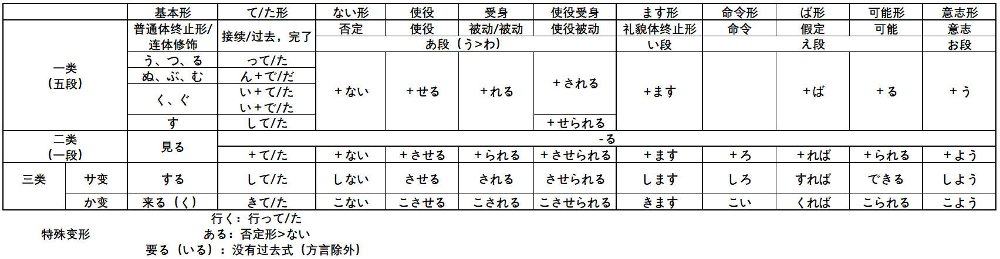
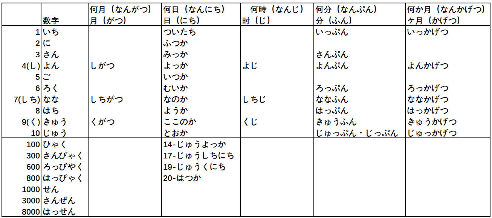
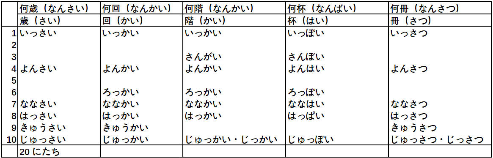

# 基础

## 汉字笔画

[汉字笔顺](https://kakijun.jp/)

## 汉语词音读规律

### 同声同音

**guan|jiao**

- 関心（**かん**しん）|交通（**こう**つう）
- 観察（**かん**さつ）|郊外（**こう**がい）
- 官庁（**かん**ちょう）|学校（がっ**こう**）
- 館長（**かん**ちょう）|効果（**こう**か）

### 前拨后长，单短双长

**规律大概占比 80% 左右**

**前拨：前鼻音（`an, en, in, un`） + 拨音**

漢＋字 （かん＋じ）     `han` > かん（前鼻音 > ん）

**后长：后鼻音（`ang, eng, ing, ong`）+ 长音**

英＋語（えい＋ご）　`ying` > えい（后鼻音 > 长音）

**单短：单元音（`a,o,e,i,u`）+ 短音**

**双长：双元音（`ao,ou`）+ 长音**

需＋要（じゅ＋よう）　`yao` > よう（ `ao/ou` > 长音）

### 促音便

**①以「つ・ち」结尾＋「か・さ・た・は」行　｜　は行半浊**　

- 発＋達：は**つ**＋**た**つ＝発達（は**った**つ）
- 失＋敗：し**つ**＋**は**い＝失敗（し**っぱ**い）、は行发生半浊

**②以「く・き」结尾＋「か」行**

- 欲＋求：よ**く**＋**き**ゅう＝欲求（よ**っき**ゅう）
- 石＋鹼：せ**き**＋**け**ん＝石鹼（せ**っけ**ん）香皂

### 浊音便

**①以「う・ん」结尾＋「か・さ・た・は」行　｜　は行半浊**

- 中＋国：ちゅ**う**＋**こ**く＝ちゅう**ご**く
- 患＋者：か**ん**＋**し**ゃ＝かん**じ**ゃ
- 原＋発：げ**ん**＋**は**つ＝げん**ぱ**つ

## 输入注意点

- ぢ（`ji`）按照 (`di`) 输入；
- づ（`zu`）按照 (`du`) 输入；

## 4种基本句型（敬体形/简体形）

## 接续形式

## 指示词

## 动词变形

### 特殊动词

需特殊记忆的一类动词（**i/e 段 + る结尾**）：

**i 段 + る结尾**

要る（いる）、入る（いる）、入る（はいる）、参る（まいる）、切る（きる）、限る（かぎる）

握る（にぎる）、遮る（さえぎ）、知る（しる）、走る（はしる）、散る（ちる）、混じる（まじる）

**e 段 + る结尾**

蘇る（よみがえる）、帰る（かえる）、焦る（あせる）、蹴る（ける）、茂る（しげる）、捻る（ひれる）

喋る（しゃべる）、滑る（すべる）、減る（へる）、占める（しめる）、照る（てる）、寝る（ねる）

**特殊用法**

行く：行って/た

ある：否定形>ない

要る（いる）：没有过去式（方言除外）

負う：負うて/た，負って/た

### 基本形 > ます形

> 第4课

### 基本形 > て・た形

> て形-第14课 た形-第21课

### 基本形 > ない形

> 第19课

### 基本形 > 命令形

> 第29课

### 基本形 > 意志形

> 第30课

### 基本形 > ば形（假定）

> 第37课

### 基本形 > 可能形

> 第38课

### 基本形 > 受身形（被动）

> 第41课

### 基本形 > 使役形

> 第43课

### 基本形 > 使役受身形

>第43课

### 动词活用

## 数量词

## 敬语

### 特定形式

### 形式变换

### 礼貌体

### 常用句型

# 1 单元

## 第 1 课 出会い

### 会话

**出会い（で）**

#### あのう/ちょっと

- あのう、東京タワーへ行きたいんですが、道（みち）を**教えてくださいませんか**。
- もらう（更委婉，我的动作自谦）道を教えて**いただきませんか**。
  - 我 << 他人，句子主语是：我方，**我方从他人那里得到**
  - もらう >> いただく（谦让语）  

- ちょっと、お願い**したい**ことがあるんですが...（有事要拜托您）
  - お＋V(连用)＋する（いたす，谦让语）
  - ちょっと、待ってください。

#### すみません

**道歉，感谢**，口语中发音接近于**すいません**

- いいえ、全然/大丈夫です/気（き）にしないで（别放在心上）
- いいえ、**どんでもないです**/気になさらずに/**気になさらないでください**。（更尊敬，ないで>>ずに）

**引起注意**

- はい？/何（なん）でしょうか（对すみません的回应）
- 何（なに）か御用でしょうか（更尊敬，对すみません的回应）

#### 自/他动词

- これ**が**落（お）ちました（自动词，强调状态，更自然）

- 自動ドア**が**閉（し）まります

- これ**を**落としました
- 私は目覚（めざ）まし時計（どけい）**で**起（お）きました。（闹钟叫醒了我）
  - で表示原因
  - **无生命的物体（闹钟）不能充当主语**

#### 先ほど

**さっき更正式的形式**

- こんにちは。先ほど**お電話した**山田です/先ほど**の**山田です。
- 先ほどの方 >> 先ほど**会（あ）った**方
- 先ほど**の**質問（しつもん）に**お答（こた）えします**。（の（代表言う）>> おっしゃった）
- 先ほどおっしゃった質問にお答えします。

#### 助かる（たす，自v）

**子供を助ける（他v）**

**对...有帮助**

- 天気がいいので、**助かります**。
- 仕事を手伝（てつだ）えば、お父（とう）さんが**助かります**。
- さっきは、どうもありがとうございました。**助かりました**。
- 荷物を持っていただいて、**助かりました**。（もらう＞いただく）更委婉
- 荷物を持ってくださって、**助かりました**。（くれる＞くださる）别人主动

#### 感じがする

**有...感觉**

味（あじ）/匂い（にお）/声（こえ）/音（おと）**がする**（味道/气味/声音）

感じ（かん）/頭痛（ずつう）/寒気（さむけ）/吐き気（はきけ）**がする**（头疼/发冷/恶心）

- 北京（ぺきん）の**町並み**（まちなみ）が**すっかり**変（か）わってしまって、不思議（ふしぎ）な感じがします。（街景，给人一种不可思议的感觉）
- この景色（けしき）を見ると、日本に来（き）た**とって/という**感じがします。（看到这样的景色，感觉是来到了日本）

#### すっかり/ずいぶん

**すっかり（100%不能认出）**

**ずいぶん（80%不能认出）**

- 街も**すっかり/ずいぶん**変わりました
- 陳さんの病気（びょうき）は**すっかり/ずいぶん**よくなりました。
- 李さんにもらったあめは**すっかり**なめてしまいました。（てしまう完成）
- **ずいぶん**食べたね/歩（ある）いた（表量多）
- **ずいぶん**たくさん買い物をしましたね。

#### ついていく

つく（粘上，附着）＋いく（由近及远）＞ついていく＞**ついていけない**（可能形）

あの人の考え方**にはついていけません**。（那个人的想法我跟不上）に提示对象

#### くらい/ほど

**くらい＝ぐらい｜简体＋くらい｜くらい＋の＋N（表示程度）**

- これは中学校（ちゅうがっこう）のテストですが、大人（おとな）でも**分からないくらい**難しい問題です。(虽然是中学测试，却是大人都答不上的难题)くらい表中顿
- この辺は、静か過（す）ぎで寂（さび）しい**くらいです**。
- 財布を忘（わす）れましたが、ジュースを**買うくらいのお金（かね）**は持っています。（买饮料这种程度的钱还是有的）

**简体＋ほど｜比较（天花板）｜强调情感色彩**

- 涙（なみだ）が**出（で）るほど**、うれしかったです。（高兴得眼泪都出来了）
- 昨日はとても疲れました。最後は立（た）っていられない**ほど**でした。
- 首都開発（しゅとかいはつ）計画（けいかく）は、面白い**ほど**うまく進（すす）んで（进展出奇的顺利）
- 死（し）ぬほど暑い（热死了，强调感情色彩）
- 先生**ほど**優（やさ）しい人がいない。（没有比老师更温柔的人）

#### ～てきた

**来る（来）|时间/空间上的由远及近**

- 日本語の発音（はつおん）に少し慣（な）れ**てきました**。
- 救急車（きゅうきゅうしゃ）のサイレンの音（おと）がだんだん大きく**なってきました**。
- ほら、高層（こうそう）ビルが**見えてきた**でしょう？

### 课文

**日本の鉄道（てつどう）**

#### ～とは

**～とは＝～というのは**

**1.解释说明/询问**

- JR **とは**、Japan Railways **の略（りゃく）です**
- 森さん**とは**、どんな人ですか

**2.下定义**

- おせち料理**とは**、正月（しょうがつ）に食べるお祝（いわ）いの料理**のことです**。
- ～とは、～のことです

**3.～というのは/～というものは/～ということは（解释说明）**

**の：名词化，泛指｜者（もの）：东西，物品｜事（こと）：具体的事情**

- 幸運（こううん）という**もの**はいつ訪（おとず）れるか分かりません。（何时到来不可预知）
- 子供を育（そだ）てるという**こと**は、とても楽しいことです。
- 一人で生活（せいかつ）するという**こと**は、大変なことです。

**4.～ということは：推测原因|归纳结果**

- 彼が怒（おこ）った**ということは**、きっと**ひどい**ことを言われたのでしょう。（大概是被人说了很过分的话）
- 車に５人**しか**乗（の）れない**ということは**、だれかがバスで行かなければならないということです。
  - **しか～ない**：包含感情，强调只有

#### ～は～の1つです

**...之一**

- 世界的に有名（ゆうめい）な新幹線（しんかんせん）**も**JRの路線（ろせん）**の１つです**。
- 日本**は**アジアの国**の１つです**

#### 結ぶ

 **连接，建立关系（绳子打结）。結び（結ぶ的连用形）＞＞中国結び（むす）**

- 主要都市（しゅようとし）を結ぶ路線は**もちろん**（自不必说）

- 靴（くつ）のひもをきちんと**結ぶ**。（鞋带系紧）
- 中国の旅行は、私と妹（いもうと）を結ぶ大切な**思い出（で）**です。（将我和妹妹联系起来的重要回忆）
- 化石（かせき）は、古い時代（じだい）と現代（げんだい）を**結んでいます**。

**繋ぐ（つなぐ），抽象连接上　結ぶ＝繋ぐ**

- 空港（くうこう）と北京市街を**結ぶ**。
- 手を繋ぐ（つなぐ）
- 紐（ひも）を結ぶ

#### どんどん

**事情进展顺利，连续不断**

- 路線（ろせん）が**どんどん**延（の）びています。
- 佐藤さんの中国語は**どんどん**上手になっています。
- 遠慮（えんりょ）しないで、**どんどん**食べてください。

#### 大（だい/おお/たい）

- **だい+汉语词（接头词）**：大事件・大地震（じしん）・**大成功（せいこう）**・大規模（きぼ,adj2）
- **おお+和语词（接头词）**：大金（かね）持ち、大雨（あめ）、大汗（あせ）
- **たい（固化词）**：大変、大切

#### 接头词/接尾词

**各（かく）～**

- 各位（かくい）・各種（かくしゅ）・各国（かっこく）

**～化（か）**

- 映画化・電子化（でんし）・現代化（げんだい）
- 近代化（きんだいか）・高齢化（こうれい）
- 実用化（じつよう）

**～的（てき）**

- 世界的（せかいてき）/国際的（こくさいてき）

- 積極的（せっきょくてき）/具体的（ぐたい）
- 抽象的（ちゅうしょう）/消極的（しょうきょく）/個人的（こじん）
- 効果的（こうか）/伝統的（でんとう）/**本格的（ほんかく）正式，原则，正规**

#### 写作顺序

- まず＞次に＞また/そして/さらに＞最後に
- はじめに/最初に＞続いて＞最後に

- 第一に・第二に・第三に

#### 文脉指示词

**そ系列一般指上文，こ系列一般指下文**

**そこで：补充新情况。地点+で表示范围**

**それで：原因。事物＋で表示原因**

東京に向（む）かう路線を「上（のぼ）り」、地方（ちほう）に向かう路線を「下（くだ）り」といいます。

- **そこで**、こんななぞなぞがあります。（于是/在这种情况下）
- **それで**、こんななぞなぞがあります。（因此）

### 单词

**三圆：音+义+拓展|二圆：音+义|一圆：音**

転勤（てんきん）：同一公司，系统内部|転勤になる（大家共同决定的结果）

転職（てんしょく）：跳槽

東京駅は「上り」の最終の駅**になっている**からです。(强调被决定的结果)

東京駅は「上り」の最終（さいしゅう）の駅だ**と決められている**。（被决定）

辺（へん）：n,一带，附近｜街角（まちかど）

辺り（あた）：n,周围，附近

**1.出会い（で）：n,相遇，碰见**

- 出会う：偶然（ぐうぜん）に会う
- 李さんに偶然出会った

**2.お祝い（いわ）:n,庆贺，祝贺**

- 祝う：お＋祝い
- 母から入学（にゅうがく）のお祝いをいただいた。（从妈妈那里收到了入学的**礼物**）
- 入学（にゅうがく）を祝う。

**3.上る（のぼ）：v1,上，登，进京｜上り（のぼ）：n,上，上行**

- 階段（かいだん）を上る・日が昇る（のぼ）・山**に**登る（のぼ）：に强调登上山顶
- 階段を下（お）りる・日が沈む（しず）・山を下（お）りる

**下る（くだ）：v1,下，下去，到地方去｜下り（くだ）：n,下，下行**

電車から降（お）りる

電車に乗る（の）

- **下りる（お）＞上（あ）がる/登る（のぼ）**
  - 階段から下りる/階段を上がる/木に登る
- **下がる（さ）＞上（あ）がる（自他动词）**
  - 物価（ぶっか）が下がる/上がる
  - 気温（きおん）が下がる/上がる
- 下る（くだ）＞上る（のぼ）
  - 下り列車（れっしゃ）
  - 上り（のぼり）のエレベーター（上行电梯）

**4.沸（わ）く：v1,沸腾，烧开｜沸かす：v1,燃烧，烧开**

- お湯が沸く/お湯を沸かす
- 湧く（わ）：涌出
  - 興味（きょうみ）が湧いてきた。（临时）
  - 興味を持つようになってきた。（逐渐有了兴趣）

**5.乾かす（かわ）：v1,弄干，晾干**

- 干す（ほ）：展开后风干，晒干：**强调晾晒**

- 乾かす：加热，送风等人为方法，**强调干**
- 濡（ぬ）れた服を干した（可能依然湿的）

- 濡れた服を乾かした（完全干了）

**6.表す（あらわ）：v1,表示，表达，表现**

- 顔に表す（かお）：喜形于色
- 言葉に表す

**7.溶く（と）：v1,调拌，调开，溶解**

- 溶かす：水溶，**热熔**（他动）
- 溶く：固体，粉末放入液体（他动）
- 水に溶く・水で溶く
- 鉄（てつ）を溶かす・バターを溶かす（黄油）

**8.広げる（ひろ）：v2,展开，扩大，拓展**

- 噂（うわさ）を広げる（谣言，绯闻）
- 噂が広がる

**9.流れる（なが）：v2,流动，流淌**

- 噂が流れる/広がる（流言四起）
- 流れ（连用形）：潮流，流程
- 時の流れ・授業（じゅぎょう）の流れ

**10.なめる：v2,添，含**

- 犬が手を舐める
- 舐めるな！（不要把人看扁了）

**11.優れる（すぐ）：v2,优秀，卓越**

- 过去式+N
- 優れた人/技術（ぎじゅつ）

**12.延びる（の）：v2,延伸，延长**

- 路線（ろせん）が延びる/出発（しゅっぱつ）が延びる
- 伸びる：売（う）り上（あ）げが伸びる（销售额上升）

**13.訪（おとず）れる：v2,到访，访问**

- 家を訪れる
- 春が訪れる

**14.育（そだ）てる：v2,养育，培养**

- 花を育てる
- 子育（こそだ）て：n,养育孩子

**15.注目（ちゅうもく）する：v3,注目，注视**

- 注目を浴びる（あ）：大家关注的焦点（沐浴着大家注视的目光）
- 価格（かかく）に注目する/顔に注目する

**16.経営する（けいえい）**

- 会社を経営する
- 感（かん）じがします

**17.目覚まし時計（めざましどけい）：闹钟**

- 目**が**目覚（さ）める：眼睛睁开
- 目**を**覚（さ）ます＞**目覚（ざ）ます**：叫醒，唤醒

**18.なぞなぞ：n,谜语**

- 謎をかける/謎を解く（と）：出谜/解密
- 謎のような人

**19.答え（こた）：n,回答，答案**

- 答える
- 質問に答える（しつもん）

**20.こんな：连体词，这样的**

- 连体词：连接体言（连接名词，代词等）
- こんな人（贬义）
- このような（连体）
- **これら：代，这些**

### 综合练习

#### 练习

雨がやんで、空が**だんだん明（あか）るく**なってきました。（雨が止む）

探していた小学校（しょうがっこう）時代の友達に**とうとう会うことができました**。（终于见面了）

これは私の**個人（こじん）的**な意見（いけん）です。

さっきから携帯電話（けいたいでんわ）を探しているのですが、**見つかりません**。（自动词没找到，强调状态）

- 田中さんは**鉄道を利用して旅行するの**が趣味（しゅみ）です。（兴趣是...）

- 特（とく）に列車（れっしゃ）の中で**駅弁（えきべん）を食べる**のが楽しみです。（...是一种乐趣）
  - **～のが楽しみです**
- 駅弁とは**駅で売っているお弁当（べんとう）の**ことです。

#### 对话

遇见在其他场合打过招呼的人，依稀记得名字，但不确定。同他打招呼，并确认姓名

- あのう、すみません。田中さんじゃありませんか。
- すみません、ちょっと失礼（しつれい）ですが、田中さんですか。

**问路：**

- あのう、ちょっとお聞きしたいんですが...

  東大（とうだい）ってどこにありますか。/東大（とうだい）へはどうやって行けますか

- すみません、東大へ行きたいんですが、道に迷（まよ）ってて...

  こっちからは行けます。（这边可以去吗）

### 同步练习

- 親（おや）というものは**いつも子供の幸せ（しあわせ）**を願っています。（父母总是希望孩子幸福）
- 幸運（こううん）という**もの**はいつ訪（おとず）れるか分かりません。（幸运这种东西，何时到来不可预知）
- 人間（にんげん）の欲望（よくぼう）というものは**きりがありません**。（没完没了）
  - 切る（き）
- 年々（ねん）｜わざわざ（特别，专门）
- 慣（な）れない所（不习惯的地方）
- 一方（いっぽう）、～
- ～ように見える（看起来是...样）

**表达积累**

～によって異（こと）なる/違（ちが）う（依据...，...是不同的）

同（おな）じ国でも、地方**によって、～が違う**

**～ことに気がつく（意识到）**

~ということは、～ことです**が**、～ことです。（...事虽然...,但是）

町が近代化（きんだい）する**ということは**いい**ことかもしれませんが**、個性（こせい）がなくなってしまうのは寂しい**ことです**。

少し（すこし）不便（ふべん）なことがあっても、自分の目で見て、耳で聞いて、手で触（ふ）って、世界（せかい）中の人と交流（こうりゅう）することが、旅行のよさではありませんか。（这不就是旅行的好处吗？）

## 第 2 课 あいさつ

### 会话

あいさつ：寒暄

#### 寒暄

**好久不见**

- （どうも）お久（ひさ）しぶり。

- （どうも）お久しぶりですね。
- （どうも）ご無沙汰（ぶさた）しています。

- （どうも）ご無沙汰しております。

**问候**

- お元気ですか。
- お変わりないですか。（没什么变化吧）
- お変わりありませんか。
- お変わりないでしょうか。

**ぶり（间隔时间长）**

**～ぶりに＋V｜～ぶりの＋N**

**间隔时间长|...的样子**

- ３か月ぶり**に**、東京へ行きました。（时隔3个月，再次来到东京）
- **3年ぶりで**彼にあった（时隔3年见面）
- **暮（く）らしぶり：生活的样子**

- 10年ぶり**の寒さで**、湖（みずうみ）が凍（こお）りました。（10年一遇的严寒，湖水都结冰了）

**ふり：装作...的样子**

- 知らないふりをして
- いい子（こ）のふり

**その節（せつ）≈この間＝先日（せんじつ）**

その節：可以指过去或未来

- **その節**は結構（けっこう）な物をいただきまして、ありがとうございいます。（过去）
  - 結構（けっこう）：特别好，特别棒
  - 谢谢您那次送给我那么好的礼物
- **その節**はよろしくね。（未来）
  - 届时请多多关照

#### 早（はや）いものですね

**时间过得真快，～ものです：感慨**

- 時間が経（た）つのは早いものですね。（时间的流逝是很快的事情）
- １人でよく帰って**こられた**ものです。(自己一个人竟然能回来)
- 平和（へいわ）な世界（せかい）になってほしい**ものです**。（真希望世界和平）
- 休暇（きゅうか）が取（と）れたら、ゆっくり旅行したい**ものです**。（真想好好旅行一番）

#### 介绍的顺序

先内后外，先上后下

**公司里的称呼：**

[对内]

- 部長（上司）
- 鈴木さん（同事）

[对外]

- 佐藤です（对外称呼内部的人）
- 山田課長（かちょう）（称呼外部公司的人）
- **すみません、山田課長はいらっしゃいますか。[称呼外部]**
- **山田は今出（で）かけております。[称呼内部]**（おります＞いる的尊敬语）

### 课文

**あいさつの時の礼儀（れいぎ）**

1.お辞儀（じぎ）の角度（かくど）**には**、首を曲げるだけの軽（かる）い**ものから**深（ふか）く頭を下げる**ものまで**、いろいろあります。

- **～には、～ものから～ものまで、いろいろある。**（存在句，从...到...，有很多）
- **～には、～ことから～ことまで、いろいろある。**
- 鞠躬的角度，从点头这样轻量事的，到把头深深低下去，有很多种。

2.次（つぎ）に相手（あいて）の名刺を**お辞儀をしながら**受け取ります。

- 接着一边鞠躬一边接受对方的名片。
- **连用形中顿，用于解释说明**
- **まず～次に～最後に（さいご）**

3.話す内容（ないよう）**にも気をつけ**なければなりません。

- **～に気をつける：留意（主动性）；**
- ～に気がつく：留意到；

**4.仕事の場（ば）/会議の場/面接の場**

**抽象的场合**

- 戴さんは昨日、会議の場で社長にほめられました。
- その場で解決（かいけつ）する。

**5.大事（だいじ）なのは**、相手に不快感（ふかいかん）を与え（あた）ないことです。（重要的是）

**6.～顔をする**

- 怖い顔をしていています
- 彼女はわたしを見ると、**びっくりしたような顔**をしました。（她看见了我，显得很吃惊）

**7.相手に印象（いんしょう）を与える**：留下印象

～印象を与える

**8.～時は、普通（ふつう）～する：普通お辞儀をします。**

**～のが普通/一般（いっぱん）的（てき）です**：握手（あくしゅ）よりもお辞儀をする**のが一般的です**

#### Vる＋ほうが~

**表示客观对比，建议的语气没有 Vた＋ほうが～强**

**Vた＋ほうが～**

**Vない＋ほうがいい**

- 危ないから**触（さわ）らないほうが**いい。

- 両手（りょうて）を**使うほうが**丁寧（ていねい）です。
- 食事は（１人で**食べるより**）大勢（おおぜい）で**食べるほうが**楽しいです。（吃饭多人在一起更有乐趣）
- ジョギングは、（**急（いそ）ぐより**）ゆっくり**走（はし）るほうが**いいそうです。（客观对比）
- ジョギングは、ゆっくり**走った方がいい**です。（语气更强烈）

#### ～かどうか/～か

**多个并列时，可将かどうか省略为か。**

- 飛行機のチケットは買った**か**、ホテルの部屋は予約した**か**、確認（かくにん）してください。**（かどうか省略为か）**
- 昨日どこへ行ったか、誰とあったか、何をしたかどうか、いろいろ聞かれました。
- **結婚（けっこん）している**かどうか、給料（きゅうりょう）はいくらか、年（とし）はいくつかどうかは、普通（ふつう）は聞きません。

**年（とし）**

年が離（はな）れる（年龄差距较大）

年を取（と）る（上了年纪）

お年寄り（としよ）老年人

- わたしは兄（あに）と**年が離れて**います。
- 夫（おっと）とはかなり年が**離れて**います。
- 母は最近**年を取って**、目が悪（わる）くなりました。
- お**年寄り**には席（せき）を譲（ゆず）りましょう。

#### いくら～ても

**无论...也**

- **いくら**早く答え**ても**間違いがあれば合格（ごうかく）てきません。（回答再快，错了也不合格）
- この店では**いくら**料理を食べ**ても**1000円です。
- **いくら**頑張（がんば）っ**ても**無駄（むだ）だ（怎么努力都没用）
- **いくらなんでもひどい**。（再怎么说也太过分了）

**いかに（怎样，怎么）/どんなに（怎样，怎么）/どれだけ（多么）～ても**

**いかに：更书面语**

- **どんなに**遅く（おそ）なっ**ても**大丈夫です。
- **いかに**フランス語がうまく**ても**、フランス人には及（およ）びません。
- **どれだけ**考え**ても**、いい案が見つかりません。（无论怎样想，也想不出好办法）
- **どれだけ**心配したか：多么担心吗
- **いかに**急い**でも**
- **如何に（いか）生活するのか**（如何生活）
- **どんなに**頑張ってもできんない

#### ～ては/～では

某一情况下出现另一种情况

- 怖い顔をしてい**ては**、相手にいい印象を与えることはできません。

- あんな人が教師（きょうし）**では**学生がかわいそうです。(这种人是老师，学生很可怜)
- 交通（こうつう）がこんなに不便（ふべん）**では**お客さんは来ないでしょう。
- こんなに給料（きゅうりょう）が安く**ては**困（こま）ります。（工资这么少可不行）
- そんな大きな声を出し**ては**近所迷惑（きんじょめいわく）です。（发那么大声会给邻居添麻烦的）

#### こもる/こめる(他动)

**込めて，包含，充满，こめる（他动）**｜気持ち（きもち）：心情

- **煙（けむり）/匂（にお）い**がこもる（充满烟/气味）
- 家にこもる（呆在家中不出门）｜**引きこもり**（家里蹲）
- 気持ち/真心/思い**がこもる**｜気持ち/真心/思い**を込める**

- **気持ちがこもっている**かどうか、予想以上に相手に伝わってしまうものです。
- 手作（てづく）りのお弁当にはお母（かあ）さんの**真心（まごころ）がこもって**いますよ。
- 彼らは（結婚のお祝いの**気持ちをこめて**）歌を歌いました。（饱含着对婚礼祝福的心情唱歌）
- 遠（とお）く離（はな）れた家族への**思いをこめて**、手紙を書きました。（包含着远离家人的思念）

#### Vる/Vた/N＋以上

- わたしたちが**予想する以上**（いじょう）に人が集（あつ）まったら、どうしましょうか。

  到场的人数如果比预料多，我们该怎么办

- わたしたちが**予想した以上に**人が集まりました。（到场的人比我们预料的多）
- <思った以上に>試験（しけん）は難しかったです。（考试比预想的难）
- 上海は<**想像（そうぞう）以上に**>近代（きんだい）化が進（すす）んでいます。（以超乎想象的速度实现近代化）
- 田中さんも真面目ですが、山田さんは田中さん**以上に**まじめです。（山田比田中更认真）

#### ～ものです

**1.本质，理所当然**

- 予想以上に相手に伝（つた）わってしまう**ものです**。（对方能分毫不差地感受到）
- 山の天気は変（か）わりやすい**ものです**。（山里天气易变呀）

- 人の心（こころ）は分からない**ものです**。
- そんな失礼なことは言う**ものではありません**。（那种失礼的话是说**不得的**）

**2.感慨：ものだ**

- 早（はや）い**ものです**ね。
- 時間の経（た）つのは早い**ものです**ね。（时间过得真快呀）

**3.回顾：Vた＋ものです**

- 子供の時、よく川で**遊（あそ）んだものです**。
- 新入社員（しんにゅうしゃいん）の時、よく林（はやし）部長と飲みに**行ったものです**。

**～だもの/だもん：申诉自己的正当性，比～ですから语气弱**

おととい送（おく）ったん**ですもの**ね。

### 单词

待つ＞待たせる（使役）：お/ご...する（自谦）

お話中（ちゅう）/お仕事中/お電話中

日本人同士（どうし）：仅限日本人和日本人之间

**お願いします**

- こちらに**お願いします**。（把人带来吧）

- こちらに案内（あんない）してください。
- 今回もよろしく**お願いします**。

首（くび）を曲（ま）げる：点头｜握手（あくしゅ）をする

頭を下（さ）げる：鞠躬，认输｜相手（あいて）

**1.凍る（こお）：v1,结冰，结冻**

氷（こおり）｜水が凍る

**2.伝（つた）わる：v1,传达，传播，流传**

伝わる（自）｜伝える（他）

- 相手/後世（こうせい）に伝わる（流传给后世）
- **噂が伝わる/流（なが）れる/広（ひろ）がる**
- よろしくお伝えください。（请帮我带好）

**3.譲る（ゆず）：v1,让，转让**

**経つ（た）：v1,（时间）流逝，消逝**

- 席を譲る（ゆず）

- 時間が経つのは早い
- **時が経つにつれて**（随着时间的流逝）

**4.付き合う（つきあう）：v1,交往，来往**

- 彼女と付き合う
- 食事に付き合う（陪同吃饭）

**5.離（はな）れる：v2,相隔，距离，分离，离开**

- 中心部（ちゅしんぶ）を離れた場所（ばしょ）
- 駅から2キロぐらい離れた所
- **離れ離れ（はなればなれ）：离散**
- 家族がはなればなれになる

**6.与える（あた）：v2,给与，给予**

**及ぶ（およ）：v1,达，及**

- 影響（えいきょう）/被害（ひがい）が及ぶ（影响/波及）
- 影響/ショックを与える（震撼）

**7.怠ける（なま）：v2,懒惰，懈怠**

- 仕事を怠ける
- 怠け者（懒汉）

**8.曲げる（ま）：v2,弄弯，扭曲**

- 事実（じじつ）**を**曲げる
- 右（みぎ）に曲（ま）がる（自动词）

**傾（かた）ける：v2,倾斜，倾注**

- **傾く（かたむく）自动词**
- 机/首（くび）を傾（かたむ）ける（脖子）
- 力（ちから）を傾ける

**9.あきれる：v2,目瞪口呆，惊愕**

- 呆（あき）れて**もの**が言えない（呆着说不出话）
- 受け取る（うけとる）：v1,接受，接收（强调结果）
- 受ける（う）（强调动作）

**10.懐（なつ）かしい：adj1,怀念，留念**

- 故郷（ふるさと）が懐かしい
- ふるさと：多指情感上的故乡｜こきょう：正式用法
- 懐かしい**思い出**（值得怀念的会议）

**11.ありがたい：adj1,珍贵，难的**

- ありが**たい**＞ありが**とうございます**
- めで**たい**＞おめで**とうございます**

- 早い＞おは**ようございます**
- ありがたくいただきます。（那我就不客气了）
- **それはありがたいです**。

**12.結構（けっこう）：adj2,很好，优秀，足够**

**順調（じゅんちょう）：adj2,顺利，良好**

- 結構な眺め（なが）
- 千円（せんえん）で結構です
- 結構です/結構役に立つ（やくにたつ）（帮助很大，相当有用）
- 仕事が**順調に**進む（すす）

**13.かわいそう：adj2,可怜**

**いや：adj2,厌烦，讨厌**

**わずか（僅か）：adj2,很少，一点点，仅仅**

- **かわいそうな**顔をして
- 嫌だ/嫌な予感がある（有不好的预感）
- 僅か100円しかない

**わがまま：adj2,任性，任意**

- 吾輩（わがはい）｜わが：我们

- わがままな子供
- わがままを言う

**思い：n,情感，想法：思う/思い出**

**14.決まる（き）＞決まり（き）：n,规矩，决定**

- **決まりがある（有约定俗成的/有规定的）**

- 決まりを守る（まも）：守规矩

- 名刺（めいし）の出（だ）し方と受け取り（うけとり）方**に**も決まり**があります**。

  （递名片和接名片的方法也有规定）

**15.案（あん）：n,办法，方案，预想，意料**

- いい案が浮（う）かぶ
- 案内（ない）：导游，导览

**首（くび）：n,头，脑袋，脖子**

- 首になる（被炒鱿鱼了）/首にする（炒别人鱿鱼）
- **君は首だ（你被解雇了）**

**腰（こし）：腰をかける・座る（坐下）**

**16.両手（りょうて）：n,双手，两手**

片手（かたて）：n,单手，一只手

- 片道（かたみち）：单程
- 片思い（かた）：单相思

**17.真心（まごころ）：诚心，诚意，真心**

- 真っ白（まっしろ）：雪白
- 真ん中（まんなか）：正中间

**予想（よそう）：n,预料，预计，预想**

- 予想がつく（想到了）
- 予想外（よそうがい）：出乎意料

**印象（いんしょう）**

- 印象（いんしょう）を**与（あた）える**

- 印象に残（のこ）る
- 印象**深い（ふかい）**

**18.あらゆる(连体)所有，一切**

**连体词可直接＋名词**

- 有り得る（ありうる）：ある可能性（かのうせい）がある
- ありとあらゆるもの：所有的东西

**全て（すべ）**

- 全ての方法（ほうほう）：能想到的所有**正常的方法**
- あらゆる方法（ほうほう）：不择手段的方法

**その節（せつ）：那时，那次/届时**

- その節はお世話になりました

- その節はよろしく

- この間（あいだ）：n,前些天，最近

  こないだ：口语中，の常省略

- この間お世話になりました。

**19,同士（どうし）：同伴，伙伴**

同质化程度高

- 学生同士/隣同士（互为邻里）

- 秒（びょう）ルール：3秒法则

- 無力感（むりょくかん）

**20.無駄使い（むだづかい）：n,浪费，滥用**

- 水を無駄使いしないで

**近所迷惑（きんじょめいわく）：n,打扰邻里**

- 近所（きんじょ）：邻里
- **ご迷惑を掛（か）けして、申し訳（もうしわけ）ございません**。（给您添麻烦了，真的很抱歉）

**気分転換（きぶんてんかん）：n,转换心情**

- 気分が悪い：心情不好
- お祭り（まつり）気分：节日气氛

**21.短语搭配**

ご無沙汰しております：好久不见

**ご馳走（ごちそう）さまでした：谢谢热情款待**

申し訳（もうしわけ）ありません

**では、これで：那就这样吧**

今日（きょう）はこれで終（お）わりにします

### 综合练习

急（きゅう）な雨で**頭から足（あし）まで**すっかり濡（ぬ）れてしまった。（从头完全湿到脚）

#### といわれています

今の若者（わか）は人と話すことや、自分の気持ちや意見（いけん）を相手に伝（つた）えることがうまくできない**といわれています。**

- 现在的年轻人在与人交谈方面，自己的心情和意见无法很好地传递给对方
- **と言われています：被普遍认为**

**テレビグーム：电视游戏**

友達とはパソコンや携帯（けいたい）のメール**で**しか付き合わないという子供も増（ふ）えています。

- 付き合わない（つきあわ）：不交往，相处
- 除了电脑和手机邮件之外

**自分の気持ちを言葉で相手に伝えること、相手の顔を見ながら直接（ちょくせつ）話すことはとても大切です。**

家族**と**も：和家人

しませんか：难道不这样吗

#### だんだん

**段々（だんだん）：程度副词，表示阶段变化过程，缓慢，渐变**

- だんだん話せるように**なってきた**
- だんだん暑く**なってきた**

#### どんどん

**情态副词：猛烈，快速，顺利，压迫感**

- どんどん話すようにする。

- どんどん暑くなっている。

#### 对话

**公司商谈，客人久等**

- 申し訳（わけ）ありません。お待たせしました。
- お待たせし**て**申し訳ございません。（て：表示轻微地原因）

**见到多年未见的恩师**

- ご無沙汰（ぶさた）しております
  - お変わりませんか（か）
  - お変わりないでしょうか
  - お変わりございませんか

- おかげさまで、元気にして（い）ます。（托您的福，一切都好）口语中い脱落

### 同步练习

#### 振假名/送假名

**話（はな）し**

- 写在汉字旁边的：送假名-し
- はな：振假名

被害（ひがい）が広い地域（ちいき）に及ぶ（およ）灾害影响很多地方。

時間/お金に**余裕（よゆう）がある**：时间上宽裕

#### 小句中が＞の

**ようこそ：欢迎，热烈欢迎**

落ち着く（おちつく）：v1,沉着，朴素

壁（かべ）は明るい色**より**もう少し落ち着いた色にし**ては**いかがでしょう。

いくら親（おや）でも、子供の心の中までは分からない**ものです**。

#### 连用形中顿

**动词用连用形作中顿：v3：散歩をする＞散歩し**

**adj1 中顿：Aい＞Aく**

**ている去掉：光っている＞光り（ひか）**

- 横浜で生まれ、ここで育ち（そだ）、ここで子育てをしています。
- 月（つき）は明るく、星（ほし）は光り、山々が**くっきりと**見えています。（看得很清楚）

講義（こうぎ）に**ついていけません**。：跟不上讲义

活字（かつじ）離れ**が**進む若者（わか）＞活字（かつじ）離れ**の**進む若者（わか）

**ツール：工具**

#### てほしい

**希望别人去做**

新聞を読んでほしいものです。（希望读一读报纸）

表から（ひょう）：从表上看

- 表から~，～ことがわかります
- ここから～、～ことがわかります

セットで売る：成套出售

～と～を比（くら）べると、～は～（という）ことが分かる。

**つい読み比べをしてしまいます：つい...してしまう，一不小心完成了**

## 第 3 课 顔合わせ

### 会话

**顔合（あ）わせ：见面会**

担当（たんとう）いたします＞担当する（いる＞いたす自谦）

担当して**おります**＞担当している（いる＞おる自谦）

**私（わたくし）**：读音是更正式的表达

**4人（にん）/４名（めい）更郑重的说法**

#### こめて/ほか

**2年目（ねんめ）：第2年**

- 李さんを**こめて**4名のスタッフ（包含李一共4名）

- 李さん**ほか**3名のスタッフ（除李之外有3名）

#### ～させていただく

**请别人允许我做...：客套，请求允许**

**あ段＋せる：使役｜主（おも）：adj2**

**～ていただく：请别人为我做（～てもらう）**

- **主に営業（おもにえいぎょう）を担当させていただきます。**（请允许我担当主要负责人）
- この会社の主な商品（しょうひん）は、バターとチーズです。

**主（しゅ）として=主に**

- 田中先生は**主として**初級（しょきゅう）のクラスを担当しています。
- それでは、私から説明（せつめい）**させていただきます**。

#### ～にとって

**站在...的立场来看**

**表示判断或评价的基准**

**后+对事物的评价，价值判断等**

- わたし**にとっては**、初めての海外旅行（かいがいりょこう）でしたが。
- 張さん**にとって**、仕事は人生（じんせい）のすべてではありません。
- わたしたちの会社**にとって**、今回のプロジェクトはとても大切です。（公司的立场）

**1.～として：作为~（身份，资格，名目），以~名义**

**做某事/评价某事时的立场，资格，名义**

- 困（こま）っている人を助（たす）けるのは、人間（にんげん）**として**当然（とうぜん）のことです。（做人的本分）
- わたしが親（おや）**として**一番気をつけていることは、子供の個性（こせい）を尊重（そんちょう）することです。
- 李さんは主任（しゅにん）**として**、上海支社に赴任（ふにん）しました。

**2.～としては：作为~来说**

**做某事/评价某事的立场限定为个人立场**

- 彼女**としては**とても辛（つら）かったようです（痛苦，煎熬）。

- この絵は、子供**としては**とても上手です。

- わたし**としては**（＝わたしは）、その案に反対（はんたい）です。（后面+动作）

- わたし**にとって**、その案は**反対すべきです**。（应该反对）

  **にとって：后面不＋动作｜后＋价值判断**

**3.～にしたら/～にしてみれば/～にすれば（假定的感觉）**

**在~立场来看的话，应该~**

**假定别人的立场，做出推量**

- 大人（おとな）は簡単（かんたん）でも、子供**にしたら**難しい**でしょう**。（对大人来说很简单，但对孩子来说很难吧）
- 彼**にしてみれば**、こんな朝早（あさはや）く出（で）かけるのは嫌（いや）**でしょう**。（站在他的立场来说，这么早出门也是不大情愿的吧）
- 張さん**にすれば**、今回の決定（けってい）に不満（ふまん）があるだろう。（站在小张的立场，对这次决定会有所不满吧）

#### ～として/～にとって

**Pにとって、Q：P是立场，Q是评价；**

**Pとして、Q：P是身份，资格，Q是动作/评价**

- 困っている人を助けるのは、人間（にんげん）**として**当然（とうぜん）のことです。（责任感）
- 困っている人を助けるのは、人間**にとって**当然のことです。（仅评价）

#### が/けど/けれど/けれども

**が：表示转折；后＋省略；引出话题**

**けれども：多在口语中使用**

- すみません**が**、今お話してもいいでしょうか。（现在方便谈话吗）
- 李さんも日本語が上手です**けど**、王（おう）さんも上手ですね。
- ちょっと伺います**けど**、この近くに博物館（はくぶつかん）はありませんか。
  - 聞く（き）自谦＞伺い
  - お聞きしたいですが（聞きします）

#### 今でも

**今でも/も｜現在（げんざい）でも/も**

- 父はわたしのことを**今でも**小さな子供のように思っています。
- 幼い（おさな）ごろのこと今でも覚えている。｜**頃（ごろ）：时候**

- 京都（きょうと）には1000年以上の建物（たてもの）が**今でも**たくさん残（のこ）っています。

**今まで：到今为止，现在已经改变**

- 今まで勉強してきたこと

- **今まで**故郷（こきょう）を離（はな）れて暮らしていました。（在此之前，一直离开故乡生活）

- **今まで**優（やさ）しくしてくれてどうもありがとうございました。（感谢一直以来对我那么好）

  分别时寒暄

#### 自我介绍

- **寒暄：**初めまして

- **所属+姓名：**（公司，学校）の～です/～と申します

- **补充说明：**名字写法，工作/学习经历，兴趣爱好

  - 山（さん）は山（やま）です

  - 王は王様の王、風（ふう）は風**と書きます/という漢字（かんじ）です**。

  - **～と呼んでください**
  - 主（おも）に営業を**担当（たんとう）させていただきます/担当しております**。
  - 上海支社に来て、**２年目です/２年経（た）ちました/2年になりました。**

  - 東京大学の2年生です。

  - 中国の上海から**参りました/来まし**た。

- **结尾：よろしくお願いします**/お願いいたします
  - お願い申し上げます。
  - これからお世話になります。（商务场合）

### 课文

**名字｜苗字（みょうじ）**

#### adj1＋く＋の＋N

**特殊形式**

- 多い＞多くの場合（ばあい）
- 遠い（とお）＞遠くの
- 近い（ちか）＞近くの
- **少しない＞少しの**｜公園に少しの観光客（かんこうきゃく）がいる

#### 場合（ばあい）

**简体＋場合｜N＋の＋場合｜AN＋な＋場合**

- ボタンを押（お）しても切符（きっぷ）が出（で）ない**場合**、駅員を読んでください。
- 都合（つごう）が悪い**場合**は知らせてください。（没时间得话，请告诉我）

**場合によっては：根据情况**

- 平日（へいじつ）は7時に閉店（へいてん）しますが、**場合によっては**９時まで営業することもあります。

  Vる＋ことがあります（有这种情况）

#### ～わけにはいかない

**不能，不可｜訳（わけ）：理由，道理，情况**

**できない：能力上不行**

**～ないわけにはいかない：不能不，不可不，必须**（不作什么不行）

- 名字をつけ**ないわけにはいきません**（义务）
- ここであきらめる**わけにはいきません**（不能在这个时候放弃）
- 来週受験（じゅけん）なので風邪を引く**わけにはいきません**。（下周考试，不能感冒）

**～わけにもいかない：想而不能**

- 質問がたくさんあっても、無視（むし）する**わけにもいかない**ので、きちんと答えています。
- お金は足（た）りませんが、予算を増やす**わけにもいきません**。
- お金は足りませんが、予算を増やす**わけにはいきません**。（区别不大）

#### そこで/それで

**そこで：地点，即在这种情况下，又出现新情况**

**それで：因此，で表示原因**

地名（ちめい）や地形（ちけい）から名字をつけました。

#### 倒装

**强调原因**

- 自然（しぜん）に関係（かんけい）する漢字（かんじ）が多いのは、**そのためです**。

- 彼が夜間学校をやめたのは、仕事が忙しくなった**ため**です。（倒装，果＞因）
- 彼は仕事が忙（いそが）しくなった**ため**、夜間学校（やかんがっこう）をやめました。（因＞果）

#### ～と考えられている

**～といわれている/～と考（かんが）えられている：普遍看法，并非主观判断**

- 正しい（ただ）敬語（けいご）を使える人は本当に少（すく）ない**といわれています**。（能够正确使用敬语的人是非常少的）
- 日本の人は減（へ）っていく**と考えられています**。

#### それでも

**即使如此**

- 父親（ちちおや）が病気（びょうき）で亡（な）くなりました。**それでも**彼はアルバイト（零工）をして大学を卒業しました。
- 日本人の名字の種類（しゅるい）は30万近くあります。**それでも**世界（せかい）の第（だい）２位です。

#### 数值表达

**約（やく）・大体・ほぼ＋数字**

**数字＋程度（ていど）・ほど・ぐらい**

**～以上：～を超える/～を上回る（うわまわ）**

**～以下（いか）：~近く（将近）/～を下回る（したまわ）**

- 30万近く（ちか）：将近

- 160万を超（こ）えています

**一方（いっぽう）：一方面，另一方面**

A社の業績（ぎょうせき）はとてもいいです。一方、B社の業績はあまりよくありません。

#### 表达积累

**1.～ようになったのは、～になってからです**

すべての日本人が名字を持つ**ようになったのは**、明治時代（めいじじだい）**になってからです**。

**2.どうすればいいのかわかりません：不知道怎么办**

どんな名字を持てばいいのかわかりません。

**3.名前をつける**

- 名付（なつ）けられた：被起名字
- ～から名付けられた：从...来的

**4.程度（ていど）しかない：只有这个程度**

### 单词

広告（こうこく）｜法律（ほうりつ）

加わります（くわ）

Vる＋ことがあります（有时候会）

Vた＋ことがあります（有...经历）

持つ＞持て（命令形）

**それでも：即使那样，尽管如此，可是**

それでも食べたい

**1.溶ける（と）：v2,融化，熔化，溶化**

- バターが溶ける
- 砂糖が水**に**溶ける（溶于水中）｜砂糖で水**で**溶ける（用水去溶解）
- 雪/氷（こおり）が解ける＞雪解け（と）：破冰

**2.上（うわまわ）回る：v1,超过，超出**

**下回る（したまわ）：v1,不够...水平，在...以下**

- 前回（ぜんかい）の売り上げを上回る
- 予想を下回る

**3.なくなる（亡くなる）：v1,去世，死亡**

- 死ぬ（し）

- 無くなる（な）：没有了，消失了

  夢/お金が無くなる

**4.指す（さ）：v1,指，指示**

- 「それ」は文章（ぶんしょう）のどの部分（ぶぶん）を指すか
- 授業（じゅぎょう）で指された。（被课上点名）

**加わる（くわ）：v1,参加，添加，增添**

加える（くわ）：他动词

1名加われば、メンバーが揃う（そろ）：再加一个人的话，小组成立

**試す（ため）：v1,试，尝试，试验**

- 試してみる：尝试其他的事物（不止试衣服）

- 試着（しちゃく）：试衣服

**5.あきらめる：v2,放弃，断念，死心**

- もう諦めた（あきら）
- 諦めずに最後まで頑張る

**力（ちから）：n,力气，力量**

- 力が強い/力強い
- **力になれるように**頑張る（努力成为某人的力量/支柱）

**見舞い（みま）：n,探望，慰问，问候**

- お見舞いに行く（去探望）

**辛い（つら）：adj1,难受，痛苦，难过**

- 別（わか）れは辛い（つら）

**深刻（しんこく）:adj2，严肃，严重，深刻**

- 深刻な問題
- ～問題が深刻になってきた（问题变得越来越严重）

**6.仲良く（なかよ）：adv,亲密，友好**

- 仲良し：二人は仲良しです。
- 友達として仲良くしてね（作为朋友要友好）

**7.学習する（がくしゅう）：v3,学习**

**勉強する：暗含学习的辛苦**

**学ぶ（まな）**

**習う（なら）：学习技能，一般需要老师**

- 彼女の生（い）き方を学ぶ（学习生活的方式）
- ピアノを習う（学习技能）
- 日本語を勉強する/学ぶ
- もっともっと勉強しなきゃ
- 日本語学習（がくしゅう）

**8.ざっと：adv,一下子，很快**

- ざっと読んで意味を把握（はあく）する
- 部屋をざっと**片付（かたづ）ける**

### 综合练习

1.冬の北海道（ほっかいどう）は素晴（すば）らしいです。夏は花が咲（さ）いて**さらに**美（うつく）しいです。**（さらに：更加）**

2.**そこで**：在这基础上又出现新的结果

3.出席者（しゅっせきしゃ）は８名ですが、資料（しりょう）は**10部（ぶ）**コピーしておいてください。

4.引っ越し（ひっこし）先（さき）の住所（じゅうしょ）を知っていますか。

### 同步练习

#### V简＋のは、～ためです

私わちのチームは負（ま）けて**しまったのは**、代表選手（だいひょうせんしゅ）が**けが**で出（で）られないため。

- チーム：小组，团队
- けが：受伤

#### にとって/として

- わたしは将来（しょうらい）オリンピックの選手（せんしゅ）**として**、**活躍（かつやく）**したいと思（おも）っています。（大展身手）

- その方法（ほうほう）として、**世界（せかい）の人々から注目（ちゅうもく）されています**。

（受到世界各地人的关注）｜被动形式

- 親（おや）の愛は子供**にとって**何よりも大切なものです。（父母的爱对孩子来说比什么都重要）
- 彼女は自分のこと**について**は何も話してくれませんでした。（关于）

**並べる（なら）：v2,排列，摆放**

栄養（えいよう）が足（た）りないと頭も働（はたら）かず、学習（がくしゅう）もちんとできない。

- ず＞ない
- **これら：这些，ら表示复数**
- 用意する（ようい）：准备，安排，提供

中日（ちゅうにち）病院（びょういん）の医者になって3年になりました。

ちょっと通訳（つやく）していただきませんか。（口译）

- 通訳（つやく）：口译
- 翻訳（ほんやく）：笔译

## 第 4 课 東京本社

**東京本社（とうきょうほんしゃ）**

### 会话

#### うち（家/内）

**うち：抽象概念**

**わたしの家（いえ）：指房子**

うちの会社は北京に支社があります。

#### 转述信息

**～と言っていた（直接引述）｜って（口语）**

- **~ということだ（可表示过去等，口语+书面语）**
- **～とのことだ（可表示过去等，口语）**

**～そうだ：传闻（听到，看到的）**

- **本身没有过去，否定，疑问**
- Aい＋そうです
- ANだ＋そうです
- Vる＋そうです

**～と言った/～と言ってた**

- ちょっとお話をしたい**と言っていました**。（重点在转述内容）
- ちょっとお話をしたい**と言いました**。（重点在描述动作）

**午後なら何時でも構（かま）わないそうです、山田さんのご都合（つご）はいかがですか。**

- **将来时间＋なら；**

- 構う（かま）：管，理睬；
- 都合（つご）：情况｜都合がいい/悪い
- 月曜日はちょっとご**都合が悪い**。火曜日なら**都合がいい**んですが...
- 先生の**ご都合のいい**時にお伺いします。（小句中が＞の）

#### 省略

- どこへ行くんですか。

  東京（へ行く**の**）です

- トラックの免許（めんきょ）はいつ取（と）りましたか。

  去年の5月ごろ（に取った**の**）です。

**そのようにお伝（つた）えします**：按您说的那样转述

- お伝えします：自谦
- そうお伝えします=そのようにお伝（つた）えします

**お忙しいところ/お休みのところ/お疲れのところ**

- お疲れのところ**を**、て伝ってもらって、すみません。（を、后面+动作）
- お忙しいところ、すみません。（抽象时间上某一个点）

**実は（じつ）：是这样的**

#### 思ったより/思った以上（いじょう）

**比预想的...**

- **思ったより**大変な仕事になりそうなんです。（工作变得比想的要难）
- 北京は**思ったより**暖かいですね。
- 試験（しけん）は、**思っていたより**難（むずか）しくありませんでした。
- 今月（こん）の給料（きゅうりょう）は**予想（よそう）より**少なくてがっかりしました。（がっかり：失望）
- アフリカ旅行は**思った以上**に楽しかったです。
- 上海の変化は**想像（そうぞう）以上**に速（はや）いですね。

#### 突然ですが

**失礼（しつれい）ですが...**

- 突然（とつぜん）ですが、わたし、会社を辞（や）めることにしました。
- 突然ですが、明日出発（しゅっぱつ）することになりました。
- 突然ですが、結婚（けっこん）することになりました。

#### ～てもらえませんか

**もらう＞もらえる（可能形）**

- （私が）山田さんにこの仕事をして**もらえませんか**（你能做这项工作吗）我请别人
- 山田さんがこの仕事をし**てくれます/てくれませんか**。（山田帮我做）别人做主语
- 李さんが、わたしを推薦（すいせん）し**てくれた**んですか。（是李小姐推荐我的吗）

**てもらえますか　/　てもらえませんか　/　ていただけませんか（尊敬程度递增）**

- 自己做主语，使用可能态：もらえる

**てくれますか　/　てくれませんか　/　てくださいませんか（尊敬程度递增）**

- 他人做主语，不用可能态，使用基本型：くれる

～担当者に**なるんですか / 推薦（すいせん）されたんですか**

- この仕事は李さんに頼（たの）みます（这事交给小李）
- えっ、李さん**に**？

山田さんは上海支社に**いたこともあるし**、中国の事情（じじょう）に詳（くわ）しい**から**ということでした。

（转述小李的话：山田曾在上海分公司呆过）｜事情：情况，状况

- Vた＋ことがある（有...经验）
- 家庭（かてい）の**事情**でしばらく会社を休んでいました。（しばらく：暂时，一会儿）
- ちょっと**事情**があって...

#### ～し～から

**～し～、～し～　/　～し～、～から～：并列，表原因**

**～し～：暗示还有其他理由（不止一个）**

- 彼は頭がいい**し**、優しい**し/から**、モテるのは当然（とうぜん）だ。
- 彼は頭がいい**し**、モテるのは当然だ。（不止一个）
- 彼は頭がいい**から**、モテるのは当然だ。（只有一个）
- もうこんな時間です**し**、明日も**早いので**、そろそろ失礼します。
- 陳さんは日本語もうまい**し**、英語もできる**から**、安心（あんしん）です。

#### 承知しました/承知いたしました

我明白了的自谦语｜承知（しょうち）しました

- **する＞いたす（自谦）＞なさる（尊敬语）＞します**
- 分かり**ました** / かしこまり**ました**。
- 了解（りょうかい）です / 了解**しました** / 了解**いたしました** 

### 课文

**近年サラリーマン事情（工薪阶层的情况）**

**かつて：曾经**

#### ～といえば

**～と言う＞～といえば（说起，提到）**

- 中国**といえば**、ウーロン茶を連想（れんそう）します。
- 吉田さん**といえば**、歴史（れきし）に詳（くわ）しくて有名（ゆうめい）です。（精通历史是出名的）

#### 当（あ）たり前（まえ）

**理所当然，常做谓语**

**当たり前だ / 当たり前のことだ**

**当然（とうぜん）可放在前面使用、もちろん**

- 当然、残業（ざんぎょう）や休日出勤（きゅうじつしゅっきん）をしました。
- 残業（ざんぎょう）や休日出勤（きゅうじつしゅっきん）をするのは当たり前でした。

#### 取り組む

**取り組む：埋头干，致力于，全力投入**

**取り組み（とりくみ）：连用形作名词，措施**

- 週休２日制（しゅうきゅうふつかせい）の導入（どうにゅう）や労働（ろうどう）時間を減（へ）らす**取り組み**が実施（じっし）され
- 日本政府（せいふ）の環境（かんきょう）問題への**取り組み**はまだ始まったばかりです。（才刚刚开始）
- 仕事に真剣に（しんけん）取り組む：认真投入
- 研究（けんきゅう）に取り組む
- 環境問題に取り組む / 環境問題への取り組み：针对环境问题的一些举措（n）

#### ～てくる

时间/空间上的**由远及近**，渐变的过程

- 世界の人口（じんこう）は増え続（フエつづ）け**てきました**。（过去＞现在终）
- この店は昔（むかし）から食器（しょっき）を扱（あつか）っ**てきています**。（过去>持续到现在）经营餐具
- 頭が痛くなっ**てきました**。（越来越疼）
- 世界の人口は現在も増えし**ています**。
- 世界の人口はこの50年間急激（きゅうげき）に増加（ぞうか）し**てきました**。
- 世界の人口は**これからも**増えし**てゆきます**。（接下来继续增加下去）

#### ～年代

**ねんだい、10代：10-19**

- **10代**の子供たちに、大人（おとな）の生活習慣病（せいかつしゅうかんびょう）が広がっています。（生活习惯病正在蔓延到10多岁的孩子中）
- 昭和生まれ（しょうわうまれ）・平成生まれ（へいせい）・令和生まれ（れいわ）
- （1926~1989）・**（1989~2019）：ゆとり世代（せだい）宽松世代**・（2019~）

#### ふつか

**2号，两天**

- 会議（かいぎ）は来月の2日です（ふつか）。
- 1日（いちにち）で終われると思ったが、二日（ふつか）かけてしまった。（想的一天会结束，花费了两天）
- 二日間（ふつかかん）：2天时间
- **二日酔い（ふつかよい）：宿醉**

#### これまで

**范围广，到这个月/到这一年为止等**

**今まで：更具体，到现在为止**

- **これまで/今まで**この制度（せいど）を利用（りよう）するのは、ほとんどが女性でした。
- **今まで**晴れていたのに、急（きゅう）に雨が降り出（ふりだ）しました。（刚刚还是晴天，却突然下雨了）
- 映画が始まる直前（ちょくぜん）だったので、**今まで**トイレの前に行列（ぎょうれつ）ができていました。

#### ほとんど

**副词，名词**

- わたしのお金は**ほとんど**なくなりました。（几乎没了）
- ほとんどの学生は合格（ごうかく）した。

- 彼のコンサートにはお客が**ほとんど**来ませんでした。（演唱会）
- **ほとんど**の学生が、朝ご飯を食べないで学校に来ます。
- 説明書（せつめいしょ）を読んで、**大体（だいたい）の**ことはわかりましたが、細（こま）かい点（てん）についてはまだ疑問（ぎもん）があります。（细致的点）

#### ～（の）ではないか

**推测，主张，判断**

**～ではないか：反问，惊讶，征求同意**

**Vる/Aい＋のではないか**

**AN/N＋な＋のではないか：の作形式名词**

**AN/N＋ではないか**

**のではないか＞んじゃないか・のではないでしょうか**

- AN/Nだ＞AN/Nではない（否定形式）

- 会社での理解が得（え）られない**のではないか**、出世（しゅっせ）の妨（さまた）げとなる**のではないか**

  是否能得到公司的理解，是否能会妨碍晋升。

- これは豚肉（ぶたにく）**ではありませんか**（这不是猪肉吗）
- 本当は楽しい**んじゃないですか**（实际不适很开心吗）

#### 見れる/見らえる

**見える：由于眼力，距离等客观因素可以看到，表示自然地映入眼帘**

**見らえる：可能形，能看到，表示主观的能力（可能性和机会）**

- 外は暗く（くら）て、何も**見えません**。
- 上野動物園（うえのどうぶつえん）では、パンダが**見られます**。

- 窓を開けると、海が**見える**。
- 携帯電話（けいたいでんわ）でインターネットを楽しむ人がよく**見られます**。
- 最近は昔（むかし）のように着物を着る人はなかなか**見られなくなりました**。（想过去那样穿和服的人难得一见）
- あそこにいる、帽子（ぼうし）を被（かぶ）った男（おとこ）の人が**見えます**。
  - こ：主观关联性强/下文
  - そ：客观关联性强/上文
  - **あ：双方共有的**

都会（とかい）での**時間に追（お）われる**生活をやめて、田舎（いなか）に引っ越（ひっこ）す人もいます。

（被时间追赶的生活）

- 時間/生活/お金に追（お）われる
- 時間/生活/お金に余裕（よゆう）がある（时间充足/富裕）

**生活を送（おく）ります（过...生活）**

- 都会（とかい）での**時間に追（お）われる**生活を送ることをやめて
- **日々（ひび）を送る**＞充実（じゅうじつ）した日々を送っている。

### 单词

**まず＞次に＞更に（さら）/そうして/また＞最後に**

この国では農業（のうぎょう）が盛ん（さかん）です。さらに、工業（こうぎょう）も発展（はってん）しています。

**1.予測（よそく）:n,预测**

- 予測が外れる（はずれる）
- 当たり前のことは誰でも予測がつく
- いつ地震が起（お）こるか、予測がつかない

**2.事情（じじょう）：n,情况，缘故，缘由**

- 家庭（かてい）の事情
- 事情があって、本日（ほんじつ）は休ませていただきます。

**3.要望（ようぼう）:n,迫切要求，迫切期望**

- 応える（こた）：回应期望・応じる（おう）：适应，顺应
- ご要望にお応えできず、本当に申し訳ございません。
- お客様のご要望に応じて、計画（けいかく）を修正（しゅうせい）する

**4.注文（ちゅうもん）:n,订货，订购，点菜**

- ご注文をお伺いします
- 注文が入（はい）りました（订单来了）

**5.点（てん）：n,点，方面**

**疑問（ぎもん）：n,疑问**

- 疑問を持つ
- この点について疑問を持っています。（关于这一点有疑问）

**6.直前（ちょくぜん）：n,即将...之前，正前面**

- 出発（しゅっぱつ）の直前に（时间）：出发之前
- 車の直前を横切る（よこぎ）（空间）：车前面横穿马路

**7.妨げ（さまた）:n,妨碍，妨害**

- 出世（しゅっせ）の妨げ

- 妨げる（さまた）
- 発展（はってん）を妨げる

**働き（はたら）:n,作用，功能，工作**

- 働く / 薬の働き
- 働きながら勉強する / 装置（そうち）が働く：装置起作用

**疲れ（つか）:疲劳，劳累，劳顿**

- 疲れる
- 疲れが出（で）る / 疲れが取れる（消除疲惫）

**8.バランスを取る（と）/保つ（たも）：维持平衡**

- バランスが崩れる（くず）
- 収支（しゅうし）のバランスが崩れて、会社は倒産（とうさん）した。

**でき上（あ）がる: v1,做好，完成**

- できる＋上がる

- 出来上がり
- 出来上がり次第（しだい）、ご連絡（れんらく）いたします。（做好之后立即联系你）

**9.迫る（せま）: v1,接近，迫近，临近**

- 締め切り（しめきり）:deadline,期限
- 試験 / 締め切りが迫ってきた
- 危険（きけん）が迫る

**追う（お）: v1,追，赶，催逼**

- 時間に追われる：被时间追赶
- 生活に追われる
- **猫の手も借（か）りたいほど忙しい：非常忙**

**10.扱う（あつかう）：v1,经营，对待，处理**

取り扱う　≈　扱う

- 機械（きかい）を上手に扱う（操作机械流畅）
- この本は会社問題を扱った（讲了社会问题）
- 客として扱う（当作客人对待）
- その品は当店（とうてん）では扱ったおりません。(本店不卖这个商品)

**失う（うしな）：v1,失去，丧失**

- チャンスを失う
- 3点失った / 得た（え）

**沈む（しず）：v1,落上，沉没，消沉**

- 日が沈む
- 沈む瀬（せ）あれば浮（う）かぶ瀬（せ）あり：有起有落

**11.減（へ）らす：他v1,减少，减轻**

減る（自动词）/ 増やす（他动）・増える（自动）

- 人員（じんいん）を減らす / 増やす（裁员/增加员工）
- 人口（じんこう）が減る / 増える

**得る（え）：v2,得到，取得**

另一个读音—うる：表示事物的可能性

あり得る（う）＞あらゆる：有可能形，**即全部**

- 知識（ちしき）を得る
- ありえない：不可能有

**設ける（もう）：v2,设定，设置，设立**

- 基準（きじゅん）を設ける：设立基准
- 儲ける（もう）＞金を儲ける

**12.がっかりする：v3,失望，灰心丧气**

- ちょっとがっかりした：稍微有点失望
- がっかりして、やる気がない：没干劲

**推薦する（すいせん）：v3,推荐**

- 推薦状（すいせんじょう）
- 推薦入学（にゅうがく）

**悔しい（くや）：adj1,懊悔，遗憾**

全力（ぜんりょく）を出（だ）せなかった自分が悔しい

**細かい（こま）：adj1,细小，细致，琐碎**

拘る（こだわ）

- 細かいお金ですみません
- 細かいところまで**こだわる**：拘泥于
- こだわりがある（非常讲究）

**13.激しい（はげ）：adj1,激烈，剧烈，厉害**

- 競争（きょうそう）/ 変化が激しい
- 風 / 雨が激しい

**急激（きゅうげき）：adj2,急剧，急速**

- 急激**な**変化（へんか）
- 急激に進む近代化（きんだい）

**14.盛ん（さか）：adj2，兴盛，旺盛，热烈**

国際交流（こくさいこうりゅう）が**ますます**盛んになってきた。

ますます：更进一步，更上一层楼

**かまわない：没关系**

構う（かま）：管，理睬

なりふり構わず：不修边幅

**関係（かんけい）がある：有关系**

わたしと関係ない / わたしには関係ない（和我没关系）

### 综合练习

事情（じじょう）**に**詳（くわ）しい

#### ている/てある

- 助けてくれた（曾经别人主动帮助）
- すばらしい絵が描（か）かている（自动词）＞ている
- すばらしい絵が描（か）けてある（他动词）＞てある
- 王さんに**デザインを考えて**もらうことにしました。（请小王考虑设计的内容）

#### 对话

**请人搬东西**

- すみません、田中さん、て伝（つた）っ**てもらえませんか**。（能帮个忙吗）
- ～、運（はこ）ん**でもらえませんか**。（搬一下）

**向同事转达部长尽快完成工作的命令**

- 佐藤さん、部長は早く仕事を片付（かたづ）けろ**と言っていましたよ**。（工作收尾）
- **口语中 い 经常脱落**

**告诉老师同学迟到了，因为电车故障**

- 先生、王さんは電車の故障（こしょう）で授業（じゅぎょう）に遅（おく）れる**そうです**。
- 先生、王さんは電車の故障（こしょう）で授業（じゅぎょう）に遅（おく）れる**とのことです**。

### 同步练习

先進国（せんしんこく）の少子化（しょうしか）**への取り組み（く）**はまだ十分です。（发达国家针对少子化的措施还不够）。

- 多用于组织，国家等大型机构；

どのような**事情**があっても、義務教育（ぎむきょういく）だけは受け**なければなりません**。

１年間の交換（こうかん）留学生（りゅうがくせい）として、東京**へ来ました**。

親（おや）にしてみれば、やはり子供には**出世（しゅっせ）**してほしいと思っているでしょう。（世俗意义上的成功）

王さんは息子に**山田さんに会って（あ）お土産をもらう**ように言いました。（从山田哪里得到）

- もらう：从别人哪里得到
- あげる：我给别人；

天安門の**見学**（けんがく）が終わって

- **見学**：参观
- **見学先**：参观地点

バスは**なかなか**働きません。

- なかなか＋否定
- 表示否定程度之高

間に合わ（まにあわ）：赶得上｜間に合わない

もしお時間があれば、ぜひお会いしたいです。（有时间得话，一定见你一面）

**印象（いんしょう）/ 雰囲気（ふんいき）がすっかり変わった。**

- 印象/氛围完全改变；
- すっかり：100%改变 | ずいぶん：80%

要望（ようぼう） / ニーズに応じる（おう）

- 顺应/适应要求（期望）
- ニーズ：needs,需求

声を出す（だ）/ 大きな声を出す（出声）

# 2 单元

## 第 5 课 商品紹介

**商品紹介（しょうひんしょうかい）**

### 会话

#### なかなか

**なかなか＋否定（一般用法）：表示否定程度之高**

**なかなか＋肯定：肯定程度之高**

- 最初（さいしょ）は**なかなか**売れなくて苦労（くろう）しましたが（刚开始一直卖不出去，很辛苦）
- 最高（さいこう）・最大（さいだい）・最小（さいしょう）
- 最低（さいてい）・**最適（さいてき）：最合适**
- 最高（の）気温（きおん）
- 最適な人材（じんざい）

#### ~をきっかけに（して）

**以...为契机**

**～がきっかけ：作为契机で**

**～がきっかけになって：成为了契机，区别不大**

- コンテストで最高賞（しょう）を受賞（じゅしょう）したの**をきっかけにして**、売れるようになりました。
- 山本（やまもと）さんは就職（しゅうしょく）**をきっかけにして**一人暮（ひとりぐ）らしを始めた。

**～を～に（して）：以...为...**

手がかり：线索 / 頼り（たよ）：依赖

- 犯人（はんにん）が残（のこ）したナイフ**を手がかりに（して）**、事件（じけん）を解決（かいけつ）した。
- 李さんが書いてくれた地図を**たよに（して）**、美術館（びじゅつかん）を探（さが）した。（以...为依据）

#### も（强调）

- 最近では、海外からの注文（ちゅうもん）**も**増えてきています

  - **注文**：订单，点菜；

  - ～てきた（从过去增加到现在）

  - **～てきている**（从过去增加到现在，现在仍保持增长）

- 今年は梅雨（つゆ）に雨が降りませんね。明日も晴れらしいです。

- 二度も焼（や）けたことがある（曾被烧过2次）

- 今日は3リットルも水を飲みました。3升（数量后＋も，强调次数多）

#### ~に受（う）ける

基本型，接受，中意，喜欢

- あの名前は、中国人**に受ける**でしょうか。
- お粥（かゆ）は健康（けんこう）にいい料理ですから、女性（じょせい）**に受ける**と思います。

#### 小句中が变の

- 意味**の**違う漢字（かんじ）があると聞きました。
- 森さん**の**住んでいる所は、静かでいい所です。
- 車**の**通（とお）る道

#### と/ば假定

と：假定性弱，表继起关系，不加意志；

ば：希望后件成立，不加意志

- この眼鏡（めがね）を使（つか）え**ば**よく見えますよ。
- こちらに行け**ば**安全です。
- もし機械が故障（きかいがこしょう）し**たら**知らせてください。

**～というのは、～を表（あらわ）します：叫...，表示...意思**

#### ～ということからきた

**由...而来，～に由来（ゆらい）した：更书面语**

- 「金星をあげる」**ということからきた**言葉（ことば）です。
- 駅弁（えきべん）は、「駅で売っている弁当（べんとう）」**ということからきた**言葉です。
- 「天ぷら」はポルトガル語の“tempera”**に由来した**言葉です。

#### 话题转折/转折

**①转折话题**

**話は変（か）わりますが～ / 話が飛（と）びますが～：换个话题**

**ところで：转换话题 **

**さて / 早速（さっそく）ですが：说话人占据主导地位，积极推进**

- **話が変わりますが**、明日の夜、食事（しょくじ）に行きませんか。

- **ところで**、「金星」という名前は、中国人に受けるでしょうか
- **さて**、明日の天気予報（てんきよほう）をお知らせいたします。
- **早速（さっそく）ですが**、先日（せんじつ）の件について皆様のご意見（いけん）をお伺いします。（想听听大家的意见）

**②转折**

**けれでも（句中/句首） / でも**

**あ、それから～ / あと（後）**

- 部屋の電気を消（け）して。あと、忘れ物はない？（关灯，另外，有没有忘掉的东西）

**それで / で**

- 今日は寒いですね。**で**、結果（けっか）はどうでしたか？
- **で**、小野さんは受けた？

**それでは / では**

- それでは、山田さん、乾杯（かんぱい）のご挨拶（あいさつ）をお願いいたします。（请您致祝酒词）

#### ～って

**って = と / という / という人は （仅限口语）**

「金星」**って**：将名词作为一个信息提出来

佐藤さん**って**、大学の時、バスケットボール部だったらしいです。：提示新信息

- 手伝っては欲しい**って**言っていました。（と）
- 立入禁止は「ここに入（はい）るな」**って**意味だよ。（という）
- 太田さん**って**、どんな人ですか。（という人は）
- 引きこもり**って**、何？（というのは）
- 太田さん、今度（こんど）中国へ転勤（てんきん）だ**って**。（そうだ：听说，传闻）

#### 素敵（すてき）

**素晴らしい（すば）：有客观的评价标准，所有人都觉得好**

**素敵：吸引人的，有魅力的，主观上觉得好**

- ボトルの形（かたち）が**素敵**ですね。
- 野田さんのワンピース、とても**すてき**ね。（连衣裙, one-piece dress）
- 田中さんの奥（おく）さん、本当に**素敵**な人ですね。
- 成績（せいせき）が素晴らしいです。（客观）

#### ~のは間違いない

**绝对，表达确信。（没有错误）、間違う（v1,弄错，过失）**

**简体小句+のは間違いない**

**简体小句+ことは間違（まちがい）いない **

**简体小句+ことに間違いない**

- 中国の体操選手（たいそうせんしゅ）がオリンピックで優勝（ゆうしょう）する**のは間違いない**。
- 国民（こくみん）1人1人に税金（ぜいきん）を納める（おさ）義務（ぎむ）がある**ことは間違いない**。（每个公民毫无疑问都有纳税的义务）
- 私の荷物である**ことに間違いありません**。（肯定是我的行李）
- これは彼が**やったことに間違いない**。（肯定是他干的）

#### ~に違いない / ～に相違（そうい）ない

**（我觉得）一定，含主观意思，实际确切程度可能不高**

**相違ない：书面形式**

**简体＋に違いない | N/AN＋に間違いない**

- ここのガイドブックは内容（ないよう）が豊富（ほうふ）で面白い、**きっと**売れる**に違いない**。（常搭配副词使用）
- 彼は十分（じゅうぶん）な休みを取っていなかった**に相違ない**。（一定没好好休息，书面）
- 以上のとおり、**相違ありません**。（以上内容，确认无误）

#### 确定程度递增

**以下确定程度递增**

- たぶん～だろう（可能，大概）

- ～違いない / ～相違ない / きっと～と思う（我觉得一定）
- ～のは間違いない（一定）

### 课文

#### ～という点から

**という前面指示具体的内容**

**～という点から見ると / 判断（はんだん）すると / 分類（ぶんるい）すると：从某一点来看 / 判断 / 分类**

- 日本語の単語（たんご）を、**元の言葉は何にか**という点（てん）から分類（ぶんるい）すると（从原来的词语是什么意思分类的话）
- 物価（ぶっか）が高い**という点から見ると**、東京は暮（く）らしにくい。（从物价方面来看，生活不轻松）
- 遅（おそ）くまで開（あ）いている**という点で**、あの店は便利（べんり）だ。（营业到很晚 / 开到很晚）

#### もともと

元々：原本

- 和語（わご）は**もともと**日本語にあった言葉で、漢語（かんご）は中国語（ちゅうごくご）から取（と）り入（い）れられた言葉だ。
- この**バイオリンはもとも**と陳さん（ちん）が使（つか）っていたものだ。(小提琴)

**元来（がんらい）・本来（ほんらい）**

- 彼女は**元来**とても**穏（おだ）やか**な人だ（温和的）

#### に基（もと）づく

**もと＋つく（基础+附着，黏上），以...为基准，以..为依据**

**に基づいた＋N　=　基づいく＋N：起修饰作用**

**に基づいて＋谓语 | に基づいています**

- 音読（おんよ）みとは、昔（むかし）の中国語の発音（はつおん）**に基づいた**読み方（かた）だ。（基于古代汉语发音的读法）
- これまでの経験（けいけん）**に基づいて**判断するのは間違（まちが）っている。（基于以前经验做出判断是不对的）
- 今回（こんかい）の調査（ちょうさ）は法律（ほうりつ）**に基づいている**。（这次调查依据法律进行）

- 事実（じじつ）**に基づいて**書かれた小説（しょうせつ）である。

**～をもとにして～**

- 歴史（れきし）をもとにして小説（しょうせつ）を書く。（素材）

#### ~を中心（ちゅうしん）とする

**以...为中心 | にする ≈ とする（二者区别不大），其中 とする 更书面语，语气更硬，中心是汉语词而选とする** 

**～をきっかけにして：以...为契机**

- 西洋（せいよう）**を中心とした**外国（がいこく）から取り入れられた言葉で、普通（ふつう）片仮名（かたかな）で書く
- この雑誌（ざっし）は２０代の女性**を中心とする**若者（わかもの）に読まれている。（被20多岁的女性读）
- 地球（ちきゅう）は太陽（たいよう）**を中心として**回（まわ）っている。
- この書店（しょてん）は**中国の本を中心に**扱（あつか）っている。（主要销售中国书籍）

**～に～が加（くわ）わる | ～に～を加（くわ）える**

**在...上加上（自动｜他动）**

- 漢語、和語に外来（がいらい）語が加わると、さらに意味の違いが==出（で）てくる==。（地道表达：逐渐涌现出来）**汉语词，和语词加上外来语词，意思的差别就更明显了**
- さらに~出てくる。（更加出现）

#### たいてい（大抵）

**（n,adv）＝ほとんど**

大体（だいたい）：大概，差不多，表示**程度**上大致都（主干部分）

大抵（たいてい）：大致上，一般都，表**频率**上大致都

- 日曜日は**たいていの人**が休んで家にいます。(n)
- 平日（へいじつ）の夜（よる）や休みの日には、**たいてい**家で読書（どくしょ）をしている。（平时的晚上和休息的时间）
- この活動（かつどう）に参加（さんか）している人は、**たいてい**環境問題（かんきょうもんだい）に関心（かんしん）を持っている。
- 先生の言っていることが**大体**わかりました。

#### ような＋N | ように＋V

- 将来は（しょうらい）、アナウンサーの**ように**テレビに出（で）る**仕事につきたい**と思っています。（想从事想播音员那样的工作）
- てれびに出る（上电视）| 仕事につく（从事...工作）
- この子供が描いたような絵は一億（おく）円もするらしい。（这个孩子画的画，听说值一亿元）

**～という（提示新信息）＋ような/ように**

**～といった（复数）＋ような/ように：提示复数信息**

- エビ、イカ、卵**というような**コレステロールの高い食品（しょくひん）は避（さ）けたほうがいい。（虾，鱿鱼，鸡蛋这样高胆固醇的食品最好不要吃）

**という＋ふうな/ふうに（略口语）**

- 風（ふう）：样子，样态
- 知らないふうをして（不知道的样子）
- 学者風（がくしゃふう）

### 单词

**～に受（う）ける / ～に人気がある**

**四（よ）つに分（わ）ける：分成4个部分**

**組（く）み合（あ）わせる** = 組む + 合わせる：使...组合在一起

- 腕（うで）を組む（手挽手，双手交叉在胸前）

**取り入れる（とりいれる）**: v2, 引进，引入，采用

- 技術（ぎじゅつ）を取り入れる

**～を～と呼（よ）ぶ**

- 言葉を混種語（こんしゅご）と呼ぶ。（词叫做混合词）
- 土曜日（どようび）と日曜日（にちようび）など、一週間（いっしゅうかん）に二日（ふつか）休日（きゅうじつ）があること**を週休二日制（しゅうきょうふつかせい）と呼ぶ**。

**消（け）しゴム**：橡皮

**Vる＋ことがある（有时候）| Vた＋ことがある（有经验）**

- 同じ～でも、～で/によって～違うことがある（有时候不同）

- 漢語か和語かで意味（いみ）が**違う（ちが）ことがある**。（有的时候也不同）
- 漢語か和語か**によって意味が違う**ことがある。

**例えば（たと）**

**～ことが多い（おお）**：多数这样想

**1.スタイル: n,体型，身材，形式**

- 生活スタイル
- ヘアスタイル：发型

**2.きっかけ: n,机会，开端，契机**

**～がきっかけで、～：以...为契机**

**～をきっかけに（して）、～**

- アニメ**がきっかけで**、日本語の勉強を始めた。
- 先生の授業（じゅぎょう）**をきっかけに**、鴨川（かもがわ）へ行きたくなった。

**3.手がかり（て）: n, 线索**

- 手がかりをつかむ：找到线索。

- ヒント：灵感，提示
- ヒントを与える（あた）。

**4.頼り（たより）: n,依靠，依据，借助的东西**

- 頼る | 親（おや）に頼る：啃老，靠父母
- 頼りになる人（靠谱的，可以依靠的）

**5.もと（元）: n,原来，本来，根源，起源**

元・基・本・素

元彼・元首相（しゅしょう）

**もともと: adv, 原本，本来，根本**

元々行く気はなっかた: 本来是不想去的

**残す（のこ）: v1, 留下，剩下 | 残る（のこ）: 自动词**

**6.伸びる（の）: v2, 增加，扩大，伸展，变长**

- 伸ばす（の）: 他动词
- 売り上げが伸びる：营业额上涨
- よく伸びるクリーム: 容易抹开的面霜
- 延びる: 路線（ろせん）が伸びる

**7.分ける（わ）: v2, 分开，分解**

- りんごを二つ**に分ける**。
- 身長（しんちょう）によってグルーブを分ける。（根据身高分组）

**8.感動する（かんどう）: v3（自动）, 感动**

**只能做自动词**

- 私が彼のスビーチに**感動した**。（我被他的演讲感动了）
- 彼のスビーチがを私を**感動させた**。（使我感动）
- 私が彼のスビーチに**感動させられた**。（使役被动）

**9.活躍する（かつやく）: v3, 大显身手，活跃**

- オリンビック選手（せんしゅ）として活躍したいと思います。
- これからの活躍を期待している。

**10.納める（おさ）: v2, 缴纳，交纳，结束，完毕**

収める・治める・修める

- 税金（ぜいきん）を納める。

- どうぞお納めください。（请笑纳）

- **税込**（ぜいこみ）: 含税价格
- **税抜**（ぜいぬき）: 去税价格

**うち: n, 之中，当中**

うちの会社（我们公司）| うち=私の家

**生物（なまもの）: 生的食品，生鲜食品**

生で食べる

**11.決心（けっしん）: n, 决心，决意**

- なかなか決心が**つかない**（怎么也下不了决心）
- 決意（けつい）

**結果（けっか）: n, 结果**

- 結果が出る
- 結論（けつろん）

**順番（じゅんばん）: n, 顺序，次序**

- 順番に並（なら）べてください（请按顺序排队）

**12.あくび: n, 哈欠**

あくびをする（打哈欠）

**実際（じっさい）: n, 实际**

- 実際に読んでみると（实际上读过之后）
- 実際に起きたこと（实际发生的事情）

**最低（さいてい）| 最高（さいこう）**

**13.ほうふ（豊富）adj2, 丰富**

- 豊か（よた）: adj2
- 豊かな自然環境（しぜんかんきょう）に恵（めぐ）まれている。（自然风光很好，受惠于丰富的自然环境）

**単語（たんご）**: n, 词汇，单词

**語彙（ごい）**: n,词, 词汇（强调总体性）

- 文章（ぶんしょう）を単語に分ける（把句子拆成单词）
- 語彙が乏（とぼ）しい / 豊富

**14.穏やか（おだ）: adj2, 温和，平稳，平静**

- 穏やかな雰囲気（ふんいき）：氛围
- お春日和（はるびより）の穏やかな日（ひ）

**15.違い（ちが）: n, 不同，区别（和语词） | 相違（そうい）: n, 不同，相异（汉语词）**

違いない（ちがいない）: 没错

相違ない（そういない）: 没有区别

**間違いない（まちが）: adj1, 一定，肯定，没错**

**違う（ちが）: 不同 / 間違う（まちがう）: 弄错**

お巡（まわ）りさん: n, 巡警，警察

**回る（まわ）| 巡る（めぐ）**

**16.袋（ふくろ）: n, 袋子，口袋**

- 手袋（てぶくろ）：手套
- 手提げ（てさ）: n, 手提包，手提袋
- 風呂敷（ふろしき）: n, 包袱布，包裹步

**壁飾り（かべかざ）: n, 墙饰**

**飾る（かざ）: v, 装饰 | 飾り（かざ）: n, 装饰**

**17.さて: 连词, 那么**

**自己占主导地位推动**

- **さて**、今日のお天気をお伝えします。
- **早速（さっそく）ですか**、先日（せんじつ）の件について皆様のご意見（いけん）をお伺いします。（积极推动）
- **あと**: 另外，然后，还...，再...。
- **で**: 那么，口语中可表示催促含义。
- **けれでも（けど・け）**: 不过，可是，但是，然而 | **替代が**, 表示转折，铺垫之。

### 综合练习

フロント（front, 前台，服务台）

- “あり”是动词“ある”的连用形

- “なし”是“ない”的连用形

かぎはカード式（しき）なので、記念品（きねんひん）としてもらって帰る。（作为卡片式的钥匙，可以作为纪念品带回去）。

### 同步练习

1.おととし：前天 / あさって：后天
ない ＞ なければ：行動（こうどう）しなければならない

名前をつける（起名字）｜神社（じんじゃ）｜江戸（えど）

2.日本にはたくさんの町があるが、その町ができた理由（りゆう）はいろいろある。（日本有许多城镇，而这些城镇形成的原因各有不同。）

- ～をテーマにする（以...为题目）；
- ～が、理由はいろいろある；

というふうに（更口语化）≈ というよに

それを聞（き）いて思（おも）い出（で）しました。（听到这想起来了）

3.~をきっかけに、～が盛ん（さか）になってきた。（以...为契机，...变得很繁荣）

～をきっかけに、～に興味（きょうみ）を持（も）つようになった。

- あの試合（しあい）**をきっかけにして**、国際交流（こくさいこうりゅう）**が盛ん（さか）になった**。

- 漫画を読んだの**をきっかけに**、歴史（れきし）**に興味を持つようになった**。

4.**～をもとにした**漫画 / 映画 / ドラマ / 小説（しょうせつ）：以...为蓝本，素材

「三国志演義（さんごくしえんぎ）」**を元（もと）にした**漫画を読んだ。

**敵から（てき）町を守る（まも）**工夫（くふう）が**されている**。（する＞される）

～工夫（くふう）をする：对...所作的努力

**5.～を目指（めざ）す（以...为目标）**

サッカー選手（せんしゅ）を目指す（以成为足球选手为目标）

わざとした（adv, 故意，特意）

きっとそうに違いないですよ。（一定是这样的）

## 第 6 课 先輩

### 会话

#### ～のだ

**解释说明：な＋んだ | 寻去对方解释说明：のですか**

- 竜虎酒造（りゅうこしゅぞう）の佐藤さんな**んだ**けど（けど提起话题）、**なんと**ぼくの大学（だいがく）の先輩（せんぱい）だったんだ。
- 先日（せんじつ）相談（そうだん）した件な**んです**が、覚（おぼ）えていますか。
- 昨日（きのう）、コンサートに行きました。
- あの人は嬉（うれ）しい**のです**。（那个人看上去很高兴）

#### なんと

**惊叹，感动**

- **なんと**僕の大学の先輩だったんだ。
- A社の株価（かぶか）は、たったの１年で**なんと**10倍（じゅばい）も上（あ）がった。（A公司的股价在短短一年内竟然上涨了10倍）
- **なんと**美しい（うつく）月（つき）だ

#### 语气词

- 同意：はい / ええ / うん / はいはい / そうそう
- 否认：いいえ / いえ / いや
- 吃惊：ふうん / へえ / 本当（ほんとう）
- 保留意见：さあ / まあ

**ね・ねえ**

- 佐藤さんは来ないんです**ね**。

  ーええ。**熱（ねつ）がある**ということでしたから。（发烧了）

- 今日は遅いんだ**ね**。

- もう八時ですよ。わかしいです**ねえ**。

### 课文

### 单词

**2年先輩**：高两届

### 综合练习

### 同步练习

