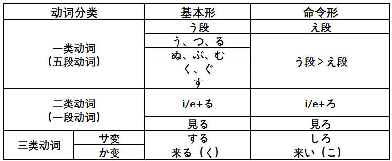
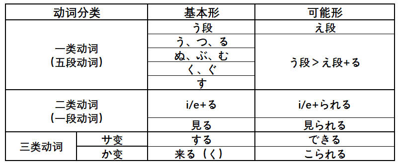
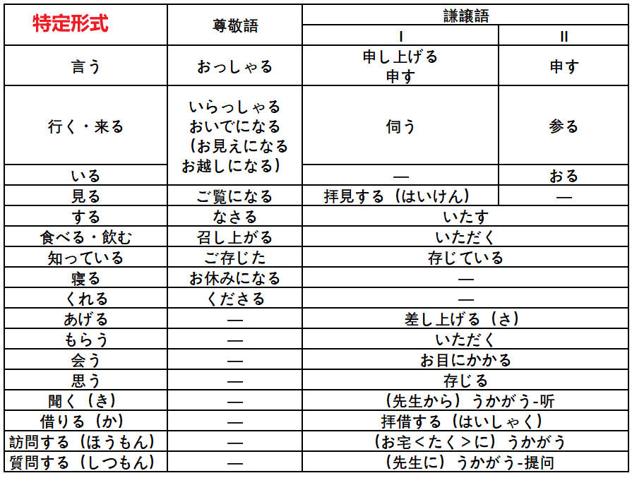

# 基础

## 汉字笔画

[汉字笔顺](https://kakijun.jp/)

## 汉语词音读规律

### 同声同音

**guan|jiao**

- 関心（**かん**しん）|交通（**こう**つう）
- 観察（**かん**さつ）|郊外（**こう**がい）
- 官庁（**かん**ちょう）|学校（がっ**こう**）
- 館長（**かん**ちょう）|効果（**こう**か）

### 前拨后长，单短双长

**规律大概占比 80% 左右**

**前拨：前鼻音（`an, en, in, un`） + 拨音**

漢＋字 （かん＋じ）     `han` > かん（前鼻音 > ん）

**后长：后鼻音（`ang, eng, ing, ong`）+ 长音**

英＋語（えい＋ご）　`ying` > えい（后鼻音 > 长音）

**单短：单元音（`a,o,e,i,u`）+ 短音**

**双长：双元音（`ao,ou`）+ 长音**

需＋要（じゅ＋よう）　`yao` > よう（ `ao/ou` > 长音）

### 促音便

**①以「つ・ち」结尾＋「か・さ・た・は」行　｜　は行半浊**　

- 発＋達：は**つ**＋**た**つ＝発達（は**った**つ）
- 失＋敗：し**つ**＋**は**い＝失敗（し**っぱ**い）、は行发生半浊

**②以「く・き」结尾＋「か」行**

- 欲＋求：よ**く**＋**き**ゅう＝欲求（よ**っき**ゅう）
- 石＋鹼：せ**き**＋**け**ん＝石鹼（せ**っけ**ん）香皂

### 浊音便

**①以「う・ん」结尾＋「か・さ・た・は」行　｜　は行半浊**

- 中＋国：ちゅ**う**＋**こ**く＝ちゅう**ご**く
- 患＋者：か**ん**＋**し**ゃ＝かん**じ**ゃ
- 原＋発：げ**ん**＋**は**つ＝げん**ぱ**つ

## 输入注意点

- ぢ（`ji`）按照 (`di`) 输入；
- づ（`zu`）按照 (`du`) 输入；

## 4种基本句型（敬体形/简体形）

## 接续形式

## 动词变形

### 特殊动词

需特殊记忆的一类动词（**i/e 段 + る结尾**）：

**i 段 + る结尾**

要る（いる）、入る（いる）、入る（はいる）、参る（まいる）、切る（きる）、限る（かぎる）

握る（にぎる）、遮る（さえぎ）、知る（しる）、走る（はしる）、散る（ちる）、混じる（まじる）

**e 段 + る结尾**

蘇る（よみがえる）、帰る（かえる）、焦る（あせる）、蹴る（ける）、茂る（しげる）、捻る（ひれる）

喋る（しゃべる）、滑る（すべる）、減る（へる）、占める（しめる）、照る（てる）、寝る（ねる）

**特殊用法**

行く：行って/た

ある：否定形>ない

要る（いる）：没有过去式（方言除外）

負う：負うて/た，負って/た

### 基本形 > ます形

> 第4课

### 基本形 > て・た形

> て形-第14课 た形-第21课

### 基本形 > ない形

> 第19课

### 基本形 > 命令形

> 第29课

### 基本形 > 意志形

> 第30课

### 基本形 > ば形（假定）

> 第37课

### 基本形 > 可能形

> 第38课

### 基本形 > 受身形（被动）

> 第41课

### 基本形 > 使役形

> 第43课

### 基本形 > 使役受身形

>第43课

### 动词活用

## 数量词

## 敬语

### 特定形式

### 形式变换

### 礼貌体

### 常用句型

# 1 单元

## 第 1 课 出会い

### 会话

**出会い（で）**

#### あのう/ちょっと

- あのう、東京タワーへ行きたいんですが、道（みち）を**教えてくださいませんか**。
- もらう（更委婉，我的动作自谦）道を教えて**いただきませんか**。
  - 我 << 他人，句子主语是：我方，**我方从他人那里得到**
  - もらう >> いただく（谦让语）  

- ちょっと、お願い**したい**ことがあるんですが...（有事要拜托您）
  - お＋V(连用)＋する（いたす，谦让语）
  - ちょっと、待ってください。

#### すみません

**道歉，感谢**，口语中发音接近于**すいません**

- いいえ、全然/大丈夫です/気（き）にしないで（别放在心上）
- いいえ、**どんでもないです**/気になさらずに/**気になさらないでください**。（更尊敬，ないで>>ずに）

**引起注意**

- はい？/何（なん）でしょうか（对すみません的回应）
- 何（なに）か御用でしょうか（更尊敬，对すみません的回应）

#### 自/他动词

- これ**が**落（お）ちました（自动词，强调状态，更自然）

- 自動ドア**が**閉（し）まります

- これ**を**落としました
- 私は目覚（めざ）まし時計（どけい）**で**起（お）きました。（闹钟叫醒了我）
  - で表示原因
  - **无生命的物体（闹钟）不能充当主语**

#### 先ほど

**さっき更正式的形式**

- こんにちは。先ほど**お電話した**山田です/先ほど**の**山田です。
- 先ほどの方 >> 先ほど**会（あ）った**方
- 先ほど**の**質問（しつもん）に**お答（こた）えします**。（の（代表言う）>> おっしゃった）
- 先ほどおっしゃった質問にお答えします。

#### 助かる（たす，自v）

**子供を助ける（他v）**

**对...有帮助**

- 天気がいいので、**助かります**。
- 仕事を手伝（てつだ）えば、お父（とう）さんが**助かります**。
- さっきは、どうもありがとうございました。**助かりました**。
- 荷物を持っていただいて、**助かりました**。（もらう＞いただく）更委婉
- 荷物を持ってくださって、**助かりました**。（くれる＞くださる）别人主动

#### 感じがする

**有...感觉**

味（あじ）/匂い（にお）/声（こえ）/音（おと）**がする**（味道/气味/声音）

感じ（かん）/頭痛（ずつう）/寒気（さむけ）/吐き気（はきけ）**がする**（头疼/发冷/恶心）

- 北京（ぺきん）の**町並み**（まちなみ）が**すっかり**変（か）わってしまって、不思議（ふしぎ）な感じがします。（街景，给人一种不可思议的感觉）
- この景色（けしき）を見ると、日本に来（き）た**とって/という**感じがします。（看到这样的景色，感觉是来到了日本）

#### すっかり/ずいぶん

**すっかり（100%不能认出）**

**ずいぶん（80%不能认出）**

- 街も**すっかり/ずいぶん**変わりました
- 陳さんの病気（びょうき）は**すっかり/ずいぶん**よくなりました。
- 李さんにもらったあめは**すっかり**なめてしまいました。（てしまう完成）
- **ずいぶん**食べたね/歩（ある）いた（表量多）
- **ずいぶん**たくさん買い物をしましたね。

#### ついていく

つく（粘上，附着）＋いく（由近及远）＞ついていく＞**ついていけない**（可能形）

あの人の考え方**にはついていけません**。（那个人的想法我跟不上）に提示对象

#### くらい/ほど

**くらい＝ぐらい｜简体＋くらい｜くらい＋の＋N（表示程度）**

- これは中学校（ちゅうがっこう）のテストですが、大人（おとな）でも**分からないくらい**難しい問題です。(虽然是中学测试，却是大人都答不上的难题)くらい表中顿
- この辺は、静か過（す）ぎで寂（さび）しい**くらいです**。
- 財布を忘（わす）れましたが、ジュースを**買うくらいのお金（かね）**は持っています。（买饮料这种程度的钱还是有的）

**简体＋ほど｜比较（天花板）｜强调情感色彩**

- 涙（なみだ）が**出（で）るほど**、うれしかったです。（高兴得眼泪都出来了）
- 昨日はとても疲れました。最後は立（た）っていられない**ほど**でした。
- 首都開発（しゅとかいはつ）計画（けいかく）は、面白い**ほど**うまく進（すす）んで（进展出奇的顺利）
- 死（し）ぬほど暑い（热死了，强调感情色彩）
- 先生**ほど**優（やさ）しい人がいない。（没有比老师更温柔的人）

#### ～てきた

**来る（来）|时间/空间上的由远及近**

- 日本語の発音（はつおん）に少し慣（な）れ**てきました**。
- 救急車（きゅうきゅうしゃ）のサイレンの音（おと）がだんだん大きく**なってきました**。
- ほら、高層（こうそう）ビルが**見えてきた**でしょう？

### 课文

**日本の鉄道（てつどう）**

#### ～とは

**～とは＝～というのは**

**1.解释说明/询问**

- JR **とは**、Japan Railways **の略（りゃく）です**
- 森さん**とは**、どんな人ですか

**2.下定义**

- おせち料理**とは**、正月（しょうがつ）に食べるお祝（いわ）いの料理**のことです**。
- ～とは、～のことです

**3.～というのは/～というものは/～ということは（解释说明）**

**の：名词化，泛指｜者（もの）：东西，物品｜事（こと）：具体的事情**

- 幸運（こううん）という**もの**はいつ訪（おとず）れるか分かりません。（何时到来不可预知）
- 子供を育（そだ）てるという**こと**は、とても楽しいことです。
- 一人で生活（せいかつ）するという**こと**は、大変なことです。

**4.～ということは：推测原因|归纳结果**

- 彼が怒（おこ）った**ということは**、きっと**ひどい**ことを言われたのでしょう。（大概是被人说了很过分的话）
- 車に５人**しか**乗（の）れない**ということは**、だれかがバスで行かなければならないということです。
  - **しか～ない**：包含感情，强调只有

#### ～は～の1つです

**...之一**

- 世界的に有名（ゆうめい）な新幹線（しんかんせん）**も**JRの路線（ろせん）**の１つです**。
- 日本**は**アジアの国**の１つです**

#### 結ぶ

 **连接，建立关系（绳子打结）。結び（結ぶ的连用形）＞＞中国結び（むす）**

- 主要都市（しゅようとし）を結ぶ路線は**もちろん**（自不必说）

- 靴（くつ）のひもをきちんと**結ぶ**。（鞋带系紧）
- 中国の旅行は、私と妹（いもうと）を結ぶ大切な**思い出（で）**です。（将我和妹妹联系起来的重要回忆）
- 化石（かせき）は、古い時代（じだい）と現代（げんだい）を**結んでいます**。

**繋ぐ（つなぐ），抽象连接上　結ぶ＝繋ぐ**

- 空港（くうこう）と北京市街を**結ぶ**。
- 手を繋ぐ（つなぐ）
- 紐（ひも）を結ぶ

#### どんどん

**事情进展顺利，连续不断**

- 路線（ろせん）が**どんどん**延（の）びています。
- 佐藤さんの中国語は**どんどん**上手になっています。
- 遠慮（えんりょ）しないで、**どんどん**食べてください。

#### 大（だい/おお/たい）

- **だい+汉语词（接头词）**：大事件・大地震（じしん）・**大成功（せいこう）**・大規模（きぼ,adj2）
- **おお+和语词（接头词）**：大金（かね）持ち、大雨（あめ）、大汗（あせ）
- **たい（固化词）**：大変、大切

#### 接头词/接尾词

**各（かく）～**

- 各位（かくい）・各種（かくしゅ）・各国（かっこく）

**～化（か）**

- 映画化・電子化（でんし）・現代化（げんだい）
- 近代化（きんだいか）・高齢化（こうれい）
- 実用化（じつよう）

**～的（てき）**

- 世界的（せかいてき）/国際的（こくさいてき）

- 積極的（せっきょくてき）/具体的（ぐたい）
- 抽象的（ちゅうしょう）/消極的（しょうきょく）/個人的（こじん）
- 効果的（こうか）/伝統的（でんとう）/**本格的（ほんかく）正式，原则，正规**

#### 写作顺序

- まず＞次に＞また/そして/さらに＞最後に
- はじめに/最初に＞続いて＞最後に

- 第一に・第二に・第三に

#### 文脉指示词

**そ系列一般指上文，こ系列一般指下文**

**そこで：补充新情况。地点+で表示范围**

**それで：原因。事物＋で表示原因**

東京に向（む）かう路線を「上（のぼ）り」、地方（ちほう）に向かう路線を「下（くだ）り」といいます。

- **そこで**、こんななぞなぞがあります。（于是/在这种情况下）
- **それで**、こんななぞなぞがあります。（因此）

### 单词

**三圆：音+义+拓展|二圆：音+义|一圆：音**

転勤（てんきん）：同一公司，系统内部|転勤になる（大家共同决定的结果）

転職（てんしょく）：跳槽

東京駅は「上り」の最終の駅**になっている**からです。(强调被决定的结果)

東京駅は「上り」の最終（さいしゅう）の駅だ**と決められている**。（被决定）

辺（へん）：n,一带，附近｜街角（まちかど）

辺り（あた）：n,周围，附近

**1.出会い（で）：n,相遇，碰见**

- 出会う：偶然（ぐうぜん）に会う
- 李さんに偶然出会った

**2.お祝い（いわ）:n,庆贺，祝贺**

- 祝う：お＋祝い
- 母から入学（にゅうがく）のお祝いをいただいた。（从妈妈那里收到了入学的**礼物**）
- 入学（にゅうがく）を祝う。

**3.上る（のぼ）：v1,上，登，进京｜上り（のぼ）：n,上，上行**

- 階段（かいだん）を上る・日が昇る（のぼ）・山**に**登る（のぼ）：に强调登上山顶
- 階段を下（お）りる・日が沈む（しず）・山を下（お）りる

**下る（くだ）：v1,下，下去，到地方去｜下り（くだ）：n,下，下行**

電車から降（お）りる

電車に乗る（の）

- **下りる（お）＞上（あ）がる/登る（のぼ）**
  - 階段から下りる/階段を上がる/木に登る
- **下がる（さ）＞上（あ）がる（自他动词）**
  - 物価（ぶっか）が下がる/上がる
  - 気温（きおん）が下がる/上がる
- 下る（くだ）＞上る（のぼ）
  - 下り列車（れっしゃ）
  - 上り（のぼり）のエレベーター（上行电梯）

**4.沸（わ）く：v1,沸腾，烧开｜沸かす：v1,燃烧，烧开**

- お湯が沸く/お湯を沸かす
- 湧く（わ）：涌出
  - 興味（きょうみ）が湧いてきた。（临时）
  - 興味を持つようになってきた。（逐渐有了兴趣）

**5.乾かす（かわ）：v1,弄干，晾干**

- 干す（ほ）：展开后风干，晒干：**强调晾晒**

- 乾かす：加热，送风等人为方法，**强调干**
- 濡（ぬ）れた服を干した（可能依然湿的）

- 濡れた服を乾かした（完全干了）

**6.表す（あらわ）：v1,表示，表达，表现**

- 顔に表す（かお）：喜形于色
- 言葉に表す

**7.溶く（と）：v1,调拌，调开，溶解**

- 溶かす：水溶，**热熔**（他动）
- 溶く：固体，粉末放入液体（他动）
- 水に溶く・水で溶く
- 鉄（てつ）を溶かす・バターを溶かす（黄油）

**8.広げる（ひろ）：v2,展开，扩大，拓展**

- 噂（うわさ）を広げる（谣言，绯闻）
- 噂が広がる

**9.流れる（なが）：v2,流动，流淌**

- 噂が流れる/広がる（流言四起）
- 流れ（连用形）：潮流，流程
- 時の流れ・授業（じゅぎょう）の流れ

**10.なめる：v2,添，含**

- 犬が手を舐める
- 舐めるな！（不要把人看扁了）

**11.優れる（すぐ）：v2,优秀，卓越**

- 过去式+N
- 優れた人/技術（ぎじゅつ）

**12.延びる（の）：v2,延伸，延长**

- 路線（ろせん）が延びる/出発（しゅっぱつ）が延びる
- 伸びる：売（う）り上（あ）げが伸びる（销售额上升）

**13.訪（おとず）れる：v2,到访，访问**

- 家を訪れる
- 春が訪れる

**14.育（そだ）てる：v2,养育，培养**

- 花を育てる
- 子育（こそだ）て：n,养育孩子

**15.注目（ちゅうもく）する：v3,注目，注视**

- 注目を浴びる（あ）：大家关注的焦点（沐浴着大家注视的目光）
- 価格（かかく）に注目する/顔に注目する

**16.経営する（けいえい）**

- 会社を経営する
- 感（かん）じがします

**17.目覚まし時計（めざましどけい）：闹钟**

- 目**が**目覚（さ）める：眼睛睁开
- 目**を**覚（さ）ます＞**目覚（ざ）ます**：叫醒，唤醒

**18.なぞなぞ：n,谜语**

- 謎をかける/謎を解く（と）：出谜/解密
- 謎のような人

**19.答え（こた）：n,回答，答案**

- 答える
- 質問に答える（しつもん）

**20.こんな：连体词，这样的**

- 连体词：连接体言（连接名词，代词等）
- こんな人（贬义）
- このような（连体）
- **これら：代，这些**

### 综合练习

#### 练习

雨がやんで、空が**だんだん明（あか）るく**なってきました。（雨が止む）

探していた小学校（しょうがっこう）時代の友達に**とうとう会うことができました**。（终于见面了）

これは私の**個人（こじん）的**な意見（いけん）です。

さっきから携帯電話（けいたいでんわ）を探しているのですが、**見つかりません**。（自动词没找到，强调状态）

- 田中さんは**鉄道を利用して旅行するの**が趣味（しゅみ）です。（兴趣是...）

- 特（とく）に列車（れっしゃ）の中で**駅弁（えきべん）を食べる**のが楽しみです。（...是一种乐趣）
  - **～のが楽しみです**
- 駅弁とは**駅で売っているお弁当（べんとう）の**ことです。

#### 对话

遇见在其他场合打过招呼的人，依稀记得名字，但不确定。同他打招呼，并确认姓名

- あのう、すみません。田中さんじゃありませんか。
- すみません、ちょっと失礼（しつれい）ですが、田中さんですか。

**问路：**

- あのう、ちょっとお聞きしたいんですが...

  東大（とうだい）ってどこにありますか。/東大（とうだい）へはどうやって行けますか

- すみません、東大へ行きたいんですが、道に迷（まよ）ってて...

  こっちからは行けます。（这边可以去吗）

#### 同步练习

- 親（おや）というものは**いつも子供の幸せ（しあわせ）**を願っています。（父母总是希望孩子幸福）
- 幸運（こううん）という**もの**はいつ訪（おとず）れるか分かりません。（幸运这种东西，何时到来不可预知）
- 人間（にんげん）の欲望（よくぼう）というものは**きりがありません**。（没完没了）
  - 切る（き）
- 年々（ねん）｜わざわざ（特别，专门）
- 慣（な）れない所（不习惯的地方）
- 一方（いっぽう）、～
- ～ように見える（看起来是...样）

**表达积累**

～によって異（こと）なる/違（ちが）う（依据...，...是不同的）

同（おな）じ国でも、地方**によって、～が違う**

**～ことに気がつく（意识到）**

~ということは、～ことです**が**、～ことです。（...事虽然...,但是）

町が近代化（きんだい）する**ということは**いい**ことかもしれませんが**、個性（こせい）がなくなってしまうのは寂しい**ことです**。

少し（すこし）不便（ふべん）なことがあっても、自分の目で見て、耳で聞いて、手で触（ふ）って、世界（せかい）中の人と交流（こうりゅう）することが、旅行のよさではありませんか。（这不就是旅行的好处吗？）

## 第 2 课 あいさつ

### 会话

あいさつ：寒暄

#### 寒暄

**好久不见**

- （どうも）お久（ひさ）しぶり。

- （どうも）お久しぶりですね。
- （どうも）ご無沙汰（ぶさた）しています。

- （どうも）ご無沙汰しております。

**问候**

- お元気ですか。
- お変わりないですか。（没什么变化吧）
- お変わりありませんか。
- お変わりないでしょうか。

**ぶり（间隔时间长）**

～ぶりに＋V｜～ぶりの＋N

- ３か月ぶり**に**、東京へ行きました。（时隔3个月，再次来到东京）
- 10年ぶり**の寒さで**、湖（みずうみ）が凍（こお）りました。（10年一遇的严寒，湖水都结冰了）

**その節（せつ）≈この間＝先日（せんじつ）**

その節：可以指过去或未来

- **その節**は結構（けっこう）な物をいただきまして、ありがとうございいます。（过去）
  - 結構（けっこう）：特别好，特别棒
  - 谢谢您那次送给我那么好的礼物
- **その節**はよろしくね。（未来）
  - 届时请多多关照

#### 早（はや）いものですね

**时间过得真快，～ものです：感慨**

- 時間が経（た）つのは早いものですね。（时间的流逝是很快的事情）
- １人でよく帰って**こられた**ものです。(自己一个人竟然能回来)
- 平和（へいわ）な世界（せかい）になってほしい**ものです**。（真希望世界和平）
- 休暇（きゅうか）が取（と）れたら、ゆっくり旅行したい**ものです**。（真想好好旅行一番）

#### 介绍的顺序

先内后外，先上后下

**公司里的称呼：**

[对内]

- 部長（上司）
- 鈴木さん（同事）

[对外]

- 佐藤です（对外称呼内部的人）
- 山田課長（かちょう）（称呼外部公司的人）
- **すみません、山田課長はいらっしゃいますか。[称呼外部]**
- **山田は今出（で）かけております。[称呼内部]**（おります＞いる的尊敬语）

### 课文

### 单词

待つ＞待たせる（使役）：お/ご...する（自谦）

お話中（ちゅう）/お仕事中/お電話中

**お願いします**

- こちらに**お願いします**。（把人带来吧）

- こちらに案内（あんない）してください。
- 今回もよろしく**お願いします**。

### 综合练习

