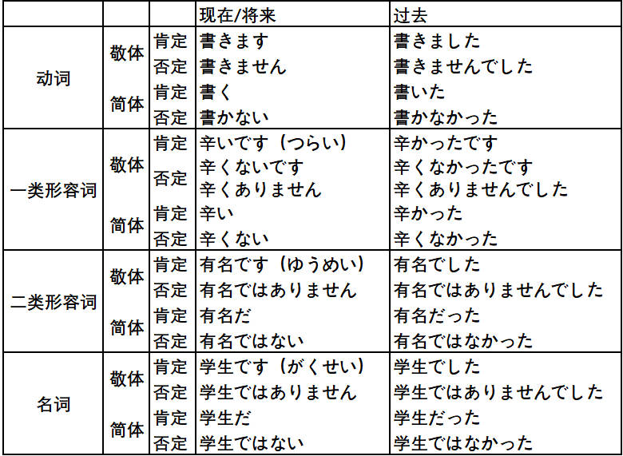
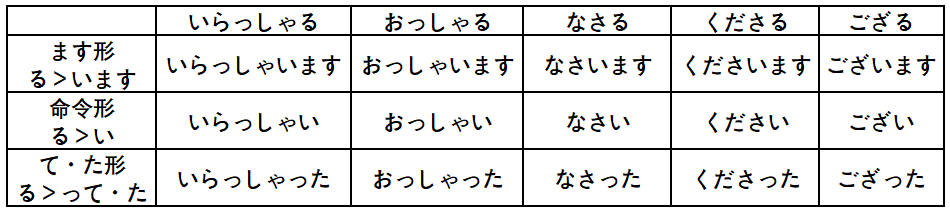

# 基础

## 汉字笔画

[汉字笔顺](https://kakijun.jp/)

## 汉语词音读规律

### 同声同音

**guan|jiao**

- 関心（**かん**しん）|交通（**こう**つう）
- 観察（**かん**さつ）|郊外（**こう**がい）
- 官庁（**かん**ちょう）|学校（がっ**こう**）
- 館長（**かん**ちょう）|効果（**こう**か）

### 前拨后长，单短双长

**规律大概占比 80% 左右**

**前拨：前鼻音（`an, en, in, un`） + 拨音**

漢＋字 （かん＋じ）     `han` > かん（前鼻音 > ん）

**后长：后鼻音（`ang, eng, ing, ong`）+ 长音**

英＋語（えい＋ご）　`ying` > えい（后鼻音 > 长音）

**单短：单元音（`a,o,e,i,u`）+ 短音**

**双长：双元音（`ao,ou`）+ 长音**

需＋要（じゅ＋よう）　`yao` > よう（ `ao/ou` > 长音）

### 促音便

**①以「つ・ち」结尾＋「か・さ・た・は」行　｜　は行半浊**　

- 発＋達：は**つ**＋**た**つ＝発達（は**った**つ）
- 失＋敗：し**つ**＋**は**い＝失敗（し**っぱ**い）、は行发生半浊

**②以「く・き」结尾＋「か」行**

- 欲＋求：よ**く**＋**き**ゅう＝欲求（よ**っき**ゅう）
- 石＋鹼：せ**き**＋**け**ん＝石鹼（せ**っけ**ん）香皂

### 浊音便

**①以「う・ん」结尾＋「か・さ・た・は」行　｜　は行半浊**

- 中＋国：ちゅ**う**＋**こ**く＝ちゅう**ご**く
- 患＋者：か**ん**＋**し**ゃ＝かん**じ**ゃ
- 原＋発：げ**ん**＋**は**つ＝げん**ぱ**つ

## 输入注意点

- ぢ（`ji`）按照 (`di`) 输入；
- づ（`zu`）按照 (`du`) 输入；

## 4种基本句型

## 动词变形

### 特殊动词

需特殊记忆的一类动词（**i/e 段 + る结尾**）：

**i 段 + る结尾**

要る（いる）、入る（いる）、入る（はいる）、参る（まいる）、切る（きる）、限る（かぎる）

握る（にぎる）、遮る（さえぎ）、知る（しる）、走る（はしる）、散る（ちる）、混じる（まじる）

**e 段 + る结尾**

蘇る（よみがえる）、帰る（かえる）、焦る（あせる）、蹴る（ける）、茂る（しげる）、捻る（ひれる）

喋る（しゃべる）、滑る（すべる）、減る（へる）、占める（しめる）、照る（てる）、寝る（ねる）

**特殊用法**

行く：行って/た

ある：否定形>ない

要る（いる）：没有过去式（方言除外）

負う：負うて/た，負って/た

### 基本形 > ます形

> 第4课

### 基本形 > て・た形

> て形-第14课 た形-第21课

### 基本形 > ない形

> 第19课

### 基本形 > 命令形

> 第29课

### 基本形 > 意志形

> 第30课

### 基本形 > ば形（假定）

> 第37课

### 基本形 > 可能形

> 第38课

### 基本形 > 受身形（被动）

> 第41课

### 基本形 > 使役形

> 第43课

### 基本形 > 使役受身形

>第43课

### 动词活用

## 数量词

## 敬语

### 特定形式

### 形式变换

### 礼貌体

### 常用句型

# 1 单元

## 第 1 课 李さんは中国人です

### ==名词谓语句==

### 语法

#### N1はN2です

は作**助词**时，读作：wa-わ，提示主体

です：**助动词**，表断定

#### N1はN2ではありません

私は田中**じゃ**ありません。（では＞じゃ）

#### N1はN2ですか

か：助词，接在句尾，表示疑问，疑问句一般不用“？”

- はい（肯定回答），そうです/です

- いいえ（否定回答）\いいや，ちがいます/ではありません

#### 标点使用

横写时可用 “，”或“、”；

竖写只能用“、”表示中断；

### 单词

出迎え（でむか）（n,迎接）

中国（ちゅうごく）

研修生（けんしゅうせい）（n,进修生）

## 第 2 课 これは本です

### ==指示词==

### 语法

#### これ/それ/あれ/どれ

**こそあど系列**

これ：这个，离自己较近

それ：那个，离对方比较近

あれ：哪个，离双方都比较远

どれ：**哪一个**，疑问词

- これ、それ、あれ、どれ＋助词（は・です）

- この、その、あの、どの＋名词

#### だれですか/何ですか

何（なん）ですか

だれ（誰）ですか

- あの人**はだれ**ですか。（那个人是谁）

- あの**方はどなた**ですか。（那位是谁）
- 日本人ですか＞**日本の方ですか**。

#### 对亲戚的不同称呼

- 面对外人时的称呼：父（ちち）、母（はは）

- 称呼别人的家人：お父（とう）さん、お母（かあ）さん、ご両親（りょうしん）

  **おじいさん**：祖父/外祖父、**おばあさん**：祖母/外祖母

  **おじさん**：叔叔、おばさん：阿姨

- 直接面对自己的家人：父（とう）ちゃん、母（かあ）ちゃん、パパ、ママ

#### 询问年龄

おいくつですか：礼貌

いくつ：对孩子

何歳（なんさい）ですか

### 单词

家族（かぞく）：家人

お土産（おみやげ）：礼物｜プレゼント｜名産品（めいさんひん）

かばん（鞄）｜**手帳**（てちょう）｜時計（とけい）

新聞（しんぶん）：报纸｜ニュース（news）：新闻

**株式会社**（かぶしきがしゃ）：股份制公司

## 第 3 课 ここはデパートです

### ==指示地点==

### 语法

#### ここ/そこ/あそこ/どこ

- **ここ/そこ/あそこ/どこはNです**

- **あちら/そちら/あちら/どちら＋助词（は・です）**：更礼貌

そこはデパートです。（百货商店）

あそこは入り口（いりぐち）です。（那儿是入口）

#### Nは＋どこですか

トイレはどこですか

**あそこ**です/**あちら**です（更礼貌）

#### 选择疑问句

1っ階（かい）ですか、２階ですか。

#### 询问价钱

**Nはいくらですか**

- これはいくらですか。
- その服はいくらですか。

### 单词

食堂（しょくどう）｜銀行（ぎんこう）

周辺（しゅうへん）｜隣（となり）｜病院（びょういん）：综合医院

バーゲン会場（かいじょう）：降价大处理卖场

入り口（いりぐち）

アパート（apartment,公寓）｜一戸建て（いっこだて）

**お国（くに）はでちらですか**

## 第 4 课 部屋に机といすがあります

### ==存在句/所在句==

### 语法

#### Nに＋Nが＋あります/います（存在）

**存在句**，あります/います（ｖ）

**に格助词**提示存在的场所，**が格助词**提示存在的主体

**あります**：无生命的事物的存在

**います**：有生命的事物存在

- 部屋に机があります

- 公園（こうえん）に子供がいます

- 庭（にわ）に**何（なに）がありますか**
- あそこに**だれがいますか**

#### Nは＋Nに＋あります/います（所在）

所在句

**は**强调所在的主体，双方已知的信息

**に**存在的场所

- 椅子は部屋にあります
- 子供は公園（こうえん）にいます
- 居間（いま）にテレビ**と**ビデオがあります。（电视机和录像机）

- 図書館（としょかん）は**どこにありますか**
- 犬は**どこにいますか**
  - **あそこにいます**
- 犬は**どこですか**
  - **あそこです**

#### 方位词

上（うえ）/下（した）/前（まえ）/後ろ（うしろ

隣（となり）/中（なか）/外（そと）

- **机の上**に猫（ねこ）がいます。（**の不能省略**）

- 猫（ねこ）は**箱（はこ）の中**にいます。

#### 疑问词+も＋V（否定）

教室（きょうしつ）に**だれもいません。**

冷蔵庫（れいぞうこ）に**何（なに）もありません。**

#### 兄弟姐妹称呼

- **兄弟**（きょうだい）：兄弟姐妹

- **姉妹**（しまい）：姊妹

- **従兄弟**（いとこ）/**従妹**（いとこ）：堂/表兄弟姊妹
- **妹**（いもうと）
- **弟**（おとうと）
- **男**（おとこ）｜**女**（おんな）
- 生徒（せいと）：学生

### 单词

**お/ご（御）＋名词：表示尊敬**

- お国（くに）
- ご家族/ご**兄弟**（きょうだい）/ご**両親**（りょうしん）

**家**（いえ）：房子｜部屋（へや）：房间｜居間（いま）：起居室，客厅

**一人暮らし**（ひとりぐらし）：一个人生活

## 单元末

==名词谓语句==

貯金箱（ちょきんばこ）：存钱罐；

**どこにありますか＝どこですか**

レジ：收银台

1.ご**趣味**（しゅみ）は何ですか

- 趣味はテニスです
- 読書（どくしょ）、旅行（りょこう）、漫画（まんが）、運動（えんどう）、映画（えいが）

2.失礼ですが、お**仕事**（しごと）は何ですか。

- 会社員（かいしゃいん）、学生（がくせい）、教師（きょうし）、医者（いしゃ）
- 公務員（こうむいん）、**運転手（うんてんしゅ）司机、弁護士（べんごし）律师**
- 芸術家（げいじゅつか）、無職（むしょく）

3.ご**出身**（しゅっしん）はどちらですか/**ご出身は？**

お国（くに）はどちらですか。

北京（ペキン）｜上海（シャンハイ）

香港（ホンコン）｜マカオ（澳门）｜省（しょう）

自治区（じちく）｜チベット（西藏）｜ラサ（拉萨）

# 2 单元

## 第 5 课 森さんは７時に起きます

### ==时间表示，动词时态==

### 语法

#### Nに＋V

数字时间（3月，2022年）＋**に**

非数字时间（今日，明日，去年）**不加に**

曜日（ようび）可加可不加

森さんは７時（しちじ）に起き**ます**。

- 肯定叙述；
- 现在的**习惯性动作**，状态；
- **未来的动作**，状态；

ます＞ません

ました＞ませんでした

#### から...まで

（时间/空间）上（起点/终点）

#### いつ/何時に

**いつ**：什么时候，大的范围

**何時に**：几点，具体时间

- 展覧会（てんらんかい）は**いつから**始まりますか。（いつからいつまで）

- **何曜日まで**休みますか。（休息到周几）

**时间接续**

- **毎（まい）～**：毎朝何時、毎日７時，带“每”的一定不加“の”
- **来週（らいしゅう）**：来週の日曜日/来週日曜日

### 单词

**是否音变，看最靠近量词的数字**

4時（よじ）｜７時（しちじ）｜９時（くじ）

**午前**（ごぜん）/**午後**（ごご）８時半（じはん）です。（上午/下午）

試験（しけん）は**いつ**始（はじ）まりますか。

**あさって**（后天）｜ごろ（左右）｜**おととい**：前天

**昨日**（きのう）｜今日（きょう）｜今（いま）：此刻

晩（ばん）｜夜（よる）｜学校（がっこう）

おととし（前年）｜**去年**（きょねん）｜**今年**（ことし）

出張（しゅっちょう）｜研修（けんしゅう）

お宅（おたく）：别人的家尊称

## 第 6 课 吉田さんは来月中国へ行きます

### ==格助词：へ、と、から、まで==

### 语法

#### へ移动的方向

来月中国（らいげつちゅうごく）**へ**行きます。

どこ**へ**行きましたか。

#### から

どこから来ました。

から：时间/空间上起点

#### N（交通工具）で＋V

飛行機**で**行きます。

**歩（ある）いて**アパートへ帰りました。

#### 何的发音

**何（なに）＋と/が/を**

- **何と何を**買いますか。（买了什么和什么）
- あそこに**何が**ありますか。（那有什么）
- 何を食べますか。（你吃什么）

**何（なに）/何（なん）+で**

- **何で**会社へ行きますか

何（なん）＋の

- それは**何の**本ですか。（那是什么书）

何（なん）+时刻/星期

- 李さんは**何時**に来ますか。（小李几点来）

#### N（人）と＋V

共同参与者

#### 格助词

**谓语**是日语句子的核心成分

提示**格关系**的词（句子中其他部分和谓语的关系）

- お先に失礼ます。

- お疲れ様ですた。

### 单词

**交通機関**（こうつうきかん）：交通工具

**確か**（たしか）：大概，也许

**家**（いえ）：房子，建筑物，私の家

**うち**：抽象概念

**昨夜**（ゆうべ）｜**まっすぐ**（真っ直ぐ）：直接

夜中（よなか）：夜里｜誕生日（たんじょうび）

お誕生日**おめでとうございます。**（祝你生日快乐）

夏休み（なつ）｜冬休み（ふゆ）｜春休み（はる）

## 第 7 课 李さんは毎日コーヒーを飲みます

### ==格助词：を、で==

### 语法

#### を/で

动作作用对象，**读お**

提示**动作发生的场所**，で

- 李さんは**図書館で**勉強します。

- 今日（きょう）**どこで**新聞（しんぶん）を読みました。

#### N1かN2

对若干名词进行选择。

- 私は毎朝パン**か**お粥（かゆ）を食べます。（吃早饭或面包）
- 休みは月曜日（げつようび）**か**火曜日（かようび）です。（星期一或星期二休息）

#### Nを＋ください

- コーラとケーキ**をください**。
- コーラとケーキ**をお願いします**。（请求，更礼貌）

#### 失礼します

失礼（しつれい）

- 告辞了：お先に失礼します。

- 打扰了： 失礼します/失礼しました

  お邪魔します/お邪魔しました

- 失礼了：失礼しました

#### 出门/回去对话

出去的人说：いってきます/いってまいります。（去然后回来）

留在家的人说：いってらっしゃい

回来的人说；ただいま

对回来的人说：お帰りなさい/お帰り

### 单词

申込書（もうしこみしょ）：申请表

何（なに）をしますか。

いらっしゃいませ｜いらっしゃい

これから：接下来｜音楽（おんがく）

お弁当（べんとう）｜昼ごはん（ひるごはん）

じゃ＝では：那么

かしこまりました/わかりました：明白

掃除します（そうじ）｜卵（たまご）｜イチゴ：草莓

## 第 8 课 李さんは日本語で手紙を書きます

### ==授受动词==

### 语法

#### あげます

我（我方）给别人｜客观描述

- 私**は**小野さん**に**花**をあげます**。
- 弟（おとうと）は小野さんに花をあげました。（我方）
- 小野さんは森さんにチョコレートをあげました。（客观描述）

#### もうらいます

**主动性不明确**，可能是自己主动要的|或对方主动给的

- 私は小野さん**に/から**辞書（じしょ）をもらいました。（小野给了我一本词典）
- 森さんは長嶋（ながしま）さん**に**パンフレットをもらいました。（森从长岛那得到）
- 母は小野さん**に**ハンカチをもらいました。（得到手绢）
- さっき長嶋（ながしま）さん**に**電話（でんわ）をもらいました。

#### で（手段，工具，原材料）

- 李さんは日本語**で**手紙を書きます。
- 手紙を速達（そくたつ）**で**送（おく）りました。
- 新聞紙（しんぶんし）**で**紙飛行機（かみひこうき）を作（つく）りました。
- 何**で**うどんを作りますか。

#### に会います

**に：提示行为的对象**

前面用什么格助词，一般由**后面的动词决定**

- 李さんは明日長嶋さん**に会います**。
- お兄さん**に会います**。

#### さっき/たった今/今

今（いま）：现在，此时此刻

たった今：比“今”稍早些

さっき：比たった今更早些，如10分钟前

### 单词

表（ひょう）｜件（けん）：事情

夕方（ゆうがた）｜太（ふと）ります：发胖

届（とど）きました：送达了

**お金（かね）**

- お金を貸（か）します：我借给别人
- お金を借（か）ります：别人借给我

**韓国語を**習（なら）います｜教（おし）えます

- スケジュール表（ひょう）を作ります
- 写真集（しゃしんしゅう）を作ります
- パンフレットを作ります。（小册子）

**ファックス/メール/手紙/電話**をもらいます：收到传真/邮件/信/电话

**ファックス/メール/手紙**を送ります：发传真/邮件/信

- 手紙を**出（だ）します**（把信寄出去）
- 電話を**かけます**・電話します。（打电话）

住所（じゅうしょ）｜小麦粉（こむぎこ）｜昼休み（ひるやすみ）：午休

## 单元末

==动词谓语句==

1.**切符売り場**（きっぷうりば）はどこですか/どこにありますか。（售票处在哪）

あそこにありますよ。

2.名古屋（なごや）までどのぐらい**かかりますか**。（花时间/花钱）

１時間４５分ですね。

3.終電（しゅうでん）は何時（なんじ）ですか。

# 3 单元

## 第 9 课 四川料理は辛いです

### ==一类形容词==

### 语法

### 单词

## 第 10 课 京都の紅葉は有名です

### ==二类形容词==

## 第 11 课 小野さんは歌が好きです

### ==ができます==

## 第 12 课 李さんは森さんより若いです

### ==比较句==

# 4 单元

## 第 13 课 机の上に本が3冊あります

### ==数量词==

## 第 14 课 昨日デパートへ行って、買い物しました

### ==て形表中断==

## 第 15 课 小野さんは今新聞を読んでいます

### ==て形表正在进行==

## 第 16 课 ホテルの部屋は広くて明るいです

### ==形容词接续==

# 5 单元

## 第 17 课 私は新しい洋服が欲しいです

### ==愿望，建议==

## 第 18 课 携帯電話はとても小さくなりました

### ==なります/します==

## 第 19 课 部屋のカぎを忘れないでください

### ==Vない形==

## 第 20 课 スミスさんはピアノを弾くことができます

### ==V基本形==

# 6 单元

## 第 21 课 私はすき焼きを食べたことがあります

### ==Vた形==

## 第 22 课 森さんは毎晩テレビを見る

### ==简体/常体/普通体==

## 第 23 课 休みの日、散歩したり買い物に行ったりします

### ==た形和简体形的应用==

## 第 24 课 李さんはもうすぐ来ると思います

### ==简体形的应用==

