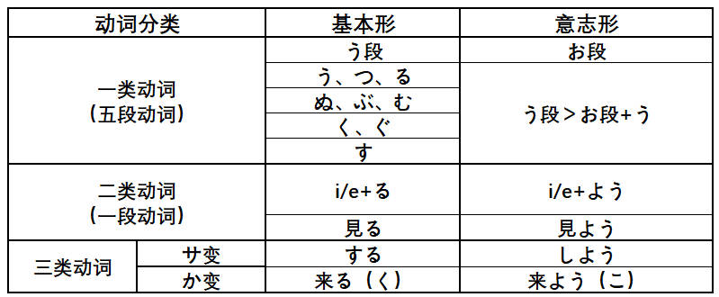
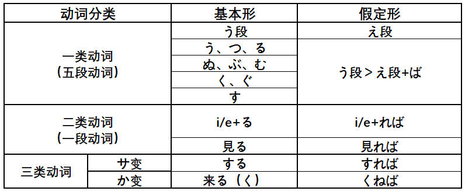
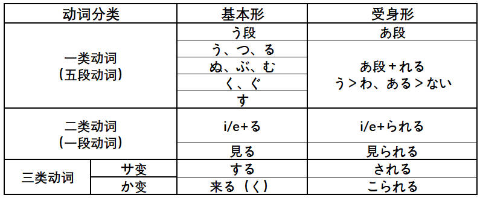
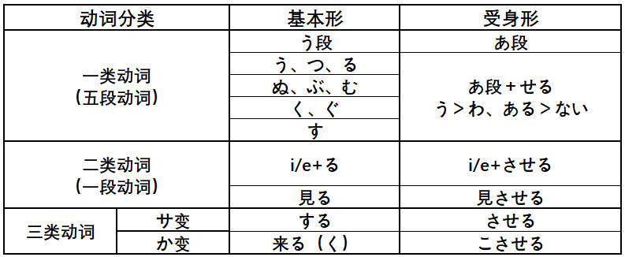
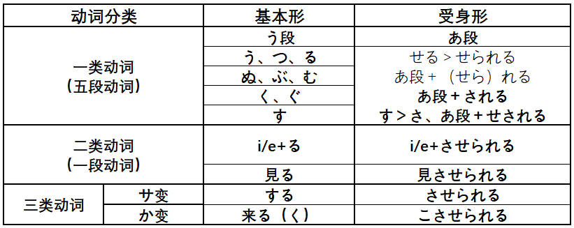
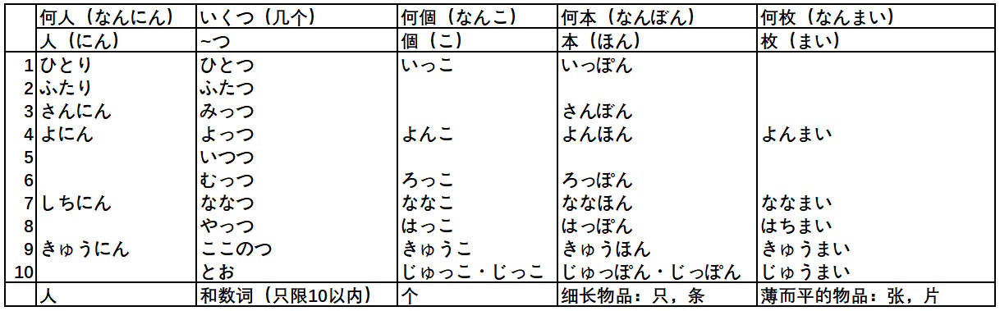

# 基础

## 汉字笔画

[汉字笔顺](https://kakijun.jp/)

## 汉语词音读规律

### 同声同音

**guan|jiao**

- 関心（**かん**しん）|交通（**こう**つう）
- 観察（**かん**さつ）|郊外（**こう**がい）
- 官庁（**かん**ちょう）|学校（がっ**こう**）
- 館長（**かん**ちょう）|効果（**こう**か）

### 前拨后长，单短双长

**规律大概占比 80% 左右**

**前拨：前鼻音（`an, en, in, un`） + 拨音**

漢＋字 （かん＋じ）     `han` > かん（前鼻音 > ん）

**后长：后鼻音（`ang, eng, ing, ong`）+ 长音**

英＋語（えい＋ご）　`ying` > えい（后鼻音 > 长音）

**单短：单元音（`a,o,e,i,u`）+ 短音**

**双长：双元音（`ao,ou`）+ 长音**

需＋要（じゅ＋よう）　`yao` > よう（ `ao/ou` > 长音）

### 促音便

**①以「つ・ち」结尾＋「か・さ・た・は」行　｜　は行半浊**　

- 発＋達：は**つ**＋**た**つ＝発達（は**った**つ）
- 失＋敗：し**つ**＋**は**い＝失敗（し**っぱ**い）、は行发生半浊

**②以「く・き」结尾＋「か」行**

- 欲＋求：よ**く**＋**き**ゅう＝欲求（よ**っき**ゅう）
- 石＋鹼：せ**き**＋**け**ん＝石鹼（せ**っけ**ん）香皂

### 浊音便

**①以「う・ん」结尾＋「か・さ・た・は」行　｜　は行半浊**

- 中＋国：ちゅ**う**＋**こ**く＝ちゅう**ご**く
- 患＋者：か**ん**＋**し**ゃ＝かん**じ**ゃ
- 原＋発：げ**ん**＋**は**つ＝げん**ぱ**つ

## 输入注意点

- ぢ（`ji`）按照 (`di`) 输入；
- づ（`zu`）按照 (`du`) 输入；

## 4种基本句型

## 动词变形

### 特殊动词

需特殊记忆的一类动词（**i/e 段 + る结尾**）：

**i 段 + る结尾**

要る（いる）、入る（いる）、入る（はいる）、参る（まいる）、切る（きる）、限る（かぎる）

握る（にぎる）、遮る（さえぎ）、知る（しる）、走る（はしる）、散る（ちる）、混じる（まじる）

**e 段 + る结尾**

蘇る（よみがえる）、帰る（かえる）、焦る（あせる）、蹴る（ける）、茂る（しげる）、捻る（ひれる）

喋る（しゃべる）、滑る（すべる）、減る（へる）、占める（しめる）、照る（てる）、寝る（ねる）

**特殊用法**

行く：行って/た

ある：否定形>ない

要る（いる）：没有过去式（方言除外）

負う：負うて/た，負って/た

### 基本形 > ます形

> 第4课

### 基本形 > て・た形

> て形-第14课 た形-第21课

### 基本形 > ない形

> 第19课

### 基本形 > 命令形

> 第29课

### 基本形 > 意志形

> 第30课

### 基本形 > ば形（假定）

> 第37课

### 基本形 > 可能形

> 第38课

### 基本形 > 受身形（被动）

> 第41课

### 基本形 > 使役形

> 第43课

### 基本形 > 使役受身形

>第43课

### 动词活用

## 数量词

## 敬语

### 特定形式

### 形式变换

### 礼貌体

### 常用句型

# 1 单元

## 第 1 课 李さんは中国人です

### ==名词谓语句==

## 第 2 课 これは本です

### ==指示词==

## 第 3 课 ここはデパートです

### ==指示地点==

## 第 4 课 部屋に机といすがあります

### ==存在句/所在句==

# 2 单元

## 第 5 课 森さんは７時に起きます

### ==时间表示，动词时态==

## 第 6 课 吉田さんは来月中国へ行きます

### ==格助词：へ、と、から、まで==

## 第 7 课 李さんは毎日コーヒーを飲みます

### ==格助词：を、で==

## 第 8 课 李さんは日本語で手紙を書きます

### ==授受动词==

# 3 单元

## 第 9 课 四川料理は辛いです

### ==一类形容词==

## 第 10 课 京都の紅葉は有名です

### ==二类形容词==

## 第 11 课 小野さんは歌が好きです

### ==ができます==

## 第 12 课 李さんは森さんより若いです

### ==比较句==

# 4 单元

## 第 13 课 机の上に本が3冊あります

### ==数量词==

## 第 14 课 昨日デパートへ行って、買い物しました

### ==て形表中断==

## 第 15 课 小野さんは今新聞を読んでいます

### ==て形表正在进行==

## 第 16 课 ホテルの部屋は広くて明るいです

### ==形容词接续==

# 5 单元

## 第 17 课 私は新しい洋服が欲しいです

### ==愿望，建议==

## 第 18 课 携帯電話はとても小さくなりました

### ==なります/します==

## 第 19 课 部屋のカぎを忘れないでください

### ==Vない形==

## 第 20 课 スミスさんはピアノを弾くことができます

### ==V基本形==

# 6 单元

## 第 21 课 私はすき焼きを食べたことがあります

### ==Vた形==

## 第 22 课 森さんは毎晩テレビを見る

### ==简体/常体/普通体==

## 第 23 课 休みの日、散歩したり買い物に行ったりします

### ==た形和简体形的应用==

## 第 24 课 李さんはもうすぐ来ると思います

### ==简体形的应用==

