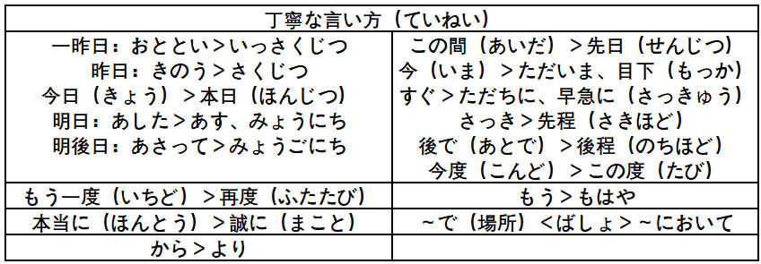

# 基础

## 汉字笔画

[汉字笔顺](https://kakijun.jp/)

## 汉语词音读规律

### 同声同音

**guan|jiao**

- 関心（**かん**しん）|交通（**こう**つう）
- 観察（**かん**さつ）|郊外（**こう**がい）
- 官庁（**かん**ちょう）|学校（がっ**こう**）
- 館長（**かん**ちょう）|効果（**こう**か）

### 前拨后长，单短双长

**规律大概占比 80% 左右**

**前拨：前鼻音（`an, en, in, un`） + 拨音**

漢＋字 （かん＋じ）     `han` > かん（前鼻音 > ん）

**后长：后鼻音（`ang, eng, ing, ong`）+ 长音**

英＋語（えい＋ご）　`ying` > えい（后鼻音 > 长音）

**单短：单元音（`a,o,e,i,u`）+ 短音**

**双长：双元音（`ao,ou`）+ 长音**

需＋要（じゅ＋よう）　`yao` > よう（ `ao/ou` > 长音）

### 促音便

**①以「つ・ち」结尾＋「か・さ・た・は」行　｜　は行半浊**　

- 発＋達：は**つ**＋**た**つ＝発達（は**った**つ）
- 失＋敗：し**つ**＋**は**い＝失敗（し**っぱ**い）、は行发生半浊

**②以「く・き」结尾＋「か」行**

- 欲＋求：よ**く**＋**き**ゅう＝欲求（よ**っき**ゅう）
- 石＋鹼：せ**き**＋**け**ん＝石鹼（せ**っけ**ん）香皂

### 浊音便

**①以「う・ん」结尾＋「か・さ・た・は」行　｜　は行半浊**

- 中＋国：ちゅ**う**＋**こ**く＝ちゅう**ご**く
- 患＋者：か**ん**＋**し**ゃ＝かん**じ**ゃ
- 原＋発：げ**ん**＋**は**つ＝げん**ぱ**つ

## 输入注意点

- ぢ（`ji`）按照 (`di`) 输入；
- づ（`zu`）按照 (`du`) 输入；

## 4种基本句型

## 动词变形

### 特殊动词

需特殊记忆的一类动词（**i/e 段 + る结尾**）：

**i 段 + る结尾**

要る（いる）、入る（いる）、入る（はいる）、参る（まいる）、切る（きる）、限る（かぎる）

握る（にぎる）、遮る（さえぎ）、知る（しる）、走る（はしる）、散る（ちる）、混じる（まじる）

**e 段 + る结尾**

蘇る（よみがえる）、帰る（かえる）、焦る（あせる）、蹴る（ける）、茂る（しげる）、捻る（ひれる）

喋る（しゃべる）、滑る（すべる）、減る（へる）、占める（しめる）、照る（てる）、寝る（ねる）

**特殊用法**

行く：行って/た

ある：否定形>ない

要る（いる）：没有过去式（方言除外）

負う：負うて/た，負って/た

### 基本形 > ます形

> 第4课

### 基本形 > て・た形

> て形-第14课 た形-第21课

### 基本形 > ない形

> 第19课

### 基本形 > 命令形

> 第29课

### 基本形 > 意志形

> 第30课

### 基本形 > ば形（假定）

> 第37课

### 基本形 > 可能形

> 第38课

### 基本形 > 受身形（被动）

> 第41课

### 基本形 > 使役形

> 第43课

### 基本形 > 使役受身形

>第43课

### 动词活用

## 数量词

## 敬语

### 特定形式

### 形式变换

### 礼貌体

### 常用句型

# 1 单元

## 第 1 课 李さんは中国人です

### ==名词谓语句==

### 语法

#### N1はN2です

は作**助词**时，读作：wa-わ，提示主体

です：**助动词**，表断定

#### N1はN2ではありません

私は田中**じゃ**ありません。（では＞じゃ）

#### N1はN2ですか

か：助词，接在句尾，表示疑问，疑问句一般不用“？”

- はい（肯定回答），そうです/です

- いいえ（否定回答）\いいや，ちがいます/ではありません

#### 标点使用

横写时可用 “，”或“、”；

竖写只能用“、”表示中断；

### 单词

出迎え（でむか）（n,迎接）

中国（ちゅうごく）

研修生（けんしゅうせい）（n,进修生）

## 第 2 课 これは本です

### ==指示词==

### 语法

#### これ/それ/あれ/どれ

**こそあど系列**

これ：这个，离自己较近

それ：那个，离对方比较近

あれ：哪个，离双方都比较远

どれ：**哪一个**，疑问词

- これ、それ、あれ、どれ＋助词（は・です）

- この、その、あの、どの＋名词

#### だれですか/何ですか

何（なん）ですか

だれ（誰）ですか

- あの人**はだれ**ですか。（那个人是谁）

- あの**方はどなた**ですか。（那位是谁）
- 日本人ですか＞**日本の方ですか**。

#### 对亲戚的不同称呼

- 面对外人时的称呼：父（ちち）、母（はは）

- 称呼别人的家人：お父（とう）さん、お母（かあ）さん、ご両親（りょうしん）

  **おじいさん**：祖父/外祖父、**おばあさん**：祖母/外祖母

  **おじさん**：叔叔、おばさん：阿姨

- 直接面对自己的家人：父（とう）ちゃん、母（かあ）ちゃん、パパ、ママ

#### 询问年龄

おいくつですか：礼貌

いくつ：对孩子

何歳（なんさい）ですか

### 单词

家族（かぞく）：家人

お土産（おみやげ）：礼物｜プレゼント｜名産品（めいさんひん）

かばん（鞄）｜**手帳**（てちょう）｜時計（とけい）

新聞（しんぶん）：报纸｜ニュース（news）：新闻

**株式会社**（かぶしきがしゃ）：股份制公司

## 第 3 课 ここはデパートです

### ==指示地点==

### 语法

#### ここ/そこ/あそこ/どこ

- **ここ/そこ/あそこ/どこはNです**

- **あちら/そちら/あちら/どちら＋助词（は・です）**：更礼貌

そこはデパートです。（百货商店）

あそこは入り口（いりぐち）です。（那儿是入口）

#### Nは＋どこですか

トイレはどこですか

**あそこ**です/**あちら**です（更礼貌）

#### 选择疑问句

1っ階（かい）ですか、２階ですか。

#### 询问价钱

**Nはいくらですか**

- これはいくらですか。
- その服はいくらですか。

### 单词

食堂（しょくどう）｜銀行（ぎんこう）

周辺（しゅうへん）｜隣（となり）｜病院（びょういん）：综合医院

バーゲン会場（かいじょう）：降价大处理卖场

入り口（いりぐち）

アパート（apartment,公寓）｜一戸建て（いっこだて）

**お国（くに）はでちらですか**

## 第 4 课 部屋に机といすがあります

### ==存在句/所在句==

### 语法

#### Nに＋Nが＋あります/います（存在）

**存在句**，あります/います（ｖ）

**に格助词**提示存在的场所，**が格助词**提示存在的主体

**あります**：无生命的事物的存在

**います**：有生命的事物存在

- 部屋に机があります

- 公園（こうえん）に子供がいます

- 庭（にわ）に**何（なに）がありますか**
- あそこに**だれがいますか**

#### Nは＋Nに＋あります/います（所在）

所在句

**は**强调所在的主体，双方已知的信息

**に**存在的场所

- 椅子は部屋にあります
- 子供は公園（こうえん）にいます
- 居間（いま）にテレビ**と**ビデオがあります。（电视机和录像机）

- 図書館（としょかん）は**どこにありますか**
- 犬は**どこにいますか**
  - **あそこにいます**
- 犬は**どこですか**
  - **あそこです**

#### 方位词

上（うえ）/下（した）/前（まえ）/後ろ（うしろ

隣（となり）/中（なか）/外（そと）

- **机の上**に猫（ねこ）がいます。（**の不能省略**）

- 猫（ねこ）は**箱（はこ）の中**にいます。

#### 疑问词+も＋V（否定）

教室（きょうしつ）に**だれもいません。**

冷蔵庫（れいぞうこ）に**何（なに）もありません。**

#### 兄弟姐妹称呼

- **兄弟**（きょうだい）：兄弟姐妹

- **姉妹**（しまい）：姊妹

- **従兄弟**（いとこ）/**従妹**（いとこ）：堂/表兄弟姊妹
- **妹**（いもうと）
- **弟**（おとうと）
- **男**（おとこ）｜**女**（おんな）
- 生徒（せいと）：学生

### 单词

**お/ご（御）＋名词：表示尊敬**

- お国（くに）
- ご家族/ご**兄弟**（きょうだい）/ご**両親**（りょうしん）

**家**（いえ）：房子｜部屋（へや）：房间｜居間（いま）：起居室，客厅

**一人暮らし**（ひとりぐらし）：一个人生活

## 单元末

==名词谓语句==

貯金箱（ちょきんばこ）：存钱罐；

**どこにありますか＝どこですか**

レジ：收银台

1.ご**趣味**（しゅみ）は何ですか

- 趣味はテニスです
- 読書（どくしょ）、旅行（りょこう）、漫画（まんが）、運動（えんどう）、映画（えいが）

2.失礼ですが、お**仕事**（しごと）は何ですか。

- 会社員（かいしゃいん）、学生（がくせい）、教師（きょうし）、医者（いしゃ）
- 公務員（こうむいん）、**運転手（うんてんしゅ）司机、弁護士（べんごし）律师**
- 芸術家（げいじゅつか）、無職（むしょく）

3.ご**出身**（しゅっしん）はどちらですか/**ご出身は？**

お国（くに）はどちらですか。

北京（ペキン）｜上海（シャンハイ）

香港（ホンコン）｜マカオ（澳门）｜省（しょう）

自治区（じちく）｜チベット（西藏）｜ラサ（拉萨）

# 2 单元

## 第 5 课 森さんは７時に起きます

### ==时间表示，动词时态==

### 语法

#### Nに＋V

数字时间（3月，2022年）＋**に**

非数字时间（今日，明日，去年）**不加に**

曜日（ようび）可加可不加

森さんは７時（しちじ）に起き**ます**。

- 肯定叙述；
- 现在的**习惯性动作**，状态；
- **未来的动作**，状态；

ます＞ません

ました＞ませんでした

#### から...まで

（时间/空间）上（起点/终点）

#### いつ/何時に

**いつ**：什么时候，大的范围

**何時に**：几点，具体时间

- 展覧会（てんらんかい）は**いつから**始まりますか。（いつからいつまで）

- **何曜日まで**休みますか。（休息到周几）

**时间接续**

- **毎（まい）～**：毎朝何時、毎日７時，带“每”的一定不加“の”
- **来週（らいしゅう）**：来週の日曜日/来週日曜日

### 单词

**是否音变，看最靠近量词的数字**

4時（よじ）｜７時（しちじ）｜９時（くじ）

**午前**（ごぜん）/**午後**（ごご）８時半（じはん）です。（上午/下午）

試験（しけん）は**いつ**始（はじ）まりますか。

**あさって**（后天）｜ごろ（左右）｜**おととい**：前天

**昨日**（きのう）｜今日（きょう）｜今（いま）：此刻

晩（ばん）｜夜（よる）｜学校（がっこう）

おととし（前年）｜**去年**（きょねん）｜**今年**（ことし）

出張（しゅっちょう）｜研修（けんしゅう）

お宅（おたく）：别人的家尊称

## 第 6 课 吉田さんは来月中国へ行きます

### ==格助词：へ、と、から、まで==

### 语法

#### へ移动的方向

来月中国（らいげつちゅうごく）**へ**行きます。

どこ**へ**行きましたか。

#### から

どこから来ました。

から：时间/空间上起点

#### N（交通工具）で＋V

飛行機**で**行きます。

**歩（ある）いて**アパートへ帰りました。

#### 何的发音

**何（なに）＋と/が/を**

- **何と何を**買いますか。（买了什么和什么）
- あそこに**何が**ありますか。（那有什么）
- 何を食べますか。（你吃什么）

**何（なに）/何（なん）+で**

- **何で**会社へ行きますか

何（なん）＋の

- それは**何の**本ですか。（那是什么书）

何（なん）+时刻/星期

- 李さんは**何時**に来ますか。（小李几点来）

#### N（人）と＋V

共同参与者

#### 格助词

**谓语**是日语句子的核心成分

提示**格关系**的词（句子中其他部分和谓语的关系）

- お先に失礼ます。

- お疲れ様ですた。

### 单词

**交通機関**（こうつうきかん）：交通工具

**確か**（たしか）：大概，也许

**家**（いえ）：房子，建筑物，私の家

**うち**：抽象概念

**昨夜**（ゆうべ）｜**まっすぐ**（真っ直ぐ）：直接

夜中（よなか）：夜里｜誕生日（たんじょうび）

お誕生日**おめでとうございます。**（祝你生日快乐）

夏休み（なつ）｜冬休み（ふゆ）｜春休み（はる）

## 第 7 课 李さんは毎日コーヒーを飲みます

### ==格助词：を、で==

### 语法

#### を/で

动作作用对象，**读お**

提示**动作发生的场所**，で

- 李さんは**図書館で**勉強します。

- 今日（きょう）**どこで**新聞（しんぶん）を読みました。

#### N1かN2

对若干名词进行选择。

- 私は毎朝パン**か**お粥（かゆ）を食べます。（吃早饭或面包）
- 休みは月曜日（げつようび）**か**火曜日（かようび）です。（星期一或星期二休息）

#### Nを＋ください

- コーラとケーキ**をください**。
- コーラとケーキ**をお願いします**。（请求，更礼貌）

#### 失礼します

失礼（しつれい）

- 告辞了：お先に失礼します。

- 打扰了： 失礼します/失礼しました

  お邪魔します/お邪魔しました

- 失礼了：失礼しました

#### 出门/回去对话

出去的人说：いってきます/いってまいります。（去然后回来）

留在家的人说：いってらっしゃい

回来的人说；ただいま

对回来的人说：お帰りなさい/お帰り

### 单词

申込書（もうしこみしょ）：申请表

何（なに）をしますか。

いらっしゃいませ｜いらっしゃい

これから：接下来｜音楽（おんがく）

お弁当（べんとう）｜昼ごはん（ひるごはん）

じゃ＝では：那么

かしこまりました/わかりました：明白

掃除します（そうじ）｜卵（たまご）｜イチゴ：草莓

## 第 8 课 李さんは日本語で手紙を書きます

### ==授受动词==

### 语法

#### あげます

我（我方）给别人｜客观描述

- 私**は**小野さん**に**花**をあげます**。
- 弟（おとうと）は小野さんに花をあげました。（我方）
- 小野さんは森さんにチョコレートをあげました。（客观描述）

#### もうらいます

**主动性不明确**，可能是自己主动要的|或对方主动给的

- 私は小野さん**に/から**辞書（じしょ）をもらいました。（小野给了我一本词典）
- 森さんは長嶋（ながしま）さん**に**パンフレットをもらいました。（森从长岛那得到）
- 母は小野さん**に**ハンカチをもらいました。（得到手绢）
- さっき長嶋（ながしま）さん**に**電話（でんわ）をもらいました。

#### で（手段，工具，原材料）

- 李さんは日本語**で**手紙を書きます。
- 手紙を速達（そくたつ）**で**送（おく）りました。
- 新聞紙（しんぶんし）**で**紙飛行機（かみひこうき）を作（つく）りました。
- 何**で**うどんを作りますか。

#### に会います

**に：提示行为的对象**

前面用什么格助词，一般由**后面的动词决定**

- 李さんは明日長嶋さん**に会います**。
- お兄さん**に会います**。

#### さっき/たった今/今

今（いま）：现在，此时此刻

たった今：比“今”稍早些

さっき：比たった今更早些，如10分钟前

### 单词

表（ひょう）｜件（けん）：事情

夕方（ゆうがた）｜太（ふと）ります：发胖

届（とど）きました：送达了

**お金（かね）**

- お金を貸（か）します：我借给别人
- お金を借（か）ります：别人借给我

**韓国語を**習（なら）います｜教（おし）えます

- スケジュール表（ひょう）を作ります
- 写真集（しゃしんしゅう）を作ります
- パンフレットを作ります。（小册子）

**ファックス/メール/手紙/電話**をもらいます：收到传真/邮件/信/电话

**ファックス/メール/手紙**を送ります：发传真/邮件/信

- 手紙を**出（だ）します**（把信寄出去）
- 電話を**かけます**・電話します。（打电话）

住所（じゅうしょ）｜小麦粉（こむぎこ）｜昼休み（ひるやすみ）：午休

## 单元末

==动词谓语句==

1.**切符売り場**（きっぷうりば）はどこですか/どこにありますか。（售票处在哪）

あそこにありますよ。

2.名古屋（なごや）までどのぐらい**かかりますか**。（花时间/花钱）

１時間４５分ですね。

3.終電（しゅうでん）は何時（なんじ）ですか。

# 3 单元

## 第 9 课 四川料理は辛いです

### ==一类形容词==

### 语法

#### 一类形容词四种基本形态

**イ型形容词**

NはAいです（现在）

NはAかったです（过去）

Nは**Aくない**です｜Nは**Aくありません**。（现在否定）

Nは**Aくなかった**です｜Nは**Aくありませんでした**。（过去否定）

- このスープはあまり**熱くない**です。（否定）

- 旅行はとても**楽しかった**です。（过去）

#### 程度副词

とても/大変（たいへん）＞**少し（すこ）/ちょっと**＞あまり＋否＞全然（ぜんぜん）+否

（很，非常）＞（一点儿）＞（不太~）＞（根本不~）

#### に/で/へ/から/まで/と＋は

を/が＋は后省略

- わたしの部屋**には**電話がありません。

- 韓国**へは**行きました。中国（ちゅうごく）**へは**行きませんでした。
- 北京ダック**は**食べました。（をは中を省略）
- この本**は**李さんにもらいました。
- 私**は**コーヒー**は**飲みません。（第一个は对比、第二个（を）は用法）

### 单词

辛い（から）｜酸っぱい（す）｜苦い（にがい）｜塩辛い（しおからい）：咸

広い国（ひろいくに）｜小さい（ちいさい）

**良い（よい/いい）**

- **いい**です（いい仅现有现在肯定使用）

- **よかった**です

- **よくない**です

- **よくなかった**です

浴衣（ゆかた）｜子供用（よう）｜ちょど（正好）

**熱くないですか**。（不热吗）

- はい、熱くないです。
- いいえ、熱くないです。

素晴らしい（すば）：非常好，非常棒｜眺め（ながめ）：景色

お湯（ゆ）：热水｜温泉（おんせん）｜お風呂（ふろ）

お湯｜水（みず）：凉水｜**お冷（おひや）：凉水常见用法**

**正反意词**

- 広い（ひろい）｜狭い（せまい）
- 遠い（とおい）｜近い（ちかい）
- いい｜悪い（わるい）
- 面白い（おもしろ）｜つまらない
- 難しい｜**易しい**（やさしい）
- 熱い（あつい）｜**冷たい**（つめたい）
- 新しい｜古い（ふる）

すき焼き：寿喜锅

## 第 10 课 京都の紅葉は有名です

### ==二类形容词==

### 语法

#### 二类形容词的四种基本形式

**AN（だ/です）｜ナ型形容词｜形容动词**

名词没有词尾，借助です传递信息。（如**传递名词否定，过去等信息**）

ANです｜ANでした

ANではありません｜ANではありませんでした

- 京都（きょうと）の紅葉（もみじ）は有名（ゆうめい）です。
- この通（とお）りは静（しずか）かです。
- 昨日は暇（ひま）**じゃ**ありませんでした。（**じゃ＝では**）

#### AN＋な＋N

- 奈良（なら）は静かな町（しずかなまち）です。

- 奈良は賑やか（にぎやか）町ではありません。

#### どんな＋名词

**こんな/そんな/あんな/どうな**

询问名词的性质

- 横浜（よこはま）は**どうな町**ですか。
- 李さんは**どうな人**ですか。

#### どうですか

询问对方的意见，感想

**いかがですか（更礼貌）**

- この料理は**どうですか**

- 京都（きょうと）は**どうでしたか**

### 单词

誕生日（たんじょうび）｜修学旅行（しゅうがくりょこう）｜故郷（こきょう）

**平日（へいじつ）：工作日｜**休日（きゅうじつ）・休みの日（やすみのひ）：周末/假期

世界（せかい）中（じゅう）：全世界｜一日中（いちにちじゅう）：一整天

彫刻（ちょうこく）

汚い（きたない）｜きれい（干净）

紅葉（もみじ）：特指｜紅葉（こうよう）：广泛

便利（べんり）｜不便（ふべん）

～のことが好きです。

**親切**（しんせつ）｜暇（ひま）

## 第 11 课 小野さんは歌が好きです

### ==ができます==

### 语法

#### は～がAい/ANです

- 小野さんは歌**が好きです**。

- 王さんは肉が**嫌（きら）いです**。

#### は～が分かります/できます

**が下手**（へた,adj2）です（做的不好）

**が苦手**（にがて,adj2）です（做的不好，心理上也怕）

- スミスさんは韓国語**が分かりますか**。
- 私はコンピューター**ができません**。（不懂电脑）
- 小野さんは料理（りょうり）**が上手（じょうず）です**。

#### ～や～や～など

**や：不完全举例**、など等等

と：完全举例

- 吉田（よしだ）さんは**時々**（ときどき）中国（ちゅうごく）**や**韓国（かんこく）へ行きます。

- 森さんはサッカー**や**野球（やきゅう）が好きです。

#### から/だから

**原因/理由＋から**：から前是完整，可以结句的句子。

**原因/理由句。だから**，结论句：所以，独立使用在结论句之前。

- 森さんはお酒が好きです**から**、毎日飲みます。

- 寒い（さむ）です**から**、窓（まど）を閉（し）めます。
- キムさんは野菜が嫌いです。**だから**、あまり野菜を食べません。
- 大学で習い（なら）ました**から**、少（すこ）し分かります。

#### 频率副词

**いつも＞よく＞時々＞たまに＞あまり～ません＞全然～ません**

100%＞70%＞50%＞20%＞10%＞0%

对比**程度副词**（第 9 课）

**とても/大変＞少し/ちょっと＞あまり+否＞全然＋否**

- 私は**たまに**コンサートへ行きます。
- 李さんは**時々**映画を見ます。
- 田中さんは**あまり**横浜へは**行きません**。

#### 第一人称“我”的称呼

私（わたし）：男女皆可

僕（ぼく）：男性自称

俺（おれ）：男性自称，稍粗俗

あたし：女性自称，卖萌嫌疑

#### で/に：动作发生的场所

**で**：**动态**事情发生场所；

**に**：**静态**事物存在场所；

1.写真展：含**动态事件**，如パーティー/展覧会

- この近くのホテル**で**友達の**写真展**（てん）があります。
- 別荘（べっそう）**で会議**（かいぎ）があります。
- 旅館（りょかん）**で結婚式**（けっこんしき）あります。

2.この近く**に**ホテルがあります。

### 单词

音楽（おんがく）｜**模様（もよう）：花纹**

**よい＞よく＋动词：程度/频率高**

- よく**音楽を聞きます**（经常听，频率高）
- よく**わかります**（懂的程度高）

別荘（べっそう）｜どうしてですか：询问原因

**迷い（まよい）ます**：犹豫，迷路

ホテルの中で迷いました。

**表建议：**

- これはいいですよ
- **これはどうですか/いかがですか**。（更委婉）

**コーヒーはいかがですか**（喝咖啡怎么样）

- どうもありがとうございます。いただきます。
- **大丈夫（だいじょうぶ）です**（常用表达）｜今は結構（けっこう）です。（现在不用了）

**気に入りました**：突然相中｜**また**：再一次，又一次，还

**運転**（うんてん）：开车｜足（あし）：脚｜脚（あし）：腿

## 第 12 课 李さんは森さんより若いです

### ==比较句==

### 语法

#### より

より：比较的基准，比起｜**より/から**时间，空间上的起点

**より＋肯定（基准，起点）**

- 李さんは森さん**より**若（わか）いです。
- 中国は日本**より**広いです。

- 日本**より**中国**のほう**が広い（ひろい）です。

  が：格助词，提示主语

  ほう＞方：方面，**形式名词**。

- 大阪**より**東京**のほうが**にぎやかですか。

#### ほど

**ほど（程）**

**ほど＋否定（程度，天花板），比不上**

- 神戸（こうべ）大阪**ほど**にぎやか**ではありません**。
- 東京（とうきょう）の冬（ふゆ）は北京の**ほど**寒くないです。
- 長嶋さん**ほど**上手**ではありません**。

#### N1の中で＋N2＋がいちばん＋Aい/ANです

**が：提示主语**

**で：格助词，提示范围**

- 日本料理（りょうり）の中で寿司（すし）がいちばんおいしいです。

- スポーツの中（なか）**で**サッカー**が**いちばん面白いです。
- **日本で**いちばん高い山は富士山（ふじさん）です。
- **1年（ねん）で**いちばん寒い月（つき）は２月（がつ）です。

#### 特殊疑问词＋がいちばん＋Aい/ANですか

- 季節（きせつ）の中で**いつがいちばん**好きですか。

  春がいちばん好きです。

- この中で**どの料理がいちばん**おいしいですか

  この料理がいちばんおいしいです。

- リンゴ**と**ナシ**と**バナナの中で**どれがいちばん**好きですか。（苹果，梨，香蕉，喜欢哪一个）

  果物の中で**何にがいちばん**好きですか。（水果中最喜欢什么）

  在眼前/文脉里，**用指示词どの、どれ**

  不在眼前/文脉里，**用何（なに）**

#### N1とN2と＋どちらが＋Aい/ANですか

- 日本語**と**英語（えいご）**と**どちらが難しいですか。

  **日本語のほうが**難しいです。

- コーヒー**と**紅茶（こうちゃ）**とどっちが**好きですか。（口语中**どうち**省略为**どうっち**）

  紅茶のほうが好きです

  **どちらも好きです**。

### 单词

**ずっと：副词，程度差异大**

冬（ふゆ）の北京は東京（とうきょう）より**ずっと寒い**です。

**人気（にんき）がありますね**：有人气，受欢迎

やはり＞やっぱり（口语半浊化）

**背（せ）**が高い：个子高

暑い（あつ）＞**暖（あたた）かい＞涼しい（すず）**＞寒い（さむ）

## 单元末

お寺（てら）｜神社（じんじゃ）

びっくりしました：吓一跳，表示震惊

小野さんにお土産（みやげ）買いました。（给小野买了礼物）

絵はがき（风景明信片）：絵（え）＋はがき＞画+明信片

**访问**

1.つまらない：无聊的，无趣的

**気持ちだけですが.../心（こころ）ばかりですが**...：仅是一点心意

2.どうぞお入（はい）りください。（请进）

どうぞお上（あ）がりください。（请进）

3.**素敵**（すてき）なお庭（にわ）ですね。（很漂亮，很棒）

4.もう少（すこ）しいかがですか（再来点怎样）

お腹（なか）がいっぱいです。ありがとうございます。（**いっぱい：满**）

5.日本語がとてもお上手（じょうず）ですね。

でも、まだまだですよ｜**とんでもないです｜とんでもありません**

# 4 单元

## 第 13 课 机の上に本が3冊あります

### ==数量词==

### 语法

#### 枚/個/本/つ

- **枚（まい）**：薄平物体：纸，盘子，邮票，衬衫；

  はがきを五枚ください

- **個（こ）**：立体得物品：鸡蛋，饭团，球等；

  空容器或器皿：箱子，盒子，空罐儿，玻璃杯；

  概念性，抽象的事物：密码等；

- **本（ほん）**：细长物品，瓶，铅笔，伞，香蕉等；

  焼き鳥（やきとり）は**５本で**４００円です

- **つ（和数词）**：1~9岁年龄

  立体的物品：橘子，帽子等；

  抽象的事物：谜，选项等；

  ～つ不用于10以上的数字；

#### 数、量词规律

- 数字+量词，量词不同，数字读音会变化；
- 10以上数字的音变看**最靠近量词的数字**；
- 一般 **1，3，6，8，10** 容易发生音变；
- 一般记忆 **1~10+量词**发音；

#### N[数量]+V

**何（なん）＋量词**

～時間：时间段，不加に

- 卵を**一個（いっこ）**食べます。
- 本を**三冊（さつ）**買いました。
- リンゴが**３つあります**。
- 教室（きょうしつ）に学生が**四人（よにん）**います。

#### N[时间]に＋N[次数]＋V

**表示频率**

～週間（しゅうかん）：几周内

～ヶ月・～ヵ月・～カ月**（かげつ）**：几个月

～年（ねん）：几年

- 李さんは**一週間（いっしゅうかん）に二回（かい）**ポールーへ行きます。
- この花は**二年（ねん）に一度（いちど）咲**（さ）きます。
- 一か月に二回ぐらい見ます。

**省略掉 “一”**

- 一週間＞**週間**
- 一か月に二回＞**月（つき）に二回**
- 一年（いちねん）に二回＞**年に二回**

#### V连用形＋に

**に：移动的目的**

**V1，V2：连用形（去ます形）＋に**

**V3：名词+に**

- 午後（ごご）郵便局（ゆうびんきょく）へ**荷物を出（だ）しに**行きます。

- 新宿（しんじゅく）へ映画を**見に**行きました。
- これから森さんと近くのお店へ**飲み**に行きます。
- デパートーへ**買い物に**行きます。（V3+に、買い物する）

#### で表基准

加在**两个或两个以上**的数量词后面。

- 五枚**で**250円です：5枚250元；
- ケーキは**一個**（いっこ）200円です（一个不用で）

#### 新年祝贺

**葉書**（はがき）：明信片｜**年賀状**（ねんがじょう）

- おけまして｜おめでとうございます
- 本年もよろしくお願いします
- 謹賀新年（きんがしんねん）

### 单词

**くらい・ぐらい**：现在不做区分，大约

どうのぐらいかかりますか。（花钱/花时间）

居酒屋（いざかや）|どうですか/いかがですか

とりあえず：姑且｜唐揚げ（からあ）：炸鸡｜肉じゃが（土豆炖肉）

他（ほか）｜大体（だいたい）：大约，一般+くらい

荷物を出（だ）します。（寄东西）

荷物を送（おく）ります。

**切手**（きって）：邮票｜**引き出し**（ひきだし）：抽屉

髪（かみ）を切（き）ります。

整理（せいり）します＞整理**して**

## 第 14 课 昨日デパートへ行って、買い物しました

### ==て形表中断/基本形==

### 语法

#### 动词分类

**普通体终止形＞礼貌体终止形**

**一类动词**

- 五段动词
- 词尾：う、つ、る/ぬ、ぶ、む/く・ぐ/す

**二类动词**

- 一段动词
- 词尾：i段/e段＋る

**三类动词**

- サ变，カ变动词
- 来る、する/动作名词＋する

#### て形中顿/てから

**て＋から：相继发生，更强调顺序**

- 昨日デパートへ**行って**、買い物しました。（中顿）
- 家へ**帰って**、宿題（しゅくだい）をします。（中顿）
- 李さんは毎晩ラジオを**聞いてから**寝（ね）ます。（接续）

#### Vて＋ください

**请求对方作某事（接续）｜N＋をください**

- ここに住所（じゅうしょ）と名前（なまえ）を**書いてください**。
- この荷物を航空便（こうくうびん）で**送（おく）ってください**。

- これをください。

#### N[场所]＋を＋V[经过/离开]

**を：经过/离开的地点**

**出（で）る・通る・渡（わた）る・卒業する・過（す）ぎる・歩く（ある）**

- 李さんは毎朝７時に**家を出（で）ます**。
- 私は来年**大学を卒業（そつぎょう）します。**
- このパスは**駅前（えきまえ）を通（とお）ります**。
- この**道をまっすぐ行って**、橋は渡って（わた）ください。

#### 「看」的用法

**1.看（主语看）**

見ます＞見る＞見て

吉田さん**は**写真**を**見ます。

**2.给~看，出示（主语给别人看）**

見せます＞見せる＞見せて

- 李さんは**写真を私に見せます**。
- 私は写真を**小野さんに見せました**。

#### こう/そう/ああ/どう

こう/そう/ああ/どう＋动词

**指示状态/动作**

**そうしてください**（请那么做）｜そうします＞そうする（v3）

### 单词

行く＞行って｜帰る＞帰ります

船（ふね）｜船便（ふなびん）

原稿（げんこう）｜ご飯ができました（完成）

**見せて**（给...看，出示）

- 私に見せてください。
- 小野さんに見せました。（给小野看）

**なかなか**：副词，程度高（微妙的从上往下夸奖）

写真を**選（えら）びます**。

**もう出**ます（で）：马上出去

**下ろします（お）/出します（だ）[一类动词]**

- お金（かね）を**下（お）ろしてから**行きます。（取钱）

- 下（お）ろします＞**下ろす（一类动词）**＞下ろして
- 手紙を**出（だ）します**。
- 出します＞出す＞出して
- 外に出（で）かける。

**一类动词**

- 洗（あら）う＞服（ふく）を洗う

- 待つ＞友達を待つ（ま）

- 売る＞売ります

- **曲げる（まがる）｜渡る（过河，桥，人行道）｜通る**

- 死ぬ（し）＞死にます

- 飛ぶ（と）＞飛びます

- 歩く（ある）＞歩きます｜**歩いていきます**（步行去）

- 急ぐ（いそ）＞**急ぎます**＞急いでください

- **消す（け）＞消します**

  電気（でんき）をつける（开灯）

  電気を消す（け）关灯

**二类动词**

- **過ぎる（す）过了＞過ぎます**

- **降（お）りる＞降ります（下车）**

  電車から/を降りる

**指路**

角（かど）｜右（みぎ）｜左（ひだり）

**角を右に曲（ま）がる**（转角处右转）

暗い（くら）｜明るい（あか）

**文脉指示**

- それから：然后，另外；
- これから：从今以后；
- これまで：迄今为止；

## 第 15 课 小野さんは今新聞を読んでいます

### ==て形应用（正在进行）==

### 语法

#### Vています

**动作正在进行**

- 小野さんは今新聞（しんぶん）を**読んでいます**；
- 森さんは**仕事をしています**。
- 太郎さんは**コーヒーを飲んでいます**。
- 今市役所（しやくしょ）の**前を歩（ある）いています**。（を：经过的地点）

#### Vて＋も＋いいですか

**Vてもいいです**：表许可，~也可以

**Vてもいいですか**：表示请求许可，~也可以吗？

- ここで**写真を撮ってもいいですか**。（拍照也可以吗）

  いいですよ。（基于社会惯例/准则，回答较正式）

  いいえ、撮ってはいけません。

- 家で**仕事をしてもいいです**。（在家办公也行）

  はい、いいです。

- **ここに座ってもいいですか**。（基于自己的心情/判断）

  ええ、そうぞ。（回答较随意）

#### Vて＋はいけません

**表示禁止**，不可以~（は表示强调，いけません：不可以）

- 飛行機（ひこうき）の中でタバコを**吸（す）ってはいけません**。

- 教室で物を**食べてはいけません**。

- この部屋に**入（はい）ってはいけませんか**。（不能进那个屋子吗）

  はい、入ってはいけません。

  いいえ、入ってもいいです。（可以进）

#### N[附着点]＋に＋V

**提示人/物体的附着点，に＋乗る・座る・入れる**

- ボール**に**乗（の）ります。
- 椅子（いす）**に**座（すわ）ってください。

- かばん**に**書類（しょるい）を入（い）れました。（资料放到包里）
- お風呂（ふろ）**に**入（はい）ります。

#### N[目的地]＋に＋V

**に：强调移动的目的地**

- 病院（びょういん）**に**行きます：强调移动的目的地；**（去的就是医院）**
- 病院**へ**行きます：强调移动的方向；**（往医院的方向走）**

### 单词

1都1道2府43县（类似省）｜县以下划分（市＞区＞町＞村）

**一类动词的特殊**

- 入（はい）る＞入ります

- 帰る＞帰ります

- 知る＞知って（一类动词）

**気（き）をつけます**：注意，留神｜これから気をつけます

**熱（ねつ）があります：发烧**

会社を休みます（不上班）

もちろん：当然，不用说｜無理（むり）をします：勉强

**打ち合わせ**（うちあわせ）をします：商洽事情

**十分**（じゅうぶん）：充分地，好好地

- 十分睡眠（すいみん）をとってください。

- 睡眠**を**取ります。（睡觉）
- 食事**を**とる。（吃饭）
- 野菜**を**とる。（摄入蔬菜）

**薬（くすり）を出（だ）します**（开药）

- 薬局（やっきょく）
- 薬を飲む

お大事に（だいじ）｜**どうぞお大事にしてください**：强多保重

**申（もう）す＞申します**

- 私は～です。
- 私は～と申します。

小野さん**に**伝（つた）える

**火（ひ）**

- 火を使う
- 火を使ってはいけません
- 車を止（と）める

温かい（あたたかい）＞冷（つめ）たい

**かまいません**：没关系，无所谓

## 第 16 课 ホテルの部屋は広くて明るいです

### ==形容词接续==

### 语法

#### Aい＞Aくて

広い（ひろい）＋明（あか）るい＞広くて明るい

- ホテルの部屋は**広くて明るい**です。
- このリンゴは**大きくて、甘（あま）くて、おいしい**です。
- **軽くて暖かい**コートを買いました。

#### AN（だ）＞ANで

- このコンピューターの操作（そうさ）は**簡単（かんたん）で便利（べんり）です**。
- 森さんは**親切（しんせつ）で優（やさ）しい**です。
- この公園は**静かで広い**です。

#### Vています

**动作的结果/状态的持续**

- 車を**持（も）っていますか**。

  はい、持っています。

  いいえ、**持っていません**。

- 私は北京に**住んでいます**。

- 小野さんはもう**結婚（けっこん）しています**か。（结婚的存续状态）

  いいえ、まだ結婚していません。

- 田中さんを**知っていますか**。（知道/认识田中吗）

  はい、知っています

  いいえ、**知りません**。

#### が

**から/が**：前后为独立的句子

**が：表示转折**｜后+省略|引出话题

**转折：小句＋が、小句**｜**まだ＋V（否定）：尚，还**

- 三か月パソコンを練習（れんしゅう）しました**が**、まだあまりできません。（转折）
- このレストランは美味しいです**が**、ちょっと高いです。（转折）

#### N1＋で＋N2

**名词接续**

- スミスさんは旅行（りょこう）会社の社員**で**、営業部（えいぎょうぶ）の部長（ぶちょう）です。
- この機械（きかい）は日中（にっちゅう）電気（でんき）の製品（せいひん）**で**、中国製（ちゅうごくせい）です。

#### 費/料/代

**費（ひ）**：会費（かいひ）｜**光熱費**（こうねつひ）：照明，供热，供暖费｜交通費｜食費（しょくひ）：伙食费

**料（りょう）**：入場料（にゅうじょうりょう）：门票费｜使用料（しようりょう）：使用费｜送料（そうりょう）：运费｜手数料（てすうりょう）：手续费

**代（だい）**：電気代（でんきだい）：电费｜水道代（すいどうだい）：水费｜タクシー代（だい）：出租车费｜食事代（しょくじだい）：餐费

### 单词

どんな人ですか：什么样的人，指示性质。

どこに住んでいますか：住在哪里。

安全（あんぜん）|建築家（けんちく**か**）｜展示場（**てんじ**じょう）

形（かたち）が面白いです｜**ちゃんと**：副词，好好地，完全

横（よこ）：旁边｜隣（となり）｜**広告**（こうこく）｜看板（かんばん）

**ずいぶん派手（はで）ですね：相当花哨**

- ずいぶん：相当，超出现象；
- 地味（じみ）：朴实，土；

**直す**（なおす）＞直します（纠正）

- **間違い**を直す（改正错误）
- ここに**間違い**があります

**片付ける**（かたづ）＞部屋を片付ける（整理房间）

細い（ほそい）：细｜太い（ふとい）：粗，胖

長い（ながい）｜短い（みじかい）

軽い（かる）｜重い（おもい）

青い（あおい）｜白い（しろい）｜赤い｜黒い（くろ）

**大切**（たいせつ）な人：重要的人｜複雑（ふくざつ）な問題（もんだい）

**真面目**（まじめ）な人：认真的人｜旅行会社（りょこう**がい**しゃ）

この**機械**（きかい）の**操作**（そうさ）は複雑です。

**財布（さいふ）**

- 布（ぬの）で作る財布
- 革（かわ）で作る財布

顔（かお）｜鼻（はな）｜指（ゆび）：手指

メリークリスマス：圣诞快乐｜サービス：服务

## 单元末

郊外（こうがい）に住（す）んでいます。

奥さん（おく）：对别人妻子的称呼

大人しい（おとなし）：乖巧｜体（からだ）

片道（かたみち）：单程｜途中（とちゅう）｜必ず（かならず）

**１日に２０本**以上（いじょう）タバコを吸います。

**我慢**します（がまん）：忍受，忍耐

歩い**て**（ある）５分ぐらいです。（用步行的方式）

喫茶店（きっさてん）**に寄（よ）って**、コーヒーを飲みます。（顺便，顺路）

家に着（つ）きます（到家）

週（しゅう）に１回**飲みに**行きます。

**1.いくらぐらいかかりますか**

かしこまりました

**2.**そこを**左（ひだり）/右（みぎ）に**曲（ま）がってください。

3.ここで**止（と）めてく**ださい。

# 5 单元

## 第 17 课 私は新しい洋服が欲しいです

### ==表达愿望，建议==

### 语法

#### ～が欲しいです

**表示愿望，想要**（只可用が）

- 私は新しい洋服（ようふく）**が欲（ほ）しい**です。
- 今何（なに）**がいちばん欲しい**ですか。

#### N＋を/が＋V连用形＋たい

**想要做~，たい看作一类形容词的活用**（を/が都可以）

- 私は映画**を見たいです**。

- 今日はお酒**を飲みたくないです**。

#### 疑问词+も/疑问词+でも

**（疑问词＋も＋否定）：全部否定**

**（疑问词＋でも）：全部肯定**

实际中一般不直接询问对方内心的想法

- **何をしたいですか**。

  **何（なに）**もしたくありません。（を＞も）

- **誰に会いたいですか。**

  誰にも会いたくないです。（に＞にも）

- **どこへ行きたいですか。**

  どこへも行きたくないです。（へ＞へも）

- 何を食べたいです｜何（なに）がいいですか。

  **何でもいいです**。（全部肯定）

- **いつでも**電話をしてください。
- **だれでも**分かります。（谁都知道）

#### V＋ませんか/V＋ましょう

**V连用＋ませんか：表示劝诱，建议，更礼貌；**

**V连用＋ましょう：表示劝诱，建议；**

- ちょっと**休みましょう**。（较礼貌，未给对方拒绝的空间）

- いっしょに**お茶を飲みませんか**。（更礼貌）
- 李さんも**いっしょに**どうですか。

### 单词

**ぜひ**：一定，表达强烈的愿望，建议等

ぜひ中国（ちゅうごく）へ来てください。

健康（けんこう）｜恋愛（れんあい）｜結婚（けっこん）｜相手（あいて）

**まず**：首先｜恋人（こいびと）｜**真面目（まじめ）**：认真｜**ドラマ**：电视剧

**今年中**（ことしじゅう）｜～中に（じゅう）

初詣（はつもうで）：初次参拜｜先輩（せんぱい）

春（はる）｜夏｜秋（あき）｜冬｜故宮（こきゅう）

連絡（れんらく）します｜**立派（りっぱ）**：建筑宏伟，人优秀

**今度**（こんど）：多指下一次，也可以指这一次；

## 第 18 课 携帯電話はとても小さくなりました

### ==なります/します==

### 语法

#### Aくなります/ANになります

**Aく＋なります，形容词做副词修饰 V**

**AN＋に＋なります**

**表示变化，陈述客观的变化结果｜结果/状态，自动词，无宾语**

- 携帯（けいたい）電話はとても**小さくなりました**。（Aく＋V）手机变小了
- だんだん**暖かくなります**。
- パソコンは**安（やす）くなりました**。（变便宜了）
- 息子（むすこ）は**医者（いしゃ）になりました**。（儿子当医生了）**名词+动词**
- 来年**社会人（しゃかいじん）**になりました。
- 髪（かみ）**は**短（みじか）くなりました。

#### Aくします/ANします

**表变化，强调变化的人为性｜他动词，有宾语**

**Aく＋します**

**AN＋に＋します**

- テレビの音（おと）を**大きくします**。（把电视的声音开大一点，**作宾语用を**）
- ジュースを**冷（つめ）たくします**。
- 部屋を**きれいにしてください**。(请把房间打扫干净)
- 会議室（かいぎしつ）を**禁煙（きんえん）にします**。（强调人为性）

#### 自/他动词

- 授業（じゅぎょう）**が**始（はじ）まります。（始まる：自动词，强调客观结果）

- 先生**が**授業**を**始めます。(始める：他动词，强调人为性)
- 窓**が**開（あ）きました。
- 窓**を**開けました。（他动词）
- タイムサービス**が**始まります。（限时销售,time service）

#### ～ほうがいいです

**方（ほう）：名词**

- 旅行の荷物は**軽（かる）いほう**がいいです。
- 部屋は**広い（ひろ）ほう**がいいです。
- 子供は**元気（げんき）なほう**がいいです。
- 公園（こうえん）は**静かなほう**がいいです。

### 单词

昨夜（ゆうべ）：昨晚

**風邪はどうですか。**

- まだなりません：侧重**变化**

- まだなっていません：强调一个**状态**

**できるだけ：尽可能**｜**準備（じゅんび）**

できるだけ軽くします：尽可能把他变轻。

**お嬢（じょう）さん**｜おいくつ

新春（しんしゅん）セール：新春大甩卖

お正月（しょうがつ）｜**まとめて**＞まとめる（v2，汇总）

**どのぐらい**安くなりますか。（大概便宜多少）

定価（ていか）｜**値段（ねだん）：价格**

**３割引き**（わりびき）｜**半額**（はんがく）

- 割引き
- **割り（わ）：几成**

**よく似合（にあ）います**：非常合适

- 似合う（v1)
- 母によく似合います。（很适合妈妈）

**これにします**：点餐，买东西，把自己的决定告诉对方。

**間（ま）もなく**：一会，不久（书面，郑重）｜**もうすぐ**：一会儿，不久

**さらに**：更加（书面，郑重）｜もっと：更加（口语）

**声**（こえ）：生命体声音｜**音**（おと）｜**空気**（くうき）を読む

- **称呼自己的**：息子（むすこ）、娘（むすめ）
- **称呼别人的：**息子さん、娘さん、お嬢（じょう）さん

赤い｜青い｜白い｜黒い（くろ）：古典日语就有

- 緑の服，无~~緑い~~

- 赤信号（あかしんご）
- **青信号**（あおしんご）

将来（しょうらい）｜未来（みらい）

**開（あ）く＞開きます**

- ドアが開きました。
- 李さんがドアを開けました。（他动词）

## 第 19 课 部屋のカぎを忘れないでください

### ==Vない形==

- **う＞あ＋ない：買う＞買わない**
- **見る＞見ない**
- **する＞しない｜来る＞こない**

### 语法

#### Vない＋でください

**请求对方不要作某事**

- 部屋の鍵（かぎ）を**忘（わす）れないでください**。
- この部屋には**入（はい）らないでください**。
- 無理を**しないでください**。
- この椅子に**座（すわ）らないでください**。
- その**品物（しなもの）に触（さわ）らない**で売ださい。

#### Vな形＋なければなりません

**なければなりません：必须**｜帰る＞帰らない

- 李さんは今日（きょう）早（はや）く帰ら**なければなりません**。
- この薬は毎日**飲まなければなりません**。

#### Vない＋といけません

**表示必须**：不这么作的**话**不可以，即必须做

- すぐに書類（しょるい）を**送（おく）らないといけません**。
- 図書館（としょかん）の本を**返（かえ）さないとういけません**。（图书馆的书必须还）
- 飛行機の中でタバコを**吸（す）ってはいけません**。（いけません：不行，不可以）
- いっしょ**に**食事に行きません。(表示行为的目的，**v连用/v名词＋に**)

#### Vなくて＋もいいです

**ない＞ないて：不做也行**

**Vて＋もいいです：表许可，也可以**

- 明日（あした）は残業（ざんぎょう）**しなくてもいいですよ**。
- **慌（あわ）て**なくてもいいです。（慌てる＞慌てない）
- 靴（くつ）を**脱（ぬ）がなくてもいい**ですか。

#### が/は

**は：提示主题｜提示旧信息**

**が：提示主语，动作主｜提示新信息**

**だれが/どこ/何（なに）＋が**：提示新信息

- あの人**が**吉田課長（かちょう）ですよ。（提示新信息）

- 山田先生**は**どの方ですか。

  山田先生**は**あの方です

  あの方**が**山田先生です。（提示新信息）

- あなたのかばん**は**どれですか。（你的包是哪一个）

- 森さん**は**七時に帰りました。

### 单词

返す（かえ）｜品物（しなもの）：物品，**商品**

先生：医生｜スキー：滑雪｜**コース：路线（転びます：摔倒；）**

先生、もう薬を飲まなくてもいいですか。（可以不吃药了吗/不吃药也可以吗）

**初めて**（はじ）：第一次｜心配（しんぱい）する：担心

**初心者**（しょしんしゃ）：初级者｜**上級者**（じょうきゅうしゃ）：高级者

**先に**行かないでください。

- **先に**：先走
- **お先に**失礼（しつれい）します

**急ぐ（急がない）｜**もう一度**（いちど）：再一次

何度（なんど）も**転（ころ）びました**。（何度：数量多）

**だいぶ**：程度高：だいぶ上手（じょうず）**に**なりました。（adj2+なります）

**もっと上手になりたいです。**

- もっと（更进一步）；
- V连用＋たい；

**滑る（すべ）**

滑ります（すべ）｜滑って｜**～に入（はい）る**

**心配しないでください｜心配しないで**

- **李さんのこと**を心配する。（担心小李）

**动词v1**

- 立つ（た）＞立たない
- 転ぶ（ころ）＞転ばない（摔倒）
- 渇く（かわ）＞**喉（のど）が渇く（かわ）：口渴了**
- **治る**（なおる）自动词，痊愈｜**治す**：他动，治病＞**病気（びょうき）**が治りました。
- 触る（さわ）＞物（もの）**に**触る
- **脱ぐ（ぬ）｜呼ぶ（よ）｜返す（かえ）｜置く（お）**
- 運ぶ（はこ）：荷物を’運ぶ（搬运行李）
- なくす：弄丢｜落とす（お）：お金を落とす
- **払う（はら）**：お金を払う（付钱）

**慌てる（あわ）｜捨てる（す）：扔掉**

朝まで残業しました。（一直加班到早上）

**ゴミ｜ごみ（垃圾）**

- ごみを**捨（す）てる**（扔垃圾）
- ごみを**出（だ）します**（扔垃圾）
- 薬を**出（だ）します**（开药）

やっと：终于、やっと帰りました

**だいぶ：程度很高，超出意料**

- 超级好，超级棒；
- だいぶよくなりました。（变得这么好）

## 第 20 课 スミスさんはピアノを弾くことができます

### ==V基本形==

### 语法

#### V基本形＋ことができます

**こと：形式名词，将短语等名词化。**

**动词基本形＋名词**

- スミスさんは**ピアノを弾くこと**ができます。
- 李さんは**車を運転（うんてん）すること**ができますか。
- 森さんは**中華料理（ちゅうかりょうり）を作ること**ができますか。

- 私の趣味（しゅみ）は**切手（きって）を集（あつ）めること**です。（收集邮票）

#### Vる＋前に

**前：之前，名词｜V基本+名词**

- こちらへ来る**前に**電話をかけてください。
- 毎日寝る**前に**シャワーを浴（あ）びます。
- **会議（かいぎ）の前に**、資料（しりょう）をコピーします。

#### 疑问词+か

**表示不确定的某一个**

**どこか/何か（なに）**

- 冬休み、**どこか**へ行きたいです。
- お腹（なか）がすきましたね。**何（なに）か**食べましょう。
- **何（なに）か**趣味（しゅみ）がありますか。

- 部屋に**だれか**いますか。（有谁）
- 部屋に**だれが**いますか。（是谁，が主语）

#### ~よね

**征求对方的同意、ね：更确定**

- 手作り（てづく）の餃子は皮（かわ）がおいしいです**よね**。
- この傘は森さんのです**よね**。
- 私の趣味は美味しい物を作ることがです。

### 单词

中華街（ちゅうかがい）｜**中華（ちゅうか）**

**家族でみんなで**餃子（ぎょうざ）を作ります。

- **みんなで：提示主语样态**
- 一人**で**火鍋（ひなべ）を食べます。

**ご馳走（ちそう）します：请客**

- **いつか**ごちそうしてください
- ごちそうさまでした：谢谢款待

趣味（しゅみ）：兴趣｜特技（とくぎ）

- 興味（きょうみ）：对...感兴趣

- 書道（しょどう）に興味があります。

**釣り（つ）**：お釣り（零钱）

**组合词：（V连用形+名词）**

- 編（あ）む＋物＞編み物
- 手＋作り＞手作り（てつくり）

**お腹（なか）**

- お腹がすきました。(肚子饿了)
- お腹がいっぱいです。

**山に登（のぼ）る｜集める（あつ）**

- 切手（きって）を集める
- **帰国（きこく）する**｜**うち：家**
- **帰宅（きたく）**

## 单元末

引っ越す（ひっこ）：搬家｜**動物（どうぶつ）**

ペットを**飼（か）う**ことができます。（养宠物）

生後（せいご）６か月の**オス**です（生下来6个月）

- オス（雄）｜メス（雌）
- 女神（めがみ）｜神（かみ）｜髪（かみ）

**アドバイス（advice）**

- 犬に**餌（エサ）**をやる（喂食）

- 花に水をやる
- **清潔（せいけつ）に**する（保持清洁）
- **シャンプーする（shampoo）：洗发**

**家族になりました**：~になりました

たまに：偶尔｜携帯電話の**待（ま）ち受（う）け画面（がめん）：手机屏保**

**点菜**

- 私はハンバーグにします。（要汉堡肉）
- じゃあ、私はステーキにします。（牛排）
- 私はステーキです。（另一种表达方式）
- ビールをもう宇１本（ぽん）ください。
- すみません、**追加（ついか）お願いします**。（加菜）

# 6 单元

## 第 21 课 私はすき焼きを食べたことがあります

### ==Vた形==

## 第 22 课 森さんは毎晩テレビを見る

### ==简体/常体/普通体==

## 第 23 课 休みの日、散歩したり買い物に行ったりします

### ==た形和简体形的应用==

## 第 24 课 李さんはもうすぐ来ると思います

### ==简体形的应用==

