# 基础

## 汉字笔画

[汉字笔顺](https://kakijun.jp/)

## 汉语词音读规律

### 同声同音

**guan|jiao**

- 関心（**かん**しん）|交通（**こう**つう）
- 観察（**かん**さつ）|郊外（**こう**がい）
- 官庁（**かん**ちょう）|学校（がっ**こう**）
- 館長（**かん**ちょう）|効果（**こう**か）

### 前拨后长，单短双长

**规律大概占比 80% 左右**

**前拨：前鼻音（`an, en, in, un`） + 拨音**

漢＋字 （かん＋じ）     `han` > かん（前鼻音 > ん）

**后长：后鼻音（`ang, eng, ing, ong`）+ 长音**

英＋語（えい＋ご）　`ying` > えい（后鼻音 > 长音）

**单短：单元音（`a,o,e,i,u`）+ 短音**

**双长：双元音（`ao,ou`）+ 长音**

需＋要（じゅ＋よう）　`yao` > よう（ `ao/ou` > 长音）

### 促音便

**①以「つ・ち」结尾＋「か・さ・た・は」行　｜　は行半浊**　

- 発＋達：は**つ**＋**た**つ＝発達（は**った**つ）
- 失＋敗：し**つ**＋**は**い＝失敗（し**っぱ**い）、は行发生半浊

**②以「く・き」结尾＋「か」行**

- 欲＋求：よ**く**＋**き**ゅう＝欲求（よ**っき**ゅう）
- 石＋鹼：せ**き**＋**け**ん＝石鹼（せ**っけ**ん）香皂

### 浊音便

**①以「う・ん」结尾＋「か・さ・た・は」行　｜　は行半浊**

- 中＋国：ちゅ**う**＋**こ**く＝ちゅう**ご**く
- 患＋者：か**ん**＋**し**ゃ＝かん**じ**ゃ
- 原＋発：げ**ん**＋**は**つ＝げん**ぱ**つ

## 输入注意点

- ぢ（`ji`）按照 (`di`) 输入；
- づ（`zu`）按照 (`du`) 输入；

## 4种基本句型

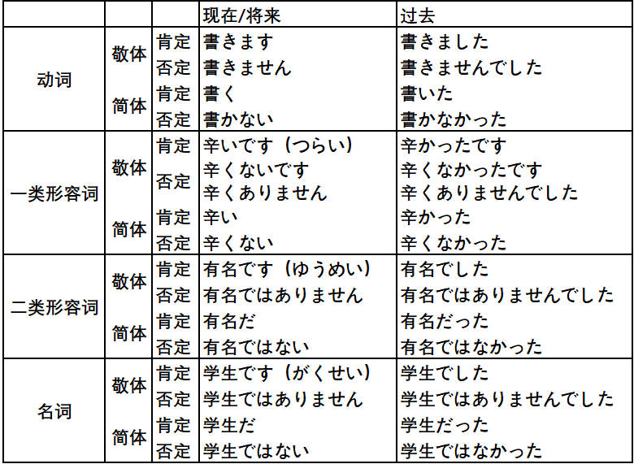

## 动词变形

### 特殊动词

需特殊记忆的一类动词（**i/e 段 + る结尾**）：

**i 段 + る结尾**

要る（いる）、入る（いる）、入る（はいる）、参る（まいる）、切る（きる）、限る（かぎる）

握る（にぎる）、遮る（さえぎ）、知る（しる）、走る（はしる）、散る（ちる）、混じる（まじる）

**e 段 + る结尾**

蘇る（よみがえる）、帰る（かえる）、焦る（あせる）、蹴る（ける）、茂る（しげる）、捻る（ひれる）

喋る（しゃべる）、滑る（すべる）、減る（へる）、占める（しめる）、照る（てる）、寝る（ねる）

**特殊用法**

行く：行って/た

ある：否定形>ない

要る（いる）：没有过去式（方言除外）

負う：負うて/た，負って/た

### 基本形 > ます形

> 第4课

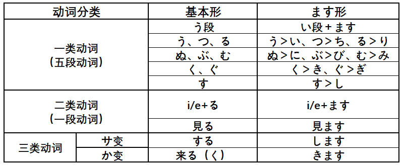

### 基本形 > て・た形

> て形-第14课 た形-第21课

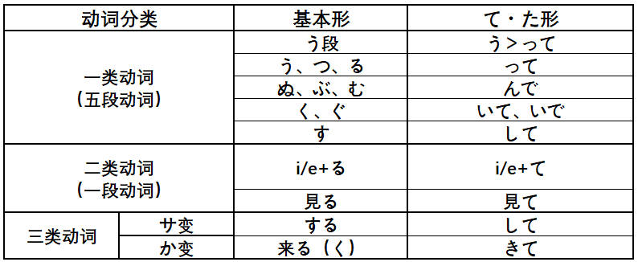

### 基本形 > ない形

> 第19课

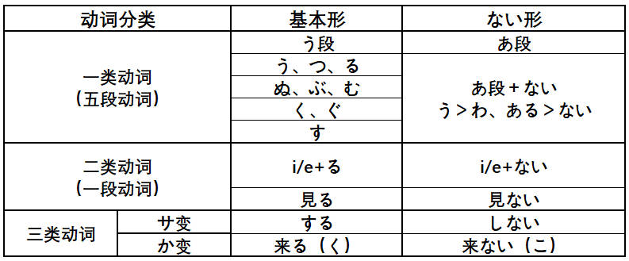

### 基本形 > 命令形

> 第29课

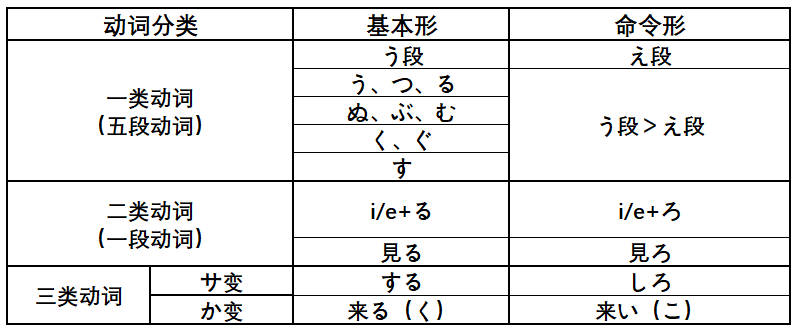

### 基本形 > 意志形

> 第30课

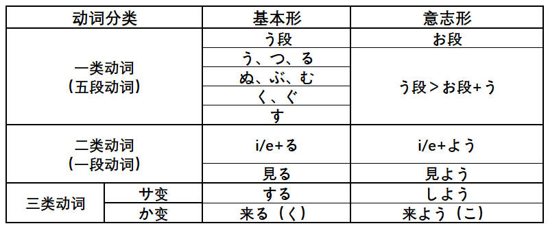

### 基本形 > ば形（假定）

> 第37课

### 基本形 > 可能形

> 第38课

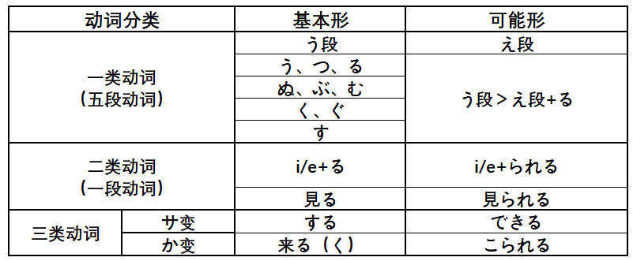

### 基本形 > 受身形（被动）

> 第41课

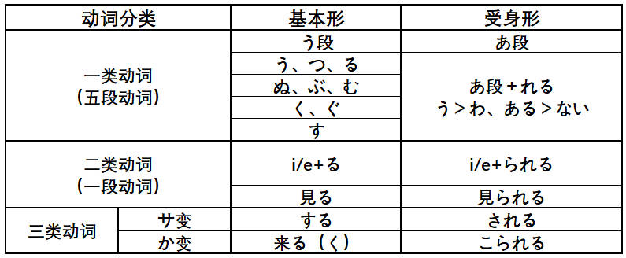

### 基本形 > 使役形

> 第43课

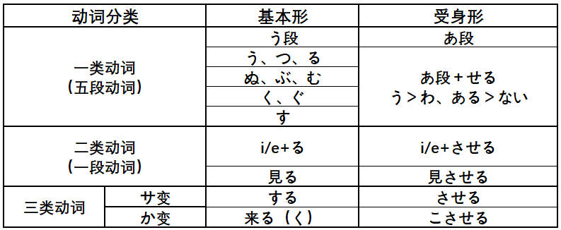

### 基本形 > 使役受身形

>第43课

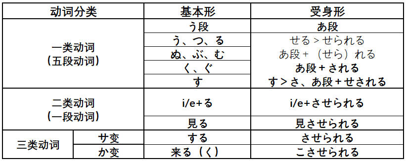

### 动词活用

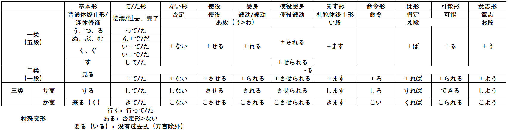

## 数量词

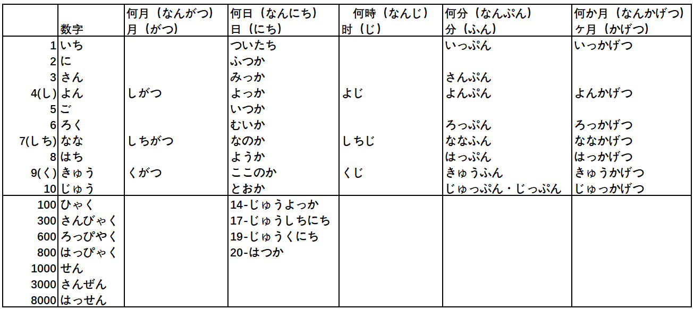

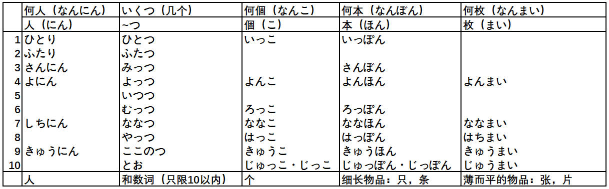

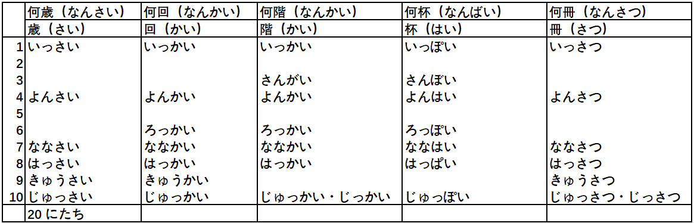

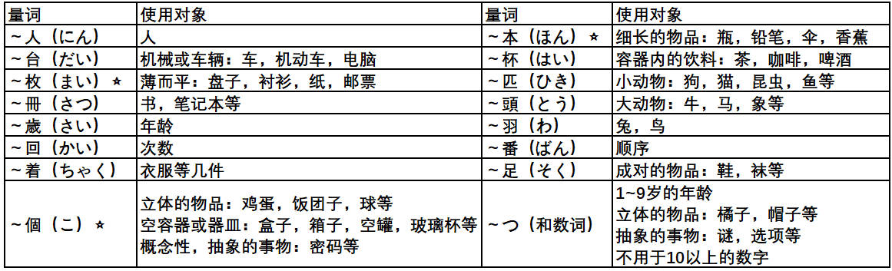

## 敬语

### 特定形式

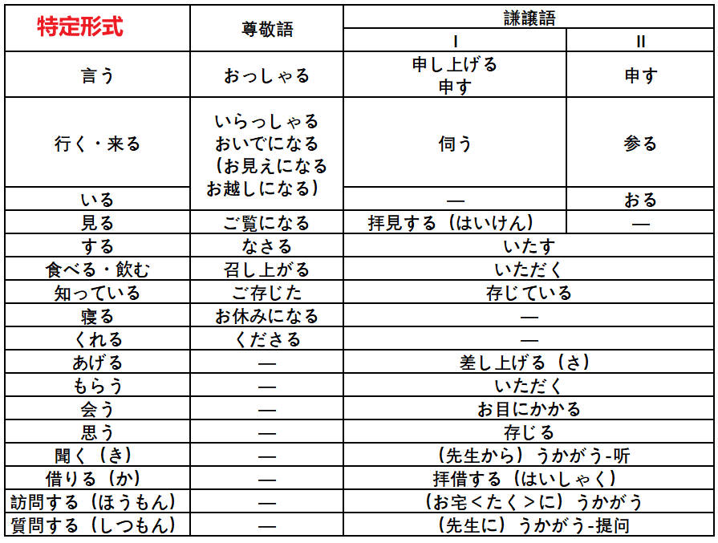

### 形式变换

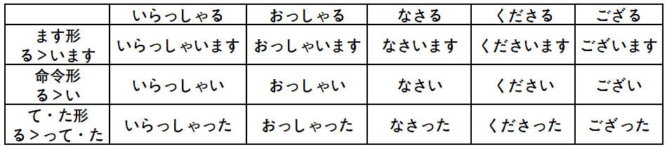

### 礼貌体

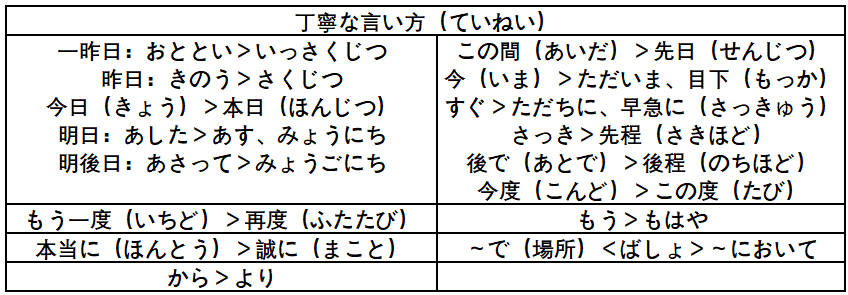

### 常用句型

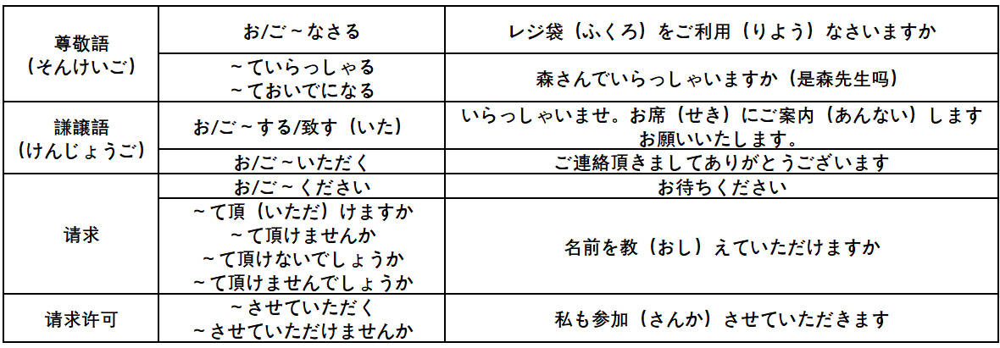

# 7 单元

## 25 课 これは明日会議で使う資料です

### ==**名词修饰（小句+名词）**==

### 语法

#### 小句+名词

**V简体+N**

- これは**明日会議（かいぎ）で使う**資料（しりょう）です。

- わたしが**明日乗る**飛行機（ひこうき）は中国航空（こうくう）です。
- あれは**倒産した**（とうさん）会社です。
- **わたしが知（し）らない**人から手紙が来ました。

#### 形容词/名词小句

**形容词小句：Ａい＋Ｎ / AN＋な＋N**

**名词小句+N：N+の＋N**

- **操作が簡単な**（そうさがかんたん）パソコンが欲しいです。
- **デザインが新しい**（あたら）靴（くつ）を買いたいです。
- **数学（すうがく）が専門（せんもん）**の先生が休みました。（教数学的老师）
- **子供が好きな**料理（りょうり）は何ですか。

**小句例子：**

- **昨日（きのう）李さんにもらった**本を読んでいます。
- **あなたが買いたい**かばんは**どれですか**。
- **あそこにある大きな白い**（しろい）建物（たてもの）は何ですか。

**询问是谁：**

- この人はだれですか。
- この方はどなたですか。

**AN/N＋だ＋と思います**

**AN/N＋かどうか**

#### 连体形/连用形（体言/用言）

- 体言：独立词，无活用（广义理解为名词），**包括名词，代名词，形容词**；
  - 连接体言的形式（+N）
- 用言：独立词，可活用，**动词，形容词**；
  - 连用形：连接用言的形式（+v/adj）

### 单词

**真っ直ぐ**（まっすぐ）：笔直的 | 真ん中（まんなか）：正中间

**だいぶ（程度多，深）**：だいぶ車が多くないましたね。

**この辺り（あたり）：这一带，附近**

**専門（せんもん）：专门 | 専攻（せんこう）：专业**

- 范围：専門＞専攻；
- 范围上：专门>专业；

**雲泥の差（うんでいのさ）：天壤之别；**

**自然な話方**（しぜん）：说话方式自然而然，很地道；

**自然に思い出した**（だ）：回忆起，想起；

**泊まる（と）：住宿，过夜；**

- 一泊二食（いっぱくにしょく）；
- 睡一晚带两顿饭；

中国結び（むすび）：中国结 | 縁結び（えんむす）一般指恋爱缘分

**取る（v1，记下）**：食事（しょくじ）とる-吃饭｜メモを取る（と）-记笔记

豊か（ゆた）な暮らし（く）：丰富的生活

**別に（adv）**：別に要はない（べつにようは）没什么特别需要的

## 26 课 自転車に2人で乗るのは危ないです

### ==**名词化**==

### 语法

#### 小句+の（形式名词）

小句（简体）+の（作名词）

- **自転車に2人で乗るの**は危（あぶ）ないいです。
  - 自転車**に**：附着点；
  - 二人**で**：样态；

- **パソコンで表（ひょう）を作（つく）るの**は楽しいです。（在电脑上制作表格很有趣）
- **手紙（てがみ）を出（だ）すの**を忘（わす）れました。（忘记寄信了）
- 李さんは**小野さんが料理を作（りょうりをつく）るの**を手伝い（てつだ）ます。（小李帮小野女士做菜）

#### こと（事）/の（形式名词）

こと/の作宾语时，こと和の可以互换。

**1.表述语言行为的动词时，只能用 こと**

**语言行为动词：**伝える（つた）：转告、知らせる（し）：告诉、話す（はな）：说

- 李さんは**森さんが休むこと**を伝えました。（转告森请假的事）

**2.感知动词 | 直接作用于动作对象的动词，只能用 の**

**感知动词**：見る、聞く

**直接作用于动作对象的动词**：手伝う（てつだ）：帮忙、止める（と）：停止、防ぐ（ふせ）：防御

- 李さんは**森さんが車から降（お）りるの**を見ました。
- 李さんは**森さんが荷物を運ぶ（はこ）の**を手伝（てつだ）いました。（小李帮森搬运行李）

#### でしょう/だろう

**约 80% 的可能性**

でしょう：推测/推量，可近似理解为 です 变化而来的。

だろう：でしょう的简体形，理解为 だ 变化而来。

**V/Aい（简体）+でしょう/だろう**

**AN/N（简体）+でしょう/だろう**

- 明日の朝は雨に**なる**でしょう。
  - 雨になる（变成大雨）
  - 雨が降る（下雨）

- 今年（ことし）はたぶん**豊作（ほうさく）**だろう。（今年大概是个丰收年）
- 桜の季節（きせつ）ですから、京都（きょうと）はたぶん**にぎやか**でしょう。（賑やか,adj2）
- この本の値段（ねんだ）は分かりませんが、たぶん高いでしょう。(不知道这本书的价格)

#### かもしれません

**约 50% 的可能性推测**，接续同 でしょう

**V/Aい（简体）+かもしれません/かも(随意的场合，口语省略)**

**AN/N（简体）+かもしれません/かも**

- 森さんは今日（きょう）会社を**休む**かもしれません。
- 来週（らいしゅう）は暇（ひま）かもしれません。
- 昨日（きのう）は**休みだった**かもしれません。（名词过去式的简体形，见4种基本句型）
- 明日は雨が**降る**かもしれません、**降らない**かもしれません。（各50%的概率）

**もしかしたら：口语，也许，可能性较低**

**もしかしたら...かもしれません < たぶん...でしょう**（概率上）

- **もしかしたら**、今日は来ない（こ）かもしれません。

#### 知らない

知ります | 知って**い**る（口语中い脱落，常不发音） | 知らなかった

### 单词

それで、つい握手（あくしゅ）するのを忘（わす）れました。

**それで**：上文的文脉指示，因此。

**つい**：一不小心，包含后悔，不快的色彩。

**挨拶（あいさつ）**：n,问候，寒暄| ご挨拶

皮肉（ひにく）：阴阳，讽刺，挖苦

午後の予定（よてい）は**あいさつ回（まわ）り**ですね。（下午是拜访吧）

- 回る：走访，转圈，绕弯；
- ほとんど：几乎，全部，80%-95%；

**Vてください。| Vないでください。**

大雨（おおあめ）｜大雪（おおゆき）

花見（はなみ）：赏樱花｜桜吹雪（さくらふぶき）

**中（なか）：n,关系，友情，友谊**

- 中がいいです。
- 仲間（なかま）伙伴
- 味方（みかた）：战友，同袍
- 友達（ともだち）｜敵（てき）：敌人

**普通（ふつう）はそういわない**：一般情况不这么说

**お支払い（しはらい）：支付**

お支払い方法（ほうほう）は一緒に（いっしょ）ですか、それでも別々（べつべつ）ですか

別々でお願いします。｜現金でお願いします。

- クレジットカード：信用卡
- 現金（げんきん）｜バーゲン：甩卖
- キャッシュカード：现金卡，储蓄卡

つまらないものですが、どうぞ。｜日本の生活（せいかつ）に慣（な）れました。（适应了日本生活）

発表（はっぴょう）する：展示，presentation。

病気（びょうき）を防ぐ（ふせ）｜敵（てき）を防ぐ（预防生病/预防敌人）

**回る（まわ）：走访，绕弯**

- 手が回らない：顾不及
- あいさつ回り：转圈打招呼

例（れい）を**挙げる**（あ）：举例子|手を挙げる

**足りる（た）：足够**

全然足りない（完全不够）|試験合格した（しけんごうかく）

**約束する（やくそく）：约定**

- 約束がある：有约了；
- 用事がある（ようじ）；

## 27 课 子供の時、大きなひ地震がありました

### ==**相对时态**==

### 语法

#### 時/時に

**Aい＋時** | **AN＋な＋時** | **N＋の＋時**

- 子供の時、大きな地震（じしん）がありました。

- 映画（えいが）を見る時、いつも一番後ろ（うし）の席（せき）に座（すわ）ります。（看电影的时候，总是座在最后一排）
- 信号（しんごう）が赤の時、道（みち）を渡（わた）ってはいけません。

**時に：特指某次**

- この前、友達が病気（びょうき）の時に、私が看病（かんびょう）しました。（前些天朋友生病时，我照看他）
- 朝や夕方（ゆうがた）の**涼しい（すず）時に**スポーツをするのは気持ちがいいですよね。（早上，傍晚）

#### ながら

**V1（去掉ます的连用形）ながらV2**：表示两个动作同时进行

- 李さんはテレビを**見ながら**食事（しょくじ）をしています。（边看电视边吃饭）
- そのことを**考え（かんが）ながら**歩（ある）いていました。（边走边考虑）
- 葉子（ようこ）さんはアルバイトを**しながら**学校（がっこう）に**通って（かよ）いる**んですよ。（边打工边上学）
- **踊り（おどり）ながら**歌（うた）を歌っている人もいましたよ。（边唱边跳）

#### でしょう/ね

**でしょう**：将自己的观点强加，推测 | **ね**：两个看法一致，用于双方意见基本相同

- 今日（きょう）は暑いですね。（双方意见相同）
- 今日は暑いでしょう。（将自己的观点强加）

#### Vる/Vている

均可表示习惯性的动作

- 私は毎日散歩（さんぽ）し**ています**。｜私は毎日散歩します。
- 私は教師（きょうし）をし**ています**。（长期从事的工作）
- 私は先月（せんげつ）から、毎朝（まいあさ）太極拳（たいきょくけん）を**します**。

### 单词

**分かりました（わ）｜かしこまりました**

**なかなか大変（たいへん）ですね。**

- 大変なことになった。（事情变麻烦了）
- 大変困る（こま）非常为难（杀伤力大，慎用）

**仕事で（しごと）、楊さん（よう）と会って（あ）いたんです。**

- で：表原因
- ～に会って（会う）：强调所见的对象
- ～と会って：双向奔赴，共同参与

**大勢（おおぜい）の人**：很多人 | たくさん（适用范围更广）

人が大勢（adv）います。

**割引（わりびき）**：割-百分比|引-减去

- 3割引き：7折
- 3から2を引く：3减去2

**グラフについて説明（せつめい）する**：关于图表进行说明

**卓球（たっきゅう）**：乒乓球|**スキー**（滑雪）|**スケート**（滑冰）|バスケットボール（篮球）

何のご用（よう）ですか。（有什么事吗）

**学校（がっこう）・病院（びょういん）・会社（かいしゃ）に通よう（往返）**

**困る**

- これは困るよ
- これ、要りますか。（这个，要吗）
- 手をたたく（拍手）

**入れる（い）｜入る（はい）**

森さんは部屋に入る。

**喧嘩する（けんか）**

- 彼女と（かのじょ）喧嘩した。（和她吵架）
- 喧嘩を売れる。（找茬）

**しばらくです：好久不见**

しばらく会わなかった：好久没见面了

**気が付く（きがつく）：察觉**

- 気が付きます
- よく気が付く人だ：心细的人
-  間違（まちが）いにきがつかなかった：没注意到错误

## 28 课 馬さんは私に地図をくれました

### ==**授受动词/补助动词**==

### 语法

内（うち）：我，家人，朋友，同事；

外（そと）：他者，陌生人，客户；

- **名词 N + を + あげる/もらう/くれる**
- **V + て + あげる/もらう/くれる**

#### あげる

我 >> 别人，**我对别人施惠，不能长辈**

- 私は小野さんにお土産**をあげます**；（我给别人）
- 弟（おとうと）は小野さんに花**をあげました**；（我方（包括家庭成员）给别人）
- 小野さんは森さんにチョコレート**をあげました**；（站在第三人称视角的客观描述）

#### もらう

我 << 他人，句子主语是：我方，我方从他人那里得到

主动性不明确，是别人主动给我的 | 还是本人要的没有明确说明，**对是否受惠更加含蓄，也更常用**。

- 私は小野さんから/に辞書（じしょ）**をもらいました**；（我从别人处得到）
- 母は小野さんにハンカチ**をもらいました**；（我方（包括家庭成员）从别人处得到）
- 森さんは長嶋（ながしま）さんにパンフレット**をもらいました**；（站在第三人称视角的客观描述）

#### くれる

别人 >> 我，句子主语是：他人，**受惠明显，不能用于客观描述**

- 馬さんは私に地図（ちず）を**くれました**；（小马给了我一张地图）
- 小野さん、この本をわたしに**くれまし**か；（这本书能送给我吗）
- 馬さんが妹（いもうと）に旅行のお土産を**くれました**；（小马把旅行时的礼物送给妹妹）

#### V てあげます

主动做**施惠性动作**

- 森さんはお年寄（としよ）りの荷物（にもつ）を**持ってあげました**；（森帮老人拿行李）
- おじいさんが孫（まご）に本を**読んであげました**；（爷爷年少给孙子听）
- この本をあなたに**貸（か）してあげます**。（我把这本书借给你）前辈对晚辈
- みんなで手伝って（てつだ）あげましょう。

#### V てもらう

比较含蓄的受惠，有两种含义：1.别人主动作的恩惠性动作；2.自己请别人做；

先生にこの文章を日本語に**訳（やく）してもらいました**；（请老师把这篇文章翻译成日语了）

森さんは李さんに北京を**案内してもらいました**；（森请小李带他游览北京）

#### V てくれます

对方作**让我方受惠的动作**—明确表示自己受惠

- 女（おんな）の人が私の財布（さいふ）を**拾（ひろ）ってくれました**；（一位女士帮助捡起了钱包）；

- 先生にこの文章を日本語に**訳（やく）してくれました**；（老师帮我把这篇文章翻译成日语了）；

#### 接受礼物时的答复

- 美味しいお茶を送って（おく）くれて、どもありがとう。
- いええ、どういたしまして。（没关系）一般很少这么回答

いええ、別に（べつ）大した（たい）物（もの）ではない。

**お口に合って（くちにあって）、よかったです。**（你能喜欢，太好了）

### 单词

**连用形＋先（さき）**：表示地方

- V连用形＋先（一，二类形容词）：引っ越し（ヒっこし）先
- V（三类）名词＋先

**どの辺（へん）**：辺（へん）不加具体的地点；

**辺り（あたり）**：辺り可加具体的时间地点｜この辺り｜駅の辺り

**どうした：怎么了｜どうして：为什么**

**翻訳**（ほんやく）：笔译｜**通訳**（つうやく）：口译

**届ける**（とど）：送到，送去；

**新鮮**（しんせん）な刺身（さしみ）

**うまく**説明した（せつめい）：说明地很好；

**自己紹介（じこしょうかい）**

## 单元末

みんな手伝（てつだ）い**に**来てくれました：に表示动作目的。

**間（ま）もなく**：不久

歓迎会（かんげいかい）を開（ひら）きました。

**とても頼（たよ）りになる人です**：非常靠得住的人

- **頼る**（たよ）（v1）：依赖，依靠
- **頼り**（たよ）（n）：借助，依据

受付（うけつけ）と秘書（ひしょ）**をしています**：做接待和秘书工作。

森さんは北京でどんな**活躍**（かつやく）をするでしょう：怎样大显身手。

駅までは、どのぐらいかかりますか。

- バスで10分ぐらいかかりますか。

- 駅へ行くバスは、1時間に4本（ほん）走（はし）っています。（1小时4班车）

# 8 单元

## 29 课 電気を消せ

### ==**命令形（Vえ）**==

- **見る＞見ろ**

- **する＞しろ**
- **来る＞こい**

### 语法

#### ください/なさい/命令形

**肯定形式（语气逐渐变硬）—要求/命令对方做某事**

**1.Vて：**省略ください，语气更缓和；

**2.Vて＋ください**：语气较为缓和，可用于对年长的人

**3.V连用形＋なさい**：提要求，命令语气，比命令形缓和点，**==不能用于长辈==**

**4.V命令形**

- 書いてください。
- 次（つぎ）の文章（ぶんしょう）を読んで、質問（しつもん）に**答（こた）えなさい**。（读下文回答问题）
- 早くお風呂に**入りなさい**。（入る＞入ります，v1）
- 電気（でんき）を**消せ（け）**。
- 子供が寝ている、静かにし**てください・しなさい・しろ**。

**否定形式（语气逐渐变硬）—要求/命令对方不做某事（禁止）**

**1.Vないで：**省略ください，语气更缓和；

**2.Vない＋でください**

**3.Vて＋はいけません**

**4.Vる＋な**

- 書か**ないでください**。
- 書い**てはいけません**。
- 書くな。｜ここに車を**止（と）めるな**。
- 人に迷惑（めいわく）を**かけないでください・かけてはいけません・かけるな**。

#### Vて（ください省略）

**Vて**是**Vでください**的省略形式，**语气比带 ください 更缓和**

**Vないで**是**Vないでください**的省略形式

- もうちょっと**急いで**（いそ）（再稍微开快点）
- ちゃんと話を**聞いて**（好好地听我说）
- 遠慮（えんりょ）**ないで**（别客气）
- 助ける（v2）＞**助けて**（たす）（救助，救命）

#### という意味です

**AはBという意味です**

- A 是叫做 B 的意思，对 A 的解释说明。

- 言う：说。と：**提示前面的具体内容**，～という思います。

**例子**

- このマークは「タバコを吸うな」**という意味です**。（这个符号是禁止吸烟的意思）

- さっき、部長（ぶちょう）は**何と言いましたか**。

  「書類（しょるい）を早く提出（ていしゅつ）しろ」**と言いました**。（快点提交文件）

- 先生は、「宿題は何だ」（しゅくだい）**と言いました**。（老师说：“作业是什么？”）

#### N1というN2

**叫做 N1 的 N2**，提供对方不知道的信息

- **フジ**という**花**です。(叫做紫藤的花)；
- **田中さん**という**名前**は日本人の名前です。（叫做田中的名字是日本的名字）

#### ないといけません

**ないといけません・なければなりません**：不这样做的话不行

**ないと・なけねば**：口语中常用省略形式

- 言わ**ないといけません**：不这样说不行；
- この場合（ばあい）は「歌ってください」と言わ**ないと**ね。（这种情况下应该说...）
- 時間がないから、急（いそ）が**ないと**。

#### Vた＋ほうがいいです

**表示建议，...比较好**

来てくださいを**言った**ほうがいいですよ。

#### V连用形＋方（かた）・先（さき）

...的方法 | ...的地方

- **言い方**をする：采用这种说话方法
- 考え（かんが）方をする：采用这种思考方法
- 引（ひ）っ越（こ）し先：搬迁的地址
- **送り先（おくりさき）：邮件的接受人和地点**
- 行先（いきさき）：去的地方
- 出張（しゅっちょう）先：出差的地方

### 单词

**親しい（した）：亲密的 | 相手（あいて）**

親しい相手：亲密的对方|中（なか）がいい（熟悉，亲密）

**年上**（としうえ）・年下（としした）

**止まる（と）|止める**

- 自动：電車**が**止まった
- 他动：電車**を**止める

**破る（やぶ）・守る（まも）**

- 記録（きろく）を破る（打破记录）
- ルール・約束（やくそく）を破る（打破规则或约定）
- 約束を守る（まも）（遵守约定）

**引く（ひ）**

- 辞書（じしょ）を引く：查词典
- 風邪を引く：得了感冒

**遠慮する（えんりょ）**

- ご遠慮なく・遠慮しないで（不要客气）・遠慮するな（男性之间）

- ご遠慮ください（请客气一下）

**迷惑（めいわく）**

- 人に迷惑をかける
- いろいろご迷惑をかけして、本当に申（もう）し訳（わけ）ありません。（添了很多麻烦，非常抱歉）
- 迷惑メール（垃圾邮件）

## 30 课 もう11時だから寝よう

### ==**意志形（Vお+う）**==

**表示决心/意志/建议**

- **見る＞見よう**
- **する＞しよう**
- **来る＞こよう**

- 行く＞行こう

### 语法

#### V意志形＋と思います

**比单独意志形更温和，常用。**

- もう遅いので、そろそろ**帰（かえ）ろうと思います**。

  お疲れ様でした。**気を付けて**ください。（注意，小心）

- 今日（きょう）、会社を**休もうと思います**。

#### V意志形＋と思っています

**と思っています**：想法持续一段时间，**未下定决定**

- 明日、病院（びょういん）へ**行こうと思っています**。（明天，我想去医院）

- 今度（こんど）、長江（ちょうこう）下り（くだ）を**しようと思っています**。
- その問題（もんだい）について、もう少し（すこし）**考え（かんが）ようと思っています**。（关于那个问题，我想再考虑考虑）

告白（こくはく）**しよう**。（临时冲动，当场形成的）

告白しよう**と思います**。（思考后，已经决定）

告白しよう**と思っています**。（持续一段时间，未下定决心）

#### ので/から

**ので**：书面语/口语，礼貌，强调**客观因果**关系。

**から**：口语，主观性强。

**小句简体形/敬体＋ので・から**

**AN/N＋な＋ので**

- 荷物が重い（おもい）**ので**、宅配便（たくはいびん）で送（おく）ります。
- 時間がない**から**、急げ（意志，命令，建议）
- 時間がない**ので**、急いでください。
- 電車が遅（おく）れた**ので**、遅刻（ちこく）しました。（主观上导致迟到）
- ここは静（しずか）かな**ので**、とても気（き）に入（い）っています。

### 单词

**もうすぐ：差不多**

雨で、外に出（で）たくなかったので：**V连用形+たい，想做某事**

出（で）かけ**ようとした時に**、電話があったんです：正要出门的时候，来电话了

**寄る（よ）：顺便，顺道去**

帰りに寄ろうと思います。（回去的时候顺道去）

**ちょうど：正好，刚好**

**ちょっと：稍微**

**開く（ひら）<自动/他动>：展开的感觉**

- 店を開く・店が開く
- 心（こころ）を開く・心が開く
- かばんを開く。（像过安检时，完全打开包）

- **開く（あ）：自动词｜開ける（あ）：他动词，闭合东西打开**
  - 缶詰（かんづぬ）を開ける。（打开罐头）
  - かばんを開ける。（打开包）

**壊れる：自动词|壊（こわ）る：他动词**

- 皿（さら）が壊れる
- 皿を壊した

**間違い（まちが）：错误**

- 間違える（まちが）：v2，搞错
- 間違いを直す（なお）：改正错误

**楽しみ：adj2，愉快/期待|楽しむ（v1）**

- 授業（じゅぎょう）を**楽しみにしています**。（期待）

- **楽しみにしていて**ください。（期待下）

## 31 课 このボタンを押すと、電源が入ります

### ==**条件表达（と）**==

### 语法

#### と

本质是两个事件之间的**继起关系，假定性弱**｜表真理、恒常、反复性状态/习惯。

**接续：基本形/ない＋と**

**不加-意志、希望、命令等**

- このボタンを押（お）す**と**、電源（でんげん）が入（はい）ります。（电源接通）
- 春（はる）になる**と**、桜が咲き（さ）始めます。
- 食べ物を食べない**と**、人間（にんげん）は生（い）きることができません。（不吃食物，人就没法活）
- その店へ行く**と**、いつもコーヒーを飲（の）みます。
- この道をまっすぐ行くと、デパートがあります。（沿着路直走，有一个百货商店）
- 田中さんにメールを送（おく）る**と**、すぐ返事が来ました。（给田中发一个邮件，他立马回复）

#### Vたことがあります

**Vた＋ことがあります。（有某种经验/经历）**

**Vる＋ことがあります。（有时发生某种情况）**

- そのパソコンは、たまにフリーズすることがあります。（那台电脑偶尔会死机）
- 時々寝坊（ねぼう）することがあります。（有时会睡懒觉）
- でも、**たまに食べないこと**があります。

#### でしょう

**1.推测，概率高|2.确认，诘问|3.礼貌，询问**

**V/Aい＋でしょう｜AN/N＋でしょう｜AN/N（简体）＋でしょう**

- 李さんは来るでしょうか。（礼貌程度高）
- これは中国のお菓子（かし）でしょうか。(点心)

#### 指路用词

**すみません。市役所（しやくしょ）へはどう行くんですか。**

- 駅からまっすぐ行くと、交差点（こうさてん）があります。

- そこを右（みぎ）に曲（ま）がって少し（すこ）歩（ある）くと、左にあります。

- ここを曲（ま）がる**と**、小さな公園（こうえん）があって
- ここから300メートル**ほど**行くと、スポーツセンターがあります。（走大约300米）

#### 疑问词＋でも

**いつでも/だれでも/なんでも**

卓球（たっきゅう）をしたい時にいつでもできるんです。

#### 下がる/下りる/下る

**1.下りる（お）/上がる（あ）**

- 階段（かいだん）から下りる（下楼梯）

- 階段を上がる（あ）/木に登る（のぼ）
- 電車から降りる（お）/電車に乗る（の）

**2.下がる（さ）/上がる（あ）**

气温/价格/数量，**上がる-自他动词**

- 物価（ぶっか）が下がる/上がる
- 気温（きおん）が下がる/上がる

**3.下（くだ）る/上（のぼ）る**

**上，下行**

- 下りのエレベーター
- 上る：東京行き

### 单词

**形容词修饰动词：Aく＋V（Aい）｜ANに＋V（AN）**

- 馬さんはとても**上手（じょうず）に**れボートを**まとめました**。（出色地整理报告）

- **静かに**ドアを**閉（し）めて**ください。
- **自由（じゆう）に利用（りよう）する**ことができる。
- **丁寧に教（おし）えて**くれた。（教得很仔细）

**きちんと：好好地，认真地**

- 朝ご飯は毎日**きちんと**食べますか。
- **きちんと**片付ける（かたづ）。（打扫）

**～でできた：用什么做的**

- この椅子（いす）は木（き）**でできた**。（这个椅子用木头做的）
- コンクリート**でできた建物**（たてもの）。

- サイズがぴったり合う（あ）。（尺寸正合适）

**やる：动作性强，强调动作**|**する**

- 必ず（かなら）誰かが**やって**いますね。

- 何かほかにも**特典**（とくてん）があるんですか。（还有什么其他的**优惠**吗）

人間（にんげん）：人类

お手洗い（てあら）｜手を洗う（てをあらう）

白鳥（はくちょう）：天鹅｜スイカ：西瓜

**怒る（おこ）**

- 腹が立つ（はらがたつ）：生气

- お腹（なか）がいっぱいです：肚子饱了

**回す（まわ）：传送**

- こまが**回る**（自动，陀螺转）
- こまを**回す**（他动，抽陀螺）
- 資料（しりょう）を後ろ（うし）に回してください。（把资料往后传）

**生きる（い）**

- **生き生き**と描（えが）き出（だ）す。（活灵活现）
- 目が**生き生き**する。

**まとめる**（v2，整理，汇集）：内容（ないよう）をまとめる

**~つ目**

- 一つ目：第一个
- 左から三つ目：左边起第三个
- 上（うえ）から三行目（ぎょう）：从上起第三行

**気持ち悪い**：生理或心理上得恶心｜**キモイ**：仅用于口语上，恶心

**美しい（うつく）：更书面语**｜綺麗（きれい）

**うまい：好吃，擅于，高明**

- うまく説明した（说明很仔细）

- 日本がうまい（擅长）

## 32 课 このボタンを押すと、電源が入ります

### ==**打算/决定/传闻**==

### 语法

#### V简＋つもりです

**个人打算，一般不用于长辈**

**Vない＋つもりです**

**Vる＋つもりはないです：否定语气更强**

- 今度（こんど）の日曜日に遊園（ゆうえん）地へ行く**つもりです**。
- 旅行（りょこう）に行かない**つもりです**。
- 旅行に行く**つもりはないです**。

#### そうです

传闻，听说，无过去，否定，疑问。によると、～そうです。

**小句/V简体＋そうです**

**Ａい＋そうです**

**ＡN/N＋だ＋そうです**

- 馬さんの息子（むすこ）さんは今年小学校（ことししょうがっこう）に入学（にゅうがく）する**そうです**。
- 天気予報（てんきよほう）**によると**、明日（あした）は**雨だそうです**。
- うわさ**によると**、あの店のラーメンは美味しくない**そうです**。
- 森さんは来週（らいしゅう）の土曜日は**暇ではない**（ひま）そうです。
- 馬さんは息子さんと遊園地へ**行くつもりだそうです**。

#### ことにする

**决定做某事，强调人为性。简体形＋ことにする**

**こととする：同ことにする、书面语，语气更硬**

- これにします。（点餐，买东西，把决定告诉对方）
- 明日、友達と映画（えいが）を見に（み）行く**ことにします**。
- テレビの音（おと）を大きく**しました**。（他动词，人为性）

- なかった**ことにする**。（过去得事就当没发生过）

#### ことになる

陈述某个决定。**こととなる＝ことになる**

- テレビの音は大きくなりました。（自动词）
- 今週（こんしゅう）は会議（かいぎ）を行（おこな）わない**ことになりました**。(举行，举办)
- 私は来月から中国の留学（りゅうがく）する**ことになりました**。
- 私たち、結婚（けっこん）する**ことになりました**。

#### Vて＋ほしい

**Vて＋ほしい：希望对方为自己做某事**

**~がほしい：想要某物**｜**V连用形＋たい：自己想做某事**

**って＝と｜という｜という人は（仅限口语）**

- 私にも**手伝って（てつだ）ほしい**って言っていました。（说想让我帮忙）
- 私は映画（えいが）を**見たい**です。

### 单词

**家（うち）**：家人，家庭，比较亲近

**家（いえ）**：物理意义上得家，中立

**できるだけ**：尽可能

列車（れっしゃ）｜電車（でんしゃ）｜高速バス（こうそく）｜夜行バス（やこう）

**なんでだろう、涙（なみだ）が出（で）た。**

- **旅行**予定（りょこうよてい）：旅行安排
- **旅**（たび）に出（で）る：出门旅行｜**旅**立つ（たびだつ）：旅行，启程
- いい日（にち）**旅立ち**（たびだち）：良日旅行

**情け（なさ）：人情，同情｜情けない（なさ）：无法同情，可悲可叹**

- 旅は道連れ（たびはみちつ）、せは情け（なさけ）：旅行靠旅伴，为人处事靠人情
- 母の**背中（せなか）**で聞いた歌を道連（みちつ）れにする（将母亲背上听到得歌作为旅伴）

**歴史**（れきし）：長い（ながい）歴史を持つ（も）—悠久的历史

**行う（おこな）：举行，举办**

- 結婚式（けっこんしき）を行う
- 結婚式を上（あ）がる/下（さ）がる：举办婚礼/退出婚礼

**気（き）さく**（爽快的）｜いろんな|いろいろな

## 单元末

**メールの書き方**

**开头：** 

- いつもお世話になっております。（一直承蒙您的关照，商务）
- 先日（せんじつ）は大変お世話になりました。
- こんにちは。(前辈，亲密老师)
- ご連絡（れんらく）ありがとうございました。
- ご返信（へんしん）ありがとうございました。

**句中**

- 先生のご都合（つごう）のいいお時間に、研究室（けんきゅうしつ）へお伺いしたいのですが、いつがよろしいでしょうか。（我想在老师您方便的时候去研究室，您什么时候方便呢？）
- いいですか

**句尾**

- お忙しいところ恐縮（きょうしゅく）ですが、お返事（へんじ）いただければ幸いです。（诚惶打扰，回信荣幸）
- お忙しいところ申し訳（もうしわけ）ありません。（百忙之中打扰您真是不好意思）
- お返事（へんじ）お待ちしております。（等候您的回信）

**句尾结束**

- 何卒（なんそつ）よろしくお願いいたします。（请多多关照）
- また何かありましたら、ご連絡をお願いいたしま。（如果还有什么问题，请与我联系）

# 9 单元

## 33 课 電車が急に止まりました

### ==**自他动词**==

### 语法

#### 自他动词

- **有对自他**；
  - 自动词：は・がー窓が開いています；
  - 他动词：をー李さんが窓を開けたんですよ；
- 无对自他；
- 自他同体；

#### てしまう

森さんはボーナスを全部使ってしまいました。

1. 后悔，遗憾，责备的语感；
2. 完了，结束了；

#### そうだ

样态：

- このケーキはとてもおいしそうです。

- お元気そうですね。（看起来气色不错）

推测：雨が降りそうだ。

**1.表示样态（看起来怎么样），推测**

- Ａ（~~い~~）＋そうです

- ＡＮ（~~だ~~）＋そうです

- Ⅴ连用形 + そうです

否定形态

- 形容词＋そう**ではあり**ません
- Ⅴ连用形＋そう**にはあり**ません

其他形式

- ない：**なさ**そうだ | いい・よ：**よさ**そうだ
- 作句子的其他成分：おいしいそう**な**クーキですね

**2.表示传闻，听过（无过去，否定，疑问形式）**

- Ａい＋そうです
- ＡＮだ＋そうです
- Ⅴる＋そうです

### 单词

穿戴

- はく：鞋/袜子/裤子（下半身穿着）

  - 靴・靴下（くつした，袜子）をはく。

  - ズボンをはく。

- 帽子（ぼうし）を被（かぶ）る

- スーツ（西装，套装）・つなぎ（连体装）・ワンピース（连衣裙）を着（き）る。

- 腕時計（うでどけい，手表）をはめる。

- 時計をつける・ピアス（项链）をつける。

うつかり（adv,不留神，不注意）忘（わす）れる。

## 34 课 壁にかレンダーが掛けてあります

### ==**补助动词：V て+ 补助动词**==

### 语法

#### ている

- 正在进行（**自动词が，他动词を**）：
  - 壁にかレンダー**を**掛けている（他动词）；
  - こま**が**回っている（自动词）；

#### てある

- 表示结果状态的持续（**自动词が，他动词を**）：
  - 壁に絵**が**掛かっている（自动词）；
  - 壁にかレンダー**が**掛けてあります（他动词）；有意进行的动作造成结果的存续；
  - 森さんは車を持っている（他动词）；

#### て おく

V **てお**く => 口语形式 V **と**く

- **提前做好某种准备，おく（置く）放置，搁置**
  - お客さんが来る前に、部屋お掃除し**ておきます**
  - おいてください｜おかくない
  - おかなくてもいいです（不做某事也是可以的）
- **放任不管**
  - まだ使うので、電気をつけ**ておいてください**；（还用，等别关）
  - 後で片付けるから、そのままにし**といて**；（之后打扫，先保持原样）

#### て みる

V て みる—试着作某事：太田さんは中国語で手紙を書いてみました。

#### ため（に）

ため：目的，形式名词。に去除后，ため多用于论文等官方文档，更为生硬。

ため＝ために

Pために、Q：P，Q动作对应的**主语必须一致**。

日本へ留学するために、お金をためています。

#### 頼む(拜托)む

> たのむ

- ドリングを頼みましょう。（点些饮料吧）
- タクジーを頼む。（打个出租车）

#### しっかり

副词

- 充足，充分：しっかり食べて
- 结实，紧固：手すりにしっかりつかまってください
- 坚挺，牢记：しっかりしる（振作起来）/しっかり覚える（牢牢记住）
- 扎实，认真，可靠：将来のことをしっかり考えている（好好考虑将来的事情）/しっかりしている（做事靠谱）

#### とっておき

取って置き　取って置く：为应付急需而准备的；

これはとっておきのお酒です。

#### こんなに

这么，这样地，adv | こんな：这样，这种，表示强调语气；

こんなにおいしいの食べたことありません。

こんなことは初めでた。（从没出现过的事）

### 单词

預（あず）ける（他动词）寄存，依托

- 荷物をコインロッカーに預ける。（コインロッカー：投币式自动存放柜）

預かる（他动词）代人保管，收存

- 荷物を預かる。

もったない（adj1）浪费，过分

合（あ）う ：动词，合适

- 服のサイズが合う。衣服尺寸合适
- 口（くち）に合う。合口味
- メガネが合う。眼镜度数合适

似合う

- 服が似合う。衣服的外形合身
- メガネが似合う。眼镜外形合适

非常に（ひじょに）

非常においしい（非常美味）

## 35 课 明日雨が降ったら、マラソン大会は中止です

### ==**假定，限定**==

### 语法

条件 と，结果。 と表示继起，假定性弱。

#### たら

- **Ａい > Ａかったら | AN/N だったら**

- **でしたら・ましたら（口语形式，对应 です、ます）**

  - 問題（もんだい）があり**ましたら**、教（おし）えてください。（有问题，请告诉我）

  - 表現（ひょうげん）が変（へん）でしたら、直（なお）します。（表现不恰当的话就改正）

- 适用**范围广**，假定/确定条件
  - 夜になったら、散歩（さんぽ）に行きましょう。(确定条件)
- 可以加意志，命令，希望等
  - 森さんに会ったら、よろしく伝（つた）えてください。
- 同 と的用法，用于事实契机

#### ても

表示逆接，即使...

その言葉（ことば）は、辞書（じしょ）で**調（しら）べて**も分かりませんでした。—那个词即使查词典也不明白

日本へ帰っても、中国語の勉強を続けてください。（**ちゅうごくご**の**べんきょう**を**つづけて**ください）

それにしても（即使这样）

- AN・Nでも
- Ａくでも
- Vて・でも

加疑问+でも

- どの家でも。—无论哪一家都
- だれでも。—无论谁
- いつでも。—无论什么时候都

#### だけ

限定，客观陈述，**重点在“只有”**

- 表示强调：だけ・も・は・しか～ない
- だけ＋（が・を）可加可不加，格助词+だけ　だけ＋格助词（可前可后）

今年（ことし）の夏休みは**三日（みっか）だけ**です。

わたしはその**料理だけ**食べませんでした。—只有那个菜没吃

#### しか～ない

重点强调 ない、除以之外无其他的，**包含感情**

- 会議室（かいぎしつ）には李さん**しかいません**。—会议室只有小李一人
- 会議室には李さん**だけがいます**。
- 私わ**水しか飲**みません。—只喝水，强ないい
- 私わ**水だけを**飲みます。—只喝水，强调水

**なかなか**：程度高，表示难以 ，否定

風邪を引（かぜをひ）いてしまって、**なかなか**治（なお）りません。—感冒了，好长时间都不好

**だんだん**：逐渐，渐渐

何度（なにど）も作る**と**、**だんだん**上手になりますよ。—と表示自然而然地继起

多作几次的话，慢慢会发生变化。

#### やる・する

やる更强调动作。どうする・どうやる（怎么做）

- **どうしたら**いいですか。
- **どうやったら**美味しくなるんでしょうか。—怎样作才能好吃呢

### 单词

もし晴れたら、出かけよう。（假如天晴的话）

そういう必要（ひつよう）ない。adj2-没有必要

心（こころ）が晴れる。

先生（せんせい）の家を訪（たず）ねる。（拜访老师）

宝（たから）くじに当（あ）たる。宝くじ（彩票），中彩票

席が空くいていますか。（座位空着吗）

運動会（うんどうかい）に参加（さんか）する。

完全（かんぜん）に失敗（しっぱい）した。

皆さんの健康（けんこう）を祝（いわ）って。

消しゴムで字を消す。（橡皮擦掉字迹）

仕事を見つける。（找到）

## 36 课 遅くなって、すみません

### ==限定==

### 语法

#### て形表原因

遅くなっ**て**、すみません。

仕事で、友達と会ったいた。

- 自然流露，或自然现象造成的结果
  - 彼に会えて、安心した。
  - 地震（じしん）で、電車が止まりました。
- **て形后面不接意志形**：風で、学校（かっこう）を休んだ。

#### N＋に用途，基准

一般没发生，不用过去式。

この写真は何に使いますか。

用途：パスボートの申請（しんせい）**に**使います。

基准：この本は、大人（おとな）**に**は易（やさ）しいです。しかし、子供**に**は難（むずか）しいです。

これは軽（かる）くて、持（も）ち歩（ある）く**のに**とても便利（べんり）なんですよ。

#### ばかり

- N+ばかり：表示**次数多**
  - 何で野菜**ばかり**食べているんですか
  - 今、ダイエット中（ちゅう）なんです
  - お酒を**ばかり**を飲んでいる。酒出现的次数多，众多物品中的一个

- Vて＋ばかりいます
  - 森さんはいつも失敗して**ばかり**います。总是出岔子
  - お酒を飲んで**ばかり**いる。强调喝酒的动作，众多动作中的一个

#### ばかり和だけ

1.だけ**客观限定**，ばかり量多，次数多，**主观限定**；

- 日本語ができるのは森さんだけです
- 周りは日本人**だけ**です。（客观陈述）
- 周りは日本人**ばかり**です。（主观情感）

2.**だけ+数字** | **数字+だけ**，而ばかり只强调多；

3.だけ与**否定相呼应**，ばかり则不行

その料理**だけ**を食べませんでした。（只有那个菜没吃）

#### 見える・聞こえる

**見える**能看见，表示能力

- 空港（くうこう）の入り口に警官（けいかん）が立（た）っている**のが見えます**。
- 李さんが呼んでいた**のが聞こえましたか**。

#### 音・声

音（おと）：无生命。凧（たこ）の音です

声（こえ）：无生命

#### 拟声拟态词

- 日本語が**ぺらぺら**ですね。（嘴巴说个不停）
- 緊張（きんちょう）して**いらいら**する。
- 雲（くも）が**ふわふわ**浮（う）かぶ。（蓬松，软乎乎）
- 胸（むね）が**わくわく**する。（激动）

### 单词

日本**の生活（せいかつ）に慣（な）れましたか**。～の生活に慣れる。（习惯生活，适应生活）

**日本の生活に慣れるの**に苦労（くろう）しましたか。适应日本的生活不容易的吧

**とにかく**（兎に角）：总之，无论如何，姑且

間（ま）に合（あ）う**かどうか**わかりませんが、**とにかく**行きましょう。不知道能不能赶上，先走吧

言葉（ことば）が**通（つう）じる**：语言沟通无障碍，得到理解

話（はなし）が**通じない**：不知道说的什么意思

電話（でんわ）が**通じない**：电话打不通

# 10 单元

## 37 课 優勝すねば、オリンピックに出場することができます

### ==ば形（假定）==

### 语法

#### ば形（假定）

- 一类动词：う段>え段+ば
- 二类动词：見る>見れば
- 三类动词：する>すれば　来る＞くれば

#### ば形用法

優勝（ゆうしょう）すれば、オリンピックに出場（しゅつじょう）することができます。

- 希望后件成立，重点在前件所具备的条件
  - どうすれば、いいですか。李さんに聞（き）けば、わかりますよ。
- 表示依存关系或一般法则，通と的用法相似；
  - このボタンを押（お）すと、電源（でんげん）が入ります。回答一种询问，表示期待
  - 春（はる）になれば、桜が咲（さ）きます。

- 多用于谚语
  - ちりも積（つ）もれば、大となる。（积少成多）
  - 三人寄れば文殊の知恵。（三人顶一个诸葛亮）

- 可用于假定，同たら，反事实的假定，不用于确定的条件
  - 雨が降れば/降ったら、マラソン大会（たいかい）は中止です。（同たら）
  - あと１００円あれば、あの鞄が買えるのに。再有100日元就能买哪个包了。（反事实假定，现在没有100日元）
  - 夜になったら、散歩（さんぽ）に**行きましょう**。（不用于确定的条件，ましょう有感情色彩）

- ば形**原则上不加意志，希望，命令，依赖等**（和と类似），**前后主语可以不一致**
  - 質問（しつもん）があれば、手（て）をあげ**てください**。有问题举手（**状态性谓语，可以用请求**）
  - 親（おや）が許（ゆる）してくれれば、彼女（かのじょ）と結婚（けっこん）するつもりです。父母允许的话，我打算和她结婚。（前后主语可以不一致，**状态性谓语**，可用打算等意志动作）
  - 雨が**降らなけねば**、ハイキングにいき**ましょう**。（**否定表示状态性的谓语**）

**一类形容词**

Aい＞Aければ

部屋がもう少し広（ひろ）ければいいのですが。房间再大点就好了。

#### なら

承接对方的话（意志，愿望）。

- **V/Aい（の）＋なら|（の）だ＞（の）なら**

  - 天安門（てんあんもん）へ行く（の/ん）なら、地下鉄（ちかてつ）が便利です

  - 忙し（いそが）い（ん）なら、行かなくてもいいですよ。

- **AN/N＋（~~だ~~）+なら |（简体形）+なら**

#### と/たら/ば/たら

- と（假定性弱，继起关系）
  - 真理/自然，恒常/机械，反复/习惯，发现/事实契机
  - **不加**意志，希望，命令
- なら
  - 承接对方的意志，愿望
  - 归结，说话人的判断
- **たら**最广泛，写作优先使用
  - 假定条件+确定条件
  - **加**意志，希望，命令
  - 可用于事实契机（同と）

- ば
  - 希望后件成立
  - 假定条件+反事实假定
  - 原则上**不加**意志，希望，命令（状态行谓语动词除外，如否定一般表状态）
  - 恒常/一般/(自然，机械)，同と

#### でも

列举几项中典型的一项

映画でも見に行きませんか。

- 誰でも参加（さんか）できます。（17课，全部）
- その計算は子供でもできます。（35课，极端情况）
- 運動（うんどう）でもしたらどうですか。（37课，列举典型）

#### とか～とか

～とか～とか：口语，前面可接句子

パーティーで、戴さんとか楊さんとか、いろいろな人に会いました。

海外旅行（かいがりょこう）に行きたいとか、新しい車が欲しいとか、ぜいたくなことばかり言っています。（尽说些失望）。

~や～や～など：口语/书面语，前面之接名词

**口语转换**

買ってしまった＞買っちゃった

- **でしま**う＞**じゃ**う
- **てしま**う＞**ちゃ**う

### 单词

0.5：れいてんご

用事（ようじ）ちょう用事がある。（有事）    約束（やくそく）有约

計画を立てる（けいかくをたてる）。制定计划

受験番号（じゅけんばんごう）。准考证号

つまみ食（ぐ）いする（V3、偷吃）

摘（つま）む。拿，摘，采 | 撮（つま）み物。下酒菜

食（ぐ）う。粗俗形式的表达

食（く）いしん坊（ぼう）（一类人，贪吃的人）｜坊さん（和尚）

坊ちゃん（少爷）|朝寝坊（あさねぼう）爱睡懒觉的人

贅沢な暮らし（ぜいたくなくらし）奢侈的生活

## 38 课 戴さんは英語が話せます

### ==可能形==

### 语法

#### 可能形

能够作某事，能力，状况允许

- 一类动词：う段>え段+る
- 二类动词：見る>見られる

- 三类动词：する>できる　来る＞こられる

戴さんは英語が話せます。

戴さんは英語を話すことができます。

**注意点**

- 格助词的使用
  - [人]が[もの・こと]が＋可能，戴さんが英語が話せる。
  - [人]が[もの・こと]を＋可能，戴さんが英語を話せる。
  - [人]に[もの・こと]が＋可能，戴さんに（は）英語が話せないる。

- 无意志动作不使用可能形，雨が降られる（×）

#### 見られる・見える

見える：由于眼力，距离等**客观因素**可看到，自然映入眼中。

- 外（そと）は暗（くら）くて、何もみえません。
- 夏になると、蝉（セミ）の声（こえ）が聞こえる。

見られる：人为条件下可看到，表示**主观能力**

- 動物園ではパンダが見られます。
- コンサートのチケットを買えば、彼の歌が聞ける。

#### よう（様）に

**Vる・Vない・V可能形＋ように**

- よく見える**ように**（目的）、大（おお）きく書きました（行为）。为了让人看得清楚，把字写得大大的
- 風邪**を**引（ひ）かないように、気（き）をつけています。一直在注意不要感冒
- いつでも出（で）られるように、準備（じゅんび）してあります。
  - 为了随时能够出发，做好了准备。
  - **他V+てある，表示动作的持续**

**①动词接续**

- **（非意志性V）Vる・Vない+ように**

  - 自己意志无法实现的动作：降る、忘れる、なる、見える、聞こえる。

  - 非意志动词直接用基本形或ない形。

- **（意志性V）V可能形（る・ない）+ように**

  - 食べる、行く、起きる

  - 自己的意志可以实现，**用意志动词的可能性表示一种状态**，能吃饭，能走路表示一种状态

**②ように＝よう（やや硬い），书面语，更加生硬**

**③PようにQ、P、Q动作可不一致**

小野さんが留学（りゅうがく）するように、森さんはアルバイトをしています。

#### よう（様）に/ため（為）に（目的）

- ため：表示强烈达成目的的心情。[意志形V]+ために
  - 明日早く**起きるために**、目覚（ざ）ましをかける。
  - **健康（けんこう）のために**何かしていますか。
- よう：希望事情变成那样，为之努力。[非意志形/状态+ように]
  - 明日早く起きられるように、目覚ましをかける。
  - 雨が降るように、神（かみ）に祈（いの）る。
  - 皆さんの支（ささ）えに少しでもなれるように、頑張（がんば）ります。
- PためにQ（表目的）。P、Q动作的主体一致 | PようにQ。P、Q动作可以不一致。
  - 子供が起きないように、静かに話した。否定一般表示状态

#### ように＆ために例句

- 汚（よご）れ**を**落（お）とす**ために**、洗剤（せんざい）を使う。（他动词表示意志性）

- 汚れ**が**落ちる**ように**、洗剤を使う。（自动词表示状态）

- 汚れ**が**落とせる**ように**、洗剤を使う。（他动词的可能形）

- 色**を**落とさない**ように**、軽（かる）く磨（みが）く。（否定形态表状态）

- 宝（たから）くじ**が**当（あ）たる**ように**、祈（いの）ります。（祈祷一般对应ように）

- 東京大学（とうきょう）入る**ために**、毎日10時間勉強した。

- 森さんがわかる**ように**、李さんはゆっくりと中国語（ちゅうごく）を話した。

- 明日の**ために**、早く寝よう。（名词の+ために）

- 忘れない**ように**、メモしておく。

#### ようになる

**Vる・Ｖない＋ようになる，强调客观变化结果**（变成某种状态，以前没有现在有了）

けがが治（なお）って、歩（ある）ける**ようになりました**。（伤已经痊愈，能走路了）

着物（きもの）を自分（じぶん）で着（き）られる**ようになりました**。

#### ようにする

**Vる・Ｖない＋ようにする，强调人为性**

陳さんは毎日、英字新聞（えいじしんぶん）を**読むようにしています**。坚持每天看英文报纸

毎朝1時間散歩する**ようにしています**。表示一种习惯

**ようにした・ようにしていた**

のどが痛い（いた）ので、今日（きょう）はあまり**話（はな）さないようにします**。

毎朝ちゃんと朝ごはんを**食べるようになりました**。状态的陈述，每天早上好好吃饭

毎朝ちゃんと朝ごはんを**食べるようにしています**。强调人为的努力，好好地吃饭

### 单词

**なんだが**残念（ざんねん）ですね。总觉得可惜啊！

なんだが：不知为什么，总觉得。

具合（ぐあい）情况，体（からだ）の具合はどですか。身体怎么样

- 今日は具合が悪い。今天不方便
- 今日は都合（つごう）が悪い。情况不太好

半分（はんぶん）ぐらいわかった。听懂一半

ストレスが溜（た）まる。积攒，有压力

放送（ほうそう）广播 | 生放送（なまほうそう）现场直播

**组合词**

入り組む（いりくむ）（V1）错综复杂 >> [V连+Vる]　入り（进入）+組む（编织）

通り抜ける（とおりぬける）（V2）走的过去，穿过 >>  [V连+Vる]　通り（通过，经过）＋抜ける（穿过）

取り替える（とりかえる）（V2）更换，交换 >>  [V连+Vる]　取り＋替える

人民元（じんみんげん）を日本円（えん）に取り替える。

痛みを感じろ(感受痛苦吧) | 感じる　

試合（しあい）に勝（か）つ。赢得比赛

## 39 课 眼鏡をかけて本を読みます

### ==ていく/てくる==

### 语法

#### て形表状态

表状态，注意前后主语一致

- **表示状态**：眼鏡をかけ**て**本を読みます。（带着眼镜看书）

- **表动作的先后**：昨日（きのう）デパートへ行っ**て**、買い物しました。

  春（はる）が過（す）ぎ**て**、夏が来ました。

- **表示并列**：ホテルの部屋は広（ひろ）く**て**明（あか）るいです。

- **表示原因**：森さんは頭が痛く**て**、会社を休みました。**（36课）**

#### ないで

表示不在的状态，**ない=ず、ないで＝ずに**。

- 今日は傘を持た**ずに**出（で）かけました。
- 今日は傘を持た**ないで**出かけました。

#### ために

38课的表示目的，此处表示原因，二者的**接续相同**。に可以省略，但是语气较硬，**ため多用于新闻/论文，描述事件时很有距离感。**

**V/Ａい(简体) + ために**

**AN ＋な＋ために**

**N ＋の＋ために**

- ために表示**原因**时，**主语可以不一致**。ために表示**目的**时，**主语必须一致**。

  道路工事（どうろこうじ）**のために**、道が込（みちがこ）んでいます。道路非常拥挤

- ために表示原因，前面不一定是意志形动作（ために表示目的时，前面一般是意志形动词）

  風邪を引いた**ために**、会社を休みました。

- ために可以表示原因，但是不能作为依据，**后面不+意志形表达**

  風邪のために、学校（がっこう）を休んだ。| 風邪で、学校を休んだ。

  風邪で、学校を休んで**ください**（表示请求的意志）。（×）

- ために多**适用于不太情愿**的事情，一般**不适于好的事情**

  部長（ぶちょう）に**なったために**、給料（きゅうりょう）が増えました。（×）

  部長に**なったから・なったので・なって**、給料が増えました。

- ために不能用于结句，から/**ので・んで**/て可以结句

#### ていく/てくる补助动词形式

去，表示**时间和空间上由近及远**，（て行く）

来，表示**时间和空间上远近及近**，（て来る）

- 空间上，以某人视点为基点

  李さんは急（いそ）いで**帰（かえ）っていきました**。**回去了**（说话人在公司）

  李さんは急いで**帰ってきました**。**回来了**（说话人在家里）

- 时间上，以某人时间点为基准

  これからは少しずつ暑く**なっていく**。今后渐渐热起来了（从现在到未来，由近及远）

  あれからはずいぶん暑く**なってきた**。从那以后变得很热，慢慢热过来（从过去到现在）

#### ていく/てくる实意动词形式

去年（きょねん）、日本で歌舞伎（かぶき）を**見てきました**。（**去，看 >> 两个实意动作**）

V1てV2：表示两个相继发生的动作

- 疲（つか）れているんでしょう？ちょっと休んでください。
- 子供を病院（びょういん）に**連（つ）れていきます**。带孩子去医院

#### てくる循环性动作

循环性动作，表示去去就回

ちょっと手紙を出（だ）し**てきます**。（我去寄信就回来）

ちょっと手（て）を洗（あら）っ**てきます**。ここで待っていてください。（我去洗洗手就来）

#### せっかく

特意，好不容易

- 用在拒绝的前面，客套话：せっかくですが、時間がないので、失礼します（しつれい）
- せっかくです**から**：接受
- せっかく**な**のに：接续
- せっかく来たんだから：来都来了

### 单词

預ける（あず）寄存：ここに預けていきましょう。

預かる（あず）替别人保存

霧（きり）がかかる：起雾，一般指秋天的雾

霞（かすみ）：春天的雾

絶対（ぜったい）に遅（おく）れないでください。

昔（むかし）：以前。大昔（おおむかし）：很久以前

円高（えんだか）：日元升值

円安（えんやす）：日元贬值

貸し切り（かしきり）：包租 >> 貸す＋切る

- 客（きゃく）が店を貸切にする。客人包场了
- 今日は貸切りです。今天包场了
- **送假名（跟在汉字后面的假名）可以省略**： 貸切 | 貸切り | 貸し切り

一般的（いっぱんてき）に言うと：一般而言

見渡す（みわたす）远眺，眺望，强调视线广阔 >> 見る＋渡す（わた）（遍及，普及）

見渡しのいいところ（视野好的地方）

眺める（ながめ）看到的风景好

続く（つづ）

- 事件（じけん）が続く：事件一个接一个
- 円高が続く：日元持续升值

なくなる（没了，丢了）| 無（な）くなる | 亡（な）くなる 　比 死（し）ぬ 更文雅

育つ（そだつ）：生长，成长

- 子供が育つ（自动词）
- 子供を育てる

## 40 课 これから友達と食事に行くところです

### ==ところだ/ばかりだ==

### 语法

#### ところ

1. **场所**：あの**窓のところ**にいる人は誰ですか。
2. **节点**：これから友達と食事に行く**ところ**です。正处在这个时间点上

#### ところだ

**正处在某个时间点上，加意志形**

**1.Vる＋ところだ：动作将要进行**

今、風呂（ふる）に**入（はい）るところ**なので、後で（あと）でこちらから電話します。（待会给你打电话）

- 小句简/敬体＋ので/から～
- ～AN/N＋**な**＋ので/から

**2.Vている＋ところだ：动作正在持续**

今、調（しら）べているところです。（现在正在查）

ているところだ：前面**一般**不加**非意志**形动作：

- ×：雨が降っているところです。
- ×：ドアが**開いている**ところです。（自动词不合适＋ているところだ）
- ○：氷（こおり）が**溶（と）けているところ**です。（冰自然融化，但是有过程可以使用）

**3.Vた＋ところだ：时间上刚结束，间隔时间补偿，强调客观**

- そのニュースは、たった今**聞いたところ**だ。（这条消息刚听说）
- さっき、家に帰って**きたところ**です。（刚刚回家）
- 準備（じゅんび）はできましたか。はい、準備が**できたところ**です。（准备工作做好了吗，刚做好）

#### ばかりだ

**量，次数多**

**1.N＋ばかり**

お酒**ばかり**を飲んでいる。（强调酒这物品出现的次数多）

**2.Vて＋ばかりいる**

お酒を飲んで**ばかり**いる。（强调喝的次数多）

**3.Vた＋ばかりだ：说话人觉得刚过去不久，主观感情色彩**

- 彼女（かのじょ）と**別（べつ）ねたばかり**なので。
- あの二人（ふたり）は去年**結婚（きょねんけっこん）したばかり**です。（去年刚结束，主观认为时间短）

#### 少し

- ちょっと待ってください。
- 少々（しょうしょう）お待ちください。（更礼貌的说法）

少（すこ）ない：adj1，数量少，不多 | 少し：adv

**少し：数量少，程度低，有名词用法（用于文章中）等10分钟**

- 少しは理解（りかい）できる。（能理解一点点）

**ちょっと：一般课互换，数量少，程度低，更抽象（口语）等5分钟**

- 今日はちょっと～/お酒はちょっと～/ちょっとお答（こた）えできません。
- ちょっと、君、何（なに）してるんですか。（唉，你干什么呢）
- ちょっと行ってきます（稍微去一下再回来）/ちょっと思い出（おもいだ）しただけ（稍微想了一下）

### 单词

## 单元末

**V1连用形＋V2る：复合词**

進化し続ける　＞　進化（しんか）します＋続ける（つづける）

さらに、動画（どうが）が撮れる（と）携帯（けいたい）やテレビ電話の機能（このう）が付いた（つ）携帯が登場（とうじょう）し始めました。（可以拍摄视频的手机和带有可视电话功能的手机也开始登场。）

- **まず（首先）＞そして（接着）＞さらに（除此之外）**
- 動画を撮れる。（能够拍视频）

**見つける（v2）：寻找，发现**

- 初めの場所（ばしょ）でも、迷子（まいご）**になる**ことはありません。（即使是不熟悉的地方，也不会迷路）
- 地図を持た**ずに**外出（がいしゅつ）できます。（ずに＞ないで）

**携帯（けいたい）電話を略（りゃく）して「携帯」とも言いました。**

- も：表示强调
- ~可以省略说成~

残高（ざんだか）：余额｜チャージ：充钱

モバイル**決済**（けっさい）：移动支付

聞き取る（ききとる）：听清楚，听懂｜聞き取り（ききとり）：连用形

**面接（めんせつ）を受（う）ける**

**就職（しゅうしょく）**

- 就職先を決める（き）（自动词）
- 就職先が決まった。（他动词）

どうすれば、面接試験（しけん）で合格（ごうかく）できるでしょう。

- 緊張（きんちょう）しないで、**はっきり明（あか）るく**受け答えをするといいですよ。

（别紧张，清楚开朗地回答问题）

# 11单元

## 41 课 李さんは部長にほめられました

### ==**受身形（Vあ＋れる）**==

## 42 课 テレビをつけたまま、出かけてしまいました

### ==**状况/逆接/推量**==

## 43 课 陳さんは、息子をアメリカに留学させます

### ==**使役形（Vあ＋せる）**==

## 44 课 玄関のところにだれかいるようです

### ==**推理推测/判断的表达**==

### 语法

#### ようだ

依据状况做出推测，**助动词**，ようだ中よう（様）名词含义-样态

**简体 + ようだ**

**AN＋な＋ようだ**

**N ＋の＋ようだ**

- 玄関（げんかん）のところにだれか**いるようです**。
- エンジンが**故障（こしょう）したようです**。
- 店（みせ）の前は行列（ぎょうれつ）ができています。あの店の料理は**美味しいようです**。
- 葉子（ようこ）さんは留学（りゅうがく）試験（しけん）**に合格（ごうかく）した**ようですよ。（叶子同学好像通过了留学考试呢）

#### みたいだ

依据状况做出推测，助动词

**简体 + みたいだ**

**AN/N＋みたいだ**

- 小野さんは森さんが**好きみたいです**。（AN＋みたいだ）
- 雨の音（おと）が聞こえません。雨が**止（や）んだみたいです**。（やむ＞やんだ）
- 外（そと）の人はみんなコートを着ています。外は**寒（さむい）いみたいです**。
- 雲（くも）が広（ひろ）がっています。明日は**雨みたいですよ**。（云在扩散）

#### らしい

①依据状况做出推测

②传闻，委婉表示听来的消息。**そうだ**

**简体 + らしい**

**AN/N＋らしい**

馬さんたちも来週（らいしゅう）行くらしいですよ。（好像小马下个星期也要去）

#### ようだ/みたいだ/らしい/そうだ

几种推测用法区分

**①ようだ/みたいだ/そうだ（接续同 だ）**

- 美味しい**そうなケーキ**ですね。
- 子供は**勉強しているようで**、静（しず）かにして。
- **休みみたいだ**から、別の店（べつのみせ）に行こう。（意志形）

**②らしい：和 い 形容词活用相同**

森さんは**風邪（かぜ）をひいた**らしく（て）、会社に来なかった。(Aく比Ａくて更正式)

- **らしい**：传闻；根据状况做出推测；(状况：声音，氛围，看到等)

- **そうだ**：传闻；根据**样态**做出推测；（样态：看到的感觉）

- **ようだ/みたいだ：**根据**状况**推测，二者用法基本相同，可用于**表示比喻**；

  - ようだ：**书面/正式口语**表达（書（か）き言葉/改（あらた）まった話葉）

  - みたいだ：**口语随意表达**（くだけた話し言葉）

- **らしい和ようだ、みたいだ基本相同，责任感不强**

  - 森さんはせきをしている。風邪を**ひいているらしい/ようだ/みたいだ**。

  - 風邪を**引いているようです**。この薬（くすり）を飲んでください。

**③そうだ：根据样态推测，看起来**

- そのケーキは**美味しいみたいです/ようです**。（状况）
- そのケーキは**美味しそうです**。（看起来，い在接续中去掉）

**④そうだ/らしい：表传闻**

**そうだ：有明确的来源**

本人（ほんにん）に聞いたんですが、森さんは来月（らいげつ）日本に戻（もど）るそうです。（下个月回日本）

**らしい：多用于小道消息，不负责，绯闻等**

噂（うわさ）によると、森さんは来月日本に戻るそうです。（流言蜚语）

**という/だって，促音って可表转述**

今回の大雨（こんかいのおおあめ）で、3人の死者（ししゃ）が出た**という**。（正式）

明日は**カレーだって**。（明天是咖喱）传闻

#### すぎる（過ぎる）

动作/事物性质超过正常水准（V2）。

**Ａ（~~い~~）＋すぎる**。

**ＡＮ（~~だ~~）＋すぎる**。

**Ⅴ连用形 + すぎる**。

- 昼ご飯（ひるごはん）を食べ**すぎました**。（午饭吃多了）
- 熱（あつ）**すぎませんか**。（太热了吧）
- 複雑（ふくざつ）**過ぎます**。（太复杂了）
- 暑**すぎて**勉強なんかとてもできない。（太热了根本没法学习）

#### 暑さ

**Ａ（~~い~~）＋さ**

- 暑い（暑热，暑气）＞暑さはいつまで続（つづ）くんでしょう。

- 大きい＞大きさ、長い＞長さ（なが）、深い＞深さ（ふか），甘い＞甘さ（甜度）

**ＡＮ（~~だ~~）＋さ**：便利さ（べんり）、複雑さ（ふくざつ）、重要さ（じゅうよう）

#### 关于判断的表达

简体时态：**现在肯定-だ；过去肯定-だった；现在否定-ではない；过去否定-ではなかった**

1.表断定：だ（1课）

2.避免断定：

- だろう・でしょう（26课）。でしょう表推测（80%以上确认），可理解为です变来的，だろう可以理解为だ变来的。

  - **V/Aい(简体)＋でしょう**。明日の朝は大雨になるでしょう。

  - **AN/N＋だ＋でしょう（“简体现在肯定时态”去掉だ）**。今年（ことし）はたぶん豊作（ほうさく）だろう。（今年大概是个丰收年）

- と思う（24课）
  - **V/Aい(简体)＋と思う**。李さんはもうすぐ来ると思う。(我想小李马上来)　この本はおもしろいと思います。
  - **AN/N＋だ＋と思う**。中国はきれいだと思います。

3.表可能：かもしれない（26课），50%左右可能性

- **V/Aい(简体)＋かもしれない**。
- **AN/N＋だ＋かもしれない**。昨日（きのう）休みだったかもしれません。

４.表确信：はずだ（42课），理应。可将はず看作**形式名词**

- **V/Aい(简体)＋はずだ**。旅行に行くはずがありません（小张在住院，不可能旅行）。暑いはずがありません。はずがない否定语气更强。

- **AN＋な＋はず**。
- **N＋の＋はず**。キムさんはこの大学の学生（がくせい）のはずです。

5.样态推测：そうだ（33课）

- **Ａ（~~い~~）＋そうです**。このケーキはとでも**おもしそです**。

- **ＡＮ（~~だ~~）＋そうです**。お元気そうですね。

- **Ⅴ连用形 + そうです**。雨が降りそうだ。

6.状况推测：ようだ・みたいだ・らしい（44课）依据状况做出推测，主动词。

- よう（様），可按形式名词考虑
  - **V/Aい(简体)＋ようだ**。玄関のところにだれがいるようです。
  - **AN＋な＋ようだ**。
  - **N＋の＋ようだ**。

- みたいだ
  - **V/Aい(简体)＋みたいだ**。雨の音が聞こえません。雨が止んだみたいです。
  - **ＡＮ/N（~~だ~~）＋みたいだ**。明日は雨みたいです。（明天可能要下雨）

- らしい
  - **V/Aい(简体)＋らしい**。今度（こんど）の社員旅行（しゃいんりょこう）は韓国（かんこく）行くらしいです。下次的全社旅行好像是去韩国。
  - **ＡＮ/N（~~だ~~）＋らしい**。

7.表传闻：そうだ（32课），らしい（44课）

- そうだ：有明确的消息来源，可靠性高。无过去，否定，疑问。
  - **Ａい＋そうです**
  - **ＡＮだ＋そうです**
  - **Ⅴる＋そうです**
- らしい：风言风语，小道消息，不可靠

### 单词

売れ行き（うれゆき）：<n>销售状况

**おかげさまで（托您的福）**

風邪はいかがですか。ええ、おかげさまで、元気（げんき）になりました。

**結構（けっこう）**

1. 足够，充分：<n>もう結構です。

2. 相当，可以：<adv>

   ここのレストラン、初めで来たけど、**けっこう**おいしいね。

   このビールは**けっこう高い**ね。

   **けっこう役に立つ**（やくにたつ）相当有用。

**なかなか（相当）**

- なかなかいい/美味しいです。
- なかなか**行けない**高級（こうきゅう）なお店。（不怎么去高级饭店）

**洒落る（しゃれる）**<v2> 打扮漂亮，别致，风趣

- おしゃれ（n/adj2 时尚，精致，好看）|ださい（土气）；
- 派手（はで）（adj2，花哨，华丽）|地味（じみ）过于朴素；

**控え目（ひかえめ）**：adj2，有节制的，受控制的

- 健康（けんこう）のため、お酒を控えめ**にしようと思います**。（する意志形+と思います）
- 撮影（さつえい）はお控えください。（控える）请控制拍照，即不要拍照

**評判（ひょうばん）：评价（指好的评价）**

- 評判 ≈ 好評（こうひょう）
- 評判のお店（みせ）受好评的店 | 評判が広がる（ひろ）（有口皆碑的）

**びっくりした（吓了一跳）**

**戻る（もど）：返回，回到**

記憶が戻る（きおくがもどる）：找回记忆

意味が深い（ふかい）：意味深长

# 12 单元

## 45 课 少子化が進んで、日本の人口はだんだん減っていくでしょう

### ==**ていく/てくる**==

## 46 课 これは柔らかくて、まるで本物の毛皮のようです

### ==**比喻/典型特征（ようだ/らしい）**==

## 47 课 周先生は明日日本へ行かれます

### ==**尊敬語（そんけいご）**==

### 语法

#### 尊敬語

**1.公式形：お・ご～になる**

- お＋V1/V2（连用）+になる、只有一个音节的（見る・寝る・いる）不可用
- お＋V3（汉字部分）＋になる、来る・する不可用

お客様はもう**帰った**。

お客様はもう**帰りました**。（对说话人礼貌）

お客様はもう**お帰りになった**。（对客人动作礼貌，对说话人无礼貌）

お客様はもう**お帰りになりました**。（对客人，说话人礼貌）

**2.特定形**

何（なに）お召（め）し上（あ）がりますか。（吃点什么）

何お食べますか。

- 食べる・飲む　＞　**召し上がる**
- 見る　＞　**ご覧になる**（らん）
- する　＞　なさる
- 言う　＞　おっしゃる
- 寝る　＞　お休みになる
- 知っている　＞　ご存じだ（ぞん）
- くれる　＞　くださる
- 行く・来る・いる　＞　**いらっしゃる・おいでになる**
- 来る　＞　**お見えになる・お越したなる（こし）**
- ている・ていく・てくる・てある・です　＞　**いらっしゃる**

**形式转换：いらっしゃる・おっしゃる・なさる・くださる**

- ます形：る　＞　います

  いらっしゃいます・おっしゃいます・なさいます・くださいます

  **ご連絡（れんらく）くださり、本当（ほんとう）にありがとうございます**。

- 命令形：る　＞　い

  いらっしゃい・おっしゃい・なさい・ください

- て・た形：る　＞　って・た

  いらっしゃった・おっしゃった・なさった・くださった

**3.受身形**

周先生は明日日本へ行かれます。（尊敬程度较低）

**4.お・ご**

お忙しい・お元気

ご家族・ご心配（しんぱい）・ご出身（しゅっしん）・ご住所（じゅうしょ）・ご満足（まんぞく）

#### お・ご～くださる

**别人为我做：くれる　＞　くださる**

- お＋V1/V2（连用）+ください

- ご＋V3（汉字）+ください

こちらのドアからお入りください。（はい）

少々おまちください。（しょうしょう）

### 单词

皆様の**ご覧のように.**..（正如大家所看到的）

先日（せんじつ）、森様が弊（へい）社に**おいでになりました**。（来る尊敬语）

**ている・ていく・てくる・てある・です　＞　いらっしゃる**

- 名词：森さん**ですか**　＞　森さん**でいらっしゃいますか**
- adj1：寒い**ですか**　＞　寒く**ていらっしゃいますか**
- **adj2：元気ですか　＞　元気でいらっしゃいますか**

**言う　＞　おっしゃる**

- 確（たし）かに、先生のおっしゃる通（とお）りです。(确实如老师所说)
- 先ほど先生のおっしゃたように。（正如刚才老师所说）
- 先生は先ほど、何とおっしゃいました。（刚才，老师说什么了）

**する　＞　なさる**

- 何をなさるつもりですか。（打算做什么）
- **レジ袋（ぶくろ）をご利用なさいますか。**
- お休みなさい

**知っている　＞　ご存じだ（ぞん）**

- よくご存じですね。（知道的真多呀）
- 皆様のご存じの通り（正如大家所知道的）

**お子さん（こ）称呼别人的孩子**

## 48 课 お荷物は私がお持ちします

### ==**謙譲語（けんじょうご）**==

### 语法

#### 謙譲語

- 謙譲語I：对动作接收者的敬意；

  明日先生の**お宅（たく）に伺います**

- 謙譲語II：对听话人/读者的敬意；

  明日東京に**参ります**

**1.公式形**

お・ご～する

- お＋V1/V2（连用）+する、只有一个音节的（見る・寝る・いる）不可用
- お＋V3（汉字部分）＋する、来る・する不可用
- お荷物は私がお持ちします

**2.特定形**

行く・くる　＞　伺う（うかが）・参る（まい）

明日、私がそちらへ伺います。（明天我去拜访您）

自谦的特定形

- する　＞　いたす

  コピーは私が**いたします**。（复印的事我来做）

  そろそろ失礼（しつねい）**いたします**。どうもお邪魔（じゃま）**いたします**。

  ご説明**いたします**。（せつめ）

  お願い**いたします**。

- 行く、来る　＞　伺う（I型-动作接收者），参る（II型-说话人，读者）

  どちらから**しらっしゃった**んですか。

  中国（ちゅうごく）の北京（ペキン）から**参りました**。

**3.お・ご**

お電話、お話

ご相談（そうだん）商量，商谈、ご案内（あんない）向导，指南，陪同游览

#### お・ご～いただく

**我让别人为我做：もらう　＞　いただく**

この服、ちょと小（ちい）さいので、取（と）り替（か）えて**いただけますか**。

承知（しょうち）いたしました。少々**お待ちください**。

#### 表达形式变换

取り替え**てもらう**（想让别人作某事）

- ～てもらいたいです。（直接陈述）

- ～てもらえますか。（可能形）

- ～てもらえませんか。
- ～てもらえないでしょうか。
- ～てもらえませんでしょうか。

取り替え**ていただく**（想让别人作某事）

- ～ていただきたいです。
- ～ていただけますか。（可能形）
- ～ていただけませんか。
- ～ていただけないでしょうか。
- ～ていただけませんでしょうか。

#### 常用表达

**关照**

いつもお世話になって**おりますか**。（いる-II自谦）承蒙多方关照

今までお世話に**なりました**。（至今为止感谢关照）

これからお世話に**なります**。（从今以后请多关照）

**请多多指导**

ご指導のほどよろしくお願いいたします。（しどう）

ご査収のほどお願い申し上げます。（さしゅう）请查收

ご確認のほどお願い申し上げます。（かくにん）请确认

ご了承のほどお願い申し上げます。（りょうしょう）请知晓

#### ございます

> 丁寧語（ていねいご）：礼貌，认真，委婉 
>
> 1.对说话人/读者礼貌；
>
> 2.使用范围广

ある　＞　ございます

です　＞　でございます

- 社長、一つお伺いしたいことが**ございます**。有个问题要向您请教一下。（ある）
- JC企画上海事務所**でございます**。（です）

- あのう、お客様、**おつりでございます**。（这是找给你的钱）

#### させていただく

> V使役态+いただく：请别人允许我做某事

もらう　＞　いただく（谦让语）（我请）别人为我做

- 資料を届けさせていただく。（しりょう、とどけ）请您允许我把资料给您送过去

- それでは、私から説明（せつめい）させていただきます。
- 休ませていただけませんか。（休息一下可以吗？）

#### 二重敬语

**1.尊敬語（そんけいご）　謙譲語（けんじょうご）　丁寧語（ていねいご）　美化語（びかご）**

お客様はもうお帰りになった。（尊敬語）

お客様はもう帰りになりました。（尊敬語＋丁寧語）

明日、そちらへ伺います。（尊敬語＋謙譲語）

**2.真正二重性（嵌套非连续）**

尊敬語 + 尊敬語（×）

謙譲語 + 謙譲語（×）

**3.特殊形式**

特殊性形式 + 公式 （尊敬語 + 尊敬語）

- （召し上がる＋お～かださい）　＞　つまらないものですが、どうぞ**お召し上がり**ください。
- （召し上がる＋お～になる）　＞　お召し上がりになる。

謙譲語 + 謙譲語

- （伺う＋お～する）　＞　お伺いする。

**4.敬语连接（～て～）**

お客様がお待ちになっ**て**いらっしゃいます。（いる）尊敬語 て 尊敬語

部長がご覧になっ**て**くださいました。（くれる）尊敬語 て 尊敬語

### 单词

一度社の方（いちどしゃのほう）においでいただけますか。（您能到我公司来一趟吗）

来る　＞　おいてになる（尊敬语）

- ～に**きて**いただけませんか。（可能性，いただけ）
- ～に**おいで**いただけませんか。（おいでになる的省略形式）
- ～に**おいでになって**いただけませんか。

明日（みょにち）なら午後はずっと社（しゃ）に**おりますが**（いる　＞　おる）

- 今家に**おります**。
- お世話になって**おります**。（せわ）

**尊敬程度递增**

- わかりました。
- かしこまりました。
- 承知いたします（しょうち）

お伺いします。（二重敬语）

**伺い・参る**

- 先生のお宅（たく）に**伺います**。（訪問する<ほうもん>）
- あの話（はなし）は先生（せんせい）から**伺いました**。（聞く<きく>）
- これは先生にお**伺いしたいです**。（質問する<しつもん>）问一下老师

- 今すぐ**参りました**。（参る<まい>）

**ござる**

- おめでとうございます。（恭喜）
- おめでたい。（adj1，可喜可贺的）

