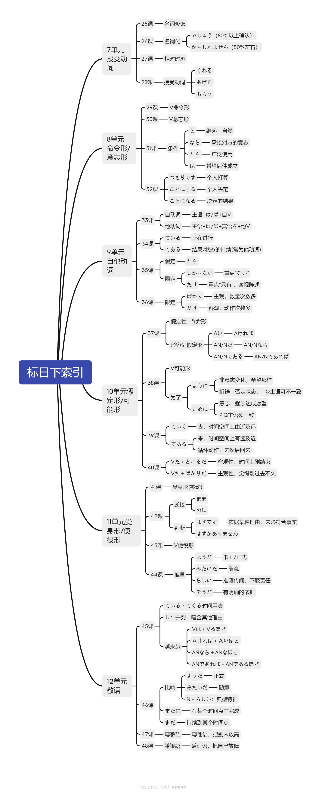

# Language_learning
> Get a language, get a thought

记录语言学习历程

## 0. English

Doing...

## 1. 日本語

> 皆さん、こんにちわ。

### 初级上

#### 单元索引

#### 语法索引

### 初级下

#### 单元索引

#### 语法索引

### 中级上

### 中级下

### 动词形态

## 2. En français

